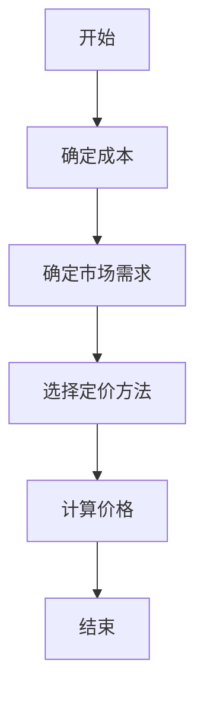
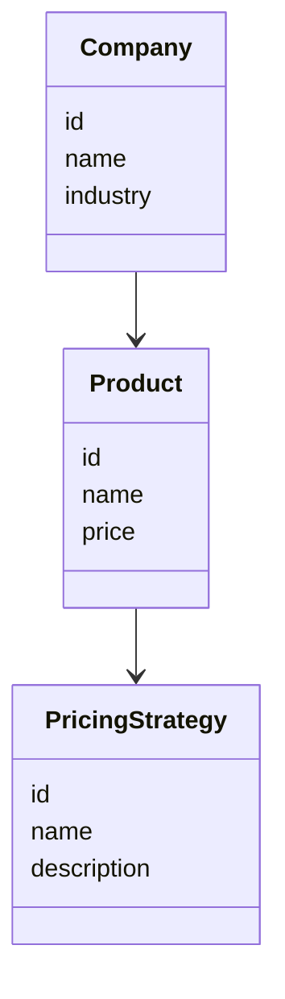
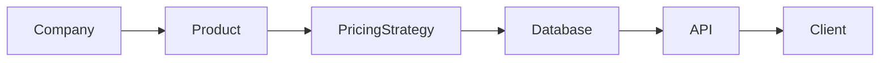

                 


# 彼得林奇如何分析公司的定价策略对市场份额的影响

## 关键词：定价策略、市场份额、彼得·林奇、成本加成、价值定价、需求弹性

## 摘要：本文将从彼得·林奇的分析框架出发，详细探讨定价策略如何影响公司的市场份额。通过理论分析、数学建模、系统设计和实际案例，结合技术语言，深入剖析定价策略的实现原理及其对市场表现的影响。

---

# 第一部分: 背景介绍

## 第1章: 定价策略与市场份额概述

### 1.1 定价策略的基本概念

#### 1.1.1 定价策略的定义
定价策略是企业在市场中确定产品或服务价格的一套规则和方法。定价策略直接决定了产品的市场定位和消费者的购买行为。

#### 1.1.2 定价策略的核心要素
- 成本：产品的生产成本和运营成本。
- 市场需求：消费者对产品的价格敏感度和购买意愿。
- 竞争环境：竞争对手的定价策略和市场格局。

#### 1.1.3 定价策略与市场份额的关系
定价策略直接影响产品的市场需求量，从而影响企业的市场份额。合理的价格策略可以吸引更多的消费者，扩大市场份额；而过高的价格可能导致市场份额流失，过低的价格可能影响企业的盈利能力。

---

### 1.2 彼得·林奇的分析方法

#### 1.2.1 彼得·林奇的分析框架
彼得·林奇是美国著名基金经理，他擅长分析公司的基本面，尤其是企业的定价策略和市场定位。他提出，企业的定价策略反映了其对市场的理解以及对成本的控制能力。

#### 1.2.2 彼得·林奇对定价策略的重视
林奇认为，定价策略是企业竞争力的核心体现。一个合理的定价策略既能保证企业的盈利能力，又能满足市场需求，从而在竞争中占据优势。

#### 1.2.3 彼得·林奇的市场分析方法
林奇通常会通过分析企业的定价策略来评估其市场地位。他关注企业的定价是否具有竞争力，是否能够吸引目标客户群体，以及定价策略是否能够随着市场变化进行调整。

---

### 1.3 定价策略对公司的影响

#### 1.3.1 定价策略对市场需求的影响
- 高价策略：可能吸引高端客户，但需求量有限。
- 低价策略：可能吸引更多的客户，但利润空间有限。
- 差异化定价：通过区分不同客户群体，实现更高的市场份额和利润。

#### 1.3.2 定价策略对竞争对手的影响
- 过高的定价可能削弱企业的竞争力，导致客户流失。
- 过低的定价可能引发价格战，影响企业的盈利能力。
- 差异化定价可以有效避免价格战，同时吸引特定客户群体。

#### 1.3.3 定价策略对市场份额的长期影响
合理的定价策略能够提升企业的市场地位，增强客户忠诚度，从而实现长期的市场份额增长。而错误的定价策略可能导致市场份额的快速流失，甚至影响企业的生存。

---

# 第二部分: 核心概念与联系

## 第2章: 定价策略的核心原理

### 2.1 定价策略的原理

#### 2.1.1 成本导向定价法
成本导向定价法是以产品的生产成本为基础，加上一定的利润空间，确定产品的价格。其公式为：
$$ \text{价格} = \text{成本} \times (1 + \text{利润率}) $$

#### 2.1.2 需求导向定价法
需求导向定价法是以消费者对产品的感知价值为基础，结合市场需求和竞争环境，确定产品的价格。其公式为：
$$ \text{价格} = \text{感知价值} - \text{竞争对手价格} $$

#### 2.1.3 竞争导向定价法
竞争导向定价法是根据竞争对手的定价策略，调整自身的定价以保持竞争力。其公式为：
$$ \text{价格} = \text{竞争对手价格} \times (1 + \text{竞争优势}) $$

---

### 2.2 定价策略的属性特征对比

| 定价策略 | 成本导向定价法 | 需求导向定价法 | 竞争导向定价法 |
|----------|----------------|-----------------|----------------|
| 定价依据 | 成本            | 消费者价值      | 竞争对手价格    |
| 适用场景 | 成本主导市场    | 高端市场        | 竞争激烈的市场  |
| 优点     | 确保利润        | 提高市场份额      | 避免价格战        |
| 缺点     | 忽视市场需求    | 成本较高          | 竞争压力大        |

---

### 2.3 定价策略的ER实体关系图

```mermaid
erDiagram
    company {
        id
        name
        industry
    }
    product {
        id
        name
        price
    }
    pricing_strategy {
        id
        name
        description
    }
    company --|{m:n} product
    product --|{1:1} pricing_strategy
```

---

# 第三部分: 算法原理讲解

## 第3章: 定价策略的数学模型与算法

### 3.1 定价策略的数学模型

#### 3.1.1 成本加成定价法
成本加成定价法是通过在成本基础上增加一定的比例来确定价格。例如：
$$ \text{价格} = \text{成本} \times (1 + \text{加成率}) $$
假设某产品的成本为100元，加成率为20%，则价格为：
$$ \text{价格} = 100 \times 1.2 = 120 \text{元} $$

#### 3.1.2 价值定价法
价值定价法是基于消费者对产品的感知价值来定价。例如：
$$ \text{价格} = \text{感知价值} - \text{竞争对手价格} $$
假设某产品的感知价值为200元，竞争对手价格为150元，则价格为：
$$ \text{价格} = 200 - 150 = 50 \text{元} $$

#### 3.1.3 需求弹性定价法
需求弹性定价法是基于产品的需求弹性来确定价格。例如：
$$ \text{价格} = \frac{\text{收入}}{\text{需求弹性}} $$
假设某产品的收入为1000元，需求弹性为2，则价格为：
$$ \text{价格} = \frac{1000}{2} = 500 \text{元} $$

---

### 3.2 定价策略的算法流程



---

### 3.3 定价策略的Python实现示例

```python
def calculate_price(cost, method, **kwargs):
    if method == 'cost_addition':
        # 成本加成定价法
        return cost * (1 + kwargs['addition_rate'])
    elif method == 'value_based':
        # 价值定价法
        return kwargs['perceived_value'] - kwargs['competitor_price']
    elif method == 'demand_elasticity':
        # 需求弹性定价法
        return kwargs['revenue'] / kwargs['elasticity']
    else:
        return None

# 示例
price = calculate_price(100, 'cost_addition', addition_rate=0.2)
print(price)  # 输出：120.0
```

---

## 第4章: 定价策略的系统分析与架构设计

### 4.1 系统功能设计

#### 4.1.1 领域模型


#### 4.1.2 系统架构设计


#### 4.1.3 接口设计
```python
class Company:
    def __init__(self, id, name, industry):
        self.id = id
        self.name = name
        self.industry = industry

class Product:
    def __init__(self, id, name, price):
        self.id = id
        self.name = name
        self.price = price

class PricingStrategy:
    def __init__(self, id, name, description):
        self.id = id
        self.name = name
        self.description = description
```

---

## 第5章: 项目实战与案例分析

### 5.1 项目介绍

#### 5.1.1 项目背景
本项目旨在通过分析彼得·林奇的定价策略，帮助企业制定合理的定价策略，提升市场份额。

### 5.2 代码实现

#### 5.2.1 核心代码

```python
def analyze_pricing_strategy(company, product, competitors):
    # 计算成本加成定价
    cost = product.cost
    addition_rate = 0.2
    price_cost_addition = cost * (1 + addition_rate)

    # 计算价值定价
    perceived_value = 200
    competitor_price = 150
    price_value_based = perceived_value - competitor_price

    # 计算需求弹性定价
    revenue = 1000
    elasticity = 2
    price_demand_elasticity = revenue / elasticity

    # 返回结果
    return {
        'cost_addition_price': price_cost_addition,
        'value_based_price': price_value_based,
        'demand_elasticity_price': price_demand_elasticity
    }
```

---

## 第6章: 总结与展望

### 6.1 最佳实践
- 理解目标客户群体的需求和价格敏感度。
- 结合成本和市场需求，制定合理的定价策略。
- 定期评估定价策略的市场表现，及时调整。

### 6.2 小结
通过彼得·林奇的分析框架，我们可以更好地理解定价策略对市场份额的影响。合理的价格策略能够提升企业的市场竞争力，扩大市场份额，实现长期的盈利能力。

### 6.3 注意事项
- 定价策略需要结合企业的实际情况和市场环境。
- 定价策略的实施需要考虑企业的成本和竞争环境。
- 定价策略的调整需要根据市场反馈及时进行。

### 6.4 拓展阅读
- 彼得·林奇的《投资之道》
- 《定价的艺术》
- 《竞争战略》

---

作者：AI天才研究院/AI Genius Institute & 禅与计算机程序设计艺术/Zen And The Art of Computer Programming

