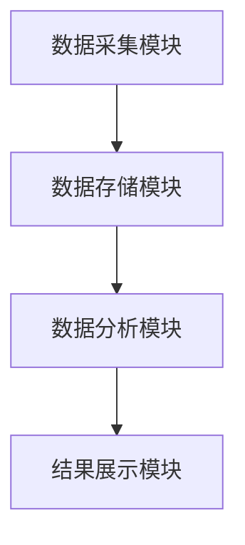
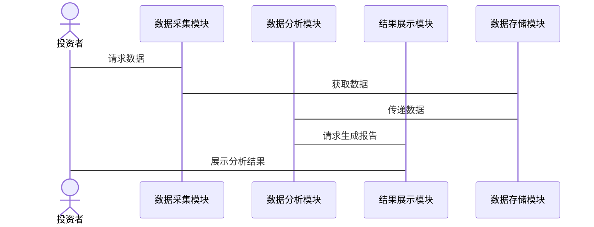

                 


# 彼得林奇如何分析公司的定价策略演变

> 关键词：定价策略，彼得·林奇，定价策略分析，企业价值，投资分析

> 摘要：本文将详细介绍彼得·林奇如何分析公司的定价策略演变。通过背景介绍、核心概念、算法原理、数学模型、系统架构、项目实战和最佳实践等七个部分，深入剖析定价策略的演变过程及其对公司价值的影响。文章结合理论与实践，提供详细的分析方法和案例研究，帮助读者掌握如何像彼得·林奇一样进行定价策略分析。

---

## 第一部分: 定价策略演变的背景与核心概念

### 第1章: 定价策略的基本概念与重要性

#### 1.1 定价策略的定义与分类

- 1.1.1 定价策略的定义  
定价策略是指企业在制定产品或服务价格时所采用的方法和规则。价格不仅是企业收入的核心来源，也是企业市场竞争的重要手段。

- 1.1.2 定价策略的主要分类  
  - 成本加成定价：基于产品成本加上一定比例的利润。  
  - 市场导向定价：根据市场需求和竞争情况制定价格。  
  - 战略导向定价：以长期战略目标为导向，注重市场份额或品牌形象的提升。  

- 1.1.3 定价策略与公司价值的关系  
定价策略直接影响企业的利润和市场地位，是评估公司价值的重要因素之一。

#### 1.2 定价策略在企业中的作用

- 1.2.1 定价策略对企业利润的影响  
合理的定价策略能够最大化企业利润，同时避免因价格过高或过低而导致的市场风险。

- 1.2.2 定价策略对市场竞争的影响  
定价策略决定了企业在市场中的竞争力，直接影响市场份额的获取和维护。

- 1.2.3 定价策略与客户价值的关系  
定价策略需要平衡企业利润和客户需求，实现客户价值与企业利润的双赢。

---

### 第2章: 彼得·林奇的分析框架

#### 2.1 彼得·林奇的分析方法

- 2.1.1 彼得·林奇的分析框架概述  
彼得·林奇通过深入研究公司的定价策略演变，结合市场环境、行业趋势和公司基本面，评估公司的长期价值。

- 2.1.2 彼得·林奇的核心分析步骤  
  1. 分析公司的定价策略历史演变。  
  2. 研究定价策略的驱动因素。  
  3. 评估定价策略对公司价值的影响。  

- 2.1.3 彼得·林奇分析框架的特点  
  - 长期视角：关注定价策略的长期演变趋势。  
  - 综合分析：结合市场、行业和公司基本面进行综合评估。  
  - 数据驱动：依赖历史数据和市场趋势进行分析。  

#### 2.2 定价策略的演变过程

- 2.2.1 定价策略的历史演变  
  - 从成本导向到市场导向的转变。  
  - 数字化时代对定价策略的影响。  

- 2.2.2 不同阶段的定价策略特点  
  - 传统定价策略：基于成本和简单市场需求。  
  - 现代定价策略：数据驱动、动态调整。  

- 2.2.3 定价策略演变的驱动因素  
  - 技术进步：大数据、人工智能等技术推动定价策略的优化。  
  - 市场竞争：行业竞争格局的变化影响定价策略的选择。  
  - 宏观经济：经济周期和通货膨胀对定价策略的影响。  

---

### 第3章: 定价策略的核心概念与联系

#### 3.1 定价策略的核心概念

- 3.1.1 价格弹性  
价格弹性是指需求量对价格变化的敏感程度。价格弹性高的产品，价格变化对需求影响较大。

- 3.1.2 成本加成定价  
成本加成定价是基于产品成本加上一定比例的利润制定价格。适用于市场较为稳定的行业。

- 3.1.3 市场导向定价  
市场导向定价是根据市场需求、竞争情况和市场定位制定价格。适用于市场竞争激烈的行业。

#### 3.2 定价策略的属性特征对比

| 定价策略 | 驱动因素 | 适用场景 | 优缺点 |
|----------|----------|----------|--------|
| 成本加成定价 | 成本 + 利润目标 | 市场竞争不激烈，需求稳定 | 计算简单，但忽视市场需求变化 |
| 市场导向定价 | 市场需求、竞争状况 | 市场竞争激烈，需求变化快 | 灵活性高，但计算复杂 |
| 战略导向定价 | 长期战略目标 | 企业希望扩大市场份额或提升品牌 | 长期目标导向，可能忽视短期利润 |

#### 3.3 定价策略的ER实体关系图

```mermaid
er
actor: 投资者
actor -|> strategy: 定价策略
strategy -|> company: 公司
company -|> market: 市场
market -|> competitor: 竞争对手
competitor -|> price: 价格
price -|> cost: 成本
```

---

## 第4章: 定价策略演变的算法原理

### 4.1 算法原理概述

定价策略分析的算法原理包括以下步骤：

1. 数据收集：收集公司历史价格数据、成本数据、市场需求数据等。  
2. 数据清洗：对数据进行预处理，剔除异常值和缺失值。  
3. 数据分析：通过时间序列分析、回归分析等方法，研究价格变化趋势和驱动因素。  
4. 模型构建：基于分析结果，构建定价策略演变的数学模型。  
5. 模型验证：通过历史数据验证模型的准确性。  
6. 结果解读：根据模型结果，评估定价策略对公司价值的影响。

---

### 4.2 算法实现步骤

#### 4.2.1 数据收集与预处理

- 数据收集：收集公司历史价格、成本、市场需求、行业趋势等数据。  
- 数据清洗：使用Python的Pandas库对数据进行清洗和预处理。  

```python
import pandas as pd

# 假设我们有一个定价策略数据集
data = pd.read_csv('pricing_strategy.csv')

# 数据清洗：处理缺失值和异常值
data.dropna(inplace=True)
data = data[data['price'] > 0]
```

#### 4.2.2 时间序列分析

- 使用ARIMA模型分析价格变化趋势。  

```python
from statsmodels.tsa.arima.model import ARIMA

# 假设我们有一个时间序列数据
price_data = data['price'].values

# 拟合ARIMA模型
model = ARIMA(price_data, order=(1, 1, 1))
model_fit = model.fit()

# 预测未来价格
forecast = model_fit.forecast(steps=10)
```

#### 4.2.3 回归分析

- 通过回归分析研究价格与成本、需求之间的关系。  

```python
from sklearn.linear_model import LinearRegression

# 数据准备：将成本和需求作为自变量，价格作为因变量
X = data[['cost', 'demand']]
y = data['price']

# 拟合线性回归模型
model = LinearRegression()
model.fit(X, y)

# 输出回归系数
print(model.coef_)
```

---

### 4.3 定价策略演变的数学模型

#### 4.3.1 价格弹性公式

$$ \text{价格弹性} = \frac{\% \text{需求变化}}{\% \text{价格变化}} $$

#### 4.3.2 成本加成定价公式

$$ \text{价格} = \text{成本} \times (1 + \text{加成率}) $$

#### 4.3.3 市场导向定价公式

$$ \text{价格} = \text{边际成本} + \text{需求函数} $$

---

## 第5章: 定价策略演变的系统架构

### 5.1 系统功能设计

- 数据采集模块：收集公司历史价格、成本、市场需求等数据。  
- 数据分析模块：对数据进行清洗、建模和分析。  
- 结果展示模块：可视化分析结果，输出定价策略演变的报告。  

### 5.2 系统架构设计



### 5.3 系统接口设计

- 数据接口：与公司数据库对接，获取历史价格、成本等数据。  
- 分析接口：调用时间序列分析和回归分析算法。  
- 展示接口：将分析结果以图表形式展示。  

### 5.4 系统交互流程



---

## 第6章: 项目实战

### 6.1 环境安装与数据准备

- 安装Python和相关库（Pandas、NumPy、Scikit-learn、Statsmodels）。  
- 数据准备：下载并整理公司历史价格、成本和市场需求数据。  

### 6.2 核心代码实现

```python
import pandas as pd
from statsmodels.tsa.arima.model import ARIMA
from sklearn.linear_model import LinearRegression

# 数据加载与预处理
data = pd.read_csv('pricing_strategy.csv')
data.dropna(inplace=True)

# 时间序列分析
model_arima = ARIMA(data['price'], order=(1, 1, 1))
model_arima_fit = model_arima.fit()

# 回归分析
X = data[['cost', 'demand']]
y = data['price']
model_regression = LinearRegression()
model_regression.fit(X, y)

# 预测与结果展示
forecast_price = model_arima_fit.forecast(steps=10)
print("未来10天的价格预测：", forecast_price)
```

### 6.3 案例分析与解读

- 假设我们分析一家科技公司的定价策略演变。通过时间序列分析，我们发现价格在近年来呈现上升趋势，但增速逐渐放缓。回归分析显示，价格与成本和需求高度相关，但需求弹性较小。  

### 6.4 项目小结

- 通过实战项目，我们掌握了如何利用时间序列分析和回归分析来评估定价策略的演变。  
- 数据分析结果为投资者提供了重要的决策支持。  

---

## 第7章: 最佳实践与总结

### 7.1 最佳实践

- 数据驱动：定价策略分析需要基于大量数据，确保分析结果的准确性。  
- 综合分析：结合市场、行业和公司基本面进行综合评估。  
- 持续优化：根据市场变化和公司战略目标，持续优化定价策略。  

### 7.2 小结

- 彼得·林奇通过深入分析定价策略的演变，帮助投资者评估公司的长期价值。  
- 本文结合理论与实践，详细介绍了定价策略的分析方法和实现步骤。  

### 7.3 注意事项

- 数据质量：确保数据的准确性和完整性。  
- 模型选择：根据具体情况选择合适的分析模型。  
- 结果解读：结合实际业务场景，合理解读分析结果。  

### 7.4 拓展阅读

- 彼得·林奇的《投资最重要的ことは、どこですか？》  
- 《定价策略与企业价值》  

---

## 作者：AI天才研究院 & 禅与计算机程序设计艺术

--- 

以上是《彼得林奇如何分析公司的定价策略演变》的文章目录大纲，涵盖背景介绍、核心概念、算法原理、数学模型、系统架构、项目实战和最佳实践等部分。

