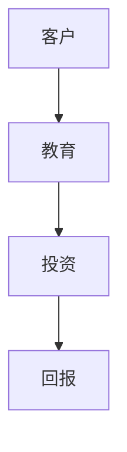
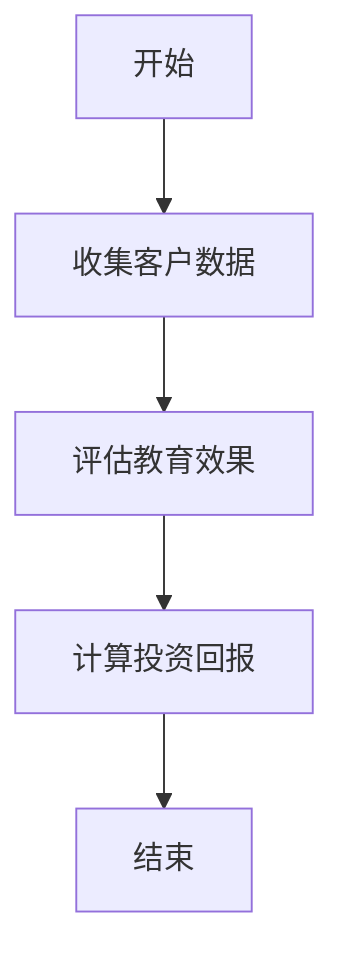
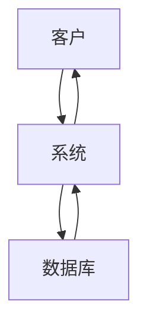

                 


# 彼得林奇如何分析公司的客户教育投资回报

**关键词**：客户教育投资回报、彼得林奇分析、投资回报评估、客户教育ROI、教育投资回报模型

**摘要**：  
本文深入探讨了彼得·林奇如何分析公司客户教育的投资回报。通过详细分析客户教育投资的基本概念、其对投资回报的影响，以及如何量化和评估这种回报，本文为读者提供了清晰的分析框架和实用的工具。文章结合理论与实践，通过数学模型、算法原理和系统设计，帮助读者全面理解客户教育投资回报的评估方法。

---

## 第一部分: 客户教育投资回报分析基础

### 第1章: 客户教育投资回报的核心概念

#### 1.1 客户教育投资的基本概念
- **客户教育的定义与内涵**  
  客户教育是指通过培训、指导和支持，帮助客户更好地理解产品或服务的价值，从而提高客户满意度和忠诚度。它不仅是企业传递价值的手段，也是建立客户关系的重要方式。
- **投资回报的基本概念**  
  投资回报（ROI）是指企业在某项投资上的收益与其投入成本的比率。它是评估投资价值的重要指标。
- **客户教育与投资回报的关系**  
  客户教育投资通过提升客户价值和客户忠诚度，间接或直接地为企业创造更多的收益，从而影响投资回报。

#### 1.2 客户教育投资回报的背景与重要性
- **当前商业环境中的客户教育趋势**  
  随着市场竞争的加剧，客户教育已成为企业差异化竞争的关键手段。通过教育客户，企业能够更好地满足客户需求，提高客户满意度。
- **客户教育在企业投资中的地位**  
  客户教育不仅是销售的辅助工具，更是企业长期战略的一部分。通过教育客户，企业可以降低客户流失率，增加复购率。
- **投资回报分析的必要性**  
  对客户教育投资的回报进行分析，可以帮助企业优化资源分配，确保投资的合理性。

#### 1.3 彼得·林奇的分析框架
- **彼得·林奇的投资理念**  
  彼得·林奇认为，投资回报的核心在于企业的基本面分析。他强调企业必须具备持续的盈利能力，而客户教育是提升企业盈利能力的重要手段。
- **客户教育在林奇分析框架中的位置**  
  在林奇的分析框架中，客户教育被视为企业基本面的重要组成部分。他认为，有效的客户教育可以降低客户获取成本，提高客户留存率，从而提升企业的长期盈利能力。
- **林奇方法的核心要素**  
  林奇的核心要素包括对企业财务状况的深入分析、对管理层能力的评估以及对客户教育投资的回报评估。

### 第2章: 客户教育投资回报的核心概念与联系

#### 2.1 核心概念的定义与属性
- **客户教育投资的属性**  
  客户教育投资具有长期性、间接性和战略性的特点。它不仅需要时间和资源的投入，还需要企业将其作为长期战略的一部分。
- **投资回报的属性**  
  投资回报具有量化性、可评估性和时间性的特点。它是通过量化指标来衡量的，可以通过多种方法进行评估，并且需要考虑时间因素。
- **两者之间的关系**  
  客户教育投资与回报之间存在密切的正相关关系。有效的客户教育投资能够显著提升企业的投资回报。

#### 2.2 客户教育与投资回报的对比分析
- **不同类型客户教育的对比**  
  | 客户教育类型 | 投资方式 | 影响范围 | 回报周期 |
  |--------------|----------|----------|----------|
  | 培训课程     | 高成本   | 广泛     | 长期      |
  | 在线支持     | 低成本   | 局限     | 短期      |
- **不同类型投资回报的对比**  
  | 投资回报类型 | 计算方式 | 适用场景 | 优缺点     |
  |--------------|----------|----------|-----------|
  | ROI          | 净收益/投资成本 | 综合评估 | 简单易懂   |
  | NPV          | 现金流贴现 | 资金时间价值 | 更加精确   |
- **客户教育与投资回报的关联性**  
  客户教育投资能够通过提升客户满意度和忠诚度，间接提升企业的收入和利润，从而增加投资回报。

#### 2.3 实体关系图


### 第3章: 客户教育投资回报的算法原理

#### 3.1 算法原理概述
- **投资回报的量化方法**  
  投资回报可以通过 ROI（Return On Investment）和 NPV（Net Present Value）等指标进行量化。
- **客户教育效果的评估模型**  
  通过客户满意度调查、客户留存率和客户转化率等指标，评估客户教育的效果。
- **林奇分析法的数学基础**  
  林奇分析法基于基本面分析，通过对企业财务数据的分析，评估客户教育投资的回报潜力。

#### 3.2 算法流程图


#### 3.3 Python实现
```python
def calculate_return(investment, growth):
    return investment * (1 + growth/100)
```

### 第4章: 数学模型与公式

#### 4.1 投资回报的基本公式
$$ ROI = \frac{净收益}{投资成本} $$

#### 4.2 客户教育投资的现金流分析
$$ NPV = \sum_{t=1}^{n} \frac{CF_t}{(1 + r)^t} $$

#### 4.3 林奇分析法的数学模型
$$ ROCE = \frac{息税前利润}{股东权益} $$

### 第5章: 系统分析与架构设计

#### 5.1 系统分析
- **问题场景介绍**  
  企业需要通过客户教育投资提高客户满意度和忠诚度，同时评估投资回报。
- **系统功能设计**  
  系统需要实现客户数据收集、教育效果评估、投资回报计算等功能。
- **领域模型类图**  
  ```mermaid
  classDiagram
      class 客户 {
          id
          名称
          联系方式
      }
      class 教育 {
          id
          内容
          时间
      }
      class 投资 {
          id
          金额
          时间
      }
      class 回报 {
          id
          计算结果
          时间
      }
      客户 --> 教育
      教育 --> 投资
      投资 --> 回报
  ```

#### 5.2 系统架构设计
- **系统架构图**  
  ```mermaid
  graph TD
      A[客户数据] --> B[教育模块]
      B --> C[投资模块]
      C --> D[回报模块]
      D --> E[输出结果]
  ```

#### 5.3 系统接口设计
- **接口描述**  
  - 输入：客户数据、教育内容、投资金额
  - 输出：投资回报计算结果

#### 5.4 系统交互序列图


### 第6章: 项目实战

#### 6.1 环境安装
- **Python安装**  
  安装Python 3.8以上版本。
- **依赖库安装**  
  使用 pip 安装 numpy 和 pandas 库。

#### 6.2 核心实现
```python
import numpy as np
import pandas as pd

def calculate_roi(revenue, cost):
    return (revenue - cost) / cost * 100

data = pd.DataFrame({
    '客户ID': [1, 2, 3],
    '投资金额': [10000, 20000, 15000],
    '收益': [15000, 30000, 22500]
})

data['ROI'] = data.apply(lambda x: calculate_roi(x['收益'], x['投资金额']), axis=1)
print(data)
```

#### 6.3 案例分析
- **案例背景**  
  某公司投入10万元用于客户教育，最终实现收益15万元。
- **计算结果**  
  ROI = (150000 - 100000) / 100000 * 100% = 50%。

#### 6.4 分析与解读
- **分析结果**  
  投资回报率为50%，高于行业平均水平，说明该客户教育投资是成功的。
- **优化建议**  
  可以进一步优化客户教育内容，提高投资回报率。

### 第7章: 总结与最佳实践

#### 7.1 小结
- **核心内容回顾**  
  本文详细介绍了彼得·林奇分析客户教育投资回报的方法，包括理论基础、数学模型和系统设计。
- **关键要点总结**  
  - 客户教育投资回报的核心在于提升客户价值。
  - ROI 和 NPV 是常用的评估指标。
  - 林奇分析法强调基本面分析和长期投资。

#### 7.2 注意事项
- **数据准确性**  
  投资回报分析依赖于准确的数据，数据偏差会影响分析结果。
- **时间因素**  
  投资回报的评估需要考虑时间因素，尤其是在使用 NPV 进行评估时。

#### 7.3 拓展阅读
- **推荐书籍**  
  - 《彼得·林奇的投资哲学》
  - 《投资学原理》

---

**作者：AI天才研究院/AI Genius Institute & 禅与计算机程序设计艺术 /Zen And The Art of Computer Programming**

---

通过以上结构化的内容，我们可以清晰地看到彼得·林奇分析客户教育投资回报的逻辑和方法，从理论到实践，帮助读者全面理解和应用这一分析框架。

