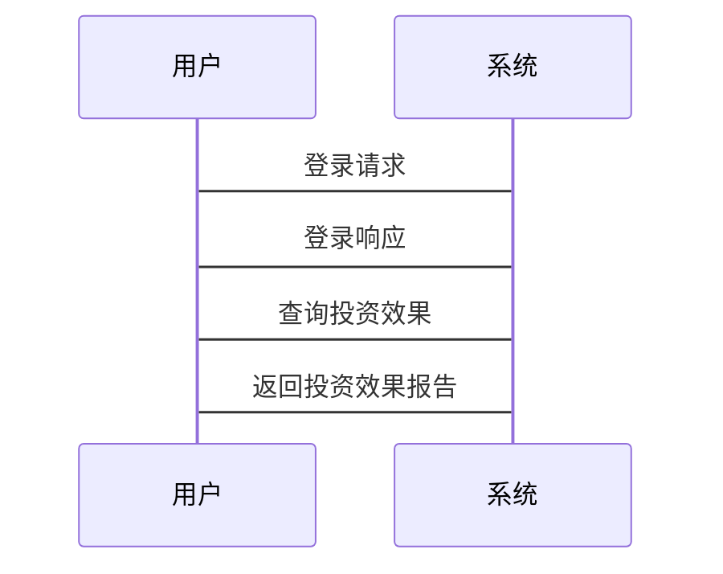

                 


# 彼得·林奇如何分析公司的客户教育投资效果

## 关键词：客户教育，投资效果，彼得·林奇，分析方法，投资策略

## 摘要：客户教育是公司投资的重要组成部分，彼得·林奇以其独特的分析方法，为我们展示了如何评估客户教育的投资效果。本文通过详细分析客户教育的核心概念、算法原理、系统架构以及项目实战，全面解读彼得·林奇的分析方法，帮助读者更好地理解和应用客户教育投资效果的评估策略。

---

## 第一部分: 客户教育投资效果分析的背景与核心概念

### 第1章: 客户教育投资效果分析的背景介绍

#### 1.1 客户教育的基本概念

##### 1.1.1 客户教育的定义与核心要素
客户教育是指通过一系列的培训、指导和支持，帮助客户更好地理解和使用公司的产品或服务。核心要素包括教育内容、教育方式、教育目标和教育效果评估。

##### 1.1.2 客户教育在投资中的重要性
客户教育能够提升客户的使用效率和满意度，进而增强客户忠诚度，促进长期投资回报。

##### 1.1.3 客户教育与投资效果的关系
客户教育直接影响客户的投资决策和投资效果。有效的客户教育可以提高客户的投资收益，降低投资风险。

#### 1.2 彼得·林奇的客户教育投资分析方法

##### 1.2.1 彼得·林奇的投资理念与客户教育
彼得·林奇强调基本面分析，注重客户教育的质量和效果，认为客户教育是投资成功的关键因素之一。

##### 1.2.2 客户教育投资效果的核心问题
如何量化客户教育对投资效果的影响？如何优化客户教育策略以提升投资回报？

##### 1.2.3 客户教育投资效果的边界与外延
客户教育投资效果分析的边界包括教育内容、教育方式、客户特征等，外延则涉及教育效果的长期影响和间接收益。

#### 1.3 本书的核心目标与框架

##### 1.3.1 本书的核心目标
通过分析彼得·林奇的客户教育投资策略，提供一套可操作的分析框架和方法，帮助读者提升客户教育的投资效果。

##### 1.3.2 本书的分析框架
从客户教育的核心概念、算法原理、系统架构到项目实战，全面解读客户教育投资效果的评估方法。

##### 1.3.3 本书的逻辑结构
背景介绍 -> 核心概念 -> 算法原理 -> 系统架构 -> 项目实战 -> 最佳实践。

### 第2章: 客户教育投资效果的核心概念与联系

#### 2.1 客户教育的核心概念

##### 2.1.1 客户教育的定义与属性
客户教育是一种系统化的过程，旨在提升客户的知识水平和技能，帮助客户更好地使用产品或服务。

##### 2.1.2 客户教育的特征与分类
特征包括个性化、互动性和持续性；分类包括产品教育、服务教育和投资教育。

##### 2.1.3 客户教育的核心要素
包括教育目标、教育内容、教育方式、教育资源和教育评估。

#### 2.2 投资效果的核心概念

##### 2.2.1 投资效果的定义与测量
投资效果是指客户在投资过程中所获得的收益和风险控制能力。测量指标包括收益率、风险承受能力和投资行为的正确性。

##### 2.2.2 投资效果的关键指标
包括投资回报率、客户满意度、客户留存率和客户活跃度。

##### 2.2.3 投资效果的驱动因素
客户教育、市场环境、产品特性、客户特征和投资策略。

#### 2.3 客户教育与投资效果的关系

##### 2.3.1 客户教育对投资效果的影响路径
客户教育通过提升客户的知识水平和决策能力，直接影响投资效果。

##### 2.3.2 客户教育与投资效果的因果关系
因果关系体现在客户教育的质量直接影响投资行为和投资结果。

##### 2.3.3 客户教育与投资效果的量化分析
通过回归分析和因果关系模型，量化客户教育对投资效果的影响程度。

#### 2.4 客户教育投资效果分析的框架

##### 2.4.1 客户教育投资效果的分析维度
包括客户特征、教育内容、教育方式、投资行为和投资结果。

##### 2.4.2 客户教育投资效果的分析模型
构建客户教育与投资效果之间的关系模型，包括客户特征、教育效果和投资结果三个维度。

##### 2.4.3 客户教育投资效果的分析方法
采用定性分析和定量分析相结合的方法，综合评估客户教育的投资效果。

### 第3章: 客户教育投资效果的算法原理

#### 3.1 客户教育投资效果的评估模型

##### 3.1.1 模型的输入与输出
输入包括客户特征、教育内容、教育方式和投资行为；输出包括投资效果评估和优化建议。

##### 3.1.2 模型的核心算法
基于客户教育和投资效果的因果关系模型，采用回归分析和路径分析进行评估。

##### 3.1.3 模型的数学公式
$$ 投资效果 = β_0 + β_1 \times 教育效果 + β_2 \times 客户特征 + ε $$

#### 3.2 算法原理的详细讲解

##### 3.2.1 算法的逻辑流程
1. 收集客户特征和教育数据；
2. 评估教育效果；
3. 分析投资行为和投资结果；
4. 构建因果关系模型；
5. 优化客户教育策略。

##### 3.2.2 算法的数学推导
通过回归分析，确定客户教育对投资效果的影响系数，量化其贡献程度。

##### 3.2.3 算法的实现步骤
1. 数据收集与预处理；
2. 模型构建与参数估计；
3. 模型验证与优化；
4. 模型应用与结果解读。

#### 3.3 算法原理的举例说明

---

## 第二部分: 系统分析与架构设计方案

### 第4章: 客户教育投资效果的系统分析

#### 4.1 问题场景介绍
描述客户教育投资效果分析的系统应用场景，包括数据采集、分析处理和结果展示。

#### 4.2 系统功能设计

##### 4.2.1 领域模型设计
使用mermaid类图展示客户教育投资效果分析的领域模型，包括客户、教育内容、投资行为和投资效果等实体。

```mermaid
classDiagram
    class 客户 {
        id: 整数
        特征: 字符串
        投资行为: 行为
    }
    class 教育内容 {
        内容: 字符串
        方式: 字符串
        资源: 字符串
    }
    class 投资效果 {
        收益率: 数值
        风险: 数值
    }
    client -[关联]-> 教育内容
    client -[关联]-> 投资效果
```

#### 4.3 系统架构设计

##### 4.3.1 系统架构设计
使用mermaid架构图展示系统的整体架构，包括数据采集层、分析处理层和结果展示层。


#### 4.4 系统接口设计

##### 4.4.1 数据接口设计
定义数据采集和分析接口，确保数据的准确性和完整性。

#### 4.5 系统交互设计

##### 4.5.1 系统交互流程
使用mermaid序列图展示用户与系统的交互流程，包括登录、数据查询和结果展示。



### 第5章: 客户教育投资效果的项目实战

#### 5.1 项目介绍
描述一个具体的客户教育投资效果分析项目，包括项目目标、数据来源和分析工具。

#### 5.2 核心代码实现

##### 5.2.1 环境安装
安装必要的Python库，如pandas、numpy、sklearn等。

##### 5.2.2 核心代码实现
实现客户教育投资效果的评估模型，包括数据预处理、模型训练和结果解读。

##### 5.2.3 代码应用解读
解释代码的功能和实现逻辑，展示如何应用代码进行客户教育投资效果的分析。

#### 5.3 实际案例分析

##### 5.3.1 案例介绍
选择一个具体的客户教育项目，分析其投资效果。

##### 5.3.2 案例分析
通过数据分析和模型评估，得出客户教育对投资效果的影响程度。

##### 5.3.3 分析结果解读
解读分析结果，提出优化客户教育策略的建议。

#### 5.4 项目小结
总结项目实施的经验和教训，提出改进建议。

### 第6章: 客户教育投资效果分析的最佳实践

#### 6.1 小结
总结全文的主要内容和关键结论。

#### 6.2 注意事项
提醒读者在实际应用中需要注意的问题，如数据质量、模型选择和结果验证。

#### 6.3 拓展阅读
推荐相关的书籍和资源，供读者进一步学习和研究。

---

## 作者：AI天才研究院/AI Genius Institute & 禅与计算机程序设计艺术 /Zen And The Art of Computer Programming

---

这篇文章通过详细分析彼得·林奇的客户教育投资效果分析方法，结合理论和实践，为读者提供了一套系统化的分析框架和方法。希望读者能够通过本文，深入了解客户教育的投资效果，优化客户的教育策略，提升投资回报。

