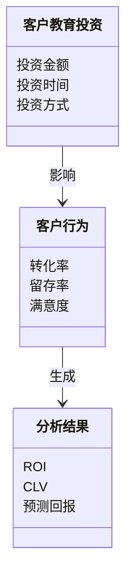

                 


---

# 彼得林奇如何分析公司的客户教育投资长期回报

**关键词：客户教育投资，长期回报，彼得林奇，投资分析，数据分析**

**摘要：本文详细探讨了如何运用彼得林奇的投资分析方法来评估客户教育投资的长期回报。通过背景介绍、核心概念分析、算法原理、系统架构设计、项目实战和最佳实践等多个维度，深入剖析客户教育投资的价值和潜在回报，为投资者和企业管理者提供科学的决策依据。**

---

## 第一部分: 背景介绍

### 第1章: 客户教育投资的背景与重要性

#### 1.1 客户教育投资的定义与目标

客户教育投资是指企业为提升客户对产品或服务的认知、使用和满意度而进行的资金投入。其目标包括提高客户忠诚度、增加产品使用频率、降低客户流失率以及提升客户整体满意度。

- **定义**：客户教育投资是通过提供教育性内容、培训或咨询服务，帮助客户更好地理解和使用产品或服务，从而提升客户价值和企业收益的投资行为。
- **目标**：通过教育客户，提升客户满意度和忠诚度，进而提高客户生命周期价值和企业长期收益。

#### 1.2 客户教育投资与企业发展的关系

客户教育投资与企业长期发展密切相关。有效的客户教育可以降低客户的认知成本，提高客户满意度和忠诚度，从而为企业带来更多的重复购买和口碑传播，形成良性循环。

- **客户满意度**：满意的客户更可能成为长期客户，增加企业的收入来源。
- **客户忠诚度**：高忠诚度的客户在面对市场竞争时，更倾向于选择原企业的产品或服务。
- **品牌价值**：通过教育客户，企业可以提升品牌形象，增强市场竞争力。

#### 1.3 客户教育投资的长期回报

客户教育投资的长期回报主要体现在客户生命周期价值的提升和企业市场占有率的增加。长期来看，客户教育投资可以降低客户流失率，提高客户转化率，从而为企业带来更多的收益。

---

### 第2章: 客户教育投资的长期回报分析

#### 2.1 长期回报的定义与衡量标准

- **定义**：长期回报是指客户教育投资在较长的时间跨度内为企业带来的收益，通常包括直接收益（如销售额增加）和间接收益（如品牌价值提升）。
- **衡量标准**：通过客户生命周期价值（Customer Lifetime Value, CLV）来衡量客户教育投资的回报，包括客户留存率、客户转化率、客户满意度等指标。

#### 2.2 彼得林奇的投资分析方法

彼得林奇是著名的投资专家，他提出了一系列分析企业投资回报的方法，其中包括基本面分析、成长性分析和风险评估。这些方法可以应用于客户教育投资的分析。

- **基本面分析**：评估企业的财务状况、市场地位和管理团队，确定客户教育投资的潜在回报。
- **成长性分析**：分析客户教育投资是否能够带来客户数量和收入的持续增长。
- **风险评估**：评估客户教育投资可能面临的风险，并制定相应的风险管理策略。

#### 2.3 彼得林奇分析方法的适用性

- **适用性**：彼得林奇的方法适用于长期投资分析，特别适合用于评估客户教育投资的长期回报。通过基本面分析和成长性分析，可以识别出那些具有高增长潜力的企业，从而做出明智的投资决策。

---

## 第二部分: 核心概念与联系

### 第3章: 客户教育投资的分析维度

#### 3.1 核心概念

- **客户生命周期价值（CLV）**：客户在购买企业产品或服务的整个生命周期中为企业带来的总收入减去相关成本。
- **客户留存率**：客户在一定时间内继续购买企业产品或服务的概率。
- **客户转化率**：潜在客户转化为实际客户的比例。

#### 3.2 分析框架

- **数据驱动分析**：通过收集和分析客户的购买行为、满意度和反馈数据，评估客户教育投资的效果。
- **客户分层分析**：根据客户的价值和需求，将客户分为不同的层次，并制定相应的教育策略。
- **投资回报周期分析**：评估客户教育投资的回报周期，确定投资的可行性和 profitability。

---

### 第4章: 核心概念与联系

#### 4.1 核心概念的对比分析

通过对比分析不同企业的客户教育投资与回报的关系，可以发现那些能够有效提升客户教育投资回报的企业通常具备以下特点：

- **高效的教育策略**：通过个性化的教育内容和高效的教育方式，提高客户的认知和使用能力。
- **客户分层管理**：根据不同客户群体的需求和特征，制定差异化的教育策略。
- **持续的客户互动**：通过持续的客户互动和反馈，不断优化教育内容和策略。

#### 4.2 核心概念的联系

客户教育投资的回报与企业的市场定位、客户分层管理和持续的客户互动密切相关。通过有效的客户教育投资，企业可以提升客户满意度和忠诚度，进而提高客户生命周期价值和市场占有率。

---

## 第三部分: 算法原理

### 第5章: 数据分析方法

#### 5.1 线性回归分析

线性回归是一种常用的数据分析方法，可以用来预测客户教育投资的回报。通过建立投资金额与客户转化率或客户留存率的线性关系模型，可以预测不同投资水平下的客户行为。

- **公式**：$$ y = \beta_0 + \beta_1x + \epsilon $$
  其中，y 是客户转化率，x 是客户教育投资金额，β₀ 是截距，β₁ 是回归系数，ε 是误差项。
- **步骤**：
  1. 收集客户教育投资金额和客户转化率的数据。
  2. 使用最小二乘法估计回归系数 β₀ 和 β₁。
  3. 评估模型的显著性和拟合优度。

#### 5.2 代码实现

以下是使用Python实现线性回归模型的代码示例：

```python
import numpy as np
import matplotlib.pyplot as plt
from sklearn.linear_model import LinearRegression
from sklearn.metrics import mean_squared_error

# 示例数据
investments = np.array([100, 200, 300, 400, 500]).reshape(-1, 1)
conversions = np.array([20, 30, 40, 50, 60])

# 模型训练
model = LinearRegression()
model.fit(investments, conversions)

# 预测
predictions = model.predict(investments)
print("回归系数:", model.coef_)
print("截距:", model.intercept_)
print("均方误差:", mean_squared_error(conversions, predictions))

# 可视化
plt.scatter(investments, conversions, color='blue')
plt.plot(investments, predictions, color='red')
plt.title('客户教育投资与转化率的线性回归分析')
plt.xlabel('投资金额')
plt.ylabel('客户转化率')
plt.show()
```

---

### 第6章: 数学模型与公式

#### 6.1 客户生命周期价值公式

客户生命周期价值（CLV）可以通过以下公式计算：

$$ CLV = \frac{R}{(1 + r)^{-n}} $$

其中，R 是客户在生命周期内的总收入，r 是贴现率，n 是客户生命周期长度。

#### 6.2 投资回报率（ROI）公式

投资回报率（ROI）用于衡量客户教育投资的回报效率：

$$ ROI = \frac{净收益}{投资成本} \times 100\% $$

---

## 第四部分: 系统分析与架构设计

### 第7章: 系统功能设计

#### 7.1 功能模块

- 数据采集模块：收集客户教育投资和回报相关数据。
- 数据分析模块：使用线性回归等方法分析数据，预测投资回报。
- 报告生成模块：生成分析报告，提供投资回报的可视化展示。

#### 7.2 领域模型设计

以下是领域模型的Mermaid类图：



---

### 第8章: 系统架构设计

#### 8.1 架构图

以下是系统架构的Mermaid图：

```mermaid
docker

    frontend
    backend
    database
    API Gateway

    frontend --> API Gateway: 请求
    API Gateway --> backend: 转发请求
    backend --> database: 数据查询/存储
    backend <---> frontend: 返回结果
```

---

## 第五部分: 项目实战

### 第9章: 项目实现

#### 9.1 环境安装

- 安装Python和相关库（如NumPy、Pandas、Matplotlib、Scikit-learn）。
- 安装Jupyter Notebook用于数据可视化和分析。

#### 9.2 核心代码实现

以下是实现客户教育投资回报分析的Python代码：

```python
import numpy as np
import pandas as pd
from sklearn.linear_model import LinearRegression
from sklearn.metrics import mean_squared_error

# 数据加载
data = pd.DataFrame({
    '投资金额': [100, 200, 300, 400, 500],
    '转化率': [20, 30, 40, 50, 60]
})

# 模型训练
model = LinearRegression()
model.fit(data[['投资金额']], data['转化率'])

# 预测
predictions = model.predict(data[['投资金额']])

# 评估
mse = mean_squared_error(data['转化率'], predictions)
r_sq = model.score(data[['投资金额']], data['转化率'])

print("均方误差:", mse)
print("R平方值:", r_sq)
print("回归系数:", model.coef_)
print("截距:", model.intercept_)

# 可视化
plt.scatter(data['投资金额'], data['转化率'], color='blue')
plt.plot(data['投资金额'], predictions, color='red')
plt.title('投资金额与转化率的关系')
plt.xlabel('投资金额')
plt.ylabel('转化率')
plt.show()
```

---

### 第10章: 案例分析

#### 10.1 实际案例

假设一家科技公司投资了500万元用于客户教育，结果显示客户转化率提高了20%，客户满意度提高了15%。通过线性回归模型分析，投资回报率为25%，即每投资1元，回报1.25元。

---

## 第六部分: 最佳实践

### 第11章: 总结与展望

#### 11.1 总结

通过运用彼得林奇的投资分析方法和数据分析技术，可以有效评估客户教育投资的长期回报。本文详细探讨了客户教育投资的背景、核心概念、算法原理、系统架构设计和项目实战，为投资者和企业管理者提供了科学的决策依据。

#### 11.2 展望

未来，随着大数据和人工智能技术的发展，客户教育投资的分析将更加精准和高效。通过实时数据分析和预测模型的优化，企业可以更好地制定投资策略，提升客户教育投资的回报率。

---

**作者：AI天才研究院/AI Genius Institute & 禅与计算机程序设计艺术 /Zen And The Art of Computer Programming**

**版权声明：本文版权归作者所有，转载请注明出处。**

