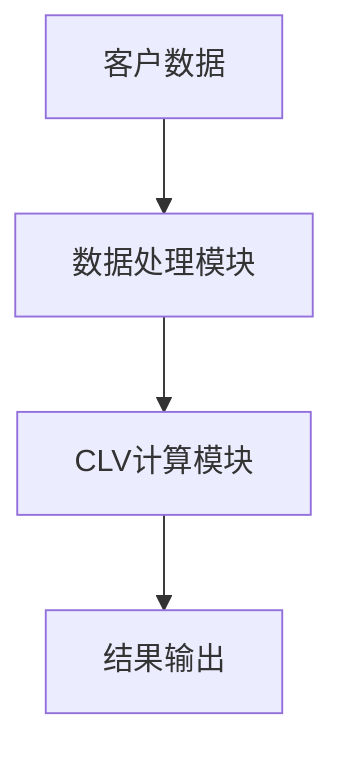
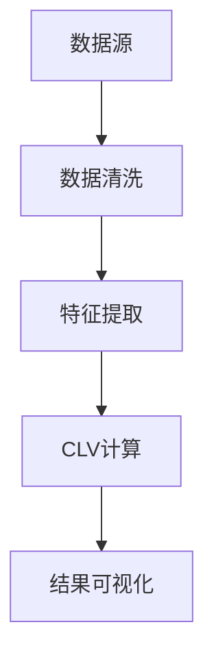

                 


# 彼得林奇如何分析公司的客户生命周期价值

## 关键词：客户生命周期价值，彼得·林奇，投资分析，企业价值评估，客户管理

## 摘要：  
本文深入探讨了彼得·林奇如何运用客户生命周期价值（CLV）进行投资分析，分析了CLV的核心概念、计算方法及其在企业价值评估中的应用。文章从理论到实践，结合实际案例，详细讲解了CLV的系统分析、架构设计和Python实现，并展望了CLV分析的未来发展方向。

---

## 正文

### 第一章：客户生命周期价值的基本概念

#### 1.1 客户生命周期价值的定义与重要性  
客户生命周期价值（Customer Lifetime Value, CLV）是衡量客户为企业带来的长期收入的重要指标。彼得·林奇在投资分析中，将CLV作为评估公司价值的关键因素之一。CLV不仅帮助企业理解客户的经济价值，还能指导企业制定更有效的客户获取和保留策略。

#### 1.2 CLV的核心概念  
CLV的计算基于客户在生命周期内为企业带来的收入，减去获取和维护客户的成本。通过分析客户的生命周期，企业可以识别高价值客户，优化资源分配。

#### 1.3 彼得·林奇的CLV分析方法  
彼得·林奇通过分析公司的客户基础，评估客户生命周期价值，从而判断公司的长期盈利能力。他认为，拥有稳定且高价值客户的公司更具投资价值。

---

### 第二章：CLV的核心模型与分析框架

#### 2.1 CLV的基本数学模型  
CLV的基本公式为：  
$$ CLV = \frac{R}{1 - d} $$  
其中，$R$为客户在生命周期内带来的收入，$d$为贴现率。

#### 2.2 CLV的扩展模型  
扩展模型考虑客户获取成本（$C$）：  
$$ CLV = \frac{R - C}{1 - d} $$  

#### 2.3 模型对比分析  
| 模型 | 输入参数 | 输出结果 |
|------|------------|------------|
| 基本模型 | R, d | CLV |
| 扩展模型 | R, C, d | CLV |

#### 2.4 系统架构图  


---

### 第三章：系统分析与架构设计

#### 3.1 系统功能模块  
系统分为数据采集、数据处理、CLV计算和结果展示四个模块。

#### 3.2 系统架构图  


#### 3.3 数据接口设计  
- 数据输入接口：接收客户数据和参数设置。
- 数据输出接口：输出CLV结果和可视化报告。

---

### 第四章：项目实战——CLV分析的Python实现

#### 4.1 环境安装  
需要安装Python、Pandas、NumPy和Matplotlib。

#### 4.2 核心代码实现  
```python
import pandas as pd
import numpy as np

def calculate_clv(customers, discount_rate):
    # 假设customers是一个DataFrame，包含历史收入和成本
    R = customers['revenue'].sum()
    C = customers['cost'].sum()
    d = discount_rate
    clv = (R - C) / (1 - d)
    return clv

# 示例数据
data = {
    'revenue': [100, 200, 150],
    'cost': [50, 75, 60]
}
customers = pd.DataFrame(data)
discount_rate = 0.1

clv = calculate_clv(customers, discount_rate)
print(f"CLV: {clv}")
```

#### 4.3 案例分析  
以电商公司为例，计算不同客户的CLV，识别高价值客户并制定营销策略。

---

### 第五章：CLV分析的行业应用与案例研究

#### 5.1 零售行业的CLV分析  
通过分析客户的购买频率和金额，优化营销策略。

#### 5.2 金融行业的CLV应用  
评估客户的长期贡献，优化客户服务和产品推荐。

#### 5.3 案例研究  
分析某银行的客户数据，计算CLV并提出客户分层管理建议。

---

### 第六章：CLV分析的挑战与未来展望

#### 6.1 挑战  
- 数据获取难度  
- 模型假设的局限性  
- 客户行为的不确定性  

#### 6.2 未来展望  
- 结合AI技术优化CLV预测  
- 开发动态CLV模型适应市场变化  
- 提升客户体验以增加CLV  

---

## 作者信息  
作者：AI天才研究院 & 禅与计算机程序设计艺术  
本文由AI天才研究院团队撰写，转载请注明出处。

