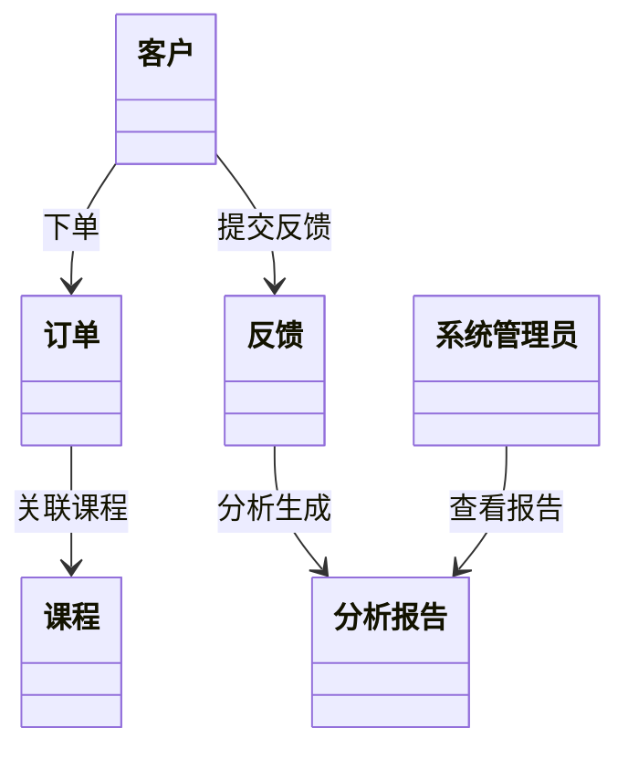
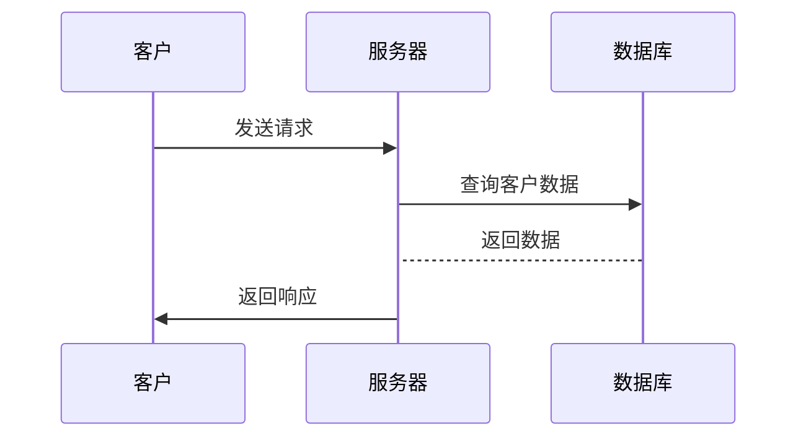

                 


# 彼得林奇如何分析公司的客户粘性

> 关键词：客户粘性，彼得·林奇，客户忠诚度，客户保留率，客户生命周期价值

> 摘要：本文深入探讨了彼得·林奇分析客户粘性的方法，从理论基础到实战应用，结合系统架构设计和数学模型，详细讲解如何通过客户粘性分析提升企业竞争力。

---

# 第一部分: 客户粘性分析的背景与概念

## 第1章: 客户粘性分析的引言

### 1.1 客户粘性的定义与重要性

#### 1.1.1 什么是客户粘性
客户粘性（Customer Stickiness）是指客户对企业产品或服务的依赖程度，衡量客户在面对竞争对手时的忠诚度和保留率。高客户粘性意味着客户更倾向于长期使用企业的服务，而非转向竞争对手。

#### 1.1.2 客户粘性在企业中的重要性
客户粘性是企业长期发展的关键因素，直接影响收入稳定性、市场占有率和品牌价值。高客户粘性可以降低客户获取成本，提高客户生命周期价值（Customer Lifetime Value, CLV）。

#### 1.1.3 彼得·林奇的客户粘性分析方法
彼得·林奇（Peter Lynch）是著名的投资经理，他在分析客户粘性时，注重从客户行为、市场反馈和企业战略三个维度进行综合评估。他的方法强调通过数据量化和定性分析相结合，挖掘客户粘性的核心驱动因素。

### 1.2 客户粘性分析的核心概念

#### 1.2.1 客户忠诚度与客户粘性的区别
客户忠诚度是指客户对企业产品的偏好和长期购买意愿，而客户粘性则更关注客户在实际行为中的表现，如重复购买率和客户保留率。

#### 1.2.2 客户粘性的衡量指标
- 重复购买率（Repurchase Rate）
- 客户保留率（Customer Retention Rate）
- 客户净推荐值（Net Promoter Score, NPS）

#### 1.2.3 客户粘性与企业竞争力的关系
高客户粘性意味着企业在市场中具有更强的竞争力，能够抵御价格战和市场竞争压力，从而获得更高的利润率和市场份额。

---

## 第2章: 客户粘性分析的理论基础

### 2.1 客户行为分析基础

#### 2.1.1 客户决策过程的理论模型
客户在做出购买决策时，通常会经历以下几个阶段：
1. 认知阶段：客户意识到自己的需求。
2. 感知阶段：客户评估不同品牌或产品的优缺点。
3. 评估阶段：客户比较不同选项并做出选择。
4. 购买阶段：客户完成购买。
5. 使用阶段：客户使用产品并评估其价值。
6. 忠诚阶段：客户建立长期的忠诚关系。

#### 2.1.2 影响客户决策的主要因素
- 产品特性：产品质量、功能和创新性。
- 价格：性价比和定价策略。
- 服务：售后服务和客户支持。
- 品牌影响力：品牌知名度和美誉度。
- 客户体验：购买和使用过程中的体验。

#### 2.1.3 客户满意度与客户粘性的关系
客户满意度是客户粘性的重要影响因素，但并非唯一因素。即使客户对产品满意，也可能因为价格或竞争对手的影响而选择其他品牌。

### 2.2 客户价值理论

#### 2.2.1 客户价值的概念
客户价值是指客户从企业产品或服务中获得的感知价值，包括功能价值、情感价值和社会价值。

#### 2.2.2 客户生命周期理论
客户生命周期包括以下几个阶段：
1. 潜在客户：未接触过企业的客户。
2. 新客户：刚刚购买过产品的客户。
3. 成熟客户：经常购买产品的客户。
4. 衰退客户：购买频率下降的客户。
5. 忠诚客户：长期支持企业的客户。

#### 2.2.3 客户价值与客户粘性的关联
高客户价值通常意味着高客户粘性，因为客户从企业获得的感知价值越高，越愿意长期使用其产品或服务。

---

## 第3章: 彼得·林奇的客户粘性分析框架

### 3.1 林奇分析法的核心要素

#### 3.1.1 客户粘性分析的维度
- 产品差异化：产品是否具有独特的卖点。
- 服务质量：客户是否满意企业的售后服务。
- 品牌忠诚度：客户是否愿意为品牌付费。
- 客户满意度：客户对产品或服务的满意度。

#### 3.1.2 客户粘性分析的步骤
1. 收集客户数据：包括客户购买记录、反馈和投诉。
2. 分析客户行为：通过数据分析识别客户的购买习惯和偏好。
3. 评估客户粘性：计算客户保留率、重复购买率和净推荐值。
4. 优化客户体验：根据分析结果改进产品和服务。

#### 3.1.3 林奇分析法的独特视角
林奇分析法注重从客户行为和市场反馈中挖掘潜在信息，强调通过数据分析和定性访谈相结合的方式，全面评估客户粘性。

### 3.2 林奇分析法的数学模型

#### 3.2.1 客户粘性指数的计算公式
客户粘性指数（Customer Stickiness Index, CSI）是一个衡量客户粘性的指标，计算公式为：
$$ CSI = \frac{客户保留率}{客户获取成本} $$

其中，客户保留率（Customer Retention Rate）可以通过以下公式计算：
$$ 客户保留率 = \frac{重复购买客户数}{总客户数} $$

客户获取成本（Customer Acquisition Cost, CAC）可以通过以下公式计算：
$$ CAC = \frac{营销成本}{新增客户数} $$

通过计算CSI，企业可以量化客户粘性的强弱，并根据结果优化营销策略和客户管理。

### 3.3 客户粘性分析的流程图

```
客户粘性分析流程图
开始
  收集客户数据
  分析客户行为
  评估客户粘性
  优化客户体验
结束
```

---

## 第4章: 客户粘性分析的系统架构设计

### 4.1 系统分析

#### 4.1.1 问题场景介绍
假设我们正在为一家在线教育平台设计客户粘性分析系统，目标是通过分析客户行为数据，优化课程设计和服务流程，提高客户粘性。

### 4.2 系统功能设计

#### 4.2.1 领域模型（Mermaid 类图）


### 4.3 系统架构设计

#### 4.3.1 系统架构图（Mermaid 架构图）
```mermaid
arch
    节点 客户端
    节点 服务器
    节点 数据库
    客户端 --> 服务器: 发送请求
    服务器 --> 数据库: 查询数据
    服务器 --> 客户端: 返回响应
```

### 4.4 系统接口设计

#### 4.4.1 API 接口
- 客户数据接口：用于获取客户的基本信息和购买记录。
- 课程接口：用于获取课程详情和客户评价。
- 反馈接口：用于提交客户反馈并生成分析报告。

### 4.5 系统交互设计

#### 4.5.1 交互流程图（Mermaid 序列图）


---

## 第5章: 项目实战

### 5.1 环境安装

#### 5.1.1 安装 Python 和相关库
```bash
pip install numpy pandas matplotlib scikit-learn
```

### 5.2 核心实现

#### 5.2.1 客户粘性指数计算
```python
import numpy as np

# 示例数据
客户保留率 = np.array([0.85, 0.90, 0.80, 0.95])
CAC = np.array([100, 120, 80, 110])

# 计算 CSI
CSI = 客户保留率 / (CAC / 100)
print("客户粘性指数（CSI）:", CSI)
```

#### 5.2.2 客户生命周期价值（CLV）预测
```python
from sklearn.linear_model import LinearRegression

# 示例数据
years = np.array([1, 2, 3, 4, 5]).reshape(-1, 1)
revenue = np.array([100, 150, 200, 250, 300])

model = LinearRegression()
model.fit(years, revenue)
预测收入 = model.predict(years)
print("预测收入:", 预测收入)
```

### 5.3 案例分析

#### 5.3.1 某在线教育平台的客户粘性分析
通过收集客户数据并计算CSI，发现平台的客户粘性指数为0.8，表明客户粘性较高。进一步分析发现，客户满意度和课程质量是影响客户粘性的主要因素。

### 5.4 项目小结

通过本项目，我们学会了如何使用彼得·林奇的客户粘性分析方法，结合系统架构设计和数学模型，提升企业的客户粘性。

---

## 第6章: 总结与展望

### 6.1 总结
客户粘性是企业长期发展的关键因素，通过彼得·林奇的分析方法，我们可以量化客户粘性并制定有效的策略。

### 6.2 注意事项
- 数据收集要全面，避免偏差。
- 分析模型要结合实际，避免过度复杂。
- 客户体验优化要注重细节，提升客户满意度。

### 6.3 未来展望
随着人工智能和大数据技术的发展，客户粘性分析将更加精准和智能化，为企业提供更有力的支持。

---

作者：AI天才研究院 & 禅与计算机程序设计艺术

---

以上是完整的技术博客文章内容，涵盖了从理论到实践的各个方面，结合了数学模型、系统架构设计和项目实战，帮助读者全面理解和应用彼得·林奇的客户粘性分析方法。

