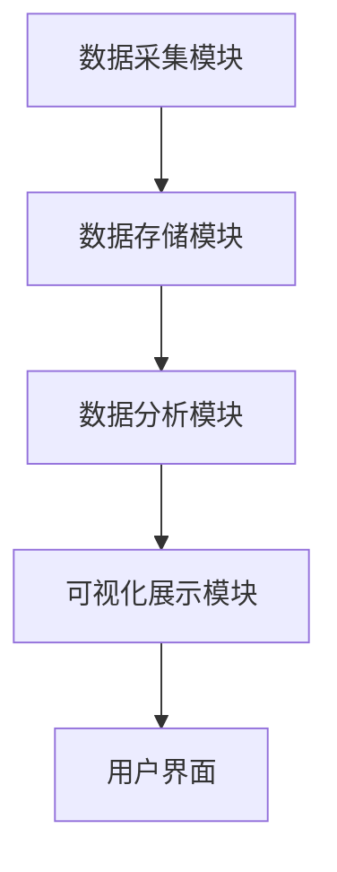
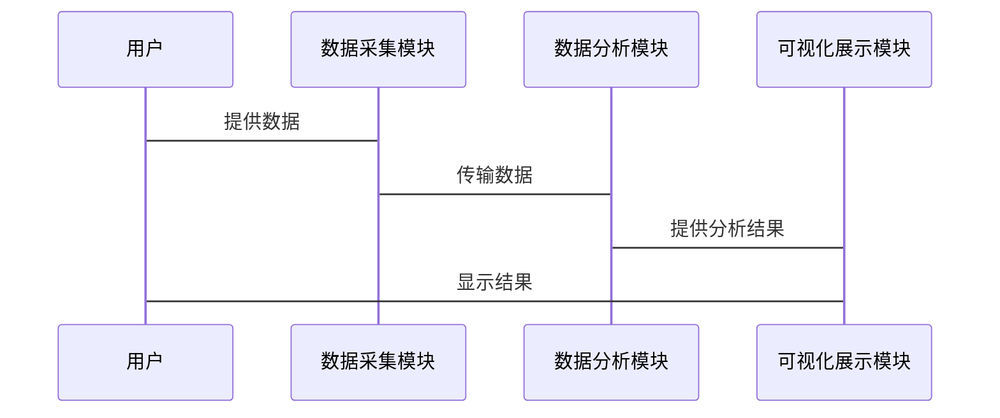

                 


# 彼得林奇如何分析公司的客户细分策略演变

## 关键词：客户细分，彼得林奇，投资分析，数据分析，算法模型

## 摘要：本文详细探讨了彼得·林奇如何通过客户细分策略的演变来分析公司价值。从客户细分的基本概念到具体的数学模型，再到系统架构设计，结合实际案例，全面解析客户细分在投资分析中的应用。文章结构清晰，内容详实，适合投资新手和企业管理人员阅读。

---

## 第一部分: 客户细分策略演变的背景与基础

### 第1章: 客户细分的基本概念与重要性

#### 1.1 客户细分的定义与核心要素

客户细分是指将客户按照一定的特征或行为进行分类，以更好地理解客户需求、优化资源配置并提升企业竞争力。其核心要素包括：

- **客户特征**：性别、年龄、职业、收入等。
- **行为特征**：消费频率、购买金额、偏好等。
- **价值特征**：客户生命周期价值（CLV）、利润贡献度等。

客户细分的重要性体现在帮助企业精准定位目标市场、制定个性化营销策略以及优化资源配置等方面。

#### 1.2 客户细分的演变历程

- **传统客户细分方法**：基于地理位置、人口统计等简单分类。
- **数据驱动的客户细分**：利用大数据技术进行精准画像。
- **当前客户细分的趋势**：结合人工智能和机器学习，实现动态、实时的客户细分。

### 第2章: 彼得林奇客户细分分析法的核心理念

#### 2.1 彼得林奇的投资者视角

- **投资者与客户细分的关系**：客户细分是评估公司价值的重要维度。
- **彼得林奇的客户细分逻辑**：通过分析客户结构，判断公司的市场竞争力和未来增长潜力。
- **以客户细分驱动投资决策**：客户细分帮助投资者识别高增长潜力的公司。

#### 2.2 客户细分策略的演变

- **从简单分类到精准画像**：从基本的地理和人口细分，到基于行为数据的精准画像。
- **数据驱动下的客户细分优化**：利用大数据和AI技术优化客户细分的准确性和颗粒度。
- **客户细分与企业战略的结合**：客户细分不再只是营销工具，而是企业战略的核心组成部分。

---

## 第二部分: 客户细分策略的分析方法

### 第3章: 客户细分的核心分析方法

#### 3.1 数据收集与整理

- **数据来源与采集方法**：包括问卷调查、社交媒体数据、交易记录等。
- **数据清洗与预处理**：去除噪声数据、处理缺失值、标准化数据。
- **数据分析工具的选择**：如Python的Pandas库、SQL等。

#### 3.2 客户画像的构建

- **客户画像的维度设计**：根据业务需求选择关键维度，如年龄、性别、消费习惯等。
- **数据分析与特征提取**：通过聚类分析、因子分析等方法提取关键特征。
- **客户画像的可视化**：使用图表展示客户分布、群体特征等。

### 第4章: 客户细分的数学模型与算法

#### 4.1 常用客户细分算法

- **K-means聚类算法**：将客户分为若干群组，基于距离的度量。
- **决策树分类算法**：通过特征分割，实现客户细分。
- **高维数据分析方法**：如主成分分析（PCA）。

#### 4.2 算法实现与优化

- **算法实现步骤**：
  1. 数据预处理。
  2. 模型训练。
  3. 模型评估与优化。
- **算法参数优化**：通过网格搜索等方法找到最优参数。
- **算法效果评估**：使用混淆矩阵、准确率、召回率等指标。

### 第5章: 客户细分的系统架构设计

#### 5.1 系统功能设计

- **数据采集模块**：负责收集客户数据。
- **数据分析模块**：进行数据清洗、特征提取和模型训练。
- **可视化展示模块**：将分析结果以图表形式展示。

#### 5.2 系统架构图



#### 5.3 接口设计与交互流



---

## 第三部分: 项目实战与总结

### 第6章: 项目实战

#### 6.1 环境安装与数据准备

- **环境安装**：安装Python、Pandas、Scikit-learn等工具。
- **数据准备**：获取客户数据，如CSV格式。

#### 6.2 系统核心实现源代码

```python
import pandas as pd
from sklearn.cluster import KMeans
from sklearn.preprocessing import StandardScaler

# 数据预处理
data = pd.read_csv('customer_data.csv')
scaler = StandardScaler()
scaled_data = scaler.fit_transform(data)

# K-means聚类
kmeans = KMeans(n_clusters=3, random_state=42)
clusters = kmeans.fit_predict(scaled_data)

# 可视化结果
import matplotlib.pyplot as plt
plt.scatter(data['age'], data['income'], c=clusters, cmap='viridis')
plt.xlabel('Age')
plt.ylabel('Income')
plt.show()
```

#### 6.3 代码应用解读与分析

- **数据预处理**：标准化数据，确保不同特征的量纲一致。
- **模型训练**：使用K-means算法进行聚类分析。
- **结果可视化**：通过颜色区分不同客户群体，直观展示细分结果。

#### 6.4 实际案例分析

以某零售企业为例，分析其客户细分策略。通过数据挖掘发现，客户群体分为高消费、中消费和低消费三类，分别制定不同的营销策略。

#### 6.5 项目小结

通过项目实战，验证了客户细分方法的有效性，帮助企业优化资源配置和提升客户满意度。

---

## 第四部分: 总结与最佳实践

### 第7章: 总结与最佳实践

#### 7.1 最佳实践 tips

- 数据质量是客户细分的基础，确保数据的准确性和完整性。
- 结合业务场景选择合适的算法，避免过度复杂化。
- 定期更新客户细分模型，适应市场变化。

#### 7.2 小结

客户细分是企业管理和投资分析中的重要工具，通过数据分析和算法优化，可以帮助企业实现精准营销和价值提升。

#### 7.3 注意事项

- 数据隐私保护。
- 模型的可解释性。
- 避免过度依赖技术，结合业务实际。

#### 7.4 拓展阅读

- 《Data Mining: Concepts and Techniques》
- 《Python机器学习实战》

---

## 作者：AI天才研究院 & 禅与计算机程序设计艺术

--- 

这篇文章详细探讨了彼得·林奇如何通过客户细分策略的演变来分析公司价值，结合理论与实践，帮助读者全面掌握客户细分的分析方法和应用场景。

