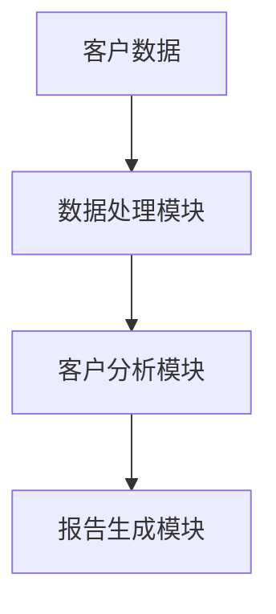
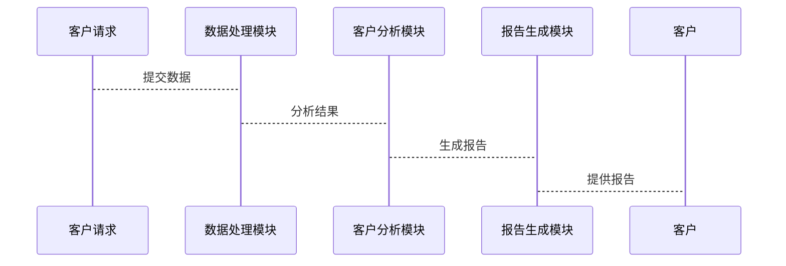

                 


# 彼得林奇如何分析公司的客户获取策略

## 关键词：客户获取策略、彼得·林奇、客户分析、企业绩效、投资策略、CLV模型、客户生命周期

## 摘要：  
彼得·林奇作为世界著名投资家，以其独特的客户分析方法闻名。本文将详细探讨彼得·林奇如何分析公司的客户获取策略，从背景介绍到系统分析，从数学模型到项目实战，全面解析客户获取策略的核心要素、分析方法及其对企业发展的影响。

---

## 第一部分：客户获取策略的背景与重要性

### 第1章：客户获取策略概述

#### 1.1 客户获取策略的重要性  
客户获取策略是企业发展的基石。通过有效的客户获取策略，企业可以吸引新客户、扩大市场份额并实现可持续增长。彼得·林奇认为，客户获取策略的优化能够显著提升企业的绩效和投资价值。

#### 1.2 彼得·林奇的客户分析方法  
彼得·林奇的客户分析方法以基本面分析为核心，注重客户获取的可持续性和盈利能力。他强调通过深入分析客户行为、市场趋势和竞争环境，来评估客户的获取策略是否具备长期发展潜力。

#### 1.3 客户获取的驱动力  
客户获取的驱动力包括市场需求、技术创新、竞争压力和企业战略。彼得·林奇指出，企业应根据自身特点选择合适的客户获取策略，并持续优化以适应市场变化。

#### 1.4 客户获取与企业绩效的关系  
客户获取策略的优劣直接影响企业的收入、利润和市场地位。彼得·林奇通过大量案例研究表明，有效的客户获取策略能够显著提升企业的绩效和投资吸引力。

---

## 第二部分：客户获取策略的核心概念与联系

### 第2章：客户获取策略的核心要素

#### 2.1 客户获取的定义与类型  
客户获取是指通过各种渠道和方法吸引潜在客户，转化为忠实客户的过程。常见的客户获取类型包括广告推广、合作伙伴推荐、内容营销和直接销售。

#### 2.2 客户获取策略的成功要素  
成功的客户获取策略依赖于精准的客户定位、高效的营销渠道和优质的产品服务。彼得·林奇强调，企业应基于客户细分和需求分析，制定个性化的获取策略。

#### 2.3 客户获取与客户保留的关系  
客户获取和保留相辅相成。有效的客户保留策略能够降低客户获取成本，提升客户忠诚度。彼得·林奇建议企业将客户获取与保留结合起来，形成完整的客户生命周期管理。

#### 2.4 客户获取策略与企业绩效的关系  
通过科学的客户获取策略，企业能够提高客户满意度、增加收入和提升市场竞争力。彼得·林奇通过分析发现，客户获取策略的优化能够显著提升企业的投资价值。

### 第3章：客户获取策略的核心概念与联系

#### 3.1 客户获取的核心概念  
客户获取的核心概念包括客户定位、渠道选择和转化率优化。彼得·林奇强调，企业应从客户价值出发，制定差异化的获取策略。

#### 3.2 客户获取策略的属性特征对比  
通过对比不同客户获取策略的属性特征，企业可以选择最适合自身的方法。以下是几种常见策略的对比：

| 策略类型 | 渠道 | 成本 | 转化率 | 适用场景 |
|----------|------|------|--------|-----------|
| 广告推广 | 线上 | 中等 | 中等 | 品牌推广 |
| 内容营销 | 线上 | 低   | 高     | 教育行业 |
| 合作伙伴 | 线下 | 高   | 中等 | 零售行业 |

#### 3.3 客户与公司的关系（Mermaid ER图）  
```mermaid
erDiagram
    customer[客户] {
        string 姓名
        string 邮箱
        string 手机号
        string 用户ID
    }
    company[公司] {
        string 公司名称
        string 业务领域
        string 注册地址
    }
    customer --> company : 购买产品或服务
```

---

## 第三部分：客户获取策略的算法原理

### 第4章：客户获取策略的算法原理

#### 4.1 客户生命周期价值（CLV）模型  
客户生命周期价值（CLV）是衡量客户价值的重要指标。彼得·林奇通过分析CLV，帮助企业评估客户获取策略的经济效益。

#### 4.2 CLV模型的数学公式  
CLV的计算公式为：  
$$CLV = \frac{收入 - 成本}{1 - 贴现率}$$  
其中，收入和成本是客户生命周期内的累计值，贴现率用于调整时间价值。

#### 4.3 CLV模型的Python实现  
以下是CLV模型的Python代码示例：  
```python
def calculate_clv(revenue, cost, discount_rate):
    clv = (revenue - cost) / (1 - discount_rate)
    return clv

revenue = 1000
cost = 500
discount_rate = 0.1

clv = calculate_clv(revenue, cost, discount_rate)
print(f"客户生命周期价值：{clv}")
```

#### 4.4 CLV模型的步骤说明  
1. 确定客户生命周期内的收入和成本。  
2. 计算贴现率，调整时间价值。  
3. 应用CLV公式，计算客户生命周期价值。  
4. 分析结果，优化客户获取策略。

---

## 第四部分：客户获取策略的系统分析

### 第5章：客户获取策略的系统架构设计

#### 5.1 系统功能设计  
系统功能包括数据收集、客户分析和报告生成。彼得·林奇的分析方法可以嵌入到系统中，实现自动化客户获取策略优化。

#### 5.2 系统架构设计（Mermaid架构图）  


#### 5.3 系统交互设计（Mermaid序列图）  


---

## 第五部分：客户获取策略的项目实战

### 第6章：客户获取策略的项目实战

#### 6.1 环境安装与工具准备  
安装必要的工具，如Python、Pandas、Matplotlib和Scikit-learn。

#### 6.2 系统核心实现源代码  
以下是客户获取分析的Python代码示例：  
```python
import pandas as pd
import matplotlib.pyplot as plt
from sklearn.cluster import KMeans

# 加载数据
data = pd.read_csv('customers.csv')

# 数据预处理
data.dropna(inplace=True)

# 模型训练
model = KMeans(n_clusters=3)
model.fit(data[['收入', '成本']])

# 可视化
plt.scatter(data['收入'], data['成本'], c=model.labels_)
plt.xlabel('收入')
plt.ylabel('成本')
plt.title('客户群划分')
plt.show()
```

#### 6.3 代码实现与应用解读  
通过KMeans算法对客户进行聚类分析，帮助企业识别不同客户群体，制定差异化的获取策略。

#### 6.4 案例分析与小结  
以实际案例为例，分析客户获取策略的效果，总结经验教训。

---

## 第六部分：客户获取策略的最佳实践

### 第7章：客户获取策略的最佳实践

#### 7.1 总结与启示  
彼得·林奇的客户分析方法提供了宝贵的启示，企业应结合自身特点，优化客户获取策略。

#### 7.2 注意事项与建议  
企业在实施客户获取策略时，应关注数据质量、渠道优化和客户反馈，确保策略的有效性。

#### 7.3 未来趋势与展望  
随着大数据和人工智能技术的发展，客户获取策略将更加智能化和个性化，企业应积极拥抱技术变革。

#### 7.4 拓展阅读  
推荐阅读彼得·林奇的相关著作，深入理解客户分析方法的应用。

---

## 作者：AI天才研究院 & 禅与计算机程序设计艺术

本文由AI天才研究院与“禅与计算机程序设计艺术”联合撰写，转载请注明出处。

