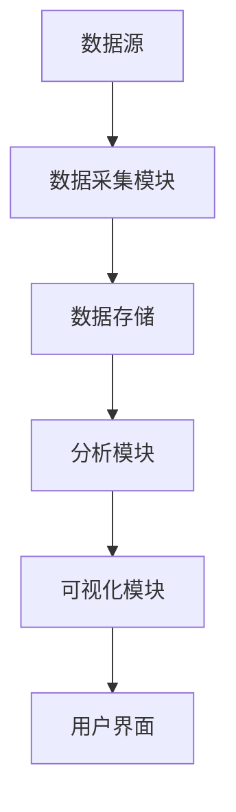

                 


# 彼得林奇如何分析公司的市场占有率

## 关键词：市场占有率，彼得林奇，投资分析，行业分析，竞争优势

## 摘要：彼得林奇作为世界著名投资家，他的成功部分归功于对市场占有率的深入分析。本文将逐步解析市场占有率的核心概念、计算方法、行业分析、竞争优势评估以及财务指标的影响，结合实际案例和系统设计，详细阐述如何通过市场占有率分析做出明智的投资决策。

---

## 第一部分：背景介绍

### 第1章：彼得林奇及其投资理念

#### 1.1 彼得林奇的背景与成就
彼得·林奇（Peter Lynch）是美国著名投资家，曾任富达麦哲伦基金的经理，以长期卓越的投资业绩闻名。他的投资理念强调深入研究公司基本面，尤其是市场份额和行业地位，认为市场占有率是评估企业竞争力的关键指标。

#### 1.2 投资中的市场占有率概念
市场占有率指公司在某个市场中的销售额占该市场总销售额的比例。彼得林奇认为，高市场占有率意味着公司具备强大的市场地位和竞争优势，通常能带来稳定的收益和增长潜力。

---

## 第二部分：市场占有率的分析方法

### 第2章：市场占有率的计算与影响因素

#### 2.1 市场占有率的计算方法
$$ 市场占有率 = \frac{\text{公司销售额}}{\text{行业总销售额}} $$

这个公式帮助投资者量化公司在行业中的地位，但需要准确的数据支持。

#### 2.2 影响市场占有率的关键因素
- **产品竞争力**：产品质量、创新性、价格是否具有竞争力。
- **市场定位**：品牌影响力、目标市场选择、营销策略。
- **成本控制**：运营效率和成本控制能力。

### 第3章：行业分析与竞争格局

#### 3.1 行业分析的基本方法
- **生命周期分析**：行业处于导入期、成长期、成熟期还是衰退期。
- **市场结构分析**：寡头垄断还是充分竞争。

#### 3.2 竞争对手分析
通过分析竞争对手的市场份额、产品线和竞争优势，评估公司在行业中的竞争力。

---

## 第三部分：市场占有率分析的数学模型与算法

### 第4章：数学模型与公式

#### 4.1 市场占有率预测模型
- **时间序列分析模型**：基于历史数据预测未来市场份额。
  ```python
  import pandas as pd
  from statsmodels.tsa.arima_model import ARIMA
  
  # 示例数据：公司过去5年的市场份额
  market_share = [0.2, 0.25, 0.3, 0.35, 0.4]
  
  # 使用ARIMA模型进行预测
  model = ARIMA(market_share, order=(1, 1, 1))
  model_fit = model.fit()
  forecast = model_fit.forecast(steps=1)[0]
  
  print(f"预测下一年的市场占有率：{forecast}")
  ```

- **回归分析模型**：将市场占有率与其他变量（如广告支出）进行回归分析。
  $$ R^2 = 1 - \frac{\sum (y_i - \hat{y_i})^2}{\sum (y_i - \bar{y})^2} $$

### 第5章：算法实现与案例分析

#### 5.1 算法实现
使用Python代码实现时间序列预测，帮助投资者预测未来市场份额。

#### 5.2 案例分析
分析某公司的历史数据，预测未来市场份额，评估投资价值。

---

## 第四部分：系统分析与架构设计

### 第6章：系统架构设计

#### 6.1 系统功能设计
- 数据采集模块：收集行业和公司数据。
- 分析模块：计算市场份额，预测未来趋势。
- 可视化模块：生成图表和报告。

#### 6.2 系统架构图


---

## 第五部分：项目实战

### 第7章：项目实战

#### 7.1 项目环境安装
安装必要的库：
```bash
pip install pandas matplotlib statsmodels
```

#### 7.2 核心代码实现
```python
import pandas as pd
import matplotlib.pyplot as plt
from statsmodels.tsa.arima_model import ARIMA

# 数据加载
data = pd.read_csv('market_share.csv')

# 数据预处理
data['date'] = pd.to_datetime(data['date'])
data.set_index('date', inplace=True)

# 模型训练
model = ARIMA(data['share'], order=(1, 1, 1))
model_fit = model.fit()

# 预测
forecast = model_fit.forecast(steps=3)
 forecast_confidence = model_fit.get_forecast().conf_int()

# 可视化
plt.figure(figsize=(10,6))
plt.plot(data['share'], label='实际值')
plt.plot(forecast, label='预测值', color='red')
plt.fill_between(forecast.index, forecast_confidence['lower share'], 
                 forecast_confidence['upper share'], color='0.5', alpha=0.3)
plt.xlabel('日期')
plt.ylabel('市场份额')
plt.legend()
plt.show()
```

---

## 第六部分：最佳实践与总结

### 第8章：最佳实践与总结

#### 8.1 小结
市场占有率是评估公司竞争力的关键指标，彼得林奇的方法提供了系统的分析框架，从行业分析到财务指标，结合定量分析和定性分析，帮助投资者做出明智决策。

#### 8.2 注意事项
- 数据准确性至关重要。
- 结合行业动态和宏观环境。
- 定期更新分析，避免过时数据影响判断。

#### 8.3 拓展阅读
- 彼得林奇的书籍《彼得林奇选股术》
- 其他投资分析方法，如SWOT分析、PE比率分析。

---

## 作者：AI天才研究院 & 禅与计算机程序设计艺术

---

这篇文章系统地介绍了彼得林奇分析市场占有率的方法，结合理论与实践，帮助投资者深入理解如何通过市场份额评估公司价值。希望对您有所帮助！

