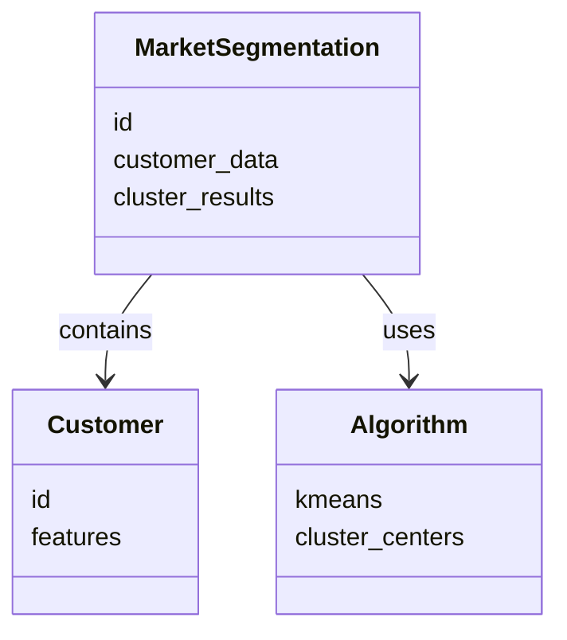

                 


# 彼得林奇如何分析公司的市场细分策略

## 关键词：市场细分，彼得林奇，数据分析，聚类分析，投资策略，客户细分

## 摘要

本文将详细探讨彼得林奇如何分析公司的市场细分策略。通过结合市场细分的定义、重要性、分析框架、数据分析方法、算法原理、系统架构设计和项目实战，本文旨在为投资者和企业提供深入的分析工具和方法，帮助其制定更有效的市场策略和投资决策。

---

## 第一部分：市场细分的背景与重要性

### 第1章：市场细分的定义与重要性

#### 1.1 市场细分的定义与核心要素

市场细分是将整体市场按照消费者需求、行为、地理位置等特征进行划分的过程。其核心要素包括：

- **消费者需求**：消费者对产品或服务的偏好和需求。
- **地理特征**：地理位置、气候等因素。
- **人口统计特征**：年龄、性别、收入水平等。
- **行为特征**：购买习惯、消费频率等。

#### 1.2 市场细分的重要性

市场细分的重要性体现在以下几个方面：

- **精准定位目标客户**：通过细分市场，企业能够更精准地定位目标客户，制定更有针对性的营销策略。
- **提高市场竞争力**：市场细分帮助企业更好地满足特定客户群体的需求，从而提高市场竞争力。
- **优化资源配置**：通过细分市场，企业可以更合理地分配资源，降低成本。

---

## 第二部分：彼得林奇的市场细分分析框架

### 第2章：彼得林奇的市场细分策略

#### 2.1 彼得林奇的分析框架

彼得林奇的市场细分分析框架包括以下几个关键步骤：

1. **确定目标市场**：明确企业的目标客户群体。
2. **制定细分标准**：根据客户特征（如地理位置、需求、行为等）制定细分标准。
3. **选择细分市场**：根据市场潜力和企业能力选择最合适的细分市场。

#### 2.2 市场细分的策略制定

- **目标市场选择**：基于企业的资源和目标客户的需求，选择最适合的细分市场。
- **市场定位**：确定企业在目标市场中的位置和竞争优势。

---

## 第三部分：数据分析与市场细分算法

### 第3章：数据分析与市场细分算法

#### 3.1 数据分析基础

- **数据清洗**：去除无效数据，确保数据质量。
- **数据预处理**：对数据进行标准化、归一化处理。
- **数据分析工具**：常用的工具包括Python的Pandas库、Matplotlib库等。

#### 3.2 聚类分析算法

- **K-means算法**：一种常用的无监督学习算法，用于将数据分成K个簇。
- **步骤**：
  1. 初始化K个簇中心。
  2. 计算每个数据点到簇中心的距离，将其分配到最近的簇。
  3. 重新计算簇中心。
  4. 重复步骤2和3，直到簇中心不再变化。

#### 3.3 聚类分析的数学模型

- **目标函数**：最小化簇内平方误差之和。
  $$ J = \sum_{i=1}^{K} \sum_{j=1}^{n_i} (x_j - c_i)^2 $$
- **簇中心计算**：$$ c_i = \frac{1}{n_i} \sum_{j=1}^{n_i} x_j $$

---

## 第四部分：系统分析与架构设计

### 第4章：系统分析与架构设计方案

#### 4.1 问题场景介绍

- **问题描述**：如何通过数据分析和聚类算法实现市场细分。
- **系统目标**：设计一个能够自动进行市场细分的系统。

#### 4.2 系统功能设计

- **领域模型设计**：使用Mermaid类图展示系统中的核心实体和关系。



#### 4.3 系统架构设计

- **系统架构图**：使用Mermaid架构图展示系统的整体架构。

```mermaid
archi
title Market Segmentation System Architecture
actor Investor
actor Data Analyst
actor System
database CustomerData
service MarketSegmentationService
service AlgorithmService
provider ClusterAnalysis
```

---

## 第五部分：项目实战

### 第5章：项目实战与代码实现

#### 5.1 环境安装与配置

- **Python环境**：安装Python 3.8及以上版本。
- **数据分析库**：安装Pandas、Scikit-learn等库。

#### 5.2 核心代码实现

- **数据加载与预处理**：

```python
import pandas as pd
import numpy as np
from sklearn.cluster import KMeans

# 加载数据
data = pd.read_csv('customer_data.csv')

# 数据预处理
data = data.dropna()
data = (data - data.mean()) / data.std()  # 标准化
```

- **聚类分析**：

```python
# 初始化K-means模型
kmeans = KMeans(n_clusters=3, random_state=42)
kmeans.fit(data)

# 获取簇中心
cluster_centers = kmeans.cluster_centers_
```

- **结果分析**：

```python
print(f"簇中心：{cluster_centers}")
print(f"簇数：{kmeans.n_clusters}")
print(f"总惯性：{kmeans.inertia_}")
```

---

## 第六部分：最佳实践与小结

### 6.1 最佳实践

- **持续学习**：市场细分是一个动态过程，需要持续关注市场变化。
- **避免过度细分**：确保细分市场的规模足够大，具有商业价值。
- **结合实际业务**：将数据分析结果与业务目标相结合。

### 6.2 小结

通过本文的分析，读者可以了解彼得林奇的市场细分策略，掌握数据分析和聚类算法的应用方法，并能够将这些方法应用到实际投资和市场分析中。

---

## 作者：AI天才研究院 & 禅与计算机程序设计艺术

---

通过以上目录结构和内容安排，本文将为读者提供一个全面的市场细分分析框架，帮助其在投资和市场分析中做出更明智的决策。

