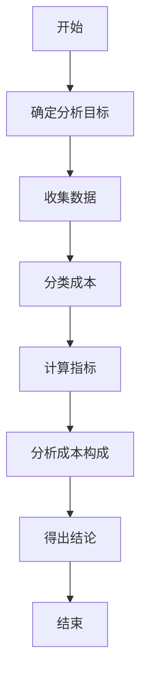
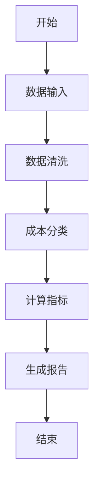
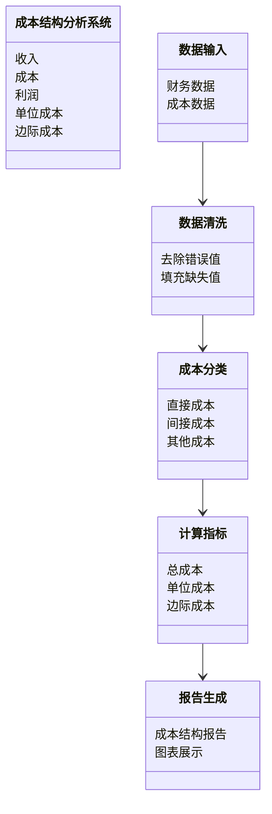
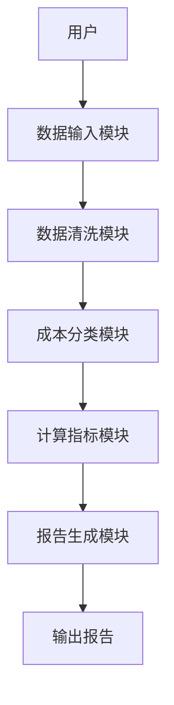

                 


# 彼得林奇如何分析公司的成本结构

## 关键词：彼得林奇，成本结构，投资分析，企业盈利，财务指标

## 摘要：本文深入探讨了彼得林奇的成本结构分析方法，通过系统化的理论阐述和实际案例分析，揭示了如何通过成本结构分析来评估企业盈利能力。文章从成本结构的基本概念、分析算法、系统架构到实际项目案例，全面解析了这一投资策略的核心要素和应用实践。

---

# 第一部分: 彼得林奇投资理念与成本结构分析基础

## 第1章: 彼得林奇投资理念概述

### 1.1 彼得林奇的投资哲学
#### 1.1.1 价值投资的核心理念
彼得林奇是价值投资的代表人物，他主张通过深入分析企业的基本面，寻找被市场低估的投资机会。他强调，投资者必须关注企业的财务状况、行业地位和竞争优势。在这些分析中，成本结构是评估企业盈利能力的重要指标。

#### 1.1.2 彼得林奇的选股策略
彼得林奇的选股策略基于对企业财务状况的全面分析，尤其是企业的成本结构。他认为，一个企业的成本结构决定了其盈利能力的可持续性。他倾向于投资那些成本控制能力强、行业竞争优势明显的企业。

#### 1.1.3 成本结构分析在投资中的重要性
成本结构分析是彼得林奇投资策略的核心内容之一。通过分析企业的成本构成，投资者可以评估企业的盈利能力、市场竞争力和财务健康状况。成本结构分析能够帮助投资者识别企业的竞争优势和潜在风险。

### 1.2 成本结构的基本概念
#### 1.2.1 成本结构的定义
成本结构是指企业在生产和运营过程中所涉及的各种成本的构成和比例。成本结构分析是将企业的各项成本按照其性质和用途进行分类、分解和评估的过程。

#### 1.2.2 成本结构的组成部分
成本结构通常包括直接成本、间接成本和其他相关成本。直接成本是指与产品生产直接相关的成本，如原材料和直接人工成本。间接成本是指企业运营中不直接与产品生产相关，但支持企业运转的成本，如管理费用和营销费用。其他相关成本包括研发成本和质量控制成本。

#### 1.2.3 成本结构对企业盈利能力的影响
成本结构是影响企业盈利能力的关键因素。合理的成本结构能够降低企业的生产成本，提高利润率。通过分析成本结构，投资者可以评估企业的成本控制能力、运营效率和市场竞争力。

---

## 第2章: 公司成本结构的构成要素

### 2.1 直接成本
#### 2.1.1 直接材料成本
直接材料成本是指生产产品所需的主要原材料和辅助材料的成本。例如，制造汽车所需的钢材和橡胶等。

#### 2.1.2 直接人工成本
直接人工成本是指生产过程中直接参与产品制造的员工工资和福利费用。

#### 2.1.3 制造费用
制造费用是指生产过程中发生的间接成本，如工厂租金、设备折旧和维护费用等。

### 2.2 间接成本
#### 2.2.1 间接人工成本
间接人工成本是指企业中不直接参与产品生产的员工工资，如管理人员和行政人员的工资。

#### 2.2.2 公司管理费用
公司管理费用是指企业总部的管理支出，包括高层管理人员的工资、办公费用和差旅费用等。

#### 2.2.3 营销与分销成本
营销与分销成本是指企业推广产品、分销产品所产生的费用，包括广告费用、销售佣金和物流费用等。

### 2.3 其他相关成本
#### 2.3.1 研发成本
研发成本是指企业用于产品开发和技术创新的支出，包括研究人员的工资、实验设备的购置费用等。

#### 2.3.2 质量控制成本
质量控制成本是指企业在生产过程中用于保证产品质量的支出，包括质量检测费用和质量管理人员的工资等。

#### 2.3.3 供应链成本
供应链成本是指企业在采购原材料、管理供应商关系和物流过程中所产生的成本。

---

## 第3章: 成本结构分析的核心要素

### 3.1 成本结构分析的基本原理
#### 3.1.1 成本结构分析的目的
成本结构分析的目的是通过对企业各项成本的分类、分解和评估，识别成本的构成和比例，评估企业的成本控制能力、运营效率和市场竞争力。

#### 3.1.2 成本结构分析的关键指标
成本结构分析的关键指标包括单位成本、边际成本、固定成本和变动成本等。

#### 3.1.3 成本结构分析的步骤
成本结构分析的步骤包括：
1. **收集数据**：收集企业的财务报表和相关成本数据。
2. **分类成本**：将成本按照直接成本、间接成本和其他相关成本进行分类。
3. **计算指标**：计算单位成本、边际成本和总成本等关键指标。
4. **分析成本构成**：评估各项成本的比例和变动趋势。
5. **得出结论**：根据分析结果，评估企业的成本结构和盈利能力。

### 3.2 成本结构分析的数学模型
#### 3.2.1 总成本计算公式
$$
\text{总成本} = \text{变动成本} + \text{固定成本}
$$

#### 3.2.2 单位成本计算公式
$$
\text{单位成本} = \frac{\text{总成本}}{\text{产量}}
$$

#### 3.2.3 边际成本计算公式
$$
\text{边际成本} = \frac{\Delta \text{总成本}}{\Delta \text{产量}}
$$

### 3.3 成本结构分析的流程图


---

## 第4章: 成本结构分析的算法原理

### 4.1 成本结构分析的算法流程


#### 4.1.1 数据输入
将企业的财务数据输入到分析系统中，包括收入、成本和利润等。

#### 4.1.2 数据清洗
对输入的数据进行清洗，剔除错误和异常值，确保数据的准确性和完整性。

#### 4.1.3 成本分类
将企业的各项成本按照直接成本、间接成本和其他相关成本进行分类。

#### 4.1.4 计算指标
根据分类后的成本数据，计算总成本、单位成本和边际成本等关键指标。

#### 4.1.5 生成报告
根据分析结果，生成成本结构分析报告，包括图表和文字说明。

#### 4.1.6 输出结果
将分析结果输出到报告中，供投资者参考。

### 4.2 成本结构分析的代码实现
以下是一个简单的成本结构分析代码示例，使用Python编写：

```python
# 成本结构分析代码示例
def calculate_cost_structure(revenue, cost_of_goods_sold, operating_expenses):
    total_cost = cost_of_goods_sold + operating_expenses
    unit_cost = total_cost / revenue if revenue != 0 else 0
    return total_cost, unit_cost

# 示例数据
revenue = 1000000
cost_of_goods_sold = 600000
operating_expenses = 200000

total_cost, unit_cost = calculate_cost_structure(revenue, cost_of_goods_sold, operating_expenses)
print(f"总成本: {total_cost}")
print(f"单位成本: {unit_cost}")
```

---

## 第5章: 系统分析与架构设计方案

### 5.1 问题场景介绍
假设我们是一家制造企业的财务分析师，需要对公司的成本结构进行深入分析，以评估企业的盈利能力。

### 5.2 系统功能设计
#### 5.2.1 领域模型


#### 5.2.2 系统架构设计


---

## 第6章: 项目实战

### 6.1 环境安装
为了进行成本结构分析，我们需要安装以下环境：
- Python 3.8+
- Jupyter Notebook
- Matplotlib

### 6.2 系统核心实现源代码
以下是一个简单的成本结构分析代码示例：

```python
import matplotlib.pyplot as plt

# 示例数据
products = ['Product A', 'Product B', 'Product C']
costs = [50, 60, 45]

# 绘制柱状图
plt.bar(products, costs)
plt.title('成本结构分析')
plt.xlabel('产品')
plt.ylabel('成本')
plt.show()
```

### 6.3 代码应用解读与分析
上述代码通过柱状图展示了不同产品的成本结构。通过分析图表，我们可以识别出哪些产品的成本较高，从而进一步优化成本结构。

---

## 第7章: 最佳实践 tips、小结、注意事项、拓展阅读

### 7.1 小结
本文详细探讨了彼得林奇的成本结构分析方法，并通过系统化的理论阐述和实际案例分析，揭示了如何通过成本结构分析来评估企业盈利能力。

### 7.2 注意事项
在进行成本结构分析时，需要注意以下几点：
1. 确保数据的准确性和完整性。
2. 合理分类成本，避免混淆。
3. 定期更新分析结果，以反映企业的最新情况。

### 7.3 拓展阅读
- 彼得林奇的《彼得林奇选股法则》
- 《成本结构分析与企业盈利提升》
- 《数据分析在投资决策中的应用》

---

# 作者：AI天才研究院/AI Genius Institute & 禅与计算机程序设计艺术 /Zen And The Art of Computer Programming

---

通过本文的系统分析和实际案例，读者可以深入了解彼得林奇的成本结构分析方法，并将其应用于实际投资决策中。希望本文能够为投资者提供有价值的参考和启发。

