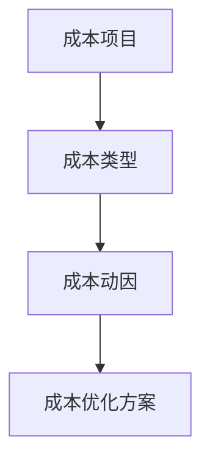
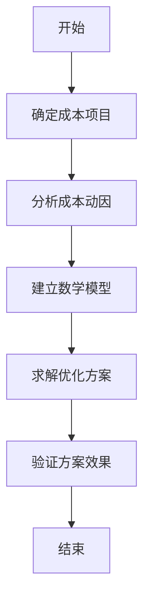
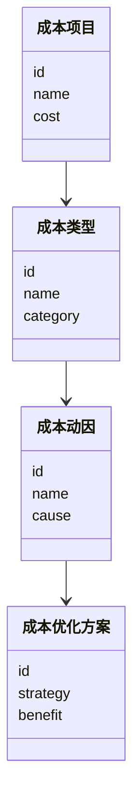
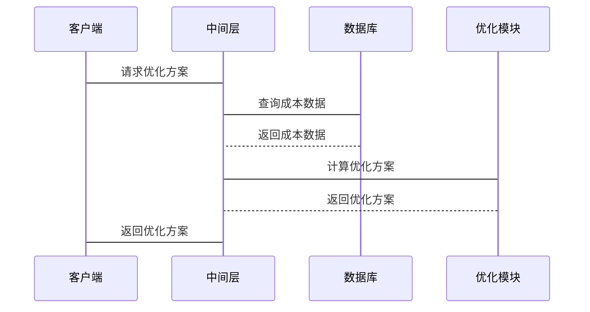

                 


# 彼得林奇如何分析公司的成本结构优化对长期竞争力的影响

## 关键词：成本结构优化, 彼得·林奇, 企业竞争力, 投资策略, 成本分析

## 摘要： 
彼得·林奇作为全球著名投资家，其对公司的成本结构分析方法在投资决策中具有重要影响。本文通过详细分析成本结构的核心概念、优化算法、系统架构及实际案例，揭示成本结构优化如何提升企业的长期竞争力。结合数学模型、流程图和Python代码，深入探讨彼得·林奇的投资哲学及其在现代企业中的应用，为企业管理者和投资者提供实用的策略建议。

---

## 第一部分: 成本结构优化与企业竞争力概述

## 第1章: 成本结构优化的背景与重要性

### 1.1 成本结构优化的背景

#### 1.1.1 企业成本结构的基本概念
企业的成本结构是指企业各项成本的构成及其比例关系。成本结构分析是企业优化运营、提升竞争力的关键环节。

#### 1.1.2 成本结构优化对企业竞争力的影响
成本结构优化能够降低企业运营成本，提高利润率和市场竞争力。优化后的成本结构使企业能够在价格竞争中更具优势，同时增强企业的盈利能力。

#### 1.1.3 彼得·林奇的成本分析方法概述
彼得·林奇通过分析企业的成本结构，评估其长期盈利能力。他注重企业的边际成本、固定成本和可变成本，以判断企业是否具备成本优势。

### 1.2 企业成本结构的核心要素

#### 1.2.1 固定成本与可变成本的定义
- 固定成本：企业在一定产量范围内必须支付的成本，如租金、 salaries。
- 可变成本：随着产量变化而变化的成本，如原材料、运输费用。

#### 1.2.2 直接成本与间接成本的区别
- 直接成本：可以直接追溯到产品或服务的成本，如原材料。
- 间接成本：无法直接追溯到产品或服务的成本，如行政管理费用。

#### 1.2.3 短期成本与长期成本的分析
- 短期成本：短期内不会变化的成本，如设备折旧。
- 长期成本：长期投资产生的成本，如研发费用。

### 1.3 成本结构优化的必要性

#### 1.3.1 企业利润最大化的目标
通过优化成本结构，企业可以实现利润最大化，增强市场竞争力。

#### 1.3.2 成本结构对企业盈利能力的影响
成本结构的优化直接影响企业的净利润，降低不必要的成本支出，提高利润率。

#### 1.3.3 行业竞争中的成本优势
在行业竞争中，具备成本优势的企业能够以更低的价格提供产品或服务，吸引更多的客户，扩大市场份额。

### 1.4 彼得·林奇的成本分析方法

#### 1.4.1 彼得·林奇的投资哲学
彼得·林奇注重长期投资，关注企业的基本面，尤其是成本结构和盈利能力。

#### 1.4.2 成本结构分析在投资决策中的作用
彼得·林奇认为，企业成本结构的优化是评估其长期竞争力的重要指标，优化的成本结构能够增强企业的盈利能力和抗风险能力。

#### 1.4.3 林奇对企业的长期竞争力的定义
彼得·林奇认为，企业的长期竞争力不仅取决于成本结构，还取决于其市场地位、创新能力和发展潜力。

### 1.5 本章小结
本章主要介绍了成本结构优化的背景、核心要素以及彼得·林奇的成本分析方法，为后续的分析奠定了基础。

---

## 第2章: 成本结构优化的核心概念与联系

### 2.1 成本结构优化的核心概念

#### 2.1.1 成本结构优化的定义
成本结构优化是指通过调整和优化企业的各项成本，使其达到最优状态，从而提高企业的竞争力和盈利能力。

#### 2.1.2 成本结构优化的目标
成本结构优化的目标是降低企业运营成本，提高利润率，增强企业的市场竞争力。

#### 2.1.3 成本结构优化的边界与外延
成本结构优化的边界包括企业的内部成本和外部成本，外延则涉及企业的供应链、生产流程和市场环境。

### 2.2 成本结构优化的核心要素

#### 2.2.1 成本项目的分类
- 固定成本：如租金、 salaries。
- 可变成本：如原材料、运输费用。

#### 2.2.2 成本动因的分析
成本动因是指导致成本发生的原因，如生产数量、时间等。

#### 2.2.3 成本效益分析的原理
成本效益分析是比较不同成本方案的成本与效益，选择最优方案。

### 2.3 成本结构优化的数学模型

#### 2.3.1 成本函数的定义
成本函数是描述成本与产量之间关系的函数，通常表示为：
$$C(x) = a + bx$$

其中，$a$ 是固定成本，$b$ 是单位可变成本，$x$ 是产量。

#### 2.3.2 成本优化的数学表达式
通过求导数找到最小值，即：
$$MC = \frac{dC}{dx}$$

### 2.4 成本结构优化的ER实体关系图


### 2.5 本章小结
本章详细讲解了成本结构优化的核心概念和数学模型，并通过ER图展示了成本结构优化的关系。

---

## 第3章: 成本结构优化的算法原理

### 3.1 成本结构优化的算法概述

#### 3.1.1 线性规划模型在成本优化中的应用
线性规划模型是一种优化方法，广泛应用于成本结构优化中。

#### 3.1.2 动态成本分析的算法步骤
1. 确定成本项目
2. 分析成本动因
3. 建立数学模型
4. 求解优化方案
5. 验证方案效果

### 3.2 成本结构优化的算法流程图


### 3.3 算法实现的Python代码
```python
import numpy as np
from scipy.optimize import minimize

def cost_function(x, a, b):
    return a + b * x

# 参数设置
a = 100  # 固定成本
b = 5    # 可变成本
x0 = 10  # 初始产量

# 求解优化问题
result = minimize(cost_function, x0, args=(a, b))

# 输出结果
print("最优产量:", result.x)
print("最低成本:", result.fun)
```

### 3.4 本章小结
本章通过线性规划模型和Python代码，详细讲解了成本结构优化的算法原理和实现步骤。

---

## 第4章: 系统分析与架构设计方案

### 4.1 问题场景介绍
以一家制造企业为例，分析其成本结构优化的系统架构。

### 4.2 系统功能设计

#### 4.2.1 领域模型mermaid类图


### 4.3 系统架构设计mermaid架构图


### 4.4 系统接口设计
系统接口设计包括API接口和数据库接口。

### 4.5 系统交互mermaid序列图


### 4.6 本章小结
本章通过系统架构设计和交互图，展示了成本结构优化在企业中的具体应用。

---

## 第5章: 项目实战

### 5.1 环境安装
需要安装Python和相关库，如numpy和scipy。

### 5.2 系统核心实现源代码
```python
import numpy as np
from scipy.optimize import minimize

def cost_function(x, a, b):
    return a + b * x

# 参数设置
a = 100
b = 5
x0 = 10

# 求解优化问题
result = minimize(cost_function, x0, args=(a, b))

# 输出结果
print("最优产量:", result.x)
print("最低成本:", result.fun)
```

### 5.3 代码应用解读与分析
通过代码实现成本结构优化，帮助企业找到最优的产量和成本。

### 5.4 实际案例分析
以某制造企业为例，分析其成本结构优化的具体实施步骤和效果。

### 5.5 本章小结
本章通过实际案例分析，展示了成本结构优化在企业中的应用效果。

---

## 第6章: 最佳实践 tips

### 6.1 小结
总结成本结构优化的重要性和实施方法。

### 6.2 注意事项
企业在实施成本结构优化时，需要注意数据的准确性和方法的适用性。

### 6.3 拓展阅读
推荐相关书籍和资源，供读者进一步学习。

---

## 结语
通过本文的分析，我们可以看到，成本结构优化是企业提升竞争力的关键因素。彼得·林奇的成本分析方法为我们提供了一个有效的工具，帮助我们在投资决策中更好地评估企业的长期竞争力。

## 作者：AI天才研究院 & 禅与计算机程序设计艺术

