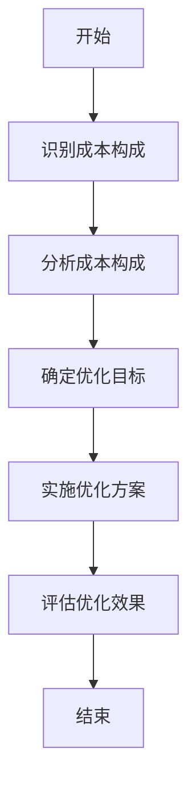
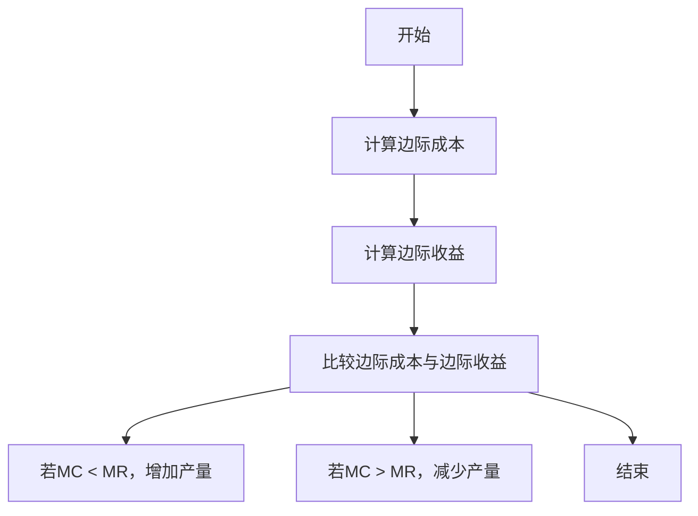
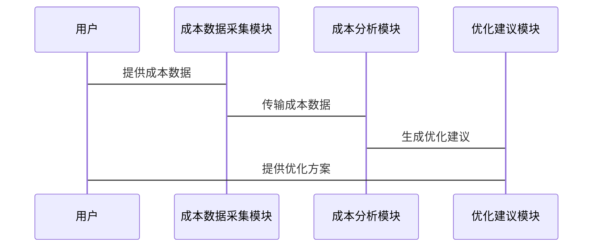

                 


# 彼得林奇如何分析公司的成本结构优化能力

> 关键词：彼得林奇，成本结构优化，投资分析，企业成本管理，优化策略，投资决策

> 摘要：本文深入探讨了彼得林奇如何分析公司的成本结构优化能力，通过详细分析成本结构优化的核心概念、数学模型、系统架构设计、项目实战等，揭示了彼得林奇的成本结构优化分析方法及其在投资决策中的应用。文章从背景介绍到系统设计，从实际案例到总结展望，全面阐述了成本结构优化能力的分析与优化策略。

---

## # 第一部分：引言

## # 第1章：成本结构优化的重要性

### ## 1.1 问题背景与描述

#### ### 1.1.1 成本结构优化的定义

成本结构优化是指通过对企业的成本构成进行分析和调整，以降低不必要的开支，提高企业利润和竞争力。彼得·林奇作为投资大师，擅长通过分析公司的成本结构，判断其优化能力，从而做出投资决策。

#### ### 1.1.2 优化成本结构的必要性

在企业运营中，成本结构是决定企业盈利能力的关键因素之一。优化成本结构可以帮助企业降低运营成本，提高利润率，增强市场竞争力。对于投资者而言，成本结构优化能力强的公司通常具有更高的投资价值。

#### ### 1.1.3 彼得·林奇的分析方法

彼得·林奇在分析公司时，特别关注成本结构的合理性。他认为，一个公司能否持续优化成本结构，是判断其管理能力和未来发展潜力的重要指标。

---

### ## 1.2 问题解决与边界

#### ### 1.2.1 成本结构优化的核心问题

- 如何识别和分析企业的主要成本构成？
- 如何通过优化成本结构提升企业盈利能力？
- 如何将成本结构优化能力与投资决策相结合？

#### ### 1.2.2 边界与外延

成本结构优化的边界包括企业的直接成本和间接成本，但不包括与公司主营业务无关的外部成本。外延则涉及成本优化的具体方法，如自动化技术的应用、供应链优化等。

#### ### 1.2.3 核心要素对比

| 核心要素 | 描述 | 优化方向 |
|----------|------|-----------|
| 直接成本 | 原材料、人工成本等 | 降低单位产品成本 |
| 间接成本 | 场地租金、管理费用等 | 优化资源分配 |
| 固定成本 | 设备折旧、研发费用等 | 提高资产利用率 |

#### ### 1.2.4 实体关系图

```mermaid
erDiagram
    customer[客户] {
        +id: int
        +name: string
        +address: string
    }
    product[产品] {
        +id: int
        +name: string
        +cost: float
    }
    order[订单] {
        +id: int
        +customer_id: int
        +product_id: int
        +quantity: int
        +total_cost: float
    }
    customer -- order: 下单
    product -- order: 订单包含的产品
```

---

## # 第二部分：核心概念与联系

## # 第2章：成本结构优化的核心概念

### ## 2.1 成本结构的组成

#### ### 2.1.1 成本结构的三要素

1. **固定成本**：如厂房、设备等，不随产量变化。
2. **可变成本**：如原材料、人工成本等，随产量变化。
3. **混合成本**：部分固定、部分可变，如运输费用。

#### ### 2.1.2 成本结构优化的目标

- 最小化总成本。
- 提高成本与收益的匹配度。
- 增强企业的市场竞争力。

#### ### 2.1.3 成本结构的关键要素对比

| 对比维度 | 固定成本 | 可变成本 | 混合成本 |
|----------|-----------|-----------|-----------|
| 变化特性 | 不变       | 随产量变化 | 部分变化   |
| 优化难度 | 较难       | 较易       | 中等       |
| 优化方向 | 提高利用率 | 降低单位成本 | 综合优化   |

#### ### 2.1.4 成本结构优化的流程图



---

## # 第三部分：算法原理讲解

## # 第3章：成本结构优化的数学模型

### ## 3.1 成本结构优化的数学模型

#### ### 3.1.1 模型建立

假设某企业生产的产品单位成本为C，固定成本为F，产量为Q。总成本T的公式为：

$$T = F + C \times Q$$

#### ### 3.1.2 优化公式推导

为了最小化总成本T，我们需要找到最优产量Q*，使得T最小：

$$\frac{dT}{dQ} = C = 0 \Rightarrow Q* = 0$$

然而，这显然不合理，因此我们需要引入边际成本的概念。

#### ### 3.1.3 边际成本分析

边际成本是指每增加一单位产量所增加的总成本。公式为：

$$MC = \frac{dC}{dQ}$$

当边际成本等于边际收益时，企业达到最优产量。

---

### ## 3.2 成本结构优化的算法流程图



---

## # 第四部分：系统分析与架构设计方案

## # 第4章：系统分析与架构设计

### ## 4.1 系统分析

#### ### 4.1.1 问题场景介绍

以一家制造企业为例，分析其成本结构，优化生产成本。

#### ### 4.1.2 系统功能设计

| 功能模块 | 描述 |
|----------|------|
| 成本数据采集 | 采集企业的成本数据 |
| 成本分析 | 分析成本构成 |
| 优化建议 | 提供优化方案 |

#### ### 4.1.3 系统架构设计


#### ### 4.1.4 接口设计

| 接口名称 | 输入 | 输出 |
|----------|------|------|
| 采集接口 | 数据源 | 成本数据 |
| 分析接口 | 成本数据 | 成本构成分析报告 |

#### ### 4.1.5 交互流程图



---

## # 第五部分：项目实战

## # 第5章：成本结构优化的项目实战

### ## 5.1 项目环境安装

- 安装Python和相关库（如NumPy、Pandas）。
- 安装Jupyter Notebook用于数据处理和可视化。

### ## 5.2 核心代码实现

```python
import numpy as np
import pandas as pd

# 示例数据
data = {
    '固定成本': [10000, 10000, 10000],
    '可变成本': [50, 60, 70],
    '产量': [100, 200, 300]
}

df = pd.DataFrame(data)

# 计算总成本
df['总成本'] = df['固定成本'] + df['可变成本'] * df['产量']

# 找出最优产量
optimal_Q = df[df['总成本'].idxmin()]['产量']
print(f"最优产量为：{optimal_Q}")
```

### ## 5.3 代码实现解读与分析

上述代码通过数据分析，计算了不同产量下的总成本，并找到最优产量。这展示了如何通过数学模型优化成本结构。

### ## 5.4 案例分析与详细讲解

以某制造企业为例，分析其成本结构，计算最优产量，并提出优化建议。

### ## 5.5 项目小结

通过项目实战，我们学会了如何将彼得·林奇的成本结构优化方法应用于实际项目中。

---

## # 第六部分：总结与展望

## # 第6章：总结与展望

### ## 6.1 内容回顾

本文从理论到实践，全面阐述了彼得·林奇的成本结构优化分析方法。

### ## 6.2 投资决策中的成本结构优化

在投资决策中，成本结构优化能力是判断企业潜力的重要指标。

### ## 6.3 注意事项

- 数据分析需结合实际情况。
- 优化方案需考虑企业实际情况。
- 持续监控成本结构变化。

### ## 6.4 拓展阅读

推荐阅读彼得·林奇的其他著作，深入理解成本结构优化的更多细节。

---

## # 作者信息

作者：AI天才研究院/AI Genius Institute & 禅与计算机程序设计艺术 /Zen And The Art of Computer Programming

