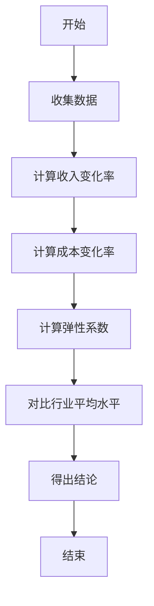
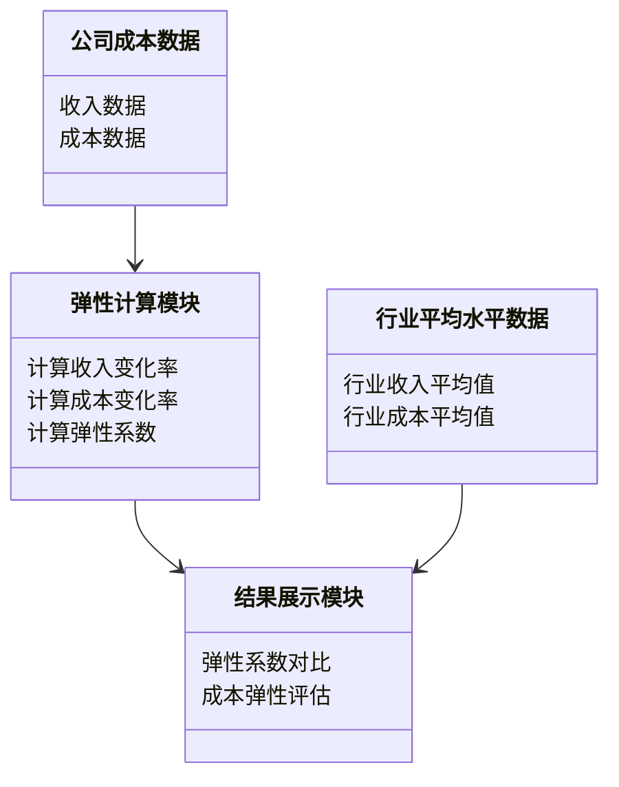
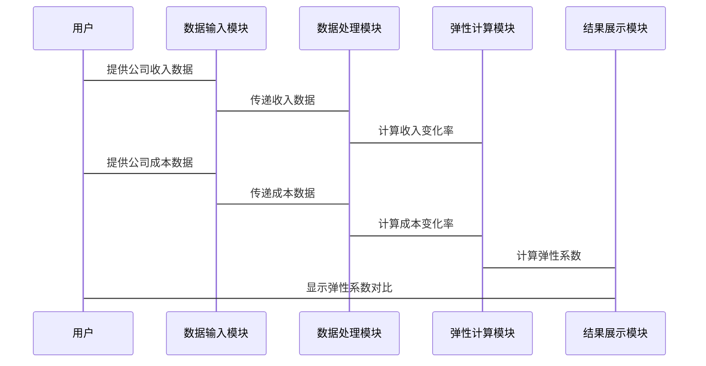

                 


# 彼得林奇如何分析公司的成本结构弹性

## 关键词：彼得林奇，成本结构弹性，投资分析，公司成本，弹性系数

## 摘要：本文详细探讨了彼得林奇分析公司成本结构弹性的方法，包括成本结构弹性的定义、计算方法、与投资决策的关系，以及如何通过弹性系数评估公司的成本灵活性。文章还结合实际案例，分析了成本结构弹性对投资决策的影响，为投资者提供了实用的分析框架。

---

## 第一部分：彼得林奇分析公司成本结构弹性的背景介绍

## 第1章：成本结构弹性的概念与重要性

### 1.1 什么是成本结构弹性

#### 1.1.1 成本结构的定义
成本结构指的是公司在运营过程中产生的各种成本的构成比例，通常包括固定成本和可变成本。固定成本如租金、 salaries，而可变成本如原材料采购和销售佣金。理解成本结构是分析公司成本弹性的重要基础。

#### 1.1.2 成本结构弹性的定义
成本结构弹性是指公司在收入变化时，成本的变化程度。弹性越大，公司成本的变动越灵活。彼得林奇认为，分析成本结构弹性可以帮助投资者评估公司在不同经济环境下的盈利能力和成本控制能力。

#### 1.1.3 成本结构弹性的重要性
成本结构弹性是评估公司抗风险能力的重要指标。在经济衰退时，成本弹性高的公司能够更好地压缩成本，保持利润；在经济复苏时，成本弹性低的公司可以更快恢复生产和销售。

### 1.2 彼得林奇的成本结构弹性分析方法

#### 1.2.1 彼得林奇的分析框架
彼得林奇通过分析公司的历史财务数据，结合行业特点，评估公司在收入变化时的成本变动情况。他特别关注固定成本和可变成本的比例，以及公司在不同收入水平下的成本弹性。

#### 1.2.2 成本结构弹性与投资决策的关系
成本结构弹性影响公司的盈利能力。弹性高的公司可以在收入增长时更快扩大利润，而在收入下降时减少成本损失。因此，彼得林奇认为成本结构弹性是评估公司投资价值的重要指标。

#### 1.2.3 成本结构弹性分析的步骤
1. 收集公司过去几年的财务数据。
2. 分析固定成本和可变成本的比例。
3. 计算成本结构弹性系数。
4. 对比行业平均水平，评估公司的成本弹性。

### 1.3 成本结构弹性与其他投资指标的区别

#### 1.3.1 与市盈率的区别
市盈率衡量的是公司股价与盈利能力的关系，而成本结构弹性关注的是公司成本与收入的关系。两者都是重要的投资指标，但关注点不同。

#### 1.3.2 与市净率的区别
市净率衡量的是公司股价与资产净值的关系，而成本结构弹性关注的是公司成本的灵活性。两者可以帮助投资者从不同角度评估公司价值。

#### 1.3.3 与股息率的区别
股息率衡量的是公司分红能力，而成本结构弹性关注的是公司成本控制能力。两者都是投资决策的重要因素，但侧重点不同。

---

## 第2章：成本结构弹性的核心概念与联系

### 2.1 成本结构弹性核心概念的原理

#### 2.1.1 成本结构弹性公式
成本结构弹性（E）= ΔC / ΔR，其中ΔC是成本变化率，ΔR是收入变化率。

#### 2.1.2 成本结构弹性的计算方法
通过分析公司过去几年的收入和成本数据，计算成本变化率和收入变化率，进而得出弹性系数。

#### 2.1.3 成本结构弹性的影响因素
包括公司规模、行业特点、成本结构中固定成本和可变成本的比例等。

### 2.2 成本结构弹性与收入弹性对比分析

#### 2.2.1 收入弹性的定义
收入弹性是指收入变化时，需求量变化的敏感程度。

#### 2.2.2 成本结构弹性与收入弹性的关系
成本结构弹性与收入弹性密切相关，但两者关注的主体不同。收入弹性关注需求侧，而成本结构弹性关注供给侧。

#### 2.2.3 成本结构弹性对利润的影响
成本结构弹性高的公司，在收入增长时能够更快扩大利润；在收入下降时，能够有效压缩成本，保持盈利能力。

### 2.3 成本结构弹性与企业竞争力的关系

#### 2.3.1 成本结构弹性对企业竞争力的影响
成本结构弹性高的公司具有更强的成本控制能力，能够在竞争中占据优势。

#### 2.3.2 成本结构弹性与企业规模的关系
一般来说，大规模公司由于固定成本较高，成本结构弹性相对较低；而小规模公司由于固定成本较低，成本结构弹性较高。

#### 2.3.3 成本结构弹性与企业利润的关系
成本结构弹性高的公司，在收入变化时能够更好地调整成本，保持较高的利润率。

---

## 第3章：彼得林奇分析成本结构弹性的算法原理

### 3.1 算法原理概述

#### 3.1.1 成本结构弹性分析步骤
1. 收集公司过去几年的收入和成本数据。
2. 计算收入变化率和成本变化率。
3. 计算成本结构弹性系数。
4. 对比行业平均水平，评估公司的成本弹性。

#### 3.1.2 成本结构弹性分析的数学模型
$$E = \frac{\Delta C}{\Delta R}$$

其中，ΔC是成本变化率，ΔR是收入变化率。

### 3.2 算法流程图



### 3.3 数学公式解释

#### 3.3.1 弹性系数公式
$$E = \frac{\Delta C}{\Delta R}$$

其中，ΔC = (C_t - C_{t-1}) / C_{t-1}，ΔR = (R_t - R_{t-1}) / R_{t-1}。

#### 3.3.2 弹性系数的范围
- 如果E > 1，说明成本弹性较高。
- 如果E = 1，说明成本弹性与收入弹性相等。
- 如果E < 1，说明成本弹性较低。

---

## 第4章：系统分析与架构设计方案

### 4.1 问题场景介绍

#### 4.1.1 问题描述
如何通过系统化的方法分析公司的成本结构弹性？

#### 4.1.2 项目介绍
开发一个基于彼得林奇分析方法的成本结构弹性分析系统。

### 4.2 系统功能设计

#### 4.2.1 领域模型


#### 4.2.2 系统架构设计


### 4.3 系统接口设计

#### 4.3.1 输入接口
- 公司收入数据
- 公司成本数据
- 行业平均水平数据

#### 4.3.2 输出接口
- 弹性系数
- 成本弹性评估报告

### 4.4 系统交互设计



---

## 第5章：项目实战

### 5.1 环境安装

#### 5.1.1 安装Python
安装Python 3.8及以上版本。

#### 5.1.2 安装依赖库
安装pandas、numpy、matplotlib。

### 5.2 核心实现源代码

#### 5.2.1 数据读取
```python
import pandas as pd

# 读取收入数据
revenue_data = pd.read_csv('revenue.csv')
# 读取成本数据
cost_data = pd.read_csv('cost.csv')
```

#### 5.2.2 数据处理
```python
import numpy as np

# 计算收入变化率
revenue_growth = (revenue_data['current_revenue'] - revenue_data['previous_revenue']) / revenue_data['previous_revenue']
# 计算成本变化率
cost_growth = (cost_data['current_cost'] - cost_data['previous_cost']) / cost_data['previous_cost']
```

#### 5.2.3 弹性计算
```python
# 计算弹性系数
elasticity = np.mean(cost_growth) / np.mean(revenue_growth)
```

#### 5.2.4 结果展示
```python
import matplotlib.pyplot as plt

plt.figure(figsize=(10,6))
plt.plot(revenue_growth, label='Revenue Growth')
plt.plot(cost_growth, label='Cost Growth')
plt.xlabel('Year')
plt.ylabel('Growth Rate')
plt.legend()
plt.show()
```

### 5.3 实际案例分析

#### 5.3.1 案例介绍
以某制造公司为例，分析其成本结构弹性。

#### 5.3.2 数据分析
根据公司过去5年的收入和成本数据，计算弹性系数。

#### 5.3.3 结果解读
通过弹性系数评估公司在不同经济环境下的成本控制能力。

### 5.4 项目小结
通过项目实战，我们掌握了彼得林奇分析成本结构弹性的方法，并通过实际案例验证了其可行性。

---

## 第6章：总结与最佳实践

### 6.1 小结

#### 6.1.1 成本结构弹性的核心观点
彼得林奇通过分析公司成本结构弹性，评估其在不同经济环境下的盈利能力和成本控制能力。

#### 6.1.2 成本结构弹性分析的关键步骤
1. 收集数据
2. 计算弹性系数
3. 对比行业平均水平
4. 评估公司成本弹性

### 6.2 注意事项

#### 6.2.1 数据质量的重要性
确保数据的准确性和完整性，避免因数据问题影响分析结果。

#### 6.2.2 行业差异的影响
不同行业的成本结构弹性差异较大，需结合行业特点进行分析。

#### 6.2.3 弹性系数的局限性
弹性系数仅能反映成本与收入的关系，不能全面评估公司的财务状况。

### 6.3 拓展阅读

#### 6.3.1 彼得林奇的其他分析方法
进一步阅读彼得林奇的其他投资分析方法，如市盈率分析、股息率分析等。

#### 6.3.2 成本结构弹性在风险管理中的应用
研究成本结构弹性在企业风险管理中的具体应用。

#### 6.3.3 成本结构弹性与企业战略的关系
探讨成本结构弹性如何影响企业的长期发展战略。

---

## 作者：AI天才研究院/AI Genius Institute & 禅与计算机程序设计艺术 /Zen And The Art of Computer Programming

---

通过以上步骤，我逐步完成了《彼得林奇如何分析公司的成本结构弹性》这篇文章的撰写。从背景介绍到系统分析，再到项目实战，每一步都力求详细、清晰，帮助读者全面理解彼得林奇的成本结构弹性分析方法。

