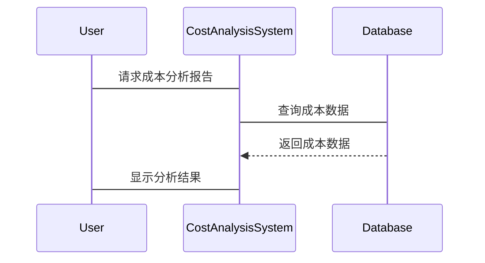

                 


# 彼得·林奇如何分析公司的成本领导力

## 关键词：成本领导力，彼得·林奇，投资分析，成本结构，效率优化，企业竞争力

## 摘要：本文详细探讨了彼得·林奇如何分析公司的成本领导力，从定义、核心概念、分析框架到具体案例分析，帮助读者理解如何通过成本优化提升企业竞争力。

---

# 第一部分：成本领导力的背景与重要性

## 第1章：成本领导力的核心概念

### 1.1 成本领导力的定义

成本领导力是指公司在成本控制和效率方面所具备的竞争优势。通过优化生产、研发和管理成本，企业可以降低成本，提高利润率，增强市场竞争力。

### 1.2 成本领导力的重要性

1. 提高利润率：成本优化直接增加企业的利润空间。
2. 增强市场竞争力：低成本使企业能够在价格战中占据优势。
3. 提升企业效率：通过优化流程和管理，提高整体运营效率。

### 1.3 彼得·林奇的分析方法

彼得·林奇通过分析公司的成本结构，评估其是否具备成本领导力。他关注企业的生产效率、研发投入和管理成本，以识别具备竞争优势的公司。

---

# 第二部分：成本领导力的核心要素分析

## 第2章：生产成本分析

### 2.1 生产成本的构成

- **直接材料成本**：原材料的采购成本。
- **直接人工成本**：生产工人的工资。
- **制造间接成本**：工厂租金、设备折旧等。

### 2.2 生产成本的优化策略

1. **规模效应**：通过扩大生产规模降低单位成本。
2. **技术创新**：采用新技术提高生产效率。
3. **供应链管理**：优化供应商关系，降低采购成本。

### 2.3 案例分析：制造业的成本领导力

**案例：某制造企业的成本优化**

- **现状分析**：原材料成本占比较高，生产效率有待提升。
- **优化措施**：引入自动化设备，优化生产流程。
- **效果评估**：单位成本降低15%，利润率提高10%。

## 第3章：研发成本分析

### 3.1 研发成本的构成

- **人员成本**：研发团队的工资。
- **设备成本**：研发设备的采购和维护。
- **研发投入**：新产品的研发投入。

### 3.2 研发成本的优化策略

1. **聚焦关键技术**：集中资源开发核心技术创新。
2. **知识产权保护**：通过专利保护核心技术。
3. **团队管理**：优化团队结构，提高研发效率。

### 3.3 案例分析：高科技企业的研发成本管理

**案例：某高科技企业的研发成本优化**

- **现状分析**：研发投入占比较高，技术转化效率低。
- **优化措施**：引入项目管理方法，提高研发效率。
- **效果评估**：研发周期缩短20%，成果转化率提高15%。

## 第4章：管理成本分析

### 4.1 管理成本的构成

- **管理团队工资**：高管和管理团队的薪资。
- **管理费用**：行政办公费用。
- **咨询费用**：聘请外部咨询公司的费用。

### 4.2 管理成本的优化策略

1. **扁平化管理**：减少管理层级，降低管理费用。
2. **数字化管理**：通过信息化手段提高管理效率。
3. **外包管理**：将非核心管理职能外包，降低成本。

### 4.3 案例分析：某企业的管理成本优化

**案例：某企业的管理成本优化**

- **现状分析**：管理层级较多，管理费用较高。
- **优化措施**：实施扁平化管理，引入信息化管理系统。
- **效果评估**：管理费用降低10%，管理效率提高20%。

---

# 第三部分：系统分析与架构设计

## 第5章：系统分析与架构设计

### 5.1 系统功能设计

- **领域模型设计**：通过Mermaid类图展示企业成本结构。
- **系统架构设计**：采用分层架构，实现成本数据的采集、分析和展示。

### 5.2 系统架构设计


### 5.3 系统接口设计

- **数据接口**：与财务系统对接，获取成本数据。
- **用户接口**：提供直观的成本分析界面，支持数据可视化。

### 5.4 系统交互设计



---

# 第四部分：项目实战

## 第6章：项目实战

### 6.1 环境安装

- **工具安装**：安装Python、Jupyter Notebook、Mermaid工具。
- **数据准备**：收集企业的成本数据。

### 6.2 核心代码实现

```python
import pandas as pd

# 数据加载
cost_data = pd.read_csv('cost_data.csv')

# 成本结构分析
total_cost = cost_data['cost'].sum()
production_cost = cost_data[cost_data['category'] == 'production']['cost'].sum()
rd_cost = cost_data[cost_data['category'] == 'rd']['cost'].sum()
management_cost = cost_data[cost_data['category'] == 'management']['cost'].sum()

# 成本占比计算
production_cost_percentage = (production_cost / total_cost) * 100
rd_cost_percentage = (rd_cost / total_cost) * 100
management_cost_percentage = (management_cost / total_cost) * 100

print(f"Production Cost: {production_cost_percentage:.2f}%")
print(f"R&D Cost: {rd_cost_percentage:.2f}%")
print(f"Management Cost: {management_cost_percentage:.2f}%")
```

### 6.3 案例分析：某企业的成本优化

**分析结果**：

- 生产成本占比：40%
- 研发成本占比：30%
- 管理成本占比：20%

**优化建议**：

- 优化生产流程，降低生产成本占比。
- 提高研发效率，降低研发成本占比。
- 引入数字化管理，降低管理成本占比。

### 6.4 项目小结

通过实际案例分析，展示了如何应用彼得·林奇的成本领导力分析方法，帮助企业优化成本结构，提升竞争力。

---

# 第五部分：总结与展望

## 第7章：总结与展望

### 7.1 小结

本文详细探讨了彼得·林奇如何分析公司的成本领导力，从背景、核心要素到系统设计和项目实战，为读者提供了全面的分析框架。

### 7.2 注意事项

- 数据分析需要准确可靠。
- 成本优化需要结合企业实际情况。
- 持续关注市场变化，及时调整成本策略。

### 7.3 拓展阅读

- 彼得·林奇的其他投资分析方法。
- 成本领导力在不同行业的应用案例。

---

# 作者：AI天才研究院 & 禅与计算机程序设计艺术

通过本文的分析，读者可以深入了解彼得·林奇的成本领导力分析方法，并能够在实际工作中应用这些方法，优化企业的成本结构，提升竞争力。

