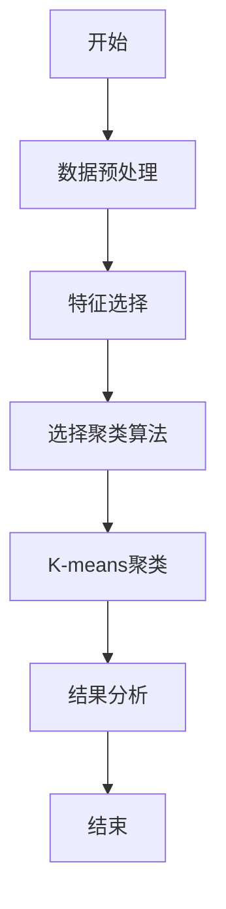
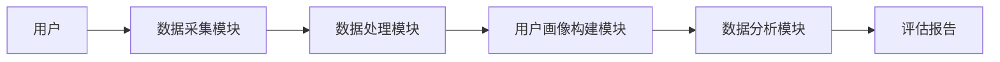
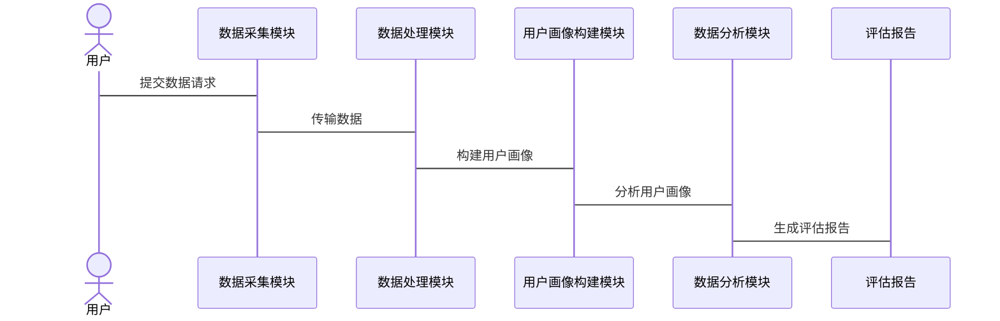

                 


# 彼得林奇如何分析公司的用户画像演变

## 关键词
- 彼得林奇
- 用户画像
- 投资分析
- 数据分析
- 公司价值

## 摘要
本文通过分析彼得林奇如何利用用户画像来评估公司价值，详细探讨了用户画像在投资分析中的应用。文章首先介绍了用户画像的基本概念和演变过程，接着深入探讨了用户画像的数学模型和分析方法，包括聚类分析和分类分析。然后，文章通过系统分析与架构设计，展示了如何构建用户画像分析系统。最后，通过实际案例分析，总结了用户画像分析的最佳实践和注意事项。

## 第1章: 用户画像的定义与演变

### 1.1 用户画像的定义
#### 1.1.1 用户画像的核心概念
用户画像是基于用户数据构建的用户信息汇总，用于描述用户的特征和行为模式。

#### 1.1.2 用户画像的演变过程
用户画像是随着数据分析技术的发展而逐步完善的，从简单的用户属性分析发展到复杂的用户行为分析。

#### 1.1.3 用户画像与公司价值的关系
用户画像是评估公司价值的重要工具，通过分析用户特征和行为模式，可以预测公司未来的盈利能力。

### 1.2 用户画像的属性特征
#### 1.2.1 用户的基本属性
- 年龄
- 性别
- 地区
- 收入水平

#### 1.2.2 用户的行为特征
- 使用频率
- 使用时长
- 用户活跃度

#### 1.2.3 用户的偏好与需求
- 用户偏好
- 用户需求

### 1.3 彼得林奇分析框架的核心要素
#### 1.3.1 用户画像在投资分析中的作用
用户画像是彼得林奇分析公司基本面的重要工具，用于评估公司的用户群体特征和市场定位。

#### 1.3.2 用户画像的边界与外延
用户画像是基于数据构建的，但需要结合公司实际业务和市场环境进行调整。

#### 1.3.3 用户画像的结构化分析方法
通过结构化分析方法，可以将用户画像分解为多个属性特征，并进行综合评估。

## 第2章: 用户画像的数学模型与分析方法

### 2.1 用户画像的属性特征对比表
| 属性 | 描述 | 影响权重 | 示例 |
|------|------|----------|------|
| 年龄 | 用户年龄分布 | 20% | 25-35岁占比最高 |
| 性别 | 用户性别比例 | 15% | 女性用户占比60% |
| 地区 | 用户地理分布 | 25% | 东部地区用户占比50% |
| 收入 | 用户收入水平 | 20% | 中高收入用户占比40% |
| 频率 | 用户使用频率 | 20% | 每周使用3次以上用户占比60% |

### 2.2 用户画像的ER实体关系图
```mermaid
er
  actor 用户
  actor 公司
  actor 行为
  actor 属性
  relation 用户-行为: 用户的行为特征
  relation 用户-属性: 用户的基本属性
  relation 公司-用户: 公司的用户群体
  relation 公司-行为: 公司的行为数据
```

### 2.3 用户画像的聚类分析算法


### 2.4 用户画像的数学模型
$$
\text{聚类中心} = \frac{\sum_{i=1}^{n} x_i}{n}
$$

### 2.5 用户画像的分类分析
$$
\text{分类结果} = \text{max}(y_1, y_2, ..., y_k)
$$

## 第3章: 用户画像的系统分析与架构设计

### 3.1 系统功能设计
- 数据采集与处理
- 用户画像构建
- 数据分析与评估

### 3.2 系统架构设计


### 3.3 接口设计
- 数据接口：RESTful API
- 用户接口：Web界面

### 3.4 交互流程


## 第4章: 用户画像的项目实战

### 4.1 环境安装
- 安装Python
- 安装数据分析库（Pandas, Scikit-learn）

### 4.2 核心代码实现
```python
from sklearn.cluster import KMeans
import pandas as pd

# 数据预处理
data = pd.read_csv('user_data.csv')
X = data[['age', 'income', 'frequency']]

# K-means聚类
kmeans = KMeans(n_clusters=3)
kmeans.fit(X)
clusters = kmeans.predict(X)
```

### 4.3 案例分析
以某互联网公司为例，分析其用户画像，评估公司价值。

### 4.4 经验总结
- 数据质量的重要性
- 算法选择的影响
- 结果解释的必要性

## 第5章: 用户画像分析的最佳实践

### 5.1 小结
用户画像是评估公司价值的重要工具，通过分析用户特征和行为模式，可以为投资决策提供有力支持。

### 5.2 注意事项
- 数据隐私保护
- 算法可解释性
- 模型的实时更新

### 5.3 拓展阅读
推荐阅读相关书籍和论文，深入学习用户画像分析的理论和实践。

## 作者：AI天才研究院/AI Genius Institute & 禅与计算机程序设计艺术 /Zen And The Art of Computer Programming

---

通过以上目录大纲，文章内容涵盖了用户画像的定义、数学模型、系统架构设计和项目实战等多个方面，结合彼得林奇的分析框架，提供了全面且深入的技术分析。

