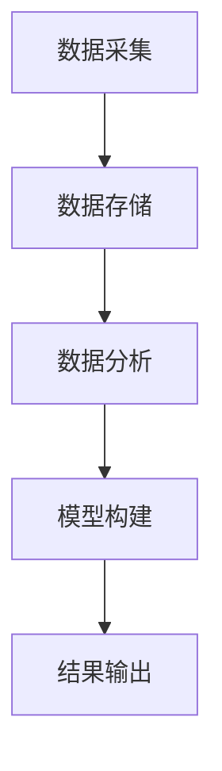
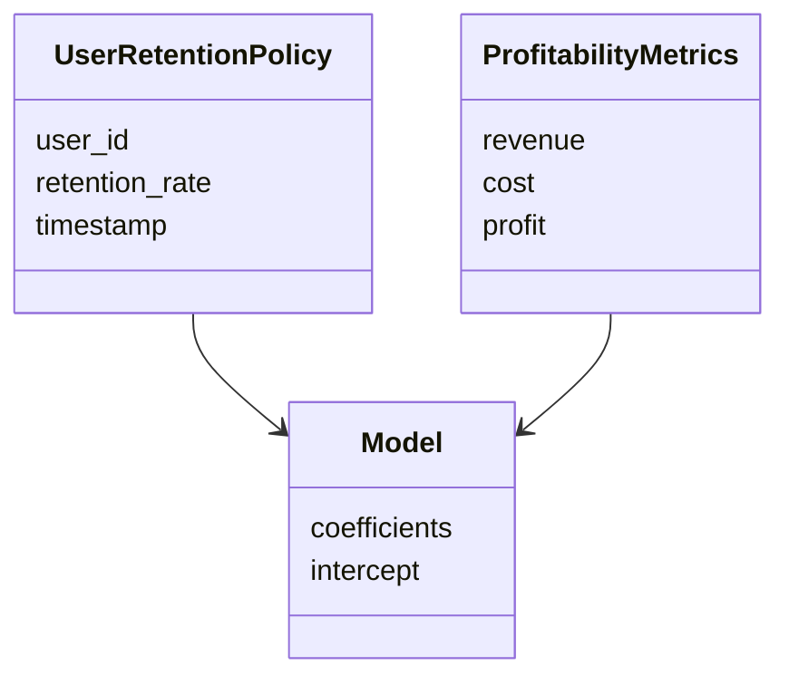
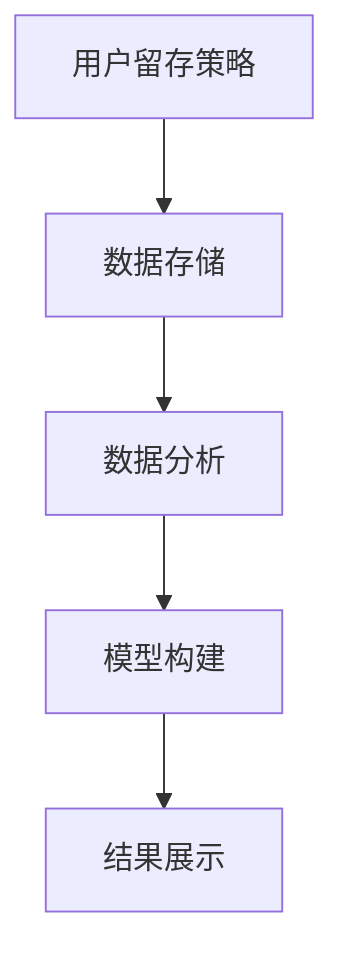

                 


# 彼得林奇如何分析公司的用户留存率与盈利能力关系

> 关键词：彼得林奇，用户留存率，盈利能力，投资分析，价值投资

> 摘要：本文通过分析彼得林奇的投资理念，探讨用户留存率与盈利能力之间的关系，构建数学模型，提供系统设计与项目实战案例，为投资决策提供科学依据。

---

# 第1章: 彼得林奇投资理念概述

## 1.1 彼得林奇的投资哲学

### 1.1.1 价值投资的核心理念

彼得林奇是全球著名投资专家，强调价值投资的核心是寻找那些被市场低估的公司，通过长期持有实现收益。他认为，公司的用户留存率和盈利能力是决定其价值的关键因素。

$$ \text{价值} = \frac{\text{公司内在价值}}{\text{市场价格}} $$

### 1.1.2 用户留存率与盈利能力的关系

用户留存率高意味着用户对公司产品或服务的依赖性强，这通常预示着较高的盈利能力。彼得林奇认为，用户留存率与盈利能力呈正相关，因为高留存率带来稳定的收入和较低的获取新用户的成本。

### 1.1.3 彼得林奇分析模型的背景与意义

彼得林奇提出，通过分析用户留存率和盈利能力，可以评估公司的长期发展潜力。这种分析方法帮助投资者识别出具有持续盈利能力的公司。

## 1.2 用户留存率的定义与重要性

### 1.2.1 用户留存率的定义

用户留存率是指在一定时间内，继续使用公司产品或服务的用户比例。计算公式如下：

$$ \text{用户留存率} = \frac{\text{留存用户数}}{\text{初始用户数}} $$

### 1.2.2 用户留存率的核心要素

- **时间范围**：通常以日、周、月为单位。
- **用户行为**：包括活跃度、购买频率等。
- **用户分层**：区分新用户和老用户。

### 1.2.3 用户留存率与公司价值的关系

高用户留存率意味着用户对公司产品的满意度高，进而提升公司的市场地位和盈利能力。

## 1.3 盈利能力的定义与衡量指标

### 1.3.1 盈利能力的定义

盈利能力是指公司在一定时期内赚取利润的能力，是衡量公司财务健康的重要指标。

### 1.3.2 主要盈利能力指标

- **净利润率**：净利润与营业收入的比率。
- **毛利率**：毛利与营业收入的比率。
- **ROE（净资产收益率）**：净利润与股东权益的比率。

### 1.3.3 盈利能力与公司成长性的关系

盈利能力强的公司通常具有更强的市场竞争力和成长潜力。

---

# 第2章: 用户留存率的深度分析

## 2.1 用户留存率的计算与影响因素

### 2.1.1 用户留存率的计算公式

$$ \text{用户留存率} = \frac{\text{留存用户数}}{\text{初始用户数}} $$

### 2.1.2 影响用户留存率的关键因素

- **产品价值**：产品是否能满足用户需求。
- **用户体验**：产品的易用性和友好性。
- **市场竞争**：市场竞争的激烈程度。

### 2.1.3 用户留存率的生命周期模型

用户留存率通常呈现S型曲线，分为引入期、成长期、成熟期和衰退期。

## 2.2 用户留存率与公司价值的关系

### 2.2.1 用户留存率对收入的影响

高留存率意味着收入的稳定性和增长性。

### 2.2.2 用户留存率对成本的影响

高留存率降低了获取新用户的成本。

### 2.2.3 用户留存率对长期盈利能力的预测

通过分析用户留存率，可以预测公司的长期盈利能力。

---

# 第3章: 盈利能力的深度分析

## 3.1 盈利能力的核心指标

### 3.1.1 净利润率

$$ \text{净利润率} = \frac{\text{净利润}}{\text{营业收入}} $$

### 3.1.2 毛利率

$$ \text{毛利率} = \frac{\text{毛利}}{\text{营业收入}} $$

### 3.1.3 资产回报率（ROA）

$$ \text{ROA} = \frac{\text{净利润}}{\text{平均资产}} $$

---

# 第4章: 用户留存率与盈利能力的关系分析

## 4.1 影响用户留存率与盈利能力的因素

### 4.1.1 用户留存率对收入的影响

用户留存率越高，收入越稳定。

### 4.1.2 盈利能力对用户留存率的反向影响

盈利能力强的公司通常能保持较高的用户留存率。

## 4.2 数学模型构建

### 4.2.1 模型构建逻辑

$$ \text{盈利能力预测} = f(\text{用户留存率}, \text{其他因素}) $$

### 4.2.2 模型输入与输出

- 输入：用户留存率、收入、成本等。
- 输出：预测的盈利能力。

---

# 第5章: 用户留存率与盈利能力分析模型的构建

## 5.1 系统分析与架构设计

### 5.1.1 问题场景介绍

分析用户留存率和盈利能力，构建预测模型。

### 5.1.2 系统功能设计

- 数据采集模块
- 数据分析模块
- 模型构建模块

### 5.1.3 系统架构设计



## 5.2 项目实战

### 5.2.1 环境安装

安装Python、Pandas、Scikit-learn等工具。

### 5.2.2 核心代码实现

```python
import pandas as pd
from sklearn import linear_model

# 加载数据
data = pd.read_csv('user_retention_profit.csv')

# 定义模型
model = linear_model.LinearRegression()

# 训练模型
model.fit(data[['user_retention']], data['profitability'])

# 预测
predictions = model.predict(data[['user_retention']])
```

### 5.2.3 案例分析

分析实际案例，验证模型的准确性。

---

# 第6章: 系统分析与架构设计方案

## 6.1 问题场景介绍

## 6.2 系统功能设计

### 6.2.1 领域模型类图



## 6.3 系统架构设计

### 6.3.1 系统架构图



---

# 第7章: 项目实战

## 7.1 环境安装

安装必要的库和工具。

## 7.2 核心代码实现

实现用户留存率与盈利能力预测的代码。

## 7.3 案例分析

分析实际案例，展示模型的应用。

## 7.4 项目小结

总结项目经验，提出改进建议。

---

# 第8章: 最佳实践与总结

## 8.1 最佳实践

### 8.1.1 数据质量的重要性

确保数据的准确性和完整性。

### 8.1.2 模型的选择与优化

选择合适的模型，并进行调优。

## 8.2 小结

总结全文，强调用户留存率与盈利能力分析的重要性。

## 8.3 注意事项

### 8.3.1 数据隐私

保护用户数据隐私。

### 8.3.2 模型局限性

认识到模型的局限性，避免过度依赖。

## 8.4 拓展阅读

推荐相关书籍和资源。

---

# 作者

作者：AI天才研究院 & 禅与计算机程序设计艺术

