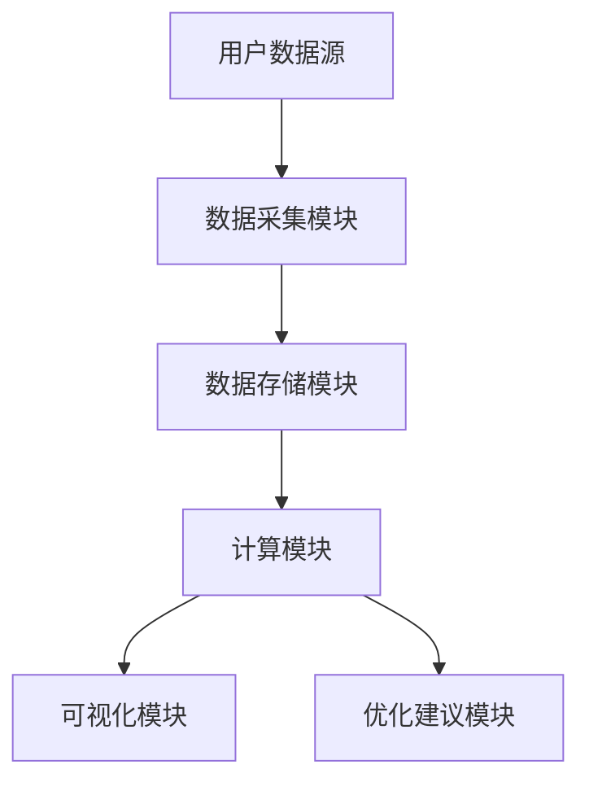
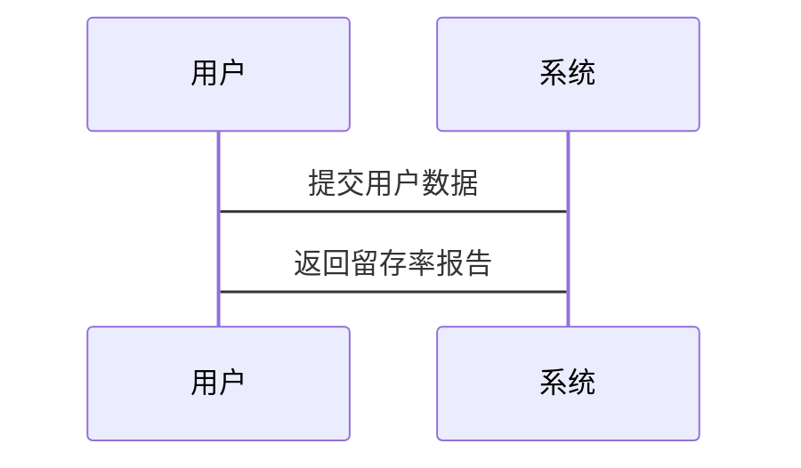

                 


# 彼得林奇如何分析公司的用户留存策略

---

## 关键词：用户留存策略、彼得·林奇、投资分析、用户生命周期、用户行为分析、企业估值

---

## 摘要：  
彼得·林奇作为世界著名投资家，其投资理念深刻影响了企业分析领域。本文从用户留存策略的角度，详细分析了彼得·林奇如何通过用户留存率、用户生命周期、用户行为等核心指标，评估公司的长期价值与成长潜力。文章结合理论与实践，通过数学模型、算法原理和系统架构的设计，深入解析用户留存策略的优化方法，并通过具体案例展示了如何将用户留存策略应用于实际投资分析中。  

---

## 正文：

### 第一部分：用户留存策略的背景与核心概念

#### 第1章：用户留存策略的定义与重要性

##### 1.1 用户留存的定义与核心要素
用户留存（User Retention）是指用户在使用产品或服务后，持续回访并保持活跃行为的过程。其核心要素包括：

- **用户行为**：用户在产品中的具体操作，如使用频率、时长等。
- **用户生命周期**：用户从初次使用到流失的完整阶段。
- **用户价值**：用户为公司带来的收入或利润。

用户留存与用户获取（User Acquisition）不同，用户获取关注的是新用户的数量，而用户留存关注的是用户质量与长期价值。

##### 1.2 彼得·林奇与用户留存分析
彼得·林奇（Peter Lynch）是美国著名投资家，以其独特的投资理念闻名。他认为，用户留存是评估公司长期价值的重要指标，尤其是对于科技类公司。用户留存率高意味着公司产品具有持续吸引力，用户粘性大，公司的收入和利润具有稳定性。

##### 1.3 用户留存的行业应用与案例
用户留存策略在不同行业的应用各有特点。例如，科技公司（如互联网平台）通常通过优化用户体验和增加产品粘性来提高留存率；而消费公司则通过会员制度和优惠活动来提升留存率。彼得·林奇的经典投资案例之一是亚马逊（Amazon），他通过分析亚马逊的用户留存率和用户生命周期，判断其长期增长潜力。

---

#### 第2章：彼得·林奇的用户留存分析框架

##### 2.1 彼得·林奇用户留存分析的三步法
彼得·林奇提出的用户留存分析框架包括以下三个步骤：

1. **分析用户留存率**：计算用户留存率，绘制留存曲线，识别用户留存的关键节点。
2. **识别用户留存的关键驱动因素**：通过数据分析，找出影响用户留存的核心因素，如用户体验、产品功能、用户激励等。
3. **评估留存策略的可持续性与盈利能力**：结合用户留存率与公司盈利能力，评估留存策略的长期效果。

##### 2.2 用户留存的关键指标与分析工具
- **用户留存率计算公式**：  
  用户留存率 = (当期留存用户数) / （当期活跃用户数）  
  其中，当期留存用户数是指在某一时间段内持续使用产品的用户数，当期活跃用户数是指在该时间段内至少使用过一次产品的用户数。

- **用户生命周期模型**：  
  用户生命周期包括引入期、成长期、成熟期和衰退期。通过分析用户在各阶段的行为，可以优化用户留存策略。

- **数据可视化工具**：如Tableau、Power BI等，用于绘制用户留存曲线和生命周期分布图。

##### 2.3 彼得·林奇的留存策略评分体系
彼得·林奇提出的评分体系包括以下几个维度：

- **用户留存率**：占总评分的40%。
- **用户生命周期价值**：占总评分的30%。
- **用户反馈与满意度**：占总评分的20%。
- **行业对标**：占总评分的10%。

---

### 第二部分：用户留存策略的数学模型与算法原理

#### 第3章：用户留存的数学模型

##### 3.1 用户留存的递归模型
用户留存的递归模型可以表示为：
$$ R(t) = (1 - d) \cdot R(t-1) + a \cdot U(t) $$
其中，$R(t)$ 表示第 $t$ 期的用户留存率，$d$ 表示用户流失率，$U(t)$ 表示第 $t$ 期的新用户获取率，$a$ 是新用户转化为留存用户的系数。

##### 3.2 用户生命周期的马尔可夫链模型
马尔可夫链模型可以描述用户在不同生命周期阶段的转移概率。例如，用户从引入期到成长期的转移概率 $P_{12}$，可以用以下公式表示：
$$ P_{12} = \frac{\text{从引入期转移到成长期的用户数}}{\text{引入期的用户总数}} $$

##### 3.3 留存预测的指数衰减模型
指数衰减模型假设用户留存率随时间呈指数衰减，其公式为：
$$ R(t) = R_0 \cdot e^{-kt} $$
其中，$R_0$ 是初始留存率，$k$ 是衰减系数，$t$ 是时间。

---

#### 第4章：用户留存的系统分析与架构设计

##### 4.1 系统功能设计
用户留存分析系统需要实现以下功能：
- 用户数据采集与存储
- 留存率计算与可视化
- 用户生命周期分析
- 留存策略优化建议

##### 4.2 系统架构设计
以下是系统的架构设计图：



##### 4.3 系统接口设计
系统接口设计包括：
- 数据采集接口：从数据库或日志中获取用户行为数据。
- 数据存储接口：将用户数据存储到数据库中。
- 留存率计算接口：调用计算模块，返回留存率结果。

##### 4.4 系统交互设计
以下是用户与系统的交互流程图：



---

### 第三部分：用户留存策略的项目实战

#### 第5章：用户留存策略的实战项目

##### 5.1 项目背景与目标
本项目旨在通过分析某互联网公司的用户行为数据，优化其用户留存策略。

##### 5.2 项目环境与工具安装
- 环境：Python 3.8+
- 工具：Pandas、Matplotlib、Seaborn

##### 5.3 核心代码实现

```python
import pandas as pd
import matplotlib.pyplot as plt
import seaborn as sns

# 数据加载
data = pd.read_csv('user_behavior.csv')

# 用户留存率计算
def calculate_retention(data, days=30):
    data['retained'] = data.groupby('user_id')['date'].transform('nunique')
    data['retained'] = data['retained'].apply(lambda x: 1 if x > 1 else 0)
    retention = data.groupby('date')['retained'].mean()
    return retention

# 留存曲线绘制
retention_curve = calculate_retention(data)
plt.figure(figsize=(10,6))
sns.lineplot(x=retention_curve.index, y=retention_curve.values)
plt.title('Retention Curve')
plt.xlabel('Time')
plt.ylabel('Retention Rate')
plt.show()
```

##### 5.4 案例分析与结果解读
通过上述代码，我们绘制了用户的留存曲线，并分析了用户留存的关键节点。结果表明，用户的留存率在第7天后显著下降，可能与产品功能更新频率有关。

##### 5.5 项目小结
本项目通过数据分析和可视化，成功识别了用户留存的关键问题，并为优化用户留存策略提供了数据支持。

---

### 第四部分：用户留存策略的总结与展望

#### 第6章：用户留存策略的最佳实践

##### 6.1 小结
本文从理论到实践，详细分析了彼得·林奇如何通过用户留存策略评估公司价值，并结合数学模型和系统架构设计，展示了如何优化用户留存策略。

##### 6.2 注意事项
- 数据分析需结合具体业务场景
- 留存策略需动态调整，根据用户反馈优化
- 注意数据隐私与合规性

##### 6.3 拓展阅读
- 《彼得·林奇的投资策略》
- 《用户留存率的深度分析与优化》

---

## 作者：  
AI天才研究院/AI Genius Institute  
禅与计算机程序设计艺术/Zen And The Art of Computer Programming

