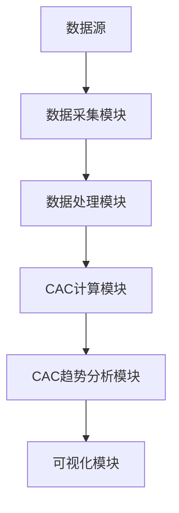

                 


# 彼得林奇如何分析公司的用户获取成本趋势

> 关键词：彼得林奇，用户获取成本（CAC），CAC趋势，CAC分析，CAC计算，CAC与企业价值

> 摘要：用户获取成本（CAC）是衡量企业用户获取效率和成本效益的重要指标。本文将深入探讨彼得林奇如何分析公司的用户获取成本趋势，从CAC的基本概念、计算方法、趋势分析、系统实现、项目实战到最佳实践，结合数学公式、代码实现和图表分析，帮助读者全面理解和掌握CAC分析的核心方法和应用场景。

---

# 第一部分: 用户获取成本（CAC）的基本概念

## 第1章: 用户获取成本（CAC）的定义与背景

### 1.1 什么是用户获取成本（CAC）
用户获取成本（CAC）是指企业为吸引一位新用户所花费的总成本。CAC的计算公式为：
$$CAC = \frac{\text{营销费用}}{\text{新增用户数}}$$

CAC是衡量企业用户获取效率的重要指标，也是评估企业增长潜力和盈利能力的关键因素。彼得林奇在投资过程中非常关注CAC，认为CAC趋势能够反映企业的市场竞争力和用户增长的可持续性。

---

### 1.2 CAC在企业估值中的重要性

CAC不仅是企业营销效率的指标，也是企业估值的重要依据。彼得林奇通过分析CAC趋势，可以评估企业的市场扩展能力、用户粘性和盈利能力。具体来说：
1. **CAC与用户生命周期价值（CLTV）的关系**：CAC应该小于用户生命周期价值（CLTV），否则企业将无法通过用户获取实现盈利。
2. **CAC与企业估值的关系**：CAC趋势的好坏直接影响企业的估值倍数。低CAC和高CAC趋势通常意味着企业具有更强的盈利能力。

---

### 1.3 彼得林奇对CAC的关注点

彼得林奇在分析CAC时，重点关注以下几个方面：
1. **CAC的行业基准**：不同行业的CAC差异较大，彼得林奇会将企业的CAC与行业平均水平进行对比。
2. **CAC趋势的变化**：CAC的上升或下降趋势反映了企业的市场策略和用户获取效率的变化。
3. **CAC与用户质量的关系**：CAC的高低不仅与成本有关，还与用户质量密切相关。

---

## 第2章: CAC的计算方法与公式

### 2.1 CAC的计算公式

CAC的计算公式看似简单，但实际应用中需要考虑多个因素。公式如下：
$$CAC = \frac{\text{营销费用}}{\text{新增用户数}}$$

其中：
- **营销费用**：包括广告投放、推广活动、销售团队费用等。
- **新增用户数**：企业在一定时间内新增的用户数量。

---

### 2.2 CAC的扩展公式

为了更精确地计算CAC，可以将其分解到不同的用户获取渠道：
$$CAC_i = \frac{\text{渠道}_i\text{的营销费用}}{\text{渠道}_i\text{的新增用户数}}$$

通过这种方式，企业可以分析不同渠道的CAC表现，找到最有效的用户获取渠道。

---

### 2.3 CAC的时间序列分析

CAC的时间序列分析可以帮助企业了解CAC的趋势变化。时间序列分析的数学模型可以表示为：
$$Trend = \sum_{i=1}^{n} (C_i \cdot t_i)$$

其中：
- $C_i$ 表示第 $i$ 个时间点的CAC值。
- $t_i$ 表示时间权重。

---

## 第3章: CAC趋势分析

### 3.1 CAC趋势的定义与意义

CAC趋势是指企业在一定时间内CAC的变化情况。通过分析CAC趋势，可以评估企业的用户获取效率和市场策略的调整效果。

---

### 3.2 彼得林奇对CAC趋势的关注

彼得林奇认为，CAC趋势的变化反映了企业的市场竞争力和用户增长潜力。他通常会关注以下几个方面：
1. **CAC趋势的长期变化**：CAC的持续下降通常意味着企业的市场策略优化和用户获取效率的提升。
2. **CAC趋势的短期波动**：短期波动可能是由于市场环境变化或季节性因素引起的。
3. **CAC趋势与企业增长的关系**：CAC趋势的好坏直接影响企业的增长潜力和盈利能力。

---

### 3.3 CAC趋势的数学模型

CAC趋势的数学模型可以表示为：
$$Trend = \sum_{i=1}^{n} (C_i \cdot t_i)$$

其中：
- $C_i$ 表示第 $i$ 个时间点的CAC值。
- $t_i$ 表示时间权重。

---

## 第4章: CAC与用户生命周期价值（CLTV）的关系

### 4.1 用户生命周期价值（CLTV）的定义

CLTV是指一个用户在其生命周期内为企业带来的总收入。CLTV的计算公式为：
$$CLTV = \text{平均收入} \times \text{用户生命周期长度}$$

---

### 4.2 CAC与CLTV的关系

CAC和CLTV是衡量用户获取效率和盈利能力的重要指标。理想情况下，企业的CAC应该小于CLTV，否则企业将无法通过用户获取实现盈利。

---

## 第5章: CAC分析的边界与外延

### 5.1 CAC的适用场景与局限性

CAC适用于分析用户获取成本，但其局限性在于：
1. **数据获取难度**：需要准确的营销费用和新增用户数数据。
2. **行业差异**：不同行业的CAC差异较大，需要结合行业基准进行分析。

---

## 第6章: CAC在不同行业中的表现差异

### 6.1 不同行业的CAC基准

不同行业的CAC基准差异较大。例如：
- **SaaS行业**：CAC通常较低，因为用户通过订阅模式付费。
- **电子商务行业**：CAC通常较高，因为用户需要支付物流和商品成本。

---

## 第7章: 本章小结

本章从CAC的基本概念、计算方法、趋势分析以及与用户生命周期价值（CLTV）的关系等方面进行了详细阐述。通过彼得林奇的视角，我们可以更好地理解CAC在企业估值和投资决策中的重要性。

---

# 第二部分: CAC的系统分析与实现

## 第8章: CAC分析的系统架构

### 8.1 系统功能设计

CAC分析系统的功能模块包括：
1. 数据采集模块：采集企业的营销费用和新增用户数数据。
2. 数据处理模块：对数据进行清洗和预处理。
3. CAC计算模块：根据公式计算CAC值。
4. CAC趋势分析模块：分析CAC的时间序列变化趋势。
5. 可视化模块：将分析结果以图表形式展示。

---

### 8.2 系统架构设计

以下是CAC分析系统的架构图：



---

## 第9章: CAC分析的代码实现

### 9.1 环境配置

以下是Python代码实现的环境配置：

```python
# 安装所需的库
import pandas as pd
import numpy as np
import matplotlib.pyplot as plt
```

---

### 9.2 数据采集与预处理

以下是数据采集与预处理的代码示例：

```python
# 读取数据
data = pd.read_csv('cac_data.csv')

# 数据清洗
data.dropna(inplace=True)
data['日期'] = pd.to_datetime(data['日期'])
data.set_index('日期', inplace=True)
```

---

### 9.3 CAC计算与趋势分析

以下是CAC计算与趋势分析的代码示例：

```python
# CAC计算
data['CAC'] = data['营销费用'] / data['新增用户数']

# CAC趋势分析
data['CAC趋势'] = data['CAC'].rolling(window=3).mean()

# 可视化
plt.figure(figsize=(10, 6))
data['CAC'].plot(label='实际CAC')
data['CAC趋势'].plot(label='CAC趋势')
plt.title('CAC趋势分析')
plt.xlabel('时间')
plt.ylabel('CAC值')
plt.legend()
plt.show()
```

---

## 第10章: CAC分析的实际案例

### 10.1 案例分析

以下是CAC分析的实际案例：

```python
# 数据示例
data = pd.DataFrame({
    '日期': ['2022-01', '2022-02', '2022-03', '2022-04', '2022-05'],
    '营销费用': [10000, 12000, 15000, 13000, 14000],
    '新增用户数': [100, 120, 150, 110, 130]
})

# CAC计算
data['CAC'] = data['营销费用'] / data['新增用户数']

# CAC趋势分析
data['CAC趋势'] = data['CAC'].rolling(window=2).mean()

# 可视化
plt.figure(figsize=(10, 6))
data['CAC'].plot(label='实际CAC')
data['CAC趋势'].plot(label='CAC趋势')
plt.title('CAC趋势分析')
plt.xlabel('时间')
plt.ylabel('CAC值')
plt.legend()
plt.show()
```

---

## 第11章: CAC分析的注意事项

### 11.1 注意事项

1. **数据质量**：确保数据的准确性和完整性。
2. **行业基准**：结合行业基准进行对比分析。
3. **用户质量**：关注用户质量，而不仅仅是用户数量。

---

## 第12章: 未来的发展趋势

### 12.1 CAC分析的未来方向

随着技术的进步，CAC分析将更加智能化和自动化。未来，我们可以利用人工智能和大数据技术，实现CAC的实时监控和预测。

---

# 第三部分: 最佳实践与总结

## 第13章: 最佳实践 tips

### 13.1 提示1：关注行业基准

在进行CAC分析时，需要关注行业基准，以便更好地评估企业的用户获取效率。

---

### 13.2 提示2：结合用户质量分析

CAC的高低不仅与成本有关，还与用户质量密切相关。因此，在分析CAC时，需要结合用户质量进行综合评估。

---

## 第14章: 总结

### 14.1 核心内容回顾

通过本文的分析，我们可以看到CAC是衡量企业用户获取效率和成本效益的重要指标。彼得林奇通过分析CAC趋势，可以帮助投资者更好地评估企业的市场竞争力和增长潜力。

---

## 第15章: 注意事项

### 15.1 注意事项1：数据的准确性和完整性

在进行CAC分析时，需要确保数据的准确性和完整性，以避免分析结果的偏差。

---

## 第16章: 拓展阅读

### 16.1 推荐书籍

1. 《彼得林奇选股术》
2. 《用户增长黑客实战手册》

---

## 第17章: 作者信息

作者：AI天才研究院/AI Genius Institute & 禅与计算机程序设计艺术 /Zen And The Art of Computer Programming

---

# 结语

通过本文的详细分析，我们可以看到CAC是衡量企业用户获取效率和成本效益的重要指标。彼得林奇通过分析CAC趋势，可以帮助投资者更好地评估企业的市场竞争力和增长潜力。希望本文能为读者在CAC分析和用户获取成本趋势的研究中提供有价值的参考。

