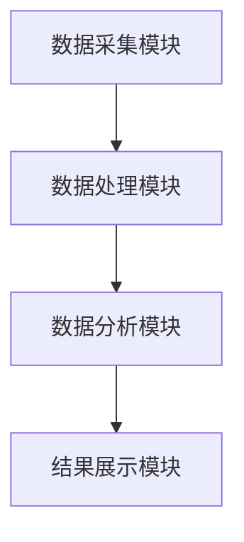

                 


# 彼得林奇如何分析公司的用户行为数据价值

> 关键词：用户行为数据、数据分析、彼得林奇、投资策略、数据驱动决策

> 摘要：本文深入探讨了彼得林奇如何通过分析用户行为数据来评估公司的价值。从数据收集、预处理到模型构建，再到系统架构设计，全面解析了用户行为数据在投资决策中的应用，结合实际案例和代码实现，展示了如何通过数据驱动的方法优化投资策略。

---

## 第1章: 用户行为数据分析的背景与价值

### 1.1 彼得·林奇与用户行为数据分析

#### 1.1.1 彼得·林奇的背景与投资理念
彼得·林奇是美国著名的投资经理人，以其在富达基金（Fidelity）的卓越表现闻名。他的投资理念强调对公司的深入研究和对市场趋势的敏锐洞察，尤其注重对公司基本面的分析。他善于通过分析企业的财务数据、市场地位和管理层质量来评估其投资价值。

#### 1.1.2 用户行为数据在投资分析中的重要性
随着互联网和大数据技术的快速发展，用户行为数据（如点击流数据、浏览记录、购买行为等）成为了评估公司价值的重要来源。用户行为数据能够揭示用户的偏好、需求和行为模式，帮助投资者更全面地了解公司的市场表现和用户满意度。

#### 1.1.3 数据驱动决策的现代投资策略
传统投资分析主要依赖财务报表和市场指标，而现代投资策略 increasingly incorporates user behavior data to gain deeper insights into customer preferences and market dynamics. By analyzing user behavior data, investors can make more informed decisions about a company's potential.

---

### 1.2 用户行为数据的核心概念

#### 1.2.1 用户行为数据的定义与分类
用户行为数据是指用户在使用产品或服务过程中产生的各种数据，包括点击、浏览、搜索、购买、注册等行为。这些数据可以分为以下几类：
- **点击流数据**：记录用户的浏览路径和点击行为。
- **用户交互数据**：包括用户的操作、反馈和互动频率。
- **交易数据**：记录用户的购买行为、订单金额和时间等信息。

#### 1.2.2 数据价值的多层次分析
用户行为数据的价值可以从以下几个层面进行分析：
- **个体层面**：分析单个用户的行为模式，识别用户的偏好和需求。
- **群体层面**：通过聚类分析，识别用户群体的特征和行为模式。
- **市场层面**：分析市场整体趋势，评估公司的市场地位和竞争对手的表现。

#### 1.2.3 行为数据与商业决策的关联
用户行为数据可以帮助企业优化产品设计、提升用户体验、制定精准营销策略。对于投资者来说，用户行为数据能够揭示公司的市场表现、用户满意度和潜在的市场机会。

---

## 第2章: 用户行为数据分析的核心方法论

### 2.1 数据分析的基本原理

#### 2.1.1 数据收集与清洗流程
数据收集是用户行为分析的第一步，主要通过日志记录、用户调查和API接口等方式获取数据。数据清洗则是对收集到的数据进行去噪、填补缺失值和处理异常值，确保数据的完整性和准确性。

#### 2.1.2 数据预处理与特征提取
在数据预处理阶段，需要对数据进行标准化、归一化和分词等处理。特征提取则是从原始数据中提取具有代表性的特征，例如用户的活跃度、购买频率和平均消费金额等。

#### 2.1.3 数据分析的常见方法
常见的数据分析方法包括：
- **描述性分析**：总结数据的基本特征。
- **诊断性分析**：识别数据中的异常和问题。
- **预测性分析**：利用历史数据预测未来趋势。
- **规范性分析**：提出优化建议和决策支持。

---

### 2.2 彼得·林奇的行为数据分析框架

#### 2.2.1 数据驱动决策的三步法
彼得·林奇的数据驱动决策过程可以分为以下三个步骤：
1. **数据收集**：收集用户行为数据。
2. **数据分析**：通过统计分析和机器学习方法对数据进行建模和分析。
3. **决策优化**：基于分析结果优化投资策略。

#### 2.2.2 用户行为模式识别
通过聚类分析、关联规则挖掘等方法，识别用户的行为模式和偏好，帮助企业更好地理解用户需求和市场趋势。

#### 2.2.3 数据分析的验证与优化
数据分析的结果需要通过实验验证，例如A/B测试，以确保分析结果的可靠性和可操作性。

---

## 第3章: 用户行为数据分析的数学模型与算法

### 3.1 数据分析的核心算法

#### 3.1.1 聚类分析算法
聚类分析是一种无监督学习算法，常用于用户分群。例如，使用K-means算法将用户分为不同的群体，分析每个群体的特征和行为模式。

#### 3.1.2 回归分析算法
回归分析是一种监督学习算法，用于预测用户的购买行为、消费金额等连续变量。

#### 3.1.3 时间序列分析算法
时间序列分析用于预测用户行为的时间趋势，例如预测用户的活跃时间段和购买频率。

---

### 3.2 数据分析的数学模型

#### 3.2.1 用户行为聚类模型
使用K-means算法对用户进行聚类分析，公式如下：
$$
\text{目标函数} = \sum_{i=1}^{k} \sum_{j=1}^{n_i} ||x_j - c_i||^2
$$
其中，$k$为聚类数，$n_i$为第$i$个聚类的样本数，$x_j$为样本，$c_i$为第$i$个聚类的中心。

#### 3.2.2 用户行为预测模型
使用线性回归模型预测用户的购买行为：
$$
y = \beta_0 + \beta_1x_1 + \beta_2x_2 + \cdots + \beta_mx_m + \epsilon
$$
其中，$y$为预测目标，$x_i$为自变量，$\beta_i$为回归系数，$\epsilon$为误差项。

---

## 第4章: 用户行为数据分析的系统架构与实现

### 4.1 数据分析系统的功能设计

#### 4.1.1 数据采集模块
负责收集用户行为数据，包括点击流数据和交易数据。

#### 4.1.2 数据处理模块
对数据进行清洗、预处理和特征提取，确保数据的准确性和可用性。

#### 4.1.3 数据分析模块
使用统计分析和机器学习算法对数据进行建模和分析，生成分析结果。

#### 4.1.4 结果展示模块
以可视化的方式展示分析结果，帮助用户理解数据洞察。

---

### 4.2 数据分析系统的架构设计

#### 4.2.1 系统架构图


#### 4.2.2 模块间交互流程
```mermaid
sequenceDiagram
    User --> A: 提交数据请求
    A --> B: 数据预处理
    B --> C: 数据分析
    C --> D: 结果展示
    User <-- D: 获取分析结果
```

---

## 第5章: 用户行为数据分析的项目实战

### 5.1 项目背景
本项目旨在通过分析用户行为数据，评估一家电商公司的市场表现和用户满意度。

---

### 5.2 项目环境与工具安装

#### 5.2.1 环境配置
- Python 3.8+
- Jupyter Notebook
- Pandas、NumPy、Scikit-learn、Matplotlib

#### 5.2.2 工具安装
```bash
pip install pandas numpy scikit-learn matplotlib
```

---

### 5.3 核心代码实现

#### 5.3.1 数据预处理
```python
import pandas as pd
import numpy as np

# 加载数据
data = pd.read_csv('user_behavior.csv')

# 数据清洗
data.dropna(inplace=True)
data['timestamp'] = pd.to_datetime(data['timestamp'])
data['date'] = data['timestamp'].dt.date
```

#### 5.3.2 用户行为分析
```python
from sklearn.cluster import KMeans
from sklearn.preprocessing import StandardScaler

# 特征提取
features = data[['clicks', 'views', 'purchases']]
scaler = StandardScaler()
scaled_features = scaler.fit_transform(features)

# 聚类分析
kmeans = KMeans(n_clusters=3, random_state=42)
clusters = kmeans.fit_predict(scaled_features)
```

#### 5.3.3 可视化分析
```python
import matplotlib.pyplot as plt

plt.figure(figsize=(10, 6))
plt.scatter(clusters, scaled_features[:, 0], c='blue')
plt.title('User Clusters')
plt.xlabel('Cluster')
plt.ylabel('Scaled Features')
plt.show()
```

---

### 5.4 项目小结
通过本项目，我们成功地将用户行为数据应用于投资分析，揭示了用户群体的特征和行为模式，为投资决策提供了有力支持。

---

## 第6章: 最佳实践与总结

### 6.1 最佳实践 tips
- 数据分析前，确保数据的完整性和准确性。
- 在选择算法时，结合数据特征和业务需求。
- 使用可视化工具帮助理解和展示分析结果。

### 6.2 小结
用户行为数据分析是现代投资分析的重要工具，通过数据驱动的方法，投资者可以更全面地评估公司的市场表现和用户价值。

### 6.3 注意事项
- 数据分析结果需要结合业务背景进行解释。
- 确保数据安全和用户隐私。

### 6.4 拓展阅读
- 《Data Analysis Using Python》
- 《Machine Learning for Investment Analysis》

---

作者：AI天才研究院/AI Genius Institute & 禅与计算机程序设计艺术/Zen And The Art of Computer Programming

