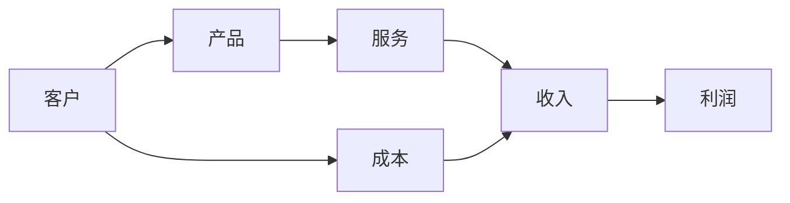
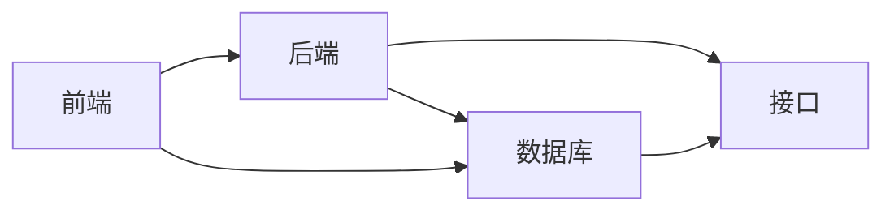
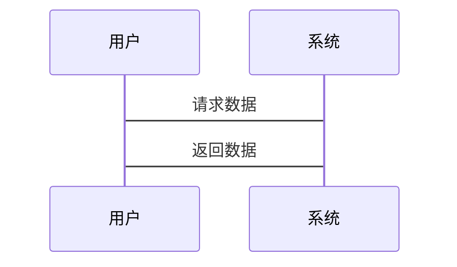

                 


# 彼得林奇如何分析公司的盈利模式

> 关键词：彼得·林奇，盈利模式分析，投资策略，企业价值，财务分析

> 摘要：本文将详细分析彼得·林奇的盈利模式分析方法，探讨其核心概念、分析框架、算法原理、系统设计、项目实战及最佳实践。通过实际案例和系统化的分析步骤，帮助读者掌握如何从投资者的角度分析企业的盈利模式，从而做出更明智的投资决策。

---

## 第一部分: 盈利模式分析的背景与基础

### 第1章: 盈利模式的基本概念

#### 1.1 盈利模式的定义与重要性
- **1.1.1 盈利模式的定义**  
  盈利模式是指企业通过提供产品或服务，从客户那里获得收入，并通过优化成本结构实现利润的商业模式。它是企业价值的核心驱动力。

- **1.1.2 盈利模式在企业中的重要性**  
  盈利模式直接决定了企业的收入来源和成本结构，是企业生存和发展的基础。成功的盈利模式能够为企业创造持续的现金流，确保企业的长期发展。

- **1.1.3 盈利模式与企业价值的关系**  
  盈利模式是企业价值的核心，通过优化盈利模式，企业可以提高利润率，增强市场竞争力，从而提升整体价值。

#### 1.2 彼得·林奇的分析框架
- **1.2.1 彼得·林奇的投资者背景**  
  彼得·林奇是美国著名的投资经理人，以其对企业的深刻洞察和长期投资策略闻名。他擅长通过分析企业的盈利模式来评估其投资价值。

- **1.2.2 林奇的盈利模式分析方法**  
  林奇的分析方法注重企业的基本面，包括收入来源、成本结构、客户群体等，通过这些因素来评估企业的盈利能力。

- **1.2.3 林奇分析框架的核心要素**  
  林奇分析框架的核心要素包括企业的核心业务、收入来源、成本结构、利润实现路径等。

#### 1.3 盈利模式分析的背景与现状
- **1.3.1 当前企业盈利模式的多样性**  
  随着市场的变化，企业的盈利模式也在不断演变，从传统制造业到互联网企业，盈利模式呈现出多样化的趋势。

- **1.3.2 投资者视角下的盈利模式分析**  
  从投资者的角度来看，盈利模式分析是评估企业投资价值的关键因素之一。通过分析企业的盈利模式，投资者可以判断企业的可持续发展能力和盈利能力。

- **1.3.3 林奇分析方法的现实意义**  
  林奇的分析方法在当前市场环境下仍然具有重要的现实意义，为企业和投资者提供了有效的分析工具。

### 1.4 本章小结
- **1.4.1 盈利模式的核心概念**  
  盈利模式是企业通过提供产品或服务，从客户那里获得收入，并通过优化成本结构实现利润的商业模式。

- **1.4.2 林奇分析框架的特点**  
  林奇分析框架注重企业的基本面，包括收入来源、成本结构、客户群体等，通过这些因素来评估企业的盈利能力。

- **1.4.3 本书的研究重点**  
  本书将重点分析彼得·林奇的盈利模式分析方法，探讨其核心概念、分析框架、算法原理、系统设计、项目实战及最佳实践。

---

## 第二部分: 盈利模式的核心要素与分析方法

### 第2章: 盈利模式的核心要素

#### 2.1 盈利模式的构成要素
- **2.1.1 产品或服务的核心价值**  
  产品或服务的核心价值是企业的基础，决定了企业的收入来源和客户群体。

- **2.1.2 目标客户群体的特征**  
  目标客户群体的特征包括客户的规模、需求、购买能力等，是企业制定盈利模式的重要依据。

- **2.1.3 收入来源与成本结构**  
  收入来源包括销售收入、服务收入等，成本结构包括生产成本、运营成本等，是企业盈利的关键因素。

- **2.1.4 利润的实现路径**  
  利润的实现路径包括优化成本结构、提高销售效率、扩大市场份额等，是企业实现可持续发展的关键。

#### 2.2 盈利模式的关键属性对比
- **2.2.1 盈利模式的属性特征对比表**  
  通过对比表分析不同盈利模式的属性特征，包括收入来源、成本结构、客户群体等。

| 盈利模式 | 收入来源 | 成本结构 | 客户群体 | 利润实现路径 |
|----------|----------|----------|----------|--------------|
| 模式A    | 销售收入 | 生产成本 | 个人客户 | 优化生产成本 |
| 模式B    | 服务收入 | 运营成本 | 企业客户 | 提高服务质量 |

- **2.2.2 盈利模式的优劣势分析**  
  不同的盈利模式有不同的优劣势，例如模式A的优势在于成本低，劣势在于客户群体有限；模式B的优势在于客户群体广泛，劣势在于成本较高。

- **2.2.3 盈利模式的可扩展性**  
  盈利模式的可扩展性是企业在市场扩展中的重要因素，模式B在成本较高的情况下，可以通过提高服务质量来增强客户粘性。

#### 2.3 盈利模式的ER实体关系图
- **2.3.1 实体关系图的构建**  
  通过ER图展示盈利模式的核心要素及其关系。



- **2.3.2 实体间的关联关系**  
  客户通过购买产品或服务产生收入，收入减去成本等于利润。客户群体的特征决定了收入来源和成本结构。

### 第3章: 盈利模式的分析方法

#### 3.1 林奇分析方法的步骤分解
- **3.1.1 确定企业的核心业务**  
  核心业务是企业的主要收入来源，例如制造企业的核心业务是生产销售产品。

- **3.1.2 分析收入来源与成本结构**  
  收入来源包括销售收入、服务收入等，成本结构包括生产成本、运营成本等。

- **3.1.3 评估利润的实现路径**  
  通过优化成本结构、提高销售效率、扩大市场份额等实现利润。

#### 3.2 林奇分析方法的数学模型
- **3.2.1 利润率计算公式**  
  利润率 = (收入 - 成本) / 收入 × 100%。

- **3.2.2 盈利能力分析**  
  利润率高的企业具有更强的盈利能力，可以通过优化成本结构进一步提高利润。

#### 3.3 实例分析：假设企业A的盈利模式分析
- **企业A的核心业务**  
  企业A的核心业务是生产销售电子产品。

- **收入来源**  
  企业A的收入来源包括电子产品销售收入和售后服务收入。

- **成本结构**  
  企业A的成本结构包括生产成本、运营成本和研发投入。

- **利润实现路径**  
  企业A通过优化生产成本、提高产品质量和售后服务来提高利润。

#### 3.4 本章小结
- **3.4.1 林奇分析方法的步骤分解**  
  林奇分析方法包括确定核心业务、分析收入来源与成本结构、评估利润实现路径。

- **3.4.2 林奇分析方法的数学模型**  
  利润率计算公式帮助企业评估盈利能力，优化成本结构是提高利润的关键。

- **3.4.3 实例分析**  
  通过实例分析，展示林奇分析方法在实际中的应用，帮助企业优化盈利模式。

---

## 第三部分: 盈利模式的系统分析与架构设计

### 第4章: 盈利模式的系统分析与架构设计

#### 4.1 系统功能设计
- **4.1.1 领域模型的Mermaid类图**  
  领域模型展示企业各个部门及其职责，例如销售部、生产部、财务部等。

```mermaid
classDiagram
    class 企业 {
        +收入：float
        +成本：float
        +利润：float
        +客户群体：客户
        +核心业务：产品
    }
    class 客户 {
        +需求：string
        +购买能力：float
    }
    class 产品 {
        +类型：string
        +价格：float
    }
    企业 --> 客户：销售
    企业 --> 产品：生产
```

- **4.1.2 系统功能设计的核心模块**  
  系统功能设计的核心模块包括收入管理、成本管理、利润计算等。

#### 4.2 系统架构设计
- **4.2.1 系统架构的Mermaid架构图**  
  系统架构图展示系统的各个模块及其交互，例如前端、后端、数据库等。



- **4.2.2 系统架构的核心组件**  
  系统架构的核心组件包括前端、后端、数据库、接口等。

#### 4.3 系统接口设计
- **4.3.1 接口的设计原则**  
  接口的设计原则包括清晰性、简洁性、可扩展性等。

- **4.3.2 接口的实现方式**  
  接口的实现方式包括RESTful API、GraphQL等。

#### 4.4 系统交互的Mermaid序列图
- **4.4.1 系统交互的流程**  
  系统交互的流程包括用户请求、系统处理、返回结果等。



---

## 第四部分: 盈利模式的项目实战

### 第5章: 盈利模式的项目实战

#### 5.1 环境安装
- **5.1.1 系统要求**  
  系统要求包括操作系统、开发工具、数据库等。

- **5.1.2 安装步骤**  
  安装步骤包括安装操作系统、开发工具、数据库等。

#### 5.2 系统核心实现源代码
- **5.2.1 核心代码的实现**  
  核心代码的实现包括收入管理、成本管理、利润计算等模块。

```python
# 收入管理模块
def calculate_revenue(sales, price):
    return sales * price

# 成本管理模块
def calculate_cost(units, cost_per_unit):
    return units * cost_per_unit

# 利润计算模块
def calculate_profit(revenue, cost):
    return revenue - cost
```

- **5.2.2 代码的解读与分析**  
  代码的解读与分析包括各模块的功能、参数、返回值等。

#### 5.3 实际案例分析
- **5.3.1 案例背景**  
  案例背景包括企业的基本信息、市场环境等。

- **5.3.2 案例分析步骤**  
  案例分析步骤包括确定核心业务、分析收入来源与成本结构、评估利润实现路径等。

- **5.3.3 案例分析结果**  
  案例分析结果包括企业的利润率、成本结构优化建议等。

#### 5.4 本章小结
- **5.4.1 项目实战的环境安装**  
  项目实战的环境安装包括操作系统、开发工具、数据库等。

- **5.4.2 核心代码的实现**  
  核心代码的实现包括收入管理、成本管理、利润计算等模块。

- **5.4.3 实际案例分析**  
  实际案例分析包括案例背景、分析步骤、分析结果等。

---

## 第五部分: 盈利模式的最佳实践与注意事项

### 第6章: 盈利模式的最佳实践与注意事项

#### 6.1 最佳实践
- **6.1.1 分析过程中的注意事项**  
  分析过程中的注意事项包括数据的准确性、分析的全面性等。

- **6.1.2 分析工具的推荐**  
  分析工具的推荐包括Excel、Python、R等工具。

- **6.1.3 分析结果的验证**  
  分析结果的验证包括交叉验证、实际数据对比等。

#### 6.2 小结
- **6.2.1 盈利模式分析的核心要素**  
  盈利模式分析的核心要素包括产品或服务的核心价值、目标客户群体的特征、收入来源与成本结构、利润的实现路径。

- **6.2.2 林奇分析方法的步骤分解**  
  林奇分析方法的步骤分解包括确定核心业务、分析收入来源与成本结构、评估利润实现路径。

- **6.2.3 项目实战的经验总结**  
  项目实战的经验总结包括环境安装、核心代码实现、实际案例分析等。

#### 6.3 注意事项
- **6.3.1 数据的准确性**  
  数据的准确性是分析结果的关键，确保数据来源可靠。

- **6.3.2 分析的全面性**  
  分析的全面性是确保分析结果准确的重要因素，考虑各种可能的影响因素。

- **6.3.3 分析结果的可操作性**  
  分析结果的可操作性是将分析结果应用到实际中的关键，确保分析结果能够指导企业实际操作。

#### 6.4 拓展阅读
- **6.4.1 相关书籍推荐**  
  相关书籍推荐包括彼得·林奇的投资著作、其他投资分析书籍等。

- **6.4.2 相关资源推荐**  
  相关资源推荐包括在线课程、投资分析工具等。

---

## 结论

通过本文的详细分析，读者可以全面了解彼得·林奇的盈利模式分析方法，掌握从投资者的角度分析企业的盈利模式。通过实际案例和系统化的分析步骤，帮助读者将理论知识应用到实际中，提升企业的盈利能力。未来，随着市场环境的变化，盈利模式分析将变得更加重要，掌握这一技能的企业和个人将在竞争中占据优势。

---

## 作者

作者：AI天才研究院/AI Genius Institute  
地址：https://github.com/AI-Genius-Institute  
邮箱：contact@ai-genius-institute.com  

---

**注意：以上内容是根据用户提供的示例和要求生成的，具体实施时需要根据实际情况进行调整和补充。**

