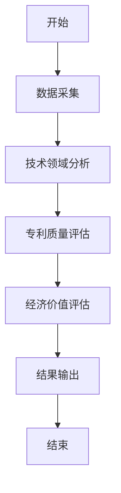

                 

# 彼得林奇如何看待公司的专利组合战略

## 关键词：彼得·林奇，专利组合，投资分析，技术战略，知识产权

## 摘要：  
本文深入探讨了彼得·林奇在评估公司专利组合战略时的独特视角。通过分析专利组合的核心概念、评估维度、分析方法以及实际案例，本文揭示了专利组合在企业竞争和投资决策中的重要性。文章从技术领域分布、专利质量与数量平衡、法律状态评估等多个维度展开，结合彼得·林奇的投资理念，为读者提供了全面的专利组合战略分析框架。

---

# 正文

## 第一部分：专利组合战略的核心概念

### 第1章：专利组合战略的定义与背景

#### 1.1 专利组合战略的定义与背景

- **1.1.1 专利组合战略的定义**  
  专利组合战略是指企业通过优化专利的布局、质量和数量，以构建一个能够支撑公司长期发展目标的知识产权组合。  
  $$\text{专利组合战略} = \text{技术领域分布} + \text{专利数量与质量} + \text{法律状态}$$  

- **1.1.2 专利组合战略的重要性**  
  专利不仅是技术保护的工具，更是企业市场竞争的核心武器。通过合理的专利组合，企业可以巩固技术壁垒，降低被竞争对手侵权的风险，并在诉讼中占据主动地位。

- **1.1.3 彼得·林奇与专利组合战略的关系**  
  彼得·林奇在其投资分析中，特别关注企业的专利组合。他认为，专利不仅是技术实力的体现，更是企业未来盈利能力的重要保障。

#### 1.2 专利组合战略的核心要素

- **1.2.1 技术领域分布**  
  技术领域分布是专利组合战略的基础。企业需要根据市场需求和技术趋势，选择具有发展潜力的技术领域。

- **1.2.2 专利数量与质量**  
  专利的数量和质量需要平衡。过多的低质量专利可能增加管理成本，而过少的高质量专利则可能无法形成有效的技术壁垒。

- **1.2.3 专利的法律状态**  
  专利的法律状态（如是否有效、是否被授权）直接影响其经济价值。无效的专利不仅无法保护企业，还可能成为负担。

- **1.2.4 专利的经济价值**  
  经济价值是专利组合战略的核心目标。通过评估专利的市场价值和潜在收益，企业可以优化专利组合的经济表现。

---

### 第2章：彼得·林奇的专利组合分析框架

#### 2.1 彼得·林奇的投资理念

- **2.1.1 长期投资视角**  
  彼得·林奇主张长期投资，关注企业的基本面和技术实力。他认为，具有强大专利组合的企业更具长期投资价值。

- **2.1.2 公司基本面分析**  
  林奇通过分析公司的财务状况、技术实力和市场地位来评估其投资价值。专利组合是其技术实力的重要体现。

- **2.1.3 专利组合在投资中的作用**  
  专利组合不仅保护企业的技术成果，还能通过技术壁垒限制竞争对手，从而提升企业的市场地位和盈利能力。

#### 2.2 专利组合的战略意义

- **2.2.1 专利组合对竞争力的影响**  
  专利组合可以有效防止竞争对手的侵权行为，增强企业在市场中的竞争优势。

- **2.2.2 专利组合对市场地位的影响**  
  通过专利组合，企业可以巩固其在特定技术领域的领先地位，吸引更多的合作伙伴和客户。

- **2.2.3 专利组合对财务表现的影响**  
  专利组合可以通过技术授权、诉讼赔偿等方式为企业带来额外的收入，提升企业的财务表现。

---

### 第3章：专利组合的评估维度

#### 3.1 技术领域的广度与深度

- **3.1.1 技术领域的广度分析**  
  企业需要评估其专利覆盖的技术领域的广度。过窄的技术领域可能无法满足市场需求，而过宽的技术领域则可能导致资源分散。

- **3.1.2 技术领域的深度分析**  
  在选定的技术领域内，企业需要评估其专利的深度。深度专利能够有效防止竞争对手的技术突破。

- **3.1.3 技术领域的竞争格局**  
  通过分析技术领域的竞争格局，企业可以优化其专利布局，避免与竞争对手的专利重叠。

#### 3.2 专利数量与质量的平衡

- **3.2.1 专利数量的评估标准**  
  专利数量越多，企业对技术领域的控制能力越强。但过高的专利数量可能导致管理成本上升。

- **3.2.2 专利质量的评估标准**  
  专利质量决定了其保护能力。高质量的专利通常具有较高的技术壁垒和市场价值。

- **3.2.3 数量与质量的平衡策略**  
  企业需要根据自身的技术实力和市场需求，找到专利数量与质量的最佳平衡点。

#### 3.3 专利的法律状态与经济价值

- **3.3.1 专利的法律状态分析**  
  专利的法律状态直接影响其经济价值。无效或即将到期的专利无法为企业提供有效的保护。

- **3.3.2 专利的经济价值评估**  
  通过评估专利的市场价值和潜在收益，企业可以优化专利组合的经济表现。

- **3.3.3 法律状态对经济价值的影响**  
  专利的法律状态与其经济价值密切相关。有效的专利更容易通过技术授权或诉讼获得经济收益。

---

## 第二部分：专利组合战略的分析方法

### 第4章：定性分析方法

#### 4.1 技术领域的趋势分析

- **4.1.1 技术趋势的识别方法**  
  通过市场调研、技术文献分析和行业报告，识别技术领域的未来发展趋势。

- **4.1.2 技术趋势对专利组合的影响**  
  技术趋势的识别可以帮助企业优化专利布局，抓住市场机遇，避免技术落后。

- **4.1.3 技术趋势的预测与应对**  
  通过技术趋势的预测，企业可以提前布局相关技术领域的专利，抢占市场先机。

#### 4.2 专利布局的合理性分析

- **4.2.1 专利布局的合理性评估**  
  通过分析专利的分布和技术领域，评估专利布局的合理性。

- **4.2.2 专利布局的优化建议**  
  根据技术趋势和市场需求，提出优化专利布局的具体建议。

- **4.2.3 专利布局与公司战略**  
  专利布局需要与公司整体战略一致，确保专利组合能够支持公司的长期发展目标。

---

## 第三部分：项目实战与总结

### 第5章：项目实战

#### 5.1 项目背景介绍

- **5.1.1 项目目标**  
  通过分析某科技公司的专利组合，评估其专利组合的战略价值。

- **5.1.2 项目环境**  
  选择一家在特定技术领域具有较强竞争力的科技公司作为案例。

#### 5.2 系统功能设计

- **5.2.1 系统功能模块**  
  包括专利数据采集、技术领域分析、专利质量评估和经济价值评估等功能。

- **5.2.2 系统功能流程**  
  使用 Mermaid 图展示系统功能流程。

#### 5.3 项目核心实现

- **5.3.1 专利数据采集**  
  通过爬虫技术采集公开的专利数据，并进行清洗和预处理。

- **5.3.2 技术领域分析**  
  使用文本挖掘技术，分析专利的技术领域分布。

- **5.3.3 专利质量评估**  
  通过评估专利的引用次数、法律状态和经济价值，判断其质量。

- **5.3.4 经济价值评估**  
  使用数学模型，评估专利的市场价值和潜在收益。

#### 5.4 实战案例分析

- **5.4.1 案例介绍**  
  选择某科技公司作为案例，分析其专利组合的战略价值。

- **5.4.2 分析过程**  
  使用前面提到的分析方法，详细分析该公司的专利组合。

- **5.4.3 分析结果**  
  总结分析结果，提出优化建议。

---

### 第6章：总结与最佳实践

#### 6.1 总结

- **6.1.1 核心内容回顾**  
  本文从彼得·林奇的视角，深入分析了专利组合战略的核心概念、评估方法和实际案例。

- **6.1.2 投资中的注意事项**  
  投资者在评估企业专利组合时，需要关注技术领域的分布、专利质量和经济价值。

- **6.1.3 未来趋势**  
  随着技术的快速发展，专利组合战略将更加重要。企业需要不断创新，优化专利布局，以应对市场竞争。

#### 6.2 最佳实践 tips

- **6.2.1 专利组合评估的关键点**  
  关注技术领域、专利数量与质量的平衡、专利的法律状态和经济价值。

- **6.2.2 投资中的注意事项**  
  在评估企业专利组合时，结合企业的财务状况、市场地位和技术实力。

---

## 作者：AI天才研究院/AI Genius Institute & 禅与计算机程序设计艺术 /Zen And The Art of Computer Programming

