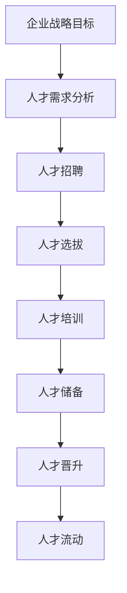

                 


# 彼得林奇如何看待公司的人才储备策略

## 关键词：彼得·林奇，人才储备，企业战略，投资理念，管理策略

## 摘要：本文从彼得·林奇的投资理念出发，探讨他对公司人才储备策略的看法，分析人才储备的重要性、核心要素及系统架构，结合算法原理和实际案例，提出人才储备策略的优化建议，并总结最佳实践。

---

# 第一部分: 人才储备策略的背景与重要性

## 第1章: 人才储备策略的背景与核心概念

### 1.1 人才储备的重要性

#### 1.1.1 企业发展的基石：人才储备的作用
企业的发展离不开人才的支持，人才储备是企业发展的基石。通过储备优秀的人才，企业可以在未来的发展中占据竞争优势。

#### 1.1.2 人才储备与企业竞争力的关系
企业竞争力的提升离不开人才储备。拥有充足的人才储备，企业能够更好地应对市场变化和挑战，保持竞争优势。

#### 1.1.3 人才储备的长期性与战略性
人才储备是一个长期的过程，需要企业制定明确的战略规划。通过长期的人才储备，企业能够确保在关键岗位上有合适的人才。

### 1.2 彼得·林奇与人才储备策略

#### 1.2.1 彼得·林奇的背景介绍
彼得·林奇是美国著名投资家，以其在富达投资集团的成功投资业绩而闻名。他的投资理念强调长期投资、深入研究和精选个股。

#### 1.2.2 彼得·林奇的投资理念与管理风格
彼得·林奇的投资理念注重长期价值，强调对企业的深入了解和分析。他的管理风格注重团队合作和人才培养，这与他的人才储备策略密切相关。

#### 1.2.3 彼得·林奇对人才储备的独特见解
彼得·林奇认为，人才储备是企业成功的关键。他强调企业应注重内部人才培养，建立完善的人才梯队，以应对未来可能出现的挑战。

### 1.3 人才储备的核心概念与边界

#### 1.3.1 人才储备的定义与核心要素
人才储备是指企业为了未来发展而储备的人才资源，其核心要素包括人才的数量、质量和结构。

#### 1.3.2 人才储备的边界与外延
人才储备的边界包括企业内部员工的培养、招聘和保留，以及外部人才的引进。其外延则涉及企业的人力资源管理、组织发展和文化建设。

#### 1.3.3 人才储备与企业战略的关系
人才储备是企业战略的重要组成部分，直接影响企业的长期发展和竞争力。企业战略应与人才储备策略相结合，确保人才储备能够支持企业的发展目标。

---

## 第2章: 人才储备策略的核心要素与分析框架

### 2.1 人才储备的核心要素

#### 2.1.1 人才储备的层次结构
人才储备可以分为基础层、管理层和战略层。基础层关注员工的基本技能，管理层关注中高层管理者的储备，战略层关注企业核心战略岗位的人才储备。

#### 2.1.2 人才储备的关键维度
关键维度包括人才的数量、质量、结构和能力。企业需要在这些维度上进行综合考虑，确保人才储备的合理性和有效性。

#### 2.1.3 人才储备的动态平衡
人才储备是一个动态平衡的过程，需要根据企业的战略调整和市场环境的变化进行适时的优化和调整。

### 2.2 彼得·林奇的人才储备视角

#### 2.2.1 彼得·林奇的人才储备理念
彼得·林奇强调企业应注重内部人才培养，建立完善的人才梯队。他倡导企业应像投资股票一样，长期关注和培养员工，提升他们的专业能力和综合素质。

#### 2.2.2 彼得·林奇对人才储备的特殊关注点
彼得·林奇关注人才的潜力和成长空间，他认为企业应注重员工的职业发展和晋升通道的建立，以留住优秀人才。

#### 2.2.3 彼得·林奇人才储备策略的实践案例
彼得·林奇在富达投资集团的成功，部分归功于他建立的完善的人才储备体系。他注重团队合作和内部培养，为公司的发展提供了强有力的人才支持。

### 2.3 核心要素的对比分析

#### 2.3.1 不同企业的人才储备策略对比
不同企业在人才储备策略上可能有所不同，主要体现在储备的人才数量、质量和结构上。一些企业注重短期的人才储备，而另一些企业则注重长期的人才培养。

#### 2.3.2 彼得·林奇策略与其他管理学理论的对比
彼得·林奇的人才储备策略与传统的管理学理论有相似之处，但也有其独特之处。他更强调内部培养和长期储备，注重员工的潜力和成长。

#### 2.3.3 人才储备策略的优劣势分析
人才储备策略的优势在于能够为企业未来发展提供充足的人才支持，劣势在于需要投入大量的时间和资源，且存在一定的风险，如人才流失。

---

## 第3章: 人才储备策略的系统分析与架构设计

### 3.1 人才储备的系统构成

#### 3.1.1 人才储备的系统模型
人才储备可以看作是一个复杂的系统，包括输入、处理、输出和反馈四个部分。输入包括人才招聘、培训和选拔，处理包括人才的培养和使用，输出包括人才的晋升和流动，反馈则用于评估和优化人才储备策略。

#### 3.1.2 人才储备的系统功能模块
人才储备系统可以划分为以下几个功能模块：
- 人才招聘模块：负责招聘和选拔人才。
- 人才培训模块：负责对员工进行培训和提升。
- 人才选拔模块：负责对员工进行选拔和评估。
- 人才储备模块：负责对储备人才的管理。

#### 3.1.3 人才储备的系统输入与输出
系统的输入包括企业战略目标、市场环境和内部资源，输出包括优化后的人才储备方案和企业竞争力的提升。

### 3.2 人才储备的系统架构设计

#### 3.2.1 系统架构的层次划分
人才储备系统可以划分为业务层、数据层和应用层。业务层负责人才储备的规划和决策，数据层负责人才数据的存储和管理，应用层负责人才储备系统的实际应用。

#### 3.2.2 系统架构的模块化设计
系统架构的模块化设计有助于提高系统的灵活性和可扩展性。每个模块负责特定的功能，如招聘、培训、选拔和储备。

#### 3.2.3 系统架构的可扩展性
系统的可扩展性设计使得企业可以根据自身的发展需求，灵活调整人才储备策略。模块化设计也方便系统功能的扩展和升级。

### 3.3 人才储备的系统流程图

#### 3.3.1 人才储备的流程图设计
以下是人才储备系统的流程图设计：



#### 3.3.2 人才储备的关键节点分析
关键节点包括人才需求分析、人才招聘、人才选拔、人才培训和人才储备。这些节点是人才储备系统的核心部分，直接影响人才储备的效果。

#### 3.3.3 人才储备的系统优化建议
企业可以通过引入先进的技术手段，如人工智能和大数据分析，优化人才储备流程，提高人才储备的效率和精准度。

---

## 第4章: 人才储备策略的算法原理与数学模型

### 4.1 人才储备的算法模型

#### 4.1.1 人才储备的数学模型
以下是人才储备的数学模型：

$$ \text{人才储备量} = \sum_{i=1}^{n} \text{人才需求}_i \times \text{储备系数}_i $$

其中，$n$ 是人才需求的种类数，$\text{储备系数}_i$ 是各类人才需求的储备系数。

#### 4.1.2 人才储备的算法流程
1. **需求分析**：根据企业战略目标，分析各类人才的需求量。
2. **储备系数确定**：根据人才的重要性，确定各类人才的储备系数。
3. **储备总量计算**：使用数学模型计算出各类人才的储备量。
4. **优化调整**：根据实际情况，优化调整储备量，确保储备的合理性和有效性。

#### 4.1.3 人才储备的算法优化
通过引入动态调整机制，可以根据市场变化和企业战略调整，实时优化人才储备策略。

### 4.2 彼得·林奇策略的数学公式

#### 4.2.1 人才储备的评估公式
以下是彼得·林奇人才储备评估公式：

$$ \text{人才储备评分} = \sum_{j=1}^{m} \text{评估指标}_j \times \text{权重}_j $$

其中，$m$ 是评估指标的数量，$\text{权重}_j$ 是各评估指标的权重。

#### 4.2.2 人才储备的预测模型
以下是人才储备的预测模型：

$$ \text{未来储备需求} = \text{当前储备量} + \text{预测增长量} $$

其中，$\text{预测增长量}$ 是根据企业未来发展目标和市场环境预测得出的人才需求增长量。

#### 4.2.3 人才储备的优化算法
通过遗传算法或模拟退火算法等优化算法，可以进一步优化人才储备策略，提高储备的科学性和精确度。

### 4.3 人才储备的算法实现

#### 4.3.1 算法实现的代码框架
以下是人才储备算法的Python代码框架：

```python
def talent_reserve():
    # 输入参数
    target = input("请输入企业战略目标：")
    demands = input("请输入各类人才需求：").split()
    coefficients = input("请输入各类人才储备系数：").split()

    # 计算储备量
   储备量 = sum([int(demands[i]) * float(coefficients[i]) for i in range(len(demands))])

    # 输出结果
    print(f"各类人才储备量为：{储备量}")

talent_reserve()
```

#### 4.3.2 算法实现的具体步骤
1. **输入参数**：企业战略目标、各类人才需求和储备系数。
2. **计算储备量**：根据数学模型，计算出各类人才的储备量。
3. **输出结果**：显示各类人才的储备量。

#### 4.3.3 算法实现的案例分析
以某企业为例，假设其战略目标是扩大技术研发部门，各类人才需求包括技术研发人员、项目管理人才和市场销售人才。储备系数分别为0.8、0.6和0.4。计算得出各类人才的储备量分别为20、15和10。

---

## 第五部分: 人才储备策略的最佳实践与总结

### 5.1 本章总结
彼得·林奇的人才储备策略强调内部培养和长期储备，注重员工的职业发展和晋升通道的建立。通过系统化的分析和优化，企业可以制定出科学合理的人才储备策略，提升企业的竞争力和可持续发展能力。

### 5.2 最佳实践 tips
1. **注重内部培养**：企业应注重员工的内部培养，建立完善的人才梯队。
2. **动态调整策略**：根据企业战略目标和市场环境的变化，及时调整人才储备策略。
3. **引入先进技术**：利用人工智能和大数据分析等先进技术，优化人才储备流程和策略。

### 5.3 项目小结
通过本文的分析，我们可以看到，彼得·林奇的人才储备策略对企业的发展具有重要的指导意义。企业应结合自身实际情况，制定科学合理的人才储备策略，为企业的长远发展提供强有力的人才支持。

### 5.4 注意事项
企业在实施人才储备策略时，应注重人才的综合素质和潜力，避免单纯追求数量和短期效益。同时，应注重员工的职业发展和激励机制的建立，确保人才储备的有效性和可持续性。

### 5.5 拓展阅读
推荐阅读彼得·林奇的《彼得·林奇的投资策略》和《投资的智慧》，以进一步了解他的投资理念和管理策略。

---

# 作者：AI天才研究院/AI Genius Institute & 禅与计算机程序设计艺术 /Zen And The Art of Computer Programming

