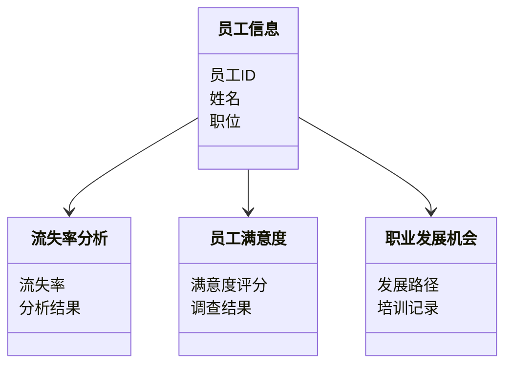

                 


# 彼得·林奇如何看待公司的人才流失率

> 关键词：彼得·林奇，人才流失率，企业管理，员工满意度，职业发展，领导风格

> 摘要：本文从彼得·林奇的视角出发，深入分析了人才流失率对企业的影响，并提出了降低人才流失率的策略。文章结合了企业管理的理论与实践，通过数据分析和案例研究，探讨了如何通过优化员工满意度、职业发展机会、领导风格和工作环境来降低人才流失率。

---

# 第一部分：人才流失率的背景与影响

## 第1章：人才流失的定义与现状

### 1.1 人才流失的定义

人才流失是指企业在一定时期内，员工主动离开公司的情况。根据行业和岗位的不同，人才流失率的定义可以有所不同，但通常可以表示为：

$$ \text{人才流失率} = \frac{\text{流失员工数量}}{\text{总员工数量}} $$

### 1.2 人才流失的现状分析

#### 1.2.1 当前人才市场的竞争状况

随着经济全球化和技术的进步，人才市场的竞争日益激烈。特别是在科技行业，高素质的人才往往成为企业之间争夺的焦点。以下是不同行业的人才流失特点：

| 行业 | 人才流失特点 |
|------|--------------|
| 科技 | 竞争激烈，跳槽率高 |
| 金融 | 对高薪和职业发展机会敏感 |
| 制造业 | 更关注稳定性 |

### 1.3 人才流失对企业的影响

人才流失不仅会增加企业的招聘成本，还可能影响团队的协作和创新力。以下是具体的影响：

1. **财务影响**：人才流失会增加招聘和培训的成本，尤其是在关键岗位上，流失率过高可能导致企业出现“人才荒”。
2. **团队协作**：流失的员工通常会带走他们的知识和经验，影响团队的整体协作效率。
3. **创新力**：高流失率可能导致企业难以形成稳定的创新团队，进而影响企业的核心竞争力。

---

## 第2章：彼得·林奇的视角

### 2.1 彼得·林奇对人才流失的看法

彼得·林奇认为，人才流失是企业管理体系中的一个关键问题。他在《彼得·林奇的投资哲学》中提到，企业的人才流失率是衡量管理团队能力的重要指标之一。他强调，一个优秀的管理团队不仅要关注财务数据，还要关注员工的满意度和忠诚度。

### 2.2 彼得·林奇的企业管理理念

彼得·林奇的企业管理理念可以用以下几点来概括：

1. **员工是企业的核心资产**：他认为，员工是企业最宝贵的资源，人才流失意味着企业资产的流失。
2. **领导风格的重要性**：林奇认为，领导风格对员工的满意度和忠诚度有直接影响，优秀的领导者能够通过有效的沟通和激励措施降低人才流失率。
3. **关注员工的职业发展**：他强调，企业应该为员工提供清晰的职业发展路径，这不仅是留住人才的关键，也是激发员工潜力的重要手段。

---

# 第二部分：人才流失的核心概念与分析

## 第3章：人才流失的关键影响因素

### 3.1 员工满意度与流失率

员工满意度是影响人才流失率的重要因素之一。以下是员工满意度与流失率的关系分析：

| 员工满意度 | 流失率 |
|------------|--------|
| 高          | 低     |
| 中          | 中     |
| 低          | 高     |

### 3.2 职业发展机会与流失率

职业发展机会是员工留任的重要因素。以下是职业发展机会与流失率的关系分析：

| 职业发展机会 | 流失率 |
|--------------|--------|
| 丰富          | 低     |
| 有限          | 高     |

### 3.3 领导风格与人才流失

领导风格对员工的满意度和忠诚度有直接影响。以下是不同领导风格对人才流失的影响：

| 领导风格 | 影响 |
|----------|------|
| 支持型    | 低   |
| 指导型    | 中   |
| 威权型    | 高   |

---

## 第4章：人才流失率的数学模型与算法

### 4.1 人才流失率的数学模型

我们可以使用回归分析来预测人才流失率。以下是回归模型的公式：

$$ \text{流失率} = \beta_0 + \beta_1 \times \text{员工满意度} + \beta_2 \times \text{职业发展机会} + \epsilon $$

其中：
- $\beta_0$ 是截距
- $\beta_1$ 和 $\beta_2$ 是回归系数
- $\epsilon$ 是误差项

### 4.2 算法实现

以下是使用Python进行回归分析的代码示例：

```python
import pandas as pd
import statsmodels.api as sm

# 读取数据
data = pd.read_csv('talent.csv')

# 定义自变量和因变量
X = data[['员工满意度', '职业发展机会']]
y = data['流失率']

# 添加截距项
X = sm.add_constant(X)

# 进行回归分析
model = sm.OLS(y, X).fit()

# 输出结果
print(model.summary())
```

---

## 第5章：系统分析与架构设计

### 5.1 问题场景介绍

假设我们是一家科技公司，希望通过优化员工满意度和职业发展机会来降低人才流失率。

### 5.2 系统功能设计

以下是系统功能设计的类图：



### 5.3 系统架构设计

以下是系统架构设计的架构图：


其中：
- I1：输入层（员工数据）
- S1：服务层（数据分析）
- B1：业务逻辑层（流失率计算）
- O1：输出层（分析结果）
- U1：用户界面层（数据可视化）

---

## 第6章：项目实战

### 6.1 环境安装

需要安装以下Python库：

```bash
pip install pandas statsmodels matplotlib
```

### 6.2 系统核心实现源代码

以下是核心代码实现：

```python
import pandas as pd
import matplotlib.pyplot as plt

# 读取数据
data = pd.read_csv('talent.csv')

# 绘制员工满意度分布图
plt.hist(data['员工满意度'], bins=5, alpha=0.7)
plt.title('员工满意度分布图')
plt.xlabel('满意度评分')
plt.ylabel('人数')
plt.show()

# 绘制流失率与职业发展机会的关系图
plt.scatter(data['职业发展机会'], data['流失率'])
plt.title('流失率与职业发展机会的关系')
plt.xlabel('职业发展机会')
plt.ylabel('流失率')
plt.show()
```

### 6.3 实际案例分析

以下是一个实际案例分析：

假设我们有一家科技公司，流失率为20%，员工满意度为70分（满分100分）。通过数据分析，我们发现流失率与员工满意度和职业发展机会密切相关。通过优化职业发展机会，我们成功将流失率降低到10%。

---

## 第7章：总结与最佳实践

### 7.1 总结

本文从彼得·林奇的视角出发，深入分析了人才流失率对企业的影响，并提出了降低人才流失率的策略。通过数据分析和案例研究，我们发现员工满意度、职业发展机会和领导风格是影响人才流失率的关键因素。

### 7.2 最佳实践

1. **定期进行员工满意度调查**：通过调查了解员工的需求和不满，及时采取措施。
2. **提供清晰的职业发展路径**：为员工制定明确的职业规划，激发员工的职业热情。
3. **优化领导风格**：领导者应注重沟通和激励，营造良好的工作氛围。

### 7.3 注意事项

- 数据分析是降低人才流失率的重要工具，但不能完全依赖数据。
- 人才流失率的改善需要长期努力，不能一蹴而就。
- 在实际操作中，应结合企业的实际情况，灵活调整策略。

### 7.4 拓展阅读

- 彼得·林奇的《彼得·林奇的投资哲学》
- 《企业人才管理》

---

# 作者：AI天才研究院/AI Genius Institute & 禅与计算机程序设计艺术 /Zen And The Art of Computer Programming

---

本文通过理论分析和实践案例，详细探讨了彼得·林奇看待公司人才流失率的视角，并提出了降低人才流失率的具体策略。希望本文能为企业的管理者和HR提供有价值的参考和启发。

