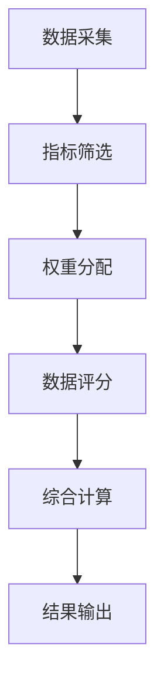
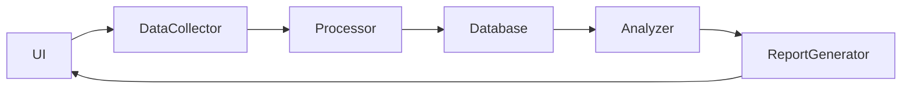
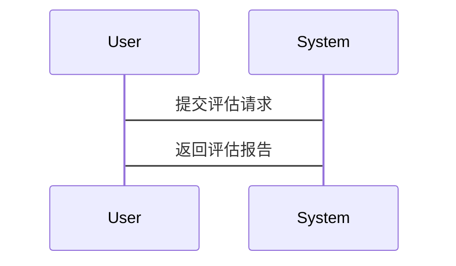

                 


# 彼得林奇如何看待公司的可持续发展

## 关键词：可持续发展，彼得林奇，投资策略，企业社会责任，长期价值

## 摘要：  
彼得林奇作为投资界的传奇人物，以其独特的价值投资理念闻名。本文将探讨彼得林奇如何看待公司的可持续发展，从背景介绍、核心概念、算法原理、数学模型、系统分析、项目实战到最佳实践等方面，全面解析可持续发展在公司投资决策中的重要性及其具体应用。

---

# 第一部分：可持续发展的背景与核心概念

## 第1章：可持续发展的定义与重要性

### 1.1 可持续发展的定义  
可持续发展是指在满足当代需求的同时，不损害后代满足其需求的能力。它涵盖了经济、社会和环境三个方面，强调平衡发展与资源利用之间的关系。

### 1.2 彼得林奇与可持续发展的联系  
彼得林奇的投资理念注重长期价值，他认为公司可持续发展能力是投资成功的关键。他关注企业的治理结构、社会责任和环境影响，认为这些因素能够影响企业的长期盈利能力。

### 1.3 可持续发展对投资决策的影响  
可持续发展因素已成为投资决策的重要组成部分。公司具备良好的可持续发展能力，通常能够在长期实现更高的股东价值，同时降低投资风险。

---

## 第2章：公司的可持续发展评估框架

### 2.1 可持续发展评估的核心要素  
- **环境因素（E）**：包括碳排放、资源利用效率等。  
- **社会因素（S）**：包括员工福利、社区参与等。  
- **治理因素（G）**：包括公司治理结构、透明度等。

### 2.2 可持续发展评估的指标体系  
- **财务指标**：如ROE（净资产收益率）、现金流等。  
- **非财务指标**：如员工满意度、碳排放强度等。  
- **综合指标**：如ESG（环境、社会、治理）评分。

### 2.3 可持续发展评估的边界与外延  
- **边界**：主要关注企业内部管理和外部影响。  
- **外延**：扩展到供应链、合作伙伴及客户关系。  
- **局限性**：数据获取难度、评估标准不统一等。

---

## 第3章：彼得林奇的可持续发展投资策略

### 3.1 投资策略的核心要素  
- **长期价值投资**：关注企业长期盈利能力。  
- **基本面分析**：评估企业的财务健康和市场地位。  
- **可持续发展能力评估**：考察企业的环境、社会和治理表现。

### 3.2 投资策略的实施步骤  
1. **确定投资目标**：明确投资领域和目标公司的筛选标准。  
2. **选择评估指标**：根据目标公司特点选择合适的ESG指标。  
3. **进行投资决策**：综合评估结果，做出投资决策。

### 3.3 投资策略的案例分析  
- **典型案例一**：某绿色能源公司，具备高ESG评分和稳定的现金流。  
- **典型案例二**：某传统制造企业，治理结构存在问题，但具备较高的财务回报。  
- **案例总结**：ESG表现与财务回报之间存在正相关性，但需综合考虑。

---

# 第二部分：可持续发展评估的算法与数学模型

## 第4章：可持续发展评估的算法原理

### 4.1 算法原理概述  
可持续发展评估通常采用加权评分法，根据指标的重要性和表现打分，最终计算综合得分。

### 4.2 算法流程图  


### 4.3 算法实现代码  
```python
def calculate_esg_score(environment_score, social_score, governance_score):
    # 假设权重分别为0.4, 0.3, 0.3
    weights = {'E': 0.4, 'S': 0.3, 'G': 0.3}
    total_score = (environment_score * weights['E'] +
                   social_score * weights['S'] +
                   governance_score * weights['G'])
    return total_score

# 示例数据
env_score = 85
social_score = 90
governance_score = 80

print(f"ESG综合得分：{calculate_esg_score(env_score, social_score, governance_score)}")
```

---

## 第5章：可持续发展评估的数学模型

### 5.1 核心数学模型  
- **内部收益率（IRR）**：$$ \text{IRR} = \sum_{t=0}^{n} \frac{CF_t}{(1 + r)^t} = 0 $$
- **净现值（NPV）**：$$ \text{NPV} = \sum_{t=0}^{n} \frac{CF_t}{(1 + r)^t} $$

### 5.2 模型应用  
以某公司为例，假设初始投资为$100万，未来三年的现金流分别为$40万、$50万、$60万，贴现率为10%。  
计算IRR和NPV，评估其可持续发展能力。

---

# 第三部分：系统分析与架构设计

## 第6章：系统分析与架构设计

### 6.1 系统功能需求  
- 数据采集模块：收集企业ESG数据。  
- 指标计算模块：计算各项ESG指标。  
- 报告生成模块：输出评估报告。

### 6.2 系统架构设计  


### 6.3 接口设计  
- 数据接口：REST API，用于数据传输。  
- 报告接口：生成PDF或HTML格式的报告。

### 6.4 交互流程  


---

# 第四部分：项目实战与最佳实践

## 第7章：项目实战

### 7.1 环境安装  
安装Python和相关库（如Pandas、Scikit-learn）。

### 7.2 核心代码实现  
```python
import pandas as pd

# 假设数据集
data = {
    'Company': ['A', 'B', 'C'],
    'E_Score': [85, 70, 90],
    'S_Score': [90, 80, 75],
    'G_Score': [80, 85, 70]
}
df = pd.DataFrame(data)

# 计算ESG综合得分
df['ESG_Score'] = df.apply(lambda x: (x['E_Score'] * 0.4) + (x['S_Score'] * 0.3) + (x['G_Score'] * 0.3), axis=1)

print(df)
```

### 7.3 案例分析  
以某绿色能源公司为例，分析其ESG表现，并解读评估结果。

## 第8章：最佳实践

### 8.1 小结  
可持续发展是公司长期价值的重要组成部分，投资者应将其纳入决策框架。

### 8.2 注意事项  
- 数据来源的可靠性。  
- 指标权重的合理性。  
- 结果的可解释性。

### 8.3 拓展阅读  
推荐阅读彼得林奇的相关著作，深入理解其投资理念。

---

# 第五部分：总结与展望

## 第9章：总结

### 9.1 本章小结  
本文从背景、核心概念、算法、系统设计、项目实战等多个方面，全面探讨了彼得林奇如何看待公司的可持续发展。

## 第10章：展望

### 10.1 未来研究方向  
- 更精确的评估模型。  
- 多维度数据的整合分析。  
- 全球化视角下的可持续发展评估。

---

# 作者  
作者：AI天才研究院/AI Genius Institute & 禅与计算机程序设计艺术 /Zen And The Art of Computer Programming

---

通过以上结构，我们可以系统地分析彼得林奇如何看待公司的可持续发展，从理论到实践，从算法到系统，全面而深入地探讨这一主题。

