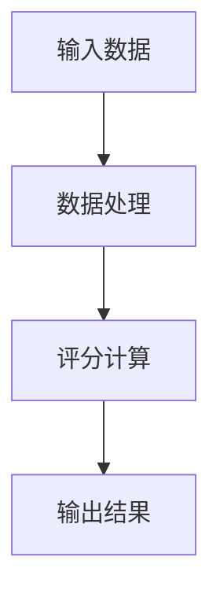

                 


# 彼得林奇如何看待公司的可持续发展目标

> 关键词：彼得·林奇，可持续发展目标，ESG，投资决策，公司治理

> 摘要：本文探讨了彼得·林奇的投资理念中对可持续发展目标的关注，分析了环境、社会和治理（ESG）因素如何影响他的投资决策，并提出了将ESG评分融入投资模型的方法。

---

## 第一部分：可持续发展与投资理念概述

### 第1章：可持续发展的定义与重要性

#### 1.1 可持续发展的定义
- **可持续发展**是指满足当代需求的同时，不损害后代满足其需求的能力。
- **环境维度**：减少资源消耗和污染，推动绿色能源使用。
- **社会维度**：关注员工权益、社区发展和产品安全。
- **治理维度**：强调公司治理结构的透明性和有效性。

#### 1.2 可持续发展的重要性
- **经济影响**：通过优化资源利用降低成本，提升效率。
- **社会影响**：促进社会公平与和谐，增强企业社会责任。
- **环境影响**：减少碳足迹，应对气候变化挑战。

### 第2章：彼得·林奇的投资理念

#### 2.1 投资理念概述
- **长期投资**：关注企业长期价值，而非短期波动。
- **价值投资**：寻找市场价格低于内在价值的企业。
- **基本面分析**：注重企业的财务状况、管理层能力和行业地位。

#### 2.2 可持续发展目标与投资
- 林奇认为，企业应关注环境、社会和治理因素，以实现长期稳健发展。
- 企业可持续发展能力是投资决策的重要考量因素。

---

## 第二部分：可持续发展目标的分析框架

### 第3章：ESG评分体系

#### 3.1 ESG评分的定义与作用
- **环境（E）**：评估企业在环境保护方面的表现，如碳排放、能源效率。
- **社会（S）**：评估企业在社会责任方面的表现，如员工权益、社区参与。
- **治理（G）**：评估企业在公司治理方面的表现，如董事会结构、透明度。

#### 3.2 ESG评分的计算方法
- 结合定量和定性指标，构建评分模型。
- 使用行业基准进行对比，评估企业表现。

### 第4章：将ESG融入投资决策

#### 4.1 林奇对可持续发展目标的评估标准
- **财务表现**：关注企业在可持续发展方面的投入是否带来经济效益。
- **风险管理**：评估企业是否有效管理环境、社会和治理风险。
- **长期价值**：判断企业是否具备可持续发展的竞争优势。

#### 4.2 可持续发展目标对投资决策的影响
- 通过ESG评分筛选出表现优异的企业。
- 结合财务指标进行综合评估，优化投资组合。

---

## 第三部分：系统分析与实战案例

### 第5章：系统架构设计

#### 5.1 系统功能设计
- **数据收集**：获取企业的ESG相关数据。
- **评分计算**：基于算法计算ESG评分。
- **决策支持**：提供投资建议和风险提示。

#### 5.2 系统架构图


### 第6章：项目实战

#### 6.1 环境安装
- 安装Python和必要的库（如pandas、numpy）。

#### 6.2 核心实现代码
```python
import pandas as pd

def calculate_esg_score(data):
    # 计算ESG评分
    score = data.mean()
    return score

data = pd.read_csv('esg_data.csv')
result = calculate_esg_score(data)
print(result)
```

#### 6.3 案例分析
- 选择一家企业，分析其ESG表现，评估其投资价值。

---

## 结语

彼得·林奇的投资理念强调企业基本面分析，而可持续发展目标的评估为企业提供了额外的维度。通过引入ESG评分体系，投资者可以更全面地评估企业的长期价值，做出更明智的投资决策。未来，随着ESG投资的兴起，这一方法将变得越来越重要。

---

作者：AI天才研究院 & 禅与计算机程序设计艺术

