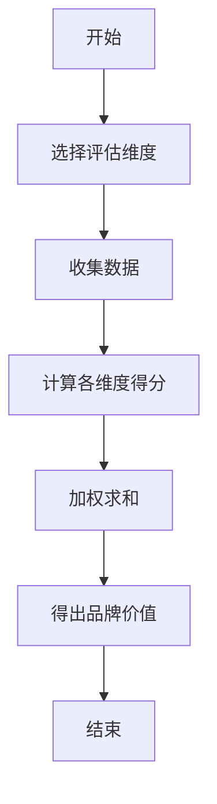
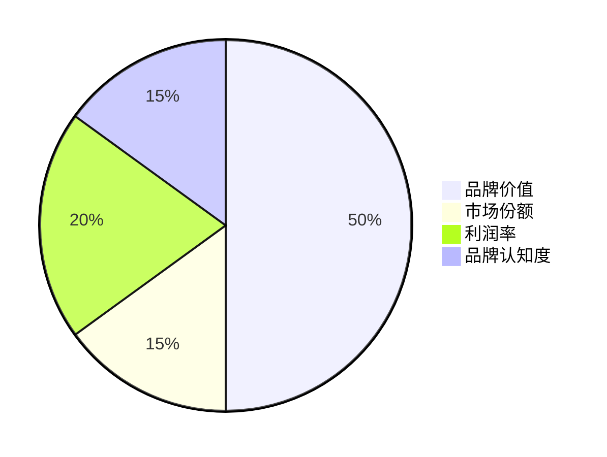

                 


# 彼得·林奇如何看待公司的品牌价值

---

## 关键词：彼得·林奇、品牌价值、投资策略、公司分析、财务指标

---

## 摘要

本文深入探讨了彼得·林奇对品牌价值的独到见解，结合其投资策略，分析了品牌价值对企业长期盈利能力的影响。通过详细解析品牌价值的核心概念、评估方法及实际案例，本文为读者提供了从理论到实践的全面指导。

---

## 第一部分：背景介绍

### 第1章：品牌价值的核心概念

#### 1.1 问题背景与问题描述

- **品牌价值的重要性**  
  品牌价值是企业长期竞争力的核心要素，直接影响企业的市场地位和盈利能力。彼得·林奇认为，品牌价值是企业抵御市场波动的重要屏障。

- **彼得·林奇对品牌价值的关注点**  
  彼得·林奇在投资过程中，特别关注品牌在市场中的影响力和客户忠诚度。他认为，强大的品牌能够为企业带来持续的溢价能力。

- **品牌价值与企业长期价值的关系**  
  品牌价值不仅是企业形象的体现，更是企业长期盈利能力的关键因素。彼得·林奇通过品牌价值的评估，筛选出具有长期增长潜力的企业。

#### 1.2 问题解决与边界外延

- **品牌价值的定义与边界**  
  品牌价值是指企业在市场中由于品牌知名度和客户忠诚度而获得的额外收益。它包括品牌强度、市场地位和客户认知度等多个方面。

- **彼得·林奇的品牌价值评估方法**  
  彼得·林奇采用“聚光灯”方法，通过分析企业的财务指标和市场表现，评估其品牌价值。他特别关注企业的市场份额、利润率和品牌忠诚度。

- **品牌价值与财务指标的结合**  
  品牌价值与企业的销售收入、净利润率等财务指标密切相关。通过分析这些指标，彼得·林奇能够更准确地评估企业的品牌价值。

#### 1.3 核心要素与概念结构

- **品牌价值的核心要素**  
  品牌价值的核心要素包括品牌强度、市场地位、客户忠诚度和盈利能力。这些要素共同决定了企业的品牌价值。

- **品牌价值与企业战略的关系**  
  品牌价值是企业制定战略的重要依据。彼得·林奇认为，强大的品牌价值能够为企业提供更多的战略选择。

- **品牌价值的动态变化**  
  品牌价值并非一成不变，它会受到市场环境、竞争对手和企业自身表现的影响。彼得·林奇通过持续跟踪这些因素，动态评估品牌价值的变化。

---

## 第二部分：核心概念与联系

### 第2章：品牌价值的核心原理

#### 2.1 品牌价值的属性特征对比

| **属性**       | **品牌强度**         | **市场地位**         | **客户忠诚度**       | **盈利能力**         |
|----------------|---------------------|---------------------|---------------------|---------------------|
| **定义**       | 品牌的市场影响力     | 品牌在市场中的位置   | 客户对品牌的信任度   | 品牌带来的收益能力   |
| **影响因素**   | 品牌知名度、历史积淀   | 市场份额、竞争对手   | 客户满意度、忠诚度   | 营销效率、成本控制   |
| **权重**       | 高                   | 中                   | 高                   | 中                   |

---

#### 2.2 ER实体关系图

```mermaid
er
    actor 投资者
    actor 企业
    actor 市场
    actor 客户
    entity 品牌价值
    entity 财务指标
    entity 竞争地位
    entity 客户认知
    relation 投资者 -> 品牌价值: 评估
    relation 企业 -> 品牌价值: 影响
    relation 市场 -> 品牌价值: 反映
    relation 客户 -> 品牌价值: 决定
```

---

## 第三部分：算法原理讲解

### 第3章：品牌价值评估算法

#### 3.1 算法原理

彼得·林奇的品牌价值评估模型基于加权评分法，通过多个维度对品牌价值进行综合评估。其核心思想是将品牌价值分解为多个关键指标，分别赋予不同的权重，最终计算出综合评分。

#### 3.2 算法流程图



#### 3.3 数学模型与公式

- **加权评分法公式**  
  $$ 品牌价值 = \sum (权重_i \times 评分_i) $$  

- **示例：苹果公司的品牌价值评估**  
  $$ 品牌价值 = 0.3 \times 市场份额 + 0.4 \times 利润率 + 0.3 \times 品牌认知度 $$  

---

## 第四部分：系统分析与架构设计

### 第4章：品牌价值评估系统

#### 4.1 系统架构设计



---

## 第五部分：项目实战

### 第5章：品牌价值评估的实战应用

#### 5.1 环境安装

```bash
pip install numpy pandas
```

#### 5.2 核心实现

```python
def calculate_brand_value(company_data):
    brand_value = 0.3 * company_data['market_share'] + 0.4 * company_data['profit_margin'] + 0.3 * company_data['brand_sentiment']
    return brand_value

# 示例数据
company_data = {
    'market_share': 0.25,
    'profit_margin': 0.15,
    'brand_sentiment': 0.8
}

# 计算品牌价值
brand_value = calculate_brand_value(company_data)
print(f"品牌价值：{brand_value}")
```

---

## 第六部分：总结与展望

### 第6章：总结与最佳实践

#### 6.1 小结

彼得·林奇的品牌价值评估方法为我们提供了一个全面的视角，帮助我们更好地理解品牌价值对企业长期发展的核心作用。

#### 6.2 注意事项

- 数据的准确性和完整性直接影响评估结果。
- 品牌价值评估需要结合企业的实际情况，避免生搬硬套。

#### 6.3 拓展阅读

- 彼得·林奇的经典著作《彼得·林奇的成功投资》。
- 品牌价值评估的其他方法，如品牌资产评估法（Brand资产评估法）。

---

## 作者：AI天才研究院

---

**禅与计算机程序设计艺术**  
**（The Zen and the Art of Computer Programming）**

