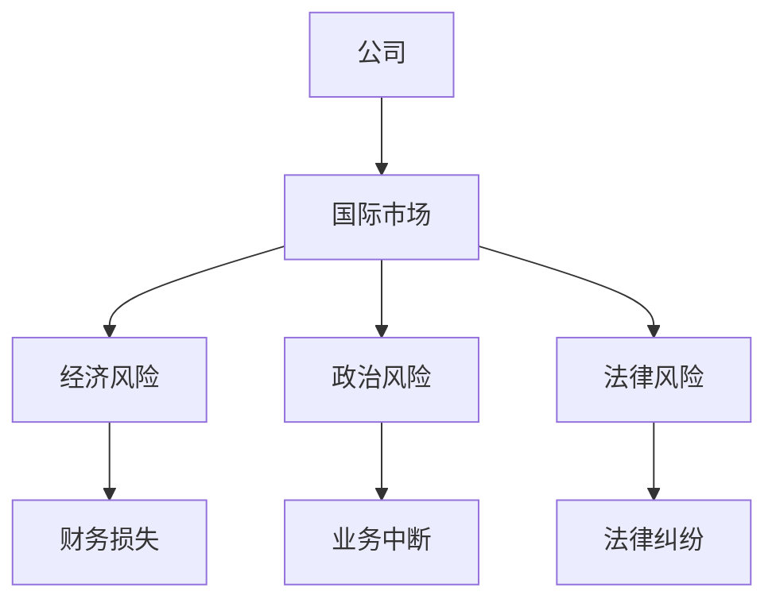
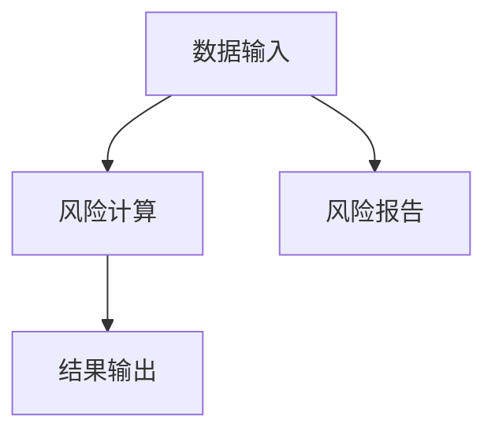

                 

# 彼得林奇如何看待公司的国际化风险

> 关键词：彼得林奇、国际化风险、投资策略、风险管理、企业战略、全球化

> 摘要：本文从彼得·林奇的投资理念出发，探讨他如何看待公司的国际化风险。文章详细分析了国际化风险的类型、评估方法和应对策略，结合实际案例和系统架构，为企业管理者提供实用的建议。

---

# 第一部分：彼得林奇与国际化风险的背景介绍

## 第1章：彼得·林奇和他的投资理念

### 1.1 彼得·林奇的生平与投资风格

#### 1.1.1 彼得·林奇的早年经历
彼得·林奇是美国著名投资家，曾任富达投资的经理人。他以独特的投资风格闻名，注重基本面分析和长期价值投资。他的投资哲学强调深入研究企业，寻找具有竞争优势的公司。

#### 1.1.2 彼得·林奇的投资哲学
林奇认为，投资的核心是理解企业的商业模式和财务状况。他强调分散投资和长期持有，避免短期市场波动的干扰。他的投资策略注重企业的成长性和盈利能力。

#### 1.1.3 彼得·林奇的投资策略
林奇的投资策略包括以下几点：
1. 选择具有强大竞争优势的企业。
2. 关注企业的财务健康状况。
3. 长期持有，避免频繁交易。
4. 分散投资，降低风险。

### 1.2 国际化风险的基本概念

#### 1.2.1 什么是国际化风险
国际化风险是指企业在跨国经营过程中，由于政治、经济、法律等因素的变化，导致的财务损失或业务中断的风险。

#### 1.2.2 国际化风险的影响
国际化风险可能影响企业的市场进入、成本控制、利润分配和品牌形象。例如，政治动荡可能导致业务中断，经济波动可能影响汇率和成本。

#### 1.2.3 企业国际化战略的重要性
企业在国际化过程中需要制定明确的战略，包括市场选择、风险管理、法律合规等。国际化战略的成功与否直接影响企业的全球竞争力。

---

# 第二部分：国际化风险的核心概念与分析

## 第2章：国际化风险的类型与特征

### 2.1 政治风险

#### 2.1.1 政治风险的定义
政治风险是指由于东道国的政治变化（如政策调整、政权更迭）对企业造成的风险。

#### 2.1.2 政治风险的主要表现
1. 政府政策变化。
2. 外汇管制。
3. 没收资产。

#### 2.1.3 政治风险的评估方法
企业可以通过分析东道国的政治稳定性、政府腐败指数和政策透明度来评估政治风险。

### 2.2 经济风险

#### 2.2.1 经济风险的定义
经济风险是指由于经济波动（如通货膨胀、经济衰退）对企业造成的风险。

#### 2.2.2 经济风险的主要表现
1. 汇率波动。
2. 利率变化。
3. 通货膨胀。

#### 2.2.3 经济风险的评估方法
企业可以通过分析宏观经济指标（如GDP增长率、通胀率）和行业趋势来评估经济风险。

### 2.3 市场风险

#### 2.3.1 市场风险的定义
市场风险是指由于市场需求变化对企业造成的风险。

#### 2.3.2 市场风险的主要表现
1. 销售额下降。
2. 价格竞争加剧。
3. 市场需求波动。

#### 2.3.3 市场风险的评估方法
企业可以通过市场调研、竞争对手分析和客户反馈来评估市场风险。

## 第3章：国际化风险的核心要素与联系

### 3.1 国际化风险的核心要素

#### 3.1.1 经济环境
经济环境包括东道国的经济政策、通胀率和汇率波动等因素。

#### 3.1.2 政治环境
政治环境包括东道国的政治稳定性、政策透明度和政府腐败指数等因素。

#### 3.1.3 法律环境
法律环境包括东道国的法律法规、税收政策和知识产权保护等因素。

#### 3.1.4 市场环境
市场环境包括市场需求、竞争状况和消费者行为等因素。

### 3.2 国际化风险的实体关系图

---

# 第三部分：国际化风险的评估与管理

## 第4章：国际化风险的评估方法

### 4.1 风险评估的核心算法

#### 4.1.1 风险评分模型
企业可以通过对各个风险因素进行评分（如经济风险、政治风险）来综合评估国际化风险。

#### 4.1.2 风险评分算法
$$ \text{总风险评分} = \sum (\text{风险权重} \times \text{风险得分}) $$

#### 4.1.3 示例
假设某企业在东道国的经济风险得分为70，政治风险得分为60，权重分别为0.4和0.6：
$$ \text{总风险评分} = 0.4 \times 70 + 0.6 \times 60 = 28 + 36 = 64 $$

### 4.2 风险评估的系统架构

#### 4.2.1 系统功能设计
- 数据输入：收集东道国的经济、政治、法律等数据。
- 风险计算：根据算法计算总风险评分。
- 结果输出：生成风险报告。

#### 4.2.2 系统架构图

---

# 第四部分：国际化风险的应对策略

## 第5章：风险管理的最佳实践

### 5.1 风险分散

#### 5.1.1 风险分散的定义
风险分散是指通过投资于多个市场或行业来降低风险。

#### 5.1.2 风险分散的实施方法
1. 多元化投资。
2. 分散供应链。

### 5.2 风险对冲

#### 5.2.1 风险对冲的定义
风险对冲是指通过金融工具（如期货、期权）来抵消风险。

#### 5.2.2 风险对冲的实施方法
1. 使用外汇期货对冲汇率风险。
2. 使用期权对冲价格波动风险。

### 5.3 企业战略调整

#### 5.3.1 战略调整的定义
战略调整是指根据风险评估结果，调整国际化战略。

#### 5.3.2 战略调整的实施方法
1. 优化市场选择。
2. 加强风险管理团队。

---

# 第五部分：总结与展望

## 第6章：总结与小结

### 6.1 本文的核心观点
彼得·林奇的投资理念为企业管理国际化风险提供了重要的启示。企业需要全面评估国际化风险，并制定有效的应对策略。

### 6.2 未来研究方向
未来可以进一步研究人工智能在国际化风险评估中的应用，以及跨国企业如何利用技术手段优化风险管理。

---

作者：AI天才研究院/AI Genius Institute & 禅与计算机程序设计艺术 /Zen And The Art of Computer Programming

