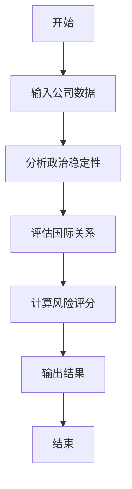
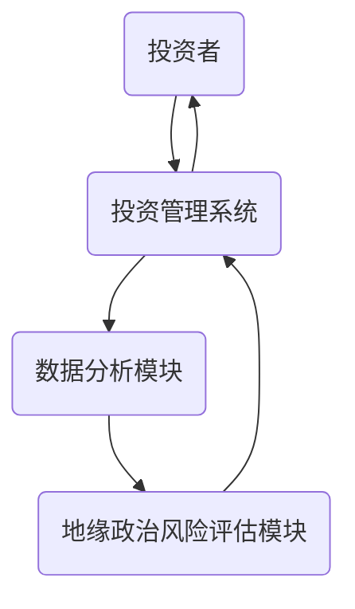

                 


# 彼得林奇如何看待公司的地缘政治风险

## 关键词
- 彼得林奇
- 地缘政治风险
- 投资分析
- 公司评估
- 风险管理

## 摘要
彼得林奇是全球著名投资经理，以其独特的企业基本面分析方法闻名。本文探讨彼得林奇如何在投资决策中评估和应对地缘政治风险，分析其核心概念、评估方法及实际案例，帮助投资者理解地缘政治对企业的影响。

---

# 目录大纲

1. **地缘政治风险的核心概念**
   - 1.1 地缘政治风险的定义与特征
   - 1.2 彼得林奇投资方法概述
   - 1.3 地缘政治风险对企业的影响

2. **地缘政治风险的属性特征对比**
   - 2.1 地缘政治风险的属性分析
   - 2.2 地缘政治风险与经济风险的对比
   - 2.3 地缘政治风险的ER实体关系图

3. **地缘政治风险评估的算法原理**
   - 3.1 算法流程图
   - 3.2 Python实现代码
   - 3.3 数学模型与公式
   - 3.4 详细讲解与实际案例

4. **地缘政治风险的系统分析与架构设计**
   - 4.1 问题场景介绍
   - 4.2 系统功能设计
   - 4.3 系统架构设计
   - 4.4 系统接口设计
   - 4.5 系统交互序列图

5. **地缘政治风险的项目实战**
   - 5.1 环境安装与工具准备
   - 5.2 核心代码实现
   - 5.3 代码解读与分析
   - 5.4 实际案例分析
   - 5.5 项目总结

6. **最佳实践与注意事项**
   - 6.1 小结
   - 6.2 注意事项
   - 6.3 拓展阅读

---

# 正文

## 第一部分: 地缘政治风险的核心概念

### 1.1 地缘政治风险的定义与特征
地缘政治风险是指由于政治不稳定、国际关系紧张或政府政策变化等因素对企业经营和投资产生的潜在影响。这些风险可能包括贸易壁垒、制裁、战争或政治动荡等。

### 1.2 彼得林奇投资方法概述
彼得林奇以其独特的投资策略闻名，他强调对公司基本面的深入研究。他的分析框架包括对管理层能力、财务状况和行业地位的评估。在地缘政治风险方面，他关注公司所在的国家和地区的政治稳定性、政策变化和国际关系。

### 1.3 地缘政治风险对企业的影响
地缘政治风险可能影响企业的供应链、市场份额和利润率。例如，贸易制裁可能导致成本上升，而政治动荡可能影响公司的正常运营。

---

## 第二部分: 地缘政治风险的属性特征对比

### 2.1 地缘政治风险的属性分析
地缘政治风险具有复杂性、不确定性和长期性。它可能影响企业的短期和长期表现，且难以预测。

### 2.2 地缘政治风险与经济风险的对比
地缘政治风险与经济风险既有区别又有联系。地缘政治风险更多涉及政治因素，而经济风险则更多涉及经济指标。

### 2.3 地缘政治风险的ER实体关系图
```mermaid
er
actor: 投资者
entity: 公司
entity: 国家
relation: 影响
```

---

## 第三部分: 地缘政治风险评估的算法原理

### 3.1 算法流程图


### 3.2 Python实现代码
```python
def geopolitical_risk_assessment(company_data):
    # 分析政治稳定性
    political_stability = company_data['政治稳定性']
    # 评估国际关系
    international_relations = company_data['国际关系']
    # 计算风险评分
    risk_score = (political_stability * 0.4) + (international_relations * 0.6)
    return risk_score

# 示例数据
company_data = {
    '政治稳定性': 0.7,
    '国际关系': 0.8
}

# 调用函数
risk_score = geopolitical_risk_assessment(company_data)
print(f"地缘政治风险评分: {risk_score}")
```

### 3.3 数学模型与公式
地缘政治风险评分公式：
$$风险评分 = 0.4 \times 政治稳定性 + 0.6 \times 国际关系$$

### 3.4 详细讲解与实际案例
假设一家公司政治稳定性得分为0.7，国际关系得分为0.8，计算风险评分为：
$$风险评分 = 0.4 \times 0.7 + 0.6 \times 0.8 = 0.28 + 0.48 = 0.76$$

---

## 第四部分: 地缘政治风险的系统分析与架构设计

### 4.1 问题场景介绍
分析一家跨国公司的地缘政治风险，评估其在不同国家的经营稳定性。

### 4.2 系统功能设计


### 4.3 系统架构设计


---

## 第五部分: 地缘政治风险的项目实战

### 5.1 环境安装与工具准备
安装Python和相关数据分析库（如Pandas、NumPy）。

### 5.2 核心代码实现
```python
import pandas as pd

def calculate_risk_score(data):
    data['风险评分'] = 0.4 * data['政治稳定性'] + 0.6 * data['国际关系']
    return data

# 示例数据
data = pd.DataFrame({
    '公司': ['A', 'B', 'C'],
    '政治稳定性': [0.8, 0.6, 0.7],
    '国际关系': [0.9, 0.7, 0.8]
})

# 调用函数
result = calculate_risk_score(data)
print(result)
```

### 5.3 代码解读与分析
上述代码计算每家公司的风险评分，帮助投资者识别高风险公司。

### 5.4 实际案例分析
分析某行业公司受地缘政治影响的情况，如贸易制裁导致成本上升。

### 5.5 项目总结
通过实际案例分析，验证模型的有效性，并总结经验教训。

---

## 第六部分: 最佳实践与注意事项

### 6.1 小结
彼得林奇的地缘政治风险分析框架为投资者提供了评估企业风险的重要工具。

### 6.2 注意事项
- 定期更新数据
- 结合其他风险因素
- 谨慎评估复杂局势

### 6.3 拓展阅读
推荐阅读彼得林奇的书籍，深入理解其投资理念。

---

# 作者
作者：AI天才研究院 & 禅与计算机程序设计艺术

