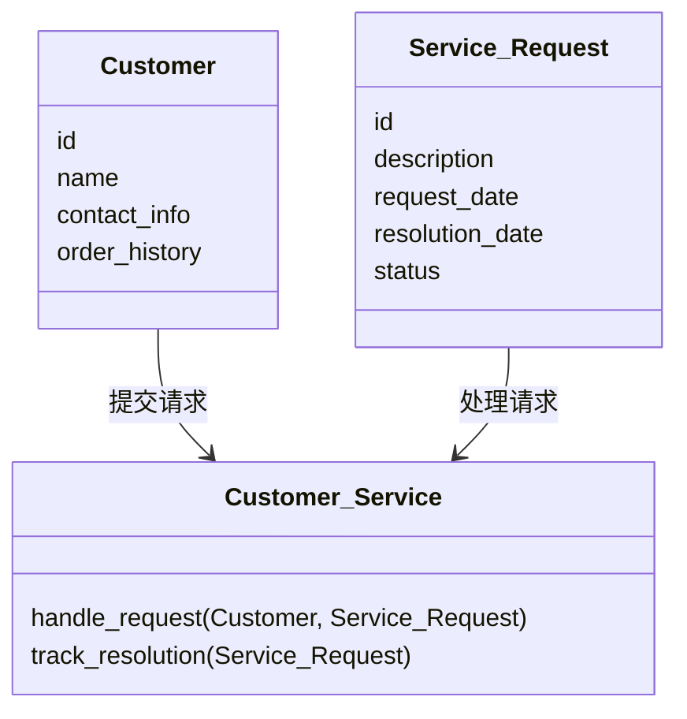
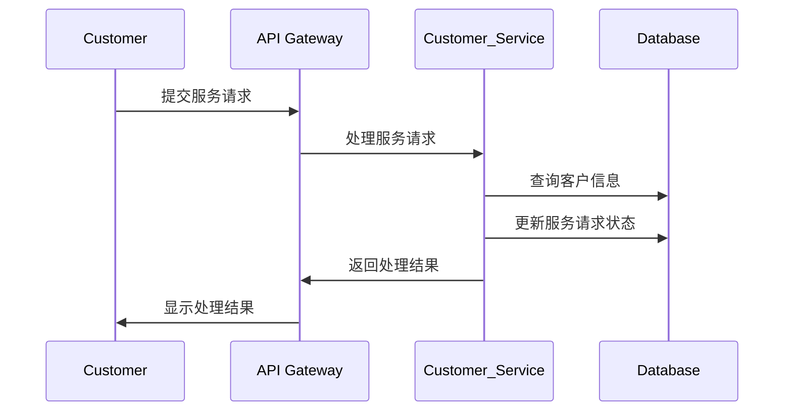

                 


# 彼得·林奇如何看待公司的客户服务

## 关键词：客户服务，彼得·林奇，投资价值，客户满意度，服务质量，客户忠诚度

## 摘要：本文从投资者的角度分析客户服务对企业发展和投资价值的影响，探讨彼得·林奇如何看待客户服务，以及如何通过优化客户服务来提升企业竞争力和长期价值。

---

# 第一部分：彼得·林奇与客户服务的背景介绍

## 第1章：彼得·林奇与客户服务的背景

### 1.1 客户服务的定义与重要性

#### 1.1.1 什么是客户服务
客户服务是指企业为满足客户需求所提供的一系列支持和服务，包括售前咨询、售后支持、问题解决和技术支持等。这些服务不仅帮助客户解决问题，还能增强客户对企业的信任和忠诚度。

#### 1.1.2 客户服务的重要性
在现代商业环境中，客户服务是区分企业竞争力的关键因素之一。优质的客户服务能够提升客户满意度，促进客户忠诚度，从而为企业带来长期的收益和竞争优势。

#### 1.1.3 彼得·林奇对客户服务的关注点
作为著名投资家，彼得·林奇在选择投资目标时，特别关注企业的客户服务能力。他认为，优秀的客户服务能够提高客户满意度和忠诚度，进而提升企业的市场份额和盈利能力。

### 1.2 彼得·林奇的投资哲学

#### 1.2.1 彼得·林奇的投资者身份
彼得·林奇以其在富达投资集团的工作闻名，他注重长期投资，关注企业的基本面和管理层能力。他认为，企业的长期成功不仅取决于财务表现，还取决于客户满意度和员工士气。

#### 1.2.2 投资者视角下的客户服务
从投资者角度来看，客户服务是企业与客户之间建立信任和长期关系的桥梁。优质的服务能够减少客户流失，提高客户忠诚度，从而增强企业的盈利能力。

#### 1.2.3 客户服务与企业价值的关系
彼得·林奇认为，客户服务是企业价值的重要组成部分。优秀的客户服务能够提升企业的品牌价值和市场地位，从而为企业带来更高的估值和投资回报。

---

## 第2章：客户服务的核心概念与联系

### 2.1 核心概念原理

#### 2.1.1 客户服务的三要素：质量、效率、客户满意度
- **质量**：服务的专业性和准确性。
- **效率**：服务的速度和响应时间。
- **客户满意度**：客户对服务的主观评价。

#### 2.1.2 客户服务与客户忠诚度的关系
客户满意度高通常意味着客户忠诚度高，客户更愿意持续购买企业的产品和服务。

#### 2.1.3 客户服务对企业长期发展的战略意义
优质的客户服务能够提升企业的品牌声誉，增强客户粘性，从而推动企业的长期发展。

### 2.2 核心概念属性对比表格

| 属性       | 描述                               |
|------------|------------------------------------|
| 质量       | 服务的专业性和准确性               |
| 效率       | 服务的速度和响应时间               |
| 满意度     | 客户对服务的主观评价               |
| 忠诚度     | 客户持续使用企业服务的程度         |
| 长期价值   | 服务对客户生命周期价值的影响       |

### 2.3 ER实体关系图

```mermaid
er
  Customer
  - id: int
  - name: string
  - contact_info: string
  Service_Request
  - id: int
  - description: string
  - request_date: date
  - resolution_date: date
  - status: enum{pending, in_progress, resolved}
  contains
  Customer -> Service_Request: 提出
```

---

## 第3章：客户服务的数学模型与评估方法

### 3.1 客户满意度模型

#### 3.1.1 模型概述
客户满意度是衡量客户服务的重要指标，可以通过以下公式计算：

$$ \text{客户满意度} = \frac{\text{总满意数}}{\text{总客户数}} \times 100\% $$

### 3.2 服务质量评估公式

服务质量可以通过以下公式进行评估：

$$ \text{服务质量} = \text{响应时间} + \text{问题解决效率} + \text{客户反馈评分} $$

### 3.3 客户忠诚度预测模型

客户忠诚度可以通过以下模型进行预测：

$$ \text{客户忠诚度} = \text{客户满意度} \times \text{客户净推荐值} $$

---

## 第4章：客户服务的系统分析与架构设计

### 4.1 问题场景介绍

假设我们正在为一家电子商务公司设计客户服务系统，目标是通过优化客户服务流程来提升客户满意度和忠诚度。

### 4.2 系统功能设计

#### 4.2.1 领域模型



### 4.3 系统架构设计


### 4.4 系统接口设计

- **API接口**：
  - POST /api/v1/service_request
  - GET /api/v1/service_request/{id}

### 4.5 系统交互流程



---

## 第5章：客户服务的项目实战

### 5.1 环境安装

#### 5.1.1 安装Python环境
```bash
python --version
pip install requests
```

#### 5.1.2 安装Django框架
```bash
pip install django
```

### 5.2 系统核心实现源代码

#### 5.2.1 Customer模型
```python
class Customer(models.Model):
    id = models.AutoField(primary_key=True)
    name = models.CharField(max_length=100)
    contact_info = models.CharField(max_length=200)
```

#### 5.2.2 Service_Request模型
```python
class Service_Request(models.Model):
    id = models.AutoField(primary_key=True)
    customer = models.ForeignKey(Customer, on_delete=models.CASCADE)
    description = models.TextField()
    request_date = models.DateTimeField(auto_now_add=True)
    resolution_date = models.DateTimeField(null=True, blank=True)
    status = models.CharField(max_length=50, choices=[('pending', '待处理'), ('in_progress', '处理中'), ('resolved', '已解决')])
```

#### 5.2.3 Customer_Service类
```python
class Customer_Service:
    def handle_request(self, customer, request):
        # 处理请求逻辑
        pass

    def track_resolution(self, request):
        # 跟踪解决进度逻辑
        pass
```

### 5.3 代码应用解读与分析

- **Customer模型**：用于存储客户信息，包括姓名和联系方式。
- **Service_Request模型**：用于存储服务请求信息，包括客户、描述、请求时间和状态。
- **Customer_Service类**：提供处理请求和跟踪解决进度的方法。

### 5.4 实际案例分析

#### 5.4.1 案例背景
假设一家电子商务公司希望通过优化客户服务流程来提升客户满意度和忠诚度。

#### 5.4.2 系统实现
根据上述模型和类，我们可以实现一个完整的客户服务系统，支持客户提交请求、跟踪解决进度和查看历史记录。

#### 5.4.3 详细讲解剖析
通过这个案例，我们可以看到客户服务系统的实现过程，包括需求分析、系统设计、编码实现和测试优化。

### 5.5 项目小结

通过这个项目，我们学会了如何从投资者的角度分析客户服务，以及如何通过优化客户服务流程来提升企业价值。

---

## 第6章：客户服务的最佳实践

### 6.1 小结

- 客户服务是企业的重要组成部分，直接影响客户满意度和忠诚度。
- 通过优化客户服务流程，可以提升企业的竞争力和长期价值。

### 6.2 注意事项

- 定期收集客户反馈，及时改进服务流程。
- 培训客服人员，提升服务质量和效率。
- 使用技术手段，如自动化工具，提高服务效率。

### 6.3 拓展阅读

- 《The Art of Customer Service》
- 《彼得·林奇的投资哲学》

---

## 作者信息

作者：AI天才研究院/AI Genius Institute & 禅与计算机程序设计艺术 /Zen And The Art of Computer Programming

---

通过以上结构，我们可以全面了解彼得·林奇如何看待客户服务，以及如何通过优化客户服务来提升企业价值。

