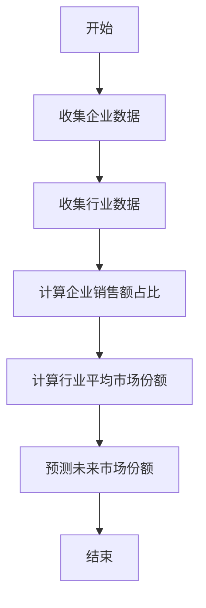

                 


# 彼得林奇如何看待公司的市场份额

## 关键词：
- 彼得林奇
- 市场份额
- 投资分析
- 市场策略
- 企业竞争力

## 摘要：
彼得·林奇是全球著名投资专家，他在《彼得林奇如何看待公司的市场份额》一书中，深入探讨了公司市场份额的重要性及其分析方法。文章从背景介绍、核心概念、算法原理、系统设计到项目实战，全面剖析了如何评估和利用市场份额数据，为企业投资决策提供科学依据。

---

## 第一部分：背景介绍

### 第1章：问题背景与问题描述

#### 1.1 问题背景
- **投资的基本概念**：投资是通过购买资产以期获得未来收益的行为，而市场份额是影响企业价值的关键因素。
- **市场份额的重要性**：市场份额反映了企业在市场中的地位，直接影响收入和利润。
- **彼得林奇的方法论**：林奇强调深入分析企业的市场份额，尤其是相对于竞争对手的情况。

#### 1.2 问题描述
- **市场份额的定义**：市场份额是企业在特定市场中销售产品或服务的总量占该市场总体的百分比。
- **问题的外延**：分析市场份额不仅关注当前状况，还需预测未来变化。
- **林奇的关注点**：他关注市场份额的变化趋势及其对企业长期价值的影响。

#### 1.3 问题解决
- **分析方法**：通过数据收集、建模和趋势分析，评估市场份额的稳定性。
- **框架**：林奇的分析框架包括市场定位、竞争优势和增长潜力。
- **影响分析**：市场份额变化直接影响企业利润和股价表现。

---

## 第二部分：核心概念与联系

### 第2章：核心概念原理

#### 2.1 市场份额的核心要素
- **构成**：市场份额由企业的销售额、客户数量和市场定位决定。
- **关键因素**：产品优势、价格策略、品牌影响力和客户忠诚度。
- **竞争力**：市场份额与企业竞争力成正比，是衡量企业市场地位的指标。

#### 2.2 属性特征对比
- **跨行业对比**：不同行业的市场份额受行业特性影响，如科技行业变化快，而传统行业相对稳定。
- **企业间对比**：同一行业内的企业通过市场份额对比，可评估其市场地位和竞争优势。
- **驱动因素**：技术创新、成本控制和营销策略影响市场份额变化。

#### 2.3 ER实体关系图
```mermaid
er
    %% 企业市场份额分析 ER 图
    entity(企业) {
        - 企业ID
        - 企业名称
        - 所属行业
    }
    entity(市场份额) {
        - 市场份额ID
        - 企业ID
        - 市场份额占比
        - 时间范围
    }
    entity(产品) {
        - 产品ID
        - 产品名称
        - 销售额
        - 市场份额
    }
    entity(竞争对手) {
        - 竞争对手ID
        - 竞争对手名称
        - 竞争对手市场份额
    }
    relation(企业, 市场份额, 一对一)
    relation(企业, 竞争对手, 一对多)
    relation(产品, 市场份额, 一对多)
```

---

## 第三部分：算法原理讲解

### 第3章：市场份额计算算法

#### 3.1 算法原理
- **基本原理**：市场份额计算基于企业的销售额占行业总销售额的比例。
- **数学模型**：$$ \text{市场份额} = \frac{\text{企业销售额}}{\text{行业总销售额}} \times 100\% $$
- **预测方法**：使用线性回归预测未来市场份额变化。

#### 3.2 算法流程图


#### 3.3 算法实现
- **Python代码**：
  ```python
  import pandas as pd

  def calculate_market_share(company_sales, industry_sales):
      return (company_sales / industry_sales) * 100

  # 示例数据
  company_sales = 100000000  # 企业销售额
  industry_sales = 500000000  # 行业总销售额
  market_share = calculate_market_share(company_sales, industry_sales)
  print(f"市场份额为：{market_share}%")
  ```

- **代码解读**：
  - 该函数计算企业销售额占行业总销售额的比例，返回市场份额百分比。
  - 示例数据中，企业销售额为1亿美元，行业总销售额为5亿美元，计算得出市场份额为20%。

---

## 第四部分：系统分析与架构设计

### 第4章：系统分析与架构设计

#### 4.1 问题场景介绍
- **目标**：构建一个实时监控和分析企业市场份额的系统。
- **范围**：涵盖数据收集、分析、可视化和报告生成。

#### 4.2 系统功能设计
- **数据收集模块**：从公开数据源或企业内部系统获取市场份额数据。
- **数据分析模块**：使用Python和Pandas进行数据清洗和计算。
- **数据可视化模块**：生成图表展示市场份额变化趋势。

#### 4.3 系统架构设计


---

## 第五部分：项目实战

### 第5章：项目实战

#### 5.1 环境安装
- **工具安装**：安装Python、Pandas、Matplotlib和Mermaid工具。
- **数据源**：使用公开的行业报告数据。

#### 5.2 核心代码实现
- **数据收集与处理**：
  ```python
  import pandas as pd
  import matplotlib.pyplot as plt

  # 数据加载
  df = pd.read_csv('market_share.csv')
  df['市场份额'] = df['销售额'] / df['行业总销售额'] * 100
  ```

- **数据可视化**：
  ```python
  plt.plot(df['时间'], df['市场份额'])
  plt.title('市场份额变化趋势')
  plt.xlabel('时间')
  plt.ylabel('市场份额 (%)')
  plt.show()
  ```

#### 5.3 案例分析
- **案例**：假设某科技公司过去三年市场份额分别为15%、20%、25%，预测未来三年市场份额可能增长到30%。
- **分析**：市场份额稳步增长，表明企业在市场中竞争力增强。

---

## 第六部分：最佳实践

### 6.1 小结
- 彼得林奇的方法强调深入分析市场份额，通过数据驱动的投资决策提高企业价值。
- 企业应定期评估市场份额，及时调整战略。

### 6.2 注意事项
- 数据来源需准确可靠。
- 分析模型应结合行业特点进行调整。
- 长期关注市场份额变化趋势，及时发现潜在风险和机会。

### 6.3 拓展阅读
- 推荐阅读彼得·林奇的其他著作，如《彼得林奇的投资哲学》。
- 学习更多数据分析工具和技术，如机器学习在市场份额预测中的应用。

---

## 作者：AI天才研究院 & 禅与计算机程序设计艺术

---

本文通过系统化的分析，深入探讨了彼得林奇对市场份额的见解，并结合实际案例和系统设计，为企业分析和投资决策提供了实用的指导。

