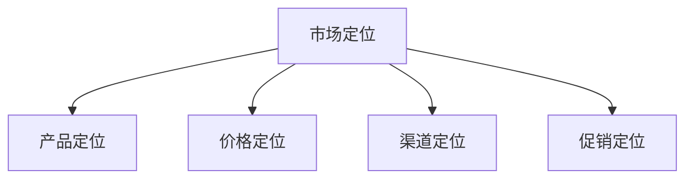
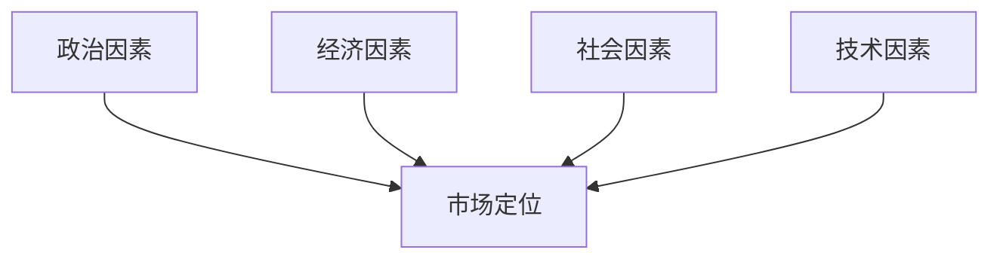
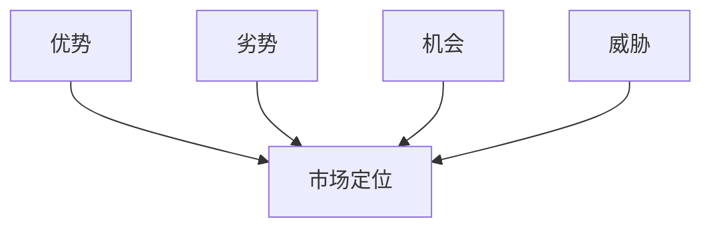
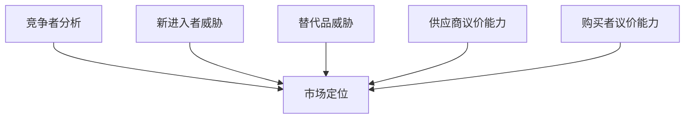
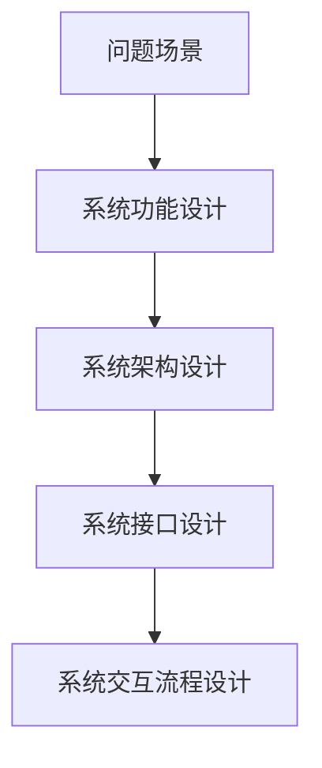
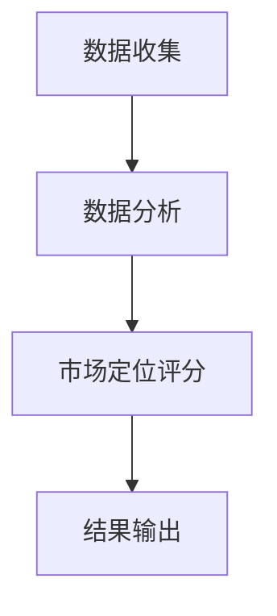
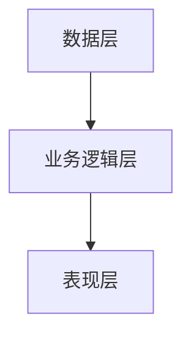
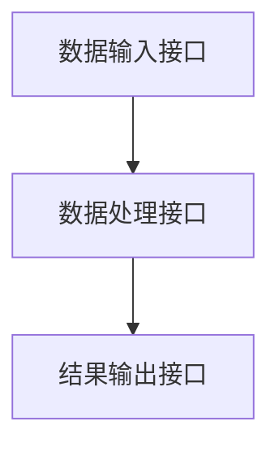
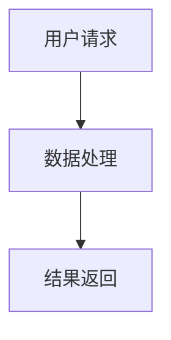

                 


# 彼得·林奇如何看待公司的市场定位

## 关键词：
- 彼得·林奇
- 市场定位
- 投资分析
- 竞争优势
- 企业战略

## 摘要：
彼得·林奇是全球著名投资专家，他通过独特的市场定位分析方法，帮助企业识别投资机会和竞争优势。本文将从市场定位的核心概念、分析方法、系统设计和项目实战等方面，详细阐述彼得·林奇的市场定位分析框架，帮助读者理解和应用这一方法。

---

# 第一部分：市场定位的背景与重要性

## 第1章：市场定位的核心概念

### 1.1 市场定位的定义与背景

市场定位是企业在目标市场中确定自身位置的过程，涉及产品、价格、渠道和促销策略。彼得·林奇认为，市场定位是投资分析的关键，因为它决定了企业的竞争优势和长期发展潜力。

### 1.2 彼得·林奇的市场定位分析框架

彼得·林奇提出了市场定位的四个维度：产品定位、价格定位、渠道定位和促销定位。他通过分析这些维度，帮助企业识别市场机会和竞争优势。

### 1.3 市场定位与企业竞争优势

市场定位直接影响企业的竞争优势。通过分析市场定位，彼得·林奇能够识别出那些在特定市场中具有独特优势的企业，从而做出明智的投资决策。

---

# 第二部分：市场定位的核心要素与分析方法

## 第2章：市场定位的核心要素

### 2.1 市场定位的四个维度

市场定位的四个维度包括产品定位、价格定位、渠道定位和促销定位。彼得·林奇认为，这些维度共同决定了企业的市场地位和竞争优势。



### 2.2 市场定位的核心要素对比

通过对比不同公司的市场定位策略，彼得·林奇能够识别出那些在市场中具有领先地位的企业。

```markdown
| 公司 | 产品定位 | 价格定位 | 渠道定位 | 促销定位 |
|------|----------|----------|----------|----------|
| 苹果 | 高端创新产品 | 高溢价 | 零售店+在线销售 | 强调品牌和创新 |
| 微软 | 软件和服务 | 中端定价 | 多渠道销售 | 技术推广 |
```

### 2.3 市场定位与企业战略的关系

市场定位与企业战略密切相关。彼得·林奇认为，通过分析市场定位，企业可以制定出更具竞争力的战略，从而在市场中获得更大的优势。

---

# 第三部分：市场定位的分析方法与工具

## 第3章：市场定位的分析方法

### 3.1 市场定位的PEST分析

PEST分析帮助企业了解外部环境对市场定位的影响。



### 3.2 市场定位的SWOT分析

SWOT分析帮助企业识别市场定位中的优势和劣势。



### 3.3 市场定位的波特五力分析

波特五力分析帮助企业了解市场中的竞争环境。



---

# 第四部分：市场定位的系统分析与架构设计

## 第4章：市场定位的系统分析

### 4.1 系统分析框架

系统分析框架包括问题场景介绍、系统功能设计、架构设计、接口设计和交互流程设计。



### 4.2 系统功能设计

系统功能设计包括数据收集、数据分析、市场定位评分和结果输出。



### 4.3 系统架构设计

系统架构设计采用分层架构，包括数据层、业务逻辑层和表现层。



### 4.4 系统接口设计

系统接口设计包括数据输入接口、数据处理接口和结果输出接口。



### 4.5 系统交互流程设计

系统交互流程设计包括用户请求、数据处理和结果返回。



---

# 第五部分：市场定位的项目实战

## 第5章：市场定位的项目实战

### 5.1 环境安装

安装必要的软件和工具，如Python、Jupyter Notebook和相关库。

### 5.2 核心代码实现

以下是核心代码实现：

```python
import pandas as pd

# 数据收集
data = pd.read_csv('market.csv')

# 数据分析
def market_positioning_score(data):
    score = 0
    # 加权评分公式
    score = 0.4 * data['产品定位'] + 0.3 * data['价格定位'] + 0.2 * data['渠道定位'] + 0.1 * data['促销定位']
    return score

# 市场定位评分
data['市场定位评分'] = data.apply(market_positioning_score, axis=1)

# 结果输出
print(data[['公司', '市场定位评分']].head())
```

### 5.3 案例分析

以苹果公司为例，分析其市场定位。

### 5.4 项目小结

通过实际案例分析，验证市场定位分析方法的有效性，并总结经验教训。

---

# 第六部分：总结与最佳实践

## 第6章：总结与最佳实践

### 6.1 总结

彼得·林奇的市场定位分析方法为我们提供了一种有效的投资分析工具。通过系统化的分析，可以帮助我们更好地识别市场机会和竞争优势。

### 6.2 投资建议

在实际投资中，建议结合市场定位分析和其他分析方法，制定出更具竞争力的投资策略。

### 6.3 注意事项

在分析市场定位时，需要注意数据的准确性和分析方法的适用性，避免因信息不全而导致分析偏差。

### 6.4 拓展阅读

建议进一步阅读彼得·林奇的其他著作，深入了解市场定位分析的更多细节。

---

作者：AI天才研究院/AI Genius Institute & 禅与计算机程序设计艺术 /Zen And The Art of Computer Programming

---

通过以上结构，我们详细阐述了彼得·林奇如何看待公司的市场定位，从理论到实践，帮助读者全面理解和应用这一方法。

