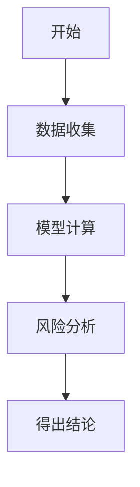

                 


# 彼得林奇如何看待公司的并购历史

> 关键词：彼得·林奇，并购历史，投资策略，财务分析，公司估值

> 摘要：本文深入探讨了投资大师彼得·林奇在公司并购中的独特见解，分析了其并购分析框架、核心概念和算法原理，并通过实际案例展示了其方法的应用。

---

# 第一部分: 并购分析的背景与基础

## 第1章: 并购的基本概念

### 1.1 并购的定义与类型

- **定义**：并购是指一家公司（收购方）购买另一家公司（被收购方）的全部或部分股权或资产，以实现业务扩展或战略重组。
- **类型**：
  - **横向并购**：同一行业内的并购，旨在扩大市场份额。
  - **纵向并购**：上下游产业的并购，优化供应链。
  - **混合并购**：跨界并购，进入新领域。

### 1.2 彼得·林奇的投资者背景

- **早期经历**：彼得·林奇是富达投资的传奇经理人，以其对普通股的投资策略闻名。
- **并购观点**：林奇认为，并购是公司增长的重要途径，但成功的并购需要深入分析和风险控制。

---

## 第2章: 彼得·林奇并购分析的核心理念

### 2.1 财务指标分析

- **关键指标**：
  - **市盈率（P/E）**：评估股价是否合理。
  - **市净率（P/B）**：衡量股价与账面价值的比例。
  - **ROE（净资产收益率）**：反映公司盈利能力。

### 2.2 行业地位分析

- **行业分析**：关注行业趋势、竞争格局和公司的市场地位。
- **竞争优势**：公司是否具备独特的竞争优势，如品牌、技术或成本优势。

### 2.3 管理层能力评估

- **管理层稳定性**：评估管理层的过往表现和战略决策能力。
- **管理风格**：倾向于保守还是激进，是否注重股东利益。

---

## 第3章: 林奇并购分析的步骤

### 3.1 确定并购目标

- **行业分析**：选择增长潜力大的行业。
- **公司筛选**：寻找估值合理、财务健康的企业。

### 3.2 财务状况评估

- **利润分析**：关注收入增长和利润率。
- **债务情况**：评估公司的负债水平和偿债能力。

### 3.3 并购风险分析

- **整合风险**：文化冲突、管理混乱可能导致整合失败。
- **市场风险**：行业波动可能影响并购后的表现。

---

## 第4章: 林奇并购分析的工具与方法

### 4.1 财务比率分析

- **流动比率**：衡量短期偿债能力。
- **速动比率**：进一步评估流动资产的变现能力。
- **负债比率**：分析公司的杠杆风险。

### 4.2 估值模型

- **DCF模型**：通过现金流折现评估公司价值。
- **相对估值法**：与行业平均市盈率、市净率对比。

### 4.3 竞争优势分析

- **护城河**：公司在行业中的独特优势，如专利、品牌或成本优势。
- **可持续性**：竞争优势是否长期存在。

---

## 第5章: 林奇并购分析的算法原理

### 5.1 现金流折现模型

- **公式**：
  $$ NPV = \sum_{t=1}^{n} \frac{CF_t}{(1+r)^t} $$
  其中，\( CF_t \) 是第t年的现金流，\( r \) 是折现率。

- **步骤**：
  1. 预测未来现金流。
  2. 确定合适的折现率。
  3. 计算净现值（NPV）。
  4. 如果NPV为正，说明并购有利可图。

### 5.2 内部收益率（IRR）

- **公式**：
  $$ IRR = r \text{ 使得 } NPV = 0 $$
- **解释**：IRR越高，投资回报越快。

---

## 第6章: 系统分析与架构设计

### 6.1 案例分析框架

- **问题场景**：假设一家科技公司考虑并购一家软件公司。
- **系统功能设计**：
  - 数据收集：收集两家公司的财务数据。
  - 模型计算：使用DCF模型评估目标公司价值。
  - 风险分析：评估整合风险和市场风险。

### 6.2 系统架构设计



---

## 第7章: 项目实战

### 7.1 环境安装

- **工具**：Excel、Python（用于数据分析）。
- **数据来源**：公司财务报表、行业报告。

### 7.2 核心实现源代码

#### 财务分析代码（Python）

```python
import pandas as pd

# 假设df为公司财务数据
def calculate_roe(df):
    df['ROE'] = df['净利润'] / df['净资产']
    return df

# 示例数据
data = {'净利润': [10, 15, 20], '净资产': [50, 60, 70]}
df = pd.DataFrame(data)
df = calculate_roe(df)
print(df)
```

#### 估值模型代码

```python
def discounted_cash_flow(fcf, discount_rate, period):
    return sum(fcf / (1 + discount_rate) ** t for t in range(period))

# 示例数据
fcf = [100, 120, 150]
discount_rate = 0.1
period = 3
value = discounted_cash_flow(fcf, discount_rate, period)
print(f"估值：{value}")
```

### 7.3 案例分析

#### 7.3.1 案例介绍

假设公司A考虑并购公司B，公司A的ROE为15%，公司B的ROE为20%，但公司B的负债率较高。

#### 7.3.2 分析步骤

1. **财务指标对比**：
   - 公司A：ROE=15%，负债率=40%。
   - 公司B：ROE=20%，负债率=60%。

2. **DCF模型计算**：
   - 假设FCT为公司B的自由现金流，折现率为10%。
   - 计算出公司B的估值为1.2亿美元。

3. **风险分析**：
   - 公司B的高负债率可能导致财务风险。
   - 行业整合可能带来协同效应。

#### 7.3.3 结论

并购公司B虽然短期内能提升ROE，但高负债率和整合风险可能影响长期收益。因此，公司A应谨慎考虑并购。

---

## 第8章: 总结与最佳实践

### 8.1 小结

彼得·林奇的并购分析方法强调财务健康、行业地位和管理层能力。通过DCF模型和ROE分析，投资者可以更准确地评估并购的价值和风险。

### 8.2 注意事项

- **数据准确性**：财务数据需准确无误。
- **模型假设**：DCF模型依赖于未来现金流的预测，假设需合理。
- **风险控制**：并购后整合和市场风险需提前评估。

### 8.3 拓展阅读

- 《彼得·林奇的投资哲学》
- 《并购的估值与分析》

---

# 作者：AI天才研究院 & 禅与计算机程序设计艺术

---

**致谢**：感谢读者的关注，欢迎留言交流。

