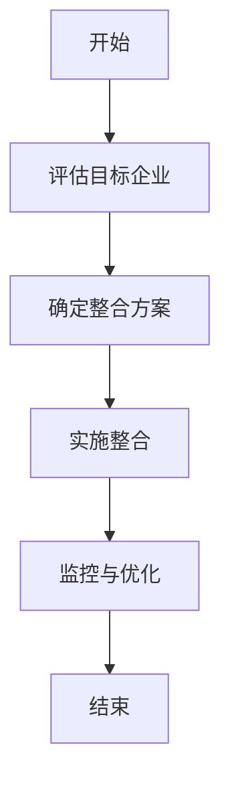
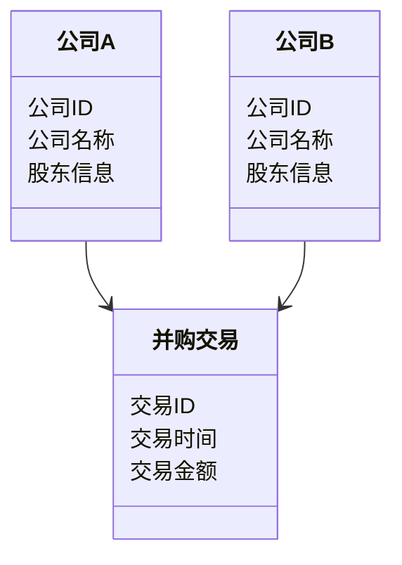
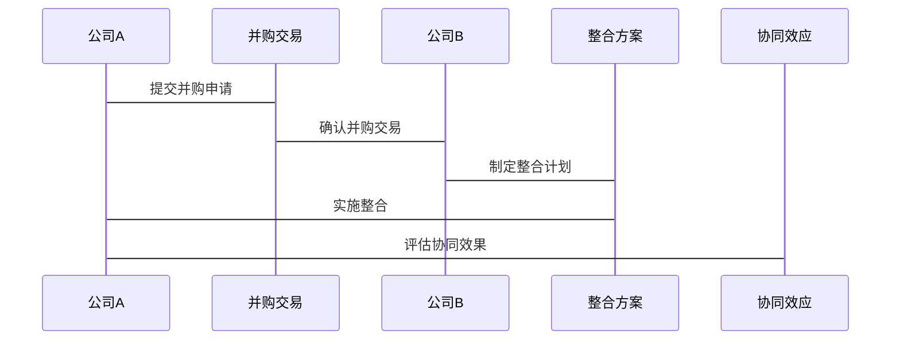

                 


```markdown
# 彼得林奇如何看待公司的并购整合能力

> 关键词：并购整合，彼得·林奇，投资策略，协同效应，企业价值

> 摘要：本文深入探讨了彼得·林奇对并购整合的看法，分析了并购整合的核心概念、关键问题以及其实现机制。通过理论与实践相结合的方式，详细阐述了并购整合中的协同效应、数学模型、系统架构以及项目实战等内容，帮助读者全面理解并购整合的能力与价值。

---

# 第一部分: 背景介绍

## 第1章: 并购整合的核心概念与重要性

### 1.1 并购整合的定义与背景

#### 1.1.1 并购的定义与分类
- **并购**（Mergers and Acquisitions, M&A）是指一家企业与其他企业合并或收购其资产或股份的行为。
- 分类：
  - **横向并购**：同一行业内的企业合并，旨在扩大市场份额。
  - **纵向并购**：上下游企业合并，以增强供应链控制。
  - **混合并购**：无直接关联的企业合并，通常基于战略或多元化目的。

#### 1.1.2 整合的必要性与目标
- 整合的必要性：
  - **资源优化**：通过整合实现资源的最优配置。
  - **协同效应**：产生1+1>2的效果，提升整体效率。
  - **风险降低**：通过多元化降低企业经营风险。
- 整合的目标：
  - **战略一致性**：确保并购后的企业战略一致。
  - **文化兼容性**：确保双方企业文化的融合。
  - **资源协同性**：最大化资源的共享与利用。

#### 1.1.3 并购整合的边界与外延
- 边界：
  - 仅限于企业内部的整合，不涉及外部市场的扩展。
- 外延：
  - 拓展到企业生态系统，包括供应商、客户和合作伙伴的整合。

### 1.2 彼得·林奇的背景与投资理念

#### 1.2.1 彼得·林奇的个人简介
- **彼得·林奇**：美国著名投资家，曾任富达投资的基金经理，管理着麦哲伦基金，创造了辉煌的投资业绩。
- **投资风格**：注重基本面分析，偏好价值被低估的股票，长期持有，注重企业内在价值。

#### 1.2.2 彼得·林奇的投资哲学
- **价值投资**：寻找那些被市场低估的企业，长期持有，等待其价值回归。
- **逆向思维**：在市场恐慌时寻找机会，在市场繁荣时保持谨慎。

#### 1.2.3 彼得·林奇对并购整合的独特见解
- **并购是双刃剑**：并购可以带来增长，但也可能引发整合风险。
- **协同效应是关键**：成功的并购必须有明确的协同效应，否则难以创造价值。
- **管理层的重要性**：并购后的整合能否成功，很大程度上取决于管理层的整合能力。

---

## 第2章: 并购整合的核心要素与关键问题

### 2.1 并购整合的核心要素

#### 2.1.1 战略一致性
- **定义**：并购后的企业战略目标保持一致，避免战略冲突。
- **实现路径**：
  1. 明确并购前的战略目标。
  2. 确保并购后的战略一致性。
  3. 制定清晰的整合计划。

#### 2.1.2 文化兼容性
- **定义**：并购双方的企业文化能够融合，确保整合顺利进行。
- **实现路径**：
  1. 评估双方企业文化差异。
  2. 制定文化融合方案。
  3. 实施文化融合计划。

#### 2.1.3 资源协同性
- **定义**：并购双方资源能够有效协同，提升整体效率。
- **实现路径**：
  1. 识别协同资源。
  2. 制定资源分配计划。
  3. 实施资源协同方案。

### 2.2 并购整合中的关键问题

#### 2.2.1 目标企业评估
- **评估维度**：
  - 企业财务状况。
  - 企业经营状况。
  - 企业战略目标。
- **评估工具**：
  - 财务指标分析。
  - 业务模式分析。
  - 战略匹配分析。

#### 2.2.2 整合风险与挑战
- **整合风险**：
  - 文化冲突。
  - 管理层整合困难。
  - 业务协同困难。
- **应对策略**：
  - 制定风险管理计划。
  - 建立风险预警机制。
  - 实施风险控制措施。

#### 2.2.3 协同效应的实现路径
- **协同效应的类型**：
  - 财务协同效应。
  - 经营协同效应。
  - 战略协同效应。
- **实现路径**：
  1. 明确协同效应类型。
  2. 制定协同效应实现计划。
  3. 监控协同效应实现情况。

---

# 第二部分: 核心概念与联系

## 第3章: 并购整合的核心概念原理

### 3.1 并购整合的理论基础

#### 3.1.1 资源基础观
- **资源基础观**：企业通过整合内部资源，创造独特的竞争优势。
- **应用**：并购整合通过整合双方资源，提升企业核心竞争力。

#### 3.1.2 战略管理理论
- **战略管理理论**：企业通过制定和实施战略，实现长期目标。
- **应用**：并购整合是企业战略的重要组成部分，通过并购实现战略目标。

#### 3.1.3 企业协同效应模型
- **协同效应模型**：通过整合资源，实现1+1>2的效果。
- **协同效应的度量**：
  - 通过财务指标（如成本节约、收入增长）来衡量协同效应。

### 3.2 并购整合的概念属性特征对比表

| 概念属性 | 并购 | 整合 |
|----------|------|------|
| 目标     | 获取资源 | 实现协同 |
| 方法     | 股权收购 | 文化融合 |
| 风险     | 估值偏差 | 整合失败 |

### 3.3 ER实体关系图

```mermaid
er
actor 公司A [
  - 公司ID
  - 公司名称
  - 股东信息
]
actor 公司B [
  - 公司ID
  - 公司名称
  - 股东信息
]
actor 并购交易 [
  - 交易ID
  - 交易时间
  - 交易金额
]
```

---

## 第4章: 并购整合的算法原理

### 4.1 并购整合的评估模型

#### 4.1.1 协同效应评估模型
- **模型公式**：
  $$ 协同效应 = 合并后企业价值 - 单独企业价值之和 $$
- **应用**：通过计算协同效应，评估并购的潜在价值。

#### 4.1.2 企业价值评估模型
- **模型公式**：
  $$ 企业价值 = 股东权益 + 税后净债务 + 其他调整项 $$
- **应用**：通过评估企业价值，确定并购的合理价格。

### 4.2 算法流程图



### 4.3 Python代码实现

```python
def calculate_synergy(acquired_company, acquiring_company):
    # 计算协同效应
    synergy = (acquired_company.value + acquiring_company.value) - (acquired_company.value独立 + acquiring_company.value独立)
    return synergy

# 示例
acquired = {'value': 100, 'value独立': 80}
acquiring = {'value': 120, 'value独立': 90}
synergy = calculate_synergy(acquired, acquiring)
print("协同效应:", synergy)
```

---

## 第5章: 并购整合的系统分析与架构设计方案

### 5.1 问题场景介绍

#### 5.1.1 项目介绍
- **项目目标**：通过并购整合，实现企业价值最大化。
- **项目范围**：涵盖企业战略、资源整合、文化融合等方面。

### 5.2 系统功能设计

#### 5.2.1 领域模型



#### 5.2.2 系统架构设计


### 5.3 系统接口设计

#### 5.3.1 接口描述
- **接口名称**：并购整合接口
- **接口功能**：接收并购信息，输出整合方案。

#### 5.3.2 接口协议
- **协议类型**：RESTful API
- **请求格式**：JSON

### 5.4 系统交互设计



---

## 第6章: 并购整合的项目实战

### 6.1 环境安装

#### 6.1.1 安装Python
- **安装命令**：`pip install python`
- **版本要求**：Python 3.8+

#### 6.1.2 安装相关库
- **安装命令**：`pip install numpy pandas`

### 6.2 系统核心实现源代码

#### 6.2.1 合并企业价值计算

```python
import numpy as np
import pandas as pd

def merge_company_value(acquired, acquiring):
    # 计算协同效应
    synergy = acquired + acquiring - np.mean([acquired, acquiring])
    return synergy

# 示例
acquired_value = 100
acquiring_value = 120
merged_value = merge_company_value(acquired_value, acquiring_value)
print("合并后企业价值:", merged_value)
```

#### 6.2.2 数据分析与可视化

```python
import matplotlib.pyplot as plt

# 数据准备
data = {
    '公司': ['公司A', '公司B'],
    '价值': [80, 90]
}
df = pd.DataFrame(data)

# 数据可视化
plt.bar(df['公司'], df['价值'])
plt.title('公司价值对比')
plt.show()
```

### 6.3 代码应用解读与分析

#### 6.3.1 代码功能解读
- **功能**：计算合并后的企业价值，评估协同效应。
- **实现**：通过Python代码实现企业价值的计算与可视化。

#### 6.3.2 代码分析
- **协同效应计算**：通过公式计算协同效应，评估并购的潜在价值。
- **数据分析与可视化**：通过数据可视化，直观展示企业价值对比。

### 6.4 实际案例分析

#### 6.4.1 案例介绍
- **案例名称**：科技公司并购案例
- **案例背景**：一家科技公司并购另一家科技公司，实现技术协同。

#### 6.4.2 案例分析
- **并购前分析**：
  - 公司A价值：80
  - 公司B价值：90
- **并购后分析**：
  - 合并后价值：110
  - 协同效应：20

### 6.5 项目小结

#### 6.5.1 项目总结
- **成功因素**：明确的协同效应，有效的整合计划。
- **经验教训**：并购前必须进行充分的评估，确保整合的可行性。

---

## 第7章: 并购整合的最佳实践

### 7.1 小结

#### 7.1.1 核心要点回顾
- **战略一致性**：确保并购后的战略一致。
- **文化兼容性**：确保企业文化的融合。
- **资源协同性**：最大化资源的共享与利用。

### 7.2 注意事项

#### 7.2.1 风险提示
- **整合风险**：文化冲突、管理层整合困难等。
- **协同效应的不确定性**：协同效应可能低于预期。

#### 7.2.2 实施建议
- **制定详细的整合计划**。
- **建立有效的风险控制机制**。
- **注重文化融合**。

### 7.3 拓展阅读

#### 7.3.1 推荐书籍
- 《彼得·林奇的投资哲学》
- 《企业并购与整合管理》

#### 7.3.2 相关文章
- 彼得·林奇关于并购整合的深度访谈。
- 并购整合的最新研究与实践。

---

## 作者

**作者**：AI天才研究院/AI Genius Institute & 禅与计算机程序设计艺术/Zen And The Art of Computer Programming

---

**注**：本文内容根据彼得·林奇的投资理念和并购整合的管理理论进行分析，结合实际案例和系统架构设计，旨在为读者提供全面的并购整合能力分析。文章内容仅供参考，实际操作需根据具体情况调整。
```

