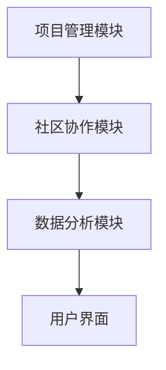

                 

# 彼得林奇如何看待公司的开源策略对竞争力的影响

---

## 关键词：开源策略、公司竞争力、彼得·林奇、投资理念、技术生态

---

## 摘要

开源策略作为现代企业技术发展的重要组成部分，不仅影响着企业的技术路线选择，还深刻地影响着公司的整体竞争力。本文从彼得·林奇的投资者视角出发，结合开源策略的核心概念、算法原理、系统架构及实际案例，分析开源策略对公司的竞争力提升的影响。文章不仅提出了开源策略的核心要素，还通过数学模型和系统架构图，详细阐述了开源策略的评估方法和实施路径。最后，文章总结了开源策略的最佳实践，并提出了进一步优化的方向。

---

## 第一部分：开源策略与公司竞争力的背景介绍

### 第1章：开源策略的基本概念

#### 1.1 开源策略的定义与特点

开源策略是指企业采用开源技术或以开源形式发布自身技术成果的战略。其核心特点包括：

- **开放性**：代码和技术方案对公众开放，允许自由修改和分发。
- **协作性**：依赖开源社区的协作，推动技术的快速迭代。
- **免费性**：开源技术通常免费使用，降低了企业的初始成本。

#### 1.2 开源策略对公司竞争力的影响

- **提升技术创新能力**：通过开源社区的协作，企业可以快速获取最新的技术和解决方案。
- **降低研发投入**：开源技术的可获得性降低了企业的研发成本。
- **增强品牌影响力**：积极参与开源项目可以提升企业的技术影响力和品牌价值。

---

## 第二部分：开源策略的核心概念与联系

### 第2章：开源策略的核心要素

#### 2.1 开源项目的管理与协调

- **项目管理模块**：负责项目的版本控制、任务分配和进度跟踪。
- **协作机制**：通过代码审查、问题跟踪和文档管理实现高效的团队协作。

#### 2.2 开源社区的构建与维护

- **社区参与模式**：通过贡献代码、文档和测试用例等方式，吸引开发者参与。
- **激励机制**：通过发布开源项目、提供资金支持和设立贡献者奖励计划，激励社区成员积极参与。

---

## 第三部分：开源策略的算法原理与数学模型

### 第3章：开源策略的评估模型

#### 3.1 开源项目的价值评估

- **项目活跃度**：通过GitHub仓库的Stars、Forks、Issues和Pull Requests的数量来衡量。
- **项目贡献度**：通过代码贡献者的数量和贡献频率来评估。

#### 3.2 开源策略的数学模型构建

- **项目价值的数学表达式**
  $$ V = \sum_{i=1}^{n} w_i \cdot f_i $$
  其中，\( w_i \) 表示第 \( i \) 个因素的权重，\( f_i \) 表示第 \( i \) 个因素的值。

- **贡献度的加权计算公式**
  $$ C = \sum_{j=1}^{m} w_j \cdot c_j $$

---

## 第四部分：开源策略的系统分析与架构设计

### 第4章：开源策略的系统架构

#### 4.1 系统功能设计

- **项目管理模块**：包括项目创建、任务分配和进度跟踪功能。
- **社区协作模块**：支持代码提交、问题跟踪和文档管理。
- **数据分析模块**：用于分析项目的活跃度、贡献度和影响力。

#### 4.2 系统架构图

---

## 第五部分：开源策略的项目实战

### 第5章：开源策略的项目实战

#### 5.1 GitHub上的开源项目分析

- **项目选择**：选择具有高Stars和Forks的开源项目，例如Linux内核和Apache服务器。
- **代码审查**：通过GitHub的代码审查功能，评估项目的代码质量和维护情况。

#### 5.2 开源贡献的量化分析

- **贡献者的活跃度分析**：通过GitHub API获取贡献者的提交记录和参与度。
- **项目的影响力分析**：通过GitHub的依赖图和依赖项目数量，评估项目的影响力。

---

## 第六部分：开源策略的最佳实践与总结

### 第6章：开源策略的最佳实践

#### 6.1 小结

- 开源策略是企业提升技术竞争力的重要手段，通过开源社区的协作和技术创新，企业可以实现快速的技术迭代和成本优化。

#### 6.2 注意事项

- 企业在采用开源策略时，需注意开源项目的维护成本、潜在的技术风险和社区的稳定性。
- 在选择开源项目时，应结合自身的技术需求和长期发展战略，避免盲目跟风。

#### 6.3 拓展阅读

- 推荐阅读《开源项目管理》和《软件工程中的开源实践》等书籍，深入理解开源策略的实施方法和优化路径。

---

## 作者

作者：AI天才研究院/AI Genius Institute & 禅与计算机程序设计艺术 /Zen And The Art of Computer Programming

---

**全文完**

