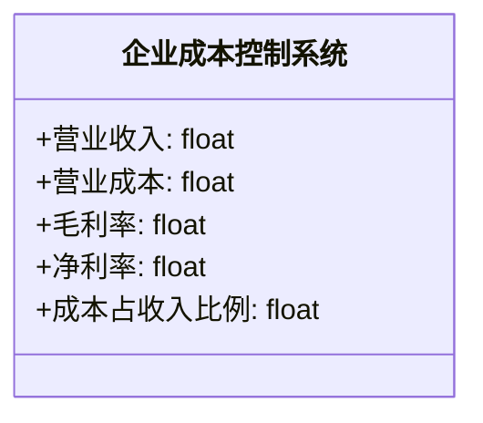
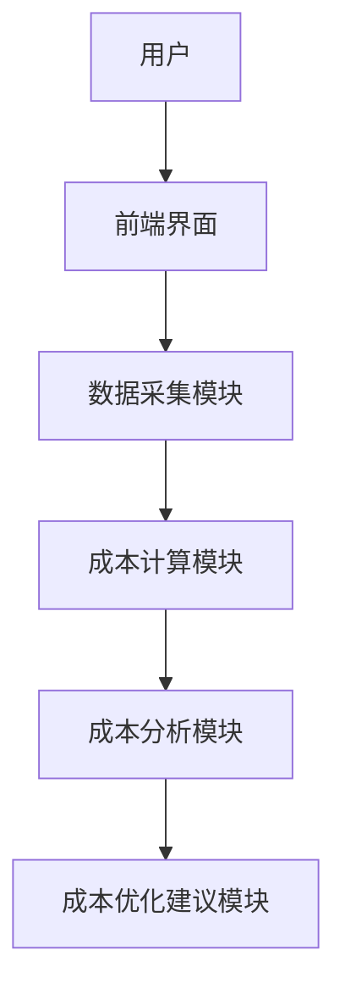

                 


# 彼得林奇如何看待公司的成本控制

> 关键词：成本控制、彼得林奇、企业价值、投资分析、财务指标

> 摘要：本文深入探讨了彼得林奇在评估公司成本控制能力时的方法和见解。通过分析成本控制的核心概念、算法原理、系统架构和实际案例，本文揭示了成本控制对投资决策的重要性，以及如何通过财务指标和模型来评估公司的成本管理能力。

---

## 第一部分: 背景介绍

### 第1章: 公司成本控制的背景与概念

#### 1.1 成本控制的基本概念

##### 1.1.1 成本的定义与分类

成本是指企业在生产和运营过程中所发生的资源消耗，包括原材料、人工、设备折旧等。成本可以分为以下几类：

- **变动成本**：随着产量变化而变化的成本，如原材料和直接人工。
- **固定成本**：不随产量变化而变化的成本，如租金和管理费用。
- **直接成本**：可以直接追溯到产品或服务的成本。
- **间接成本**：无法直接追溯到产品或服务的成本，如工厂 overhead。

##### 1.1.2 成本控制的定义与目标

成本控制是指企业通过计划、监督和调节各种成本因素，以实现降低成本、提高效率和增强竞争力的过程。其目标包括：

- 降低单位产品成本。
- 提高边际利润率。
- 优化资源配置，减少浪费。
- 增强企业的财务健康和抗风险能力。

##### 1.1.3 成本控制与企业竞争力的关系

成本控制是企业竞争力的重要组成部分。有效的成本控制可以使企业在价格竞争中更具优势，同时增加利润空间。彼得林奇认为，成本控制能力是评估企业长期盈利能力的关键指标之一。

---

#### 1.2 彼得林奇的投资理念

##### 1.2.1 彼得林奇的投资者身份与方法

彼得林奇是著名的投资专家，以其在富达投资管理公司的长期成功而闻名。他注重基本面分析，尤其是企业的财务健康状况和管理能力。他认为，投资成功的关键在于选择那些能够持续创造价值的企业。

##### 1.2.2 彼得林奇对成本控制的关注点

彼得林奇在评估企业时，特别关注成本控制能力。他认为，成本控制能力是企业能否在竞争中生存和发展的关键因素。具体包括：

- 企业的成本结构是否合理。
- 成本控制措施的有效性。
- 管理层对成本控制的重视程度。

##### 1.2.3 成本控制在企业价值评估中的重要性

彼得林奇认为，成本控制能力直接影响企业的盈利能力和估值。一家能够有效控制成本的企业，通常具有更高的投资价值。在投资决策中，他倾向于选择那些在成本控制方面表现优异的企业。

---

### 第2章: 成本控制的核心要素与影响因素

#### 2.1 成本控制的核心要素

##### 2.1.1 成本构成的三要素

- **产品成本**：生产产品所需的直接材料和人工成本。
- **运营成本**：企业日常运营中发生的各种费用，如租金、工资、广告费等。
- **管理成本**：企业管理层进行决策和监督所发生的成本。

##### 2.1.2 成本控制的关键环节

- **采购环节**：通过优化采购策略降低成本。
- **生产环节**：通过技术改进和流程优化降低成本。
- **销售环节**：通过定价策略和成本加成定价法提高利润率。

##### 2.1.3 成本控制的主体与客体

- **主体**：企业内部的各个部门，尤其是采购、生产、销售和管理层。
- **客体**：企业内外部的各种资源和成本项目。

#### 2.2 影响成本控制的主要因素

##### 2.2.1 内部因素：管理效率与流程优化

- 管理效率：高效的管理可以减少浪费和重复劳动。
- 流程优化：通过自动化和技术创新降低生产成本。

##### 2.2.2 外部因素：市场环境与行业竞争

- 市场需求：需求变化会影响企业的生产规模和成本结构。
- 行业竞争：竞争激烈的行业通常要求企业不断降低成本以保持竞争力。

##### 2.2.3 技术因素：技术创新对成本的影响

- 技术创新可以显著降低生产成本，例如自动化生产线和智能库存管理。

---

### 第3章: 成本控制与企业价值的关联

#### 3.1 成本控制对企业利润的影响

##### 3.1.1 成本降低与利润提升的关系

成本降低可以直接增加企业的利润。例如，如果一个企业将生产成本降低10%，在其他条件不变的情况下，净利润将增加10%。

##### 3.1.2 成本结构对企业盈利能力的分析

通过分析企业的成本结构，可以判断其盈利能力的可持续性。例如，高固定成本的企业在销售量增加时，边际成本较低，利润增长更快。

##### 3.1.3 成本控制在企业生命周期中的作用

在企业生命周期的不同阶段，成本控制的重要性有所不同。例如，在初创阶段，成本控制是生存的关键；在成熟阶段，成本控制是利润增长的核心。

#### 3.2 彼得林奇的成本控制分析框架

##### 3.2.1 从财务报表中识别成本控制能力

彼得林奇通过分析企业的财务报表，重点关注以下几个指标：

- 毛利率：（营业收入 - 营业成本）/ 营业收入。
- 净利率：净利润 / 营业收入。
- 成本占收入的比例：营业成本 / 营业收入。

##### 3.2.2 成本控制与企业估值的关系

有效的成本控制可以提高企业的估值。例如，一家企业通过技术创新降低生产成本，可以提高其净利润率，从而增加企业价值。

##### 3.2.3 成本控制在投资决策中的权重

在投资决策中，彼得林奇将成本控制能力作为重要考量因素。他倾向于投资那些能够持续优化成本结构的企业。

---

## 第二部分: 核心概念与联系

### 第4章: 成本控制的核心概念与原理

#### 4.1 成本控制的核心概念

##### 4.1.1 变动成本与固定成本的区分

变动成本与固定成本的区别可以通过以下公式表示：

$$ \text{总成本} = \text{固定成本} + (\text{变动成本/单位产品} \times \text{产量}) $$

例如，假设固定成本为 $1000，变动成本为 $50/单位，产量为 100 单位，则总成本为 $1000 + $50 \times 100 = $6000。

##### 4.1.2 直接成本与间接成本的界限

直接成本可以直接追溯到产品或服务，而间接成本则需要通过一定的分配方法分摊到各个产品或服务上。

##### 4.1.3 短期成本与长期成本的对比

短期成本是指在短期内无法改变的成本，而长期成本则可以随着时间和产量的变化而调整。

#### 4.2 成本控制的原理与机制

##### 4.2.1 成本-产量-利润的相互关系

通过边际成本和边际收益的分析，可以确定最优产量水平。边际成本等于边际收益时，企业实现利润最大化。

##### 4.2.2 边际成本与边际收益的平衡点

$$ \text{边际成本} = \text{边际收益} $$

例如，假设边际成本为 $20，边际收益为 $25，则企业应继续增加产量，因为边际收益大于边际成本。

##### 4.2.3 成本控制的杠杆效应

成本控制的杠杆效应可以通过以下公式表示：

$$ \text{杠杆效应} = \frac{\Delta \text{利润}}{\Delta \text{成本}} $$

例如，如果成本降低 $10，利润增加 $15，则杠杆效应为 1.5。

### 第5章: 成本控制与企业竞争力的对比分析

#### 5.1 成本控制对企业竞争力的影响

##### 5.1.1 成本优势对企业市场份额的提升作用

通过成本优势，企业可以在价格上更具竞争力，从而扩大市场份额。

##### 5.1.2 成本竞争力与企业定价策略的关系

成本竞争力影响企业的定价策略。例如，低成本企业可以采用较低的价格策略，从而吸引更多的消费者。

##### 5.1.3 成本控制与企业创新动力的相互

成本控制与企业创新动力密切相关。通过创新降低成本，企业可以增强竞争力，同时创新本身也依赖于成本控制能力。

---

## 第三部分: 算法原理

### 第6章: 成本控制的算法原理与实现

#### 6.1 成本控制的算法原理

##### 6.1.1 财务指标分析

通过分析毛利率和净利率等财务指标，可以评估企业的成本控制能力。例如：

$$ \text{毛利率} = \frac{\text{营业收入} - \text{营业成本}}{\text{营业收入}} $$

$$ \text{净利率} = \frac{\text{净利润}}{\text{营业收入}} $$

##### 6.1.2 成本控制能力评估

通过比较企业的成本占收入比例，可以评估其成本控制能力。例如：

$$ \text{成本占收入比例} = \frac{\text{营业成本}}{\text{营业收入}} $$

---

## 第四部分: 系统分析与架构设计

### 第7章: 成本控制的系统分析与架构设计

#### 7.1 问题场景介绍

通过构建一个财务分析系统，可以实时监控企业的成本控制能力。系统功能包括数据采集、成本计算、成本分析和成本优化建议。

#### 7.2 系统功能设计

##### 7.2.1 领域模型



##### 7.2.2 系统架构



---

## 第五部分: 项目实战

### 第8章: 成本控制的项目实战与案例分析

#### 8.1 环境安装

需要安装Python和相关的数据分析库，如Pandas和Matplotlib。

#### 8.2 系统核心实现源代码

```python
import pandas as pd
import matplotlib.pyplot as plt

# 数据采集
df = pd.read_csv('financial_data.csv')

# 成本计算
毛利率 = (df['营业收入'] - df['营业成本']) / df['营业收入']
净利率 = df['净利润'] / df['营业收入']
成本占收入比例 = df['营业成本'] / df['营业收入']

# 成本分析
plt.plot(df['年份'], 毛利率, label='毛利率')
plt.plot(df['年份'], 成本占收入比例, label='成本占收入比例')
plt.xlabel('年份')
plt.ylabel('比率')
plt.legend()
plt.show()
```

#### 8.3 代码应用解读与分析

通过上述代码，可以分析企业的毛利率和成本占收入比例的变化趋势，从而评估其成本控制能力。

#### 8.4 实际案例分析和详细讲解剖析

以某制造企业为例，分析其成本控制能力。假设该企业过去五年的财务数据如下：

| 年份 | 营业收入 | 营业成本 | 净利润 |
|------|----------|----------|--------|
| 2018 | 1000     | 600      | 100    |
| 2019 | 1100     | 660      | 110    |
| 2020 | 1200     | 720      | 120    |
| 2021 | 1300     | 780      | 130    |
| 2022 | 1400     | 840      | 140    |

通过计算毛利率和成本占收入比例，可以发现该企业的毛利率逐年提高，成本占收入比例保持稳定，说明其成本控制能力较强。

---

## 第六部分: 最佳实践

### 第9章: 成本控制的最佳实践与总结

#### 9.1 投资策略与成本控制

彼得林奇的实践表明，成本控制是投资决策中的关键因素。投资者应重点关注企业的毛利率和成本占收入比例等财务指标。

#### 9.2 成本控制的注意事项

- 成本控制不是一味追求最低成本，而是在合理范围内优化成本结构。
- 成本控制需要与企业战略相结合，避免短期行为。

#### 9.3 拓展阅读

建议阅读彼得林奇的《投资之道》和迈克尔·波特的《竞争优势》，以深入理解成本控制在企业战略中的作用。

---

## 作者：AI天才研究院/AI Genius Institute & 禅与计算机程序设计艺术 /Zen And The Art of Computer Programming

---

以上是《彼得林奇如何看待公司的成本控制》的技术博客文章的完整内容。希望对您有所帮助！

