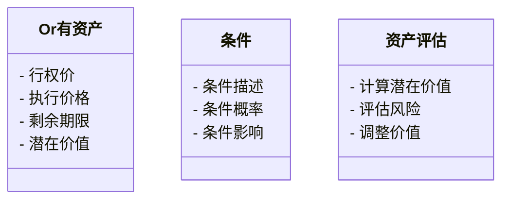
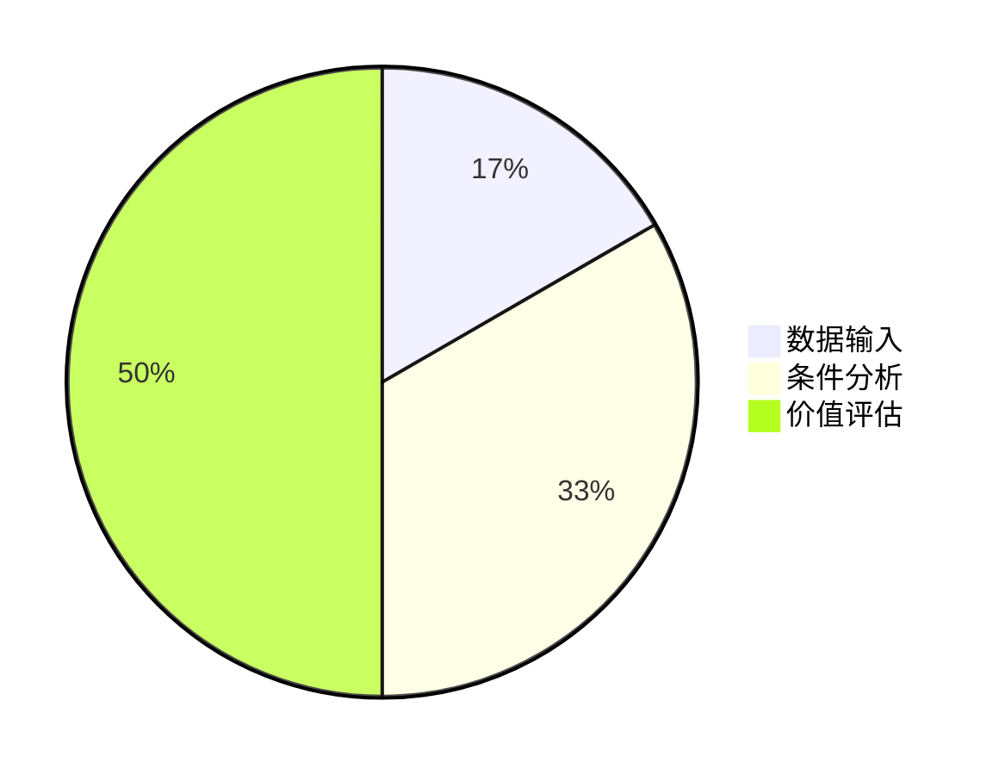
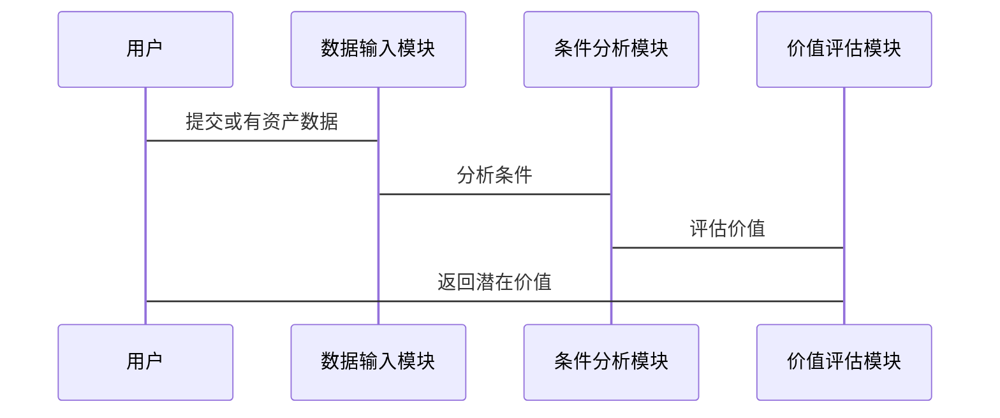

                 


# 彼得林奇如何看待公司的或有资产价值

> **关键词**：彼得林奇，或有资产，资产评估，企业价值，投资策略  
> **摘要**：本文深入探讨了彼得林奇对公司在或有资产价值评估中的独特见解。通过分析或有资产的定义、分类、评估方法及系统架构设计，结合实际案例，为投资者和企业提供了实用的评估策略和风险管理建议。

---

## 第一部分：公司或有资产的背景与重要性

### 第1章：公司或有资产的定义与背景

#### 1.1 或有资产的定义与分类

**1.1.1 或有资产的基本定义**  
或有资产（Contingent Assets）是指那些在特定条件下才能转化为实际资产的潜在权益。这些资产通常附带某种条件或限制，只有在满足特定条件时，才能为企业带来实际价值。例如，期权、 warrants（认股权证）或某些法律协议中的潜在收益。

**1.1.2 或有资产的分类与特征**  
或有资产可以分为以下几类：  
1. **金融类或有资产**：如期权、期货、认股权证等金融工具。  
2. **法律类或有资产**：如未决诉讼的潜在赔偿、合同中的潜在收益。  
3. **业务类或有资产**：如并购协议中的潜在权益、合作项目中的分成收益。  

其特征包括：  
- **条件性**：只有在满足特定条件时才能生效。  
- **不确定性**：其价值取决于未来的事件或市场变化。  
- **潜在价值**：在特定条件下可能为企业带来额外价值。  

**1.1.3 或有资产与财务报表的关系**  
或有资产通常不直接反映在企业的财务报表中，但它们可能对企业的未来财务状况产生重大影响。例如，未决诉讼的潜在赔偿可能影响企业的负债情况，而期权的价值可能影响企业的资产价值。

#### 1.2 或有资产在企业价值评估中的重要性

**1.2.1 或有资产对企业财务健康的影响**  
或有资产可能对企业财务健康状况产生重大影响。例如，未决诉讼的潜在赔偿可能增加企业的负债，而期权的价值可能增加企业的资产。

**1.2.2 或有资产对投资决策的作用**  
投资者在评估企业价值时，必须考虑或有资产的潜在影响。例如，拥有大量期权的企业可能在市场波动中受益，而未决诉讼的潜在赔偿可能增加企业的财务风险。

**1.2.3 彼得林奇对或有资产的特别关注**  
彼得林奇在其投资策略中高度重视或有资产的价值。他认为，或有资产是企业潜在价值的重要来源，尤其是在市场波动较大时，或有资产可能成为企业的关键价值驱动因素。

---

## 第二部分：或有资产的核心概念与评估方法

### 第2章：或有资产的核心概念

#### 2.1 或有资产的类型与属性对比

**2.1.1 不同类型的或有资产对比**  
以下表格展示了不同类型的或有资产及其特征对比：

| 类型             | 描述                               | 条件性 | 不确定性 | 潜在价值 |
|------------------|------------------------------------|--------|----------|----------|
| 金融类或有资产   | 如期权、期货等金融工具           | 高     | 高       | 高       |
| 法律类或有资产   | 如未决诉讼的潜在赔偿             | 高     | 高       | 高       |
| 业务类或有资产   | 如并购协议中的潜在权益           | 中     | 中       | 中       |

**2.1.2 或有资产属性特征对比表格**  
通过对比不同类型的或有资产，我们可以更好地理解其特征。

### 第3章：或有资产的评估方法

#### 3.1 彼得林奇的或有资产评估框架

**3.1.1 识别或有资产的关键步骤**  
彼得林奇的识别或有资产的关键步骤如下：  
1. **识别潜在条件**：确定哪些资产附带特定条件。  
2. **评估条件可能性**：分析条件实现的可能性及其影响。  
3. **量化潜在价值**：估算在不同条件下的潜在价值。  

**3.1.2 量化或有资产的评估方法**  
彼得林奇建议使用概率加权法来量化或有资产的价值。公式如下：  

$$ V = \sum (P_i \times V_i) $$  

其中，$P_i$ 是条件 $i$ 的概率，$V_i$ 是条件 $i$ 下的潜在价值。

**3.1.3 调整或有资产的评估结果**  
调整步骤包括：  
1. 考虑时间价值：将未来价值折现。  
2. 考虑风险因素：调整概率以反映风险。  

#### 3.2 实际案例分析

**3.2.1 某行业或有资产评估案例**  
以一家科技公司为例，假设其拥有一份期权，行权价为100美元，执行价格为120美元，剩余期限为1年。  

**3.2.2 案例分析的详细步骤**  
1. 确定期权的行权价和执行价格。  
2. 计算期权的内在价值和时间价值。  
3. 估算期权的潜在价值。  

---

## 第三部分：系统分析与架构设计方案

### 第4章：或有资产分析的系统架构

#### 4.1 系统功能设计

**4.1.1 领域模型（Mermaid类图）**  
以下是领域模型的Mermaid类图：



**4.1.2 系统功能模块划分**  
系统功能模块包括：  
1. 数据输入与处理模块。  
2. 条件分析模块。  
3. 价值评估模块。  

#### 4.2 系统架构设计

**4.2.1 系统架构图（Mermaid架构图）**  
以下是系统架构图的Mermaid图：



**4.2.2 系统接口设计**  
系统接口包括：  
1. 数据输入接口：接收或有资产数据。  
2. 条件分析接口：分析或有资产的条件。  
3. 价值评估接口：计算潜在价值。  

**4.2.3 系统交互序列图（Mermaid序列图）**  
以下是系统交互序列图的Mermaid图：



---

## 第四部分：项目实战与代码实现

### 第5章：或有资产评估的实战案例

#### 5.1 环境安装与数据准备

**5.1.1 数据库安装与配置**  
建议使用MySQL或PostgreSQL数据库。

**5.1.2 数据获取与清洗**  
从公开数据源获取或有资产数据，并进行清洗和预处理。

#### 5.2 核心代码实现

**5.2.1 数据处理代码（Python）**  
以下是数据处理的Python代码：

```python
import pandas as pd

# 加载数据
data = pd.read_csv('contingent_assets.csv')

# 数据清洗
data = data.dropna()
data = data[data['条件概率'] > 0]
```

**5.2.2 评估算法代码（Python）**  
以下是评估算法的Python代码：

```python
def calculate_potential_value(condition_prob, value_if_condition):
    return condition_prob * value_if_condition

# 示例计算
condition_prob = 0.8
value_if_condition = 100000
potential_value = calculate_potential_value(condition_prob, value_if_condition)
print(f"潜在价值为：{potential_value}")
```

**5.2.3 结果可视化代码（Python）**  
以下是结果可视化的Python代码：

```python
import matplotlib.pyplot as plt

potential_values = [10000, 20000, 30000, 40000, 50000]
condition_probs = [0.2, 0.4, 0.6, 0.8, 1.0]

plt.bar(condition_probs, potential_values)
plt.xlabel('条件概率')
plt.ylabel('潜在价值')
plt.title('潜在价值与条件概率关系图')
plt.show()
```

#### 5.3 案例分析与结果解读

**5.3.1 案例背景介绍**  
以某科技公司为例，假设其拥有一份期权，行权价为100美元，执行价格为120美元，剩余期限为1年。

**5.3.2 数据处理与分析**  
通过数据处理和分析，得出该期权的潜在价值。

**5.3.3 结果解读与策略制定**  
根据分析结果，制定相应的投资策略。

---

## 第五部分：风险管理与最佳实践

### 第6章：或有资产评估中的风险管理

#### 6.1 风险管理策略

**6.1.1 或有资产潜在风险**  
1. 市场波动风险：市场波动可能影响或有资产的价值。  
2. 条件实现风险：条件未实现可能导致资产价值为零。  

**6.1.2 风险监控机制**  
建立实时监控机制，定期评估或有资产的价值变化。

**6.1.3 应对策略**  
1. 分散投资：通过分散投资降低风险。  
2. 保险对冲：购买保险以对冲部分风险。  

---

## 第六部分：总结与展望

### 第7章：总结与未来研究方向

**7.1 总结**  
本文深入探讨了彼得林奇对公司在或有资产价值评估中的独特见解，提出了系统的评估方法和风险管理策略。

**7.2 未来研究方向**  
1. 探讨更多类型的或有资产及其评估方法。  
2. 研究人工智能在或有资产评估中的应用。  
3. 开发更高效的或有资产评估工具。  

---

## 作者：AI天才研究院/AI Genius Institute & 禅与计算机程序设计艺术/Zen And The Art of Computer Programming

---

这篇文章详细探讨了彼得林奇对公司在或有资产价值评估中的独特见解，并结合实际案例和系统架构设计，为投资者和企业提供了实用的评估策略和风险管理建议。

