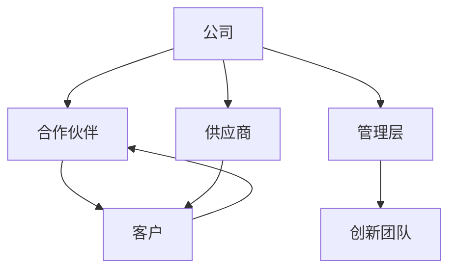

                 


# 彼得·林奇如何看待公司的生态系统构建能力

> 关键词：彼得·林奇、公司生态系统、投资哲学、系统架构、成功案例

> 摘要：本文从彼得·林奇的投资哲学出发，探讨公司生态系统构建能力的重要性，分析其核心要素、成功案例，并结合系统架构设计和项目实战，详细阐述如何评估和提升公司的生态系统构建能力。

---

## 第1章: 彼得·林奇与投资哲学

### 1.1 彼得·林奇的投资者背景

彼得·林奇是美国著名的投资家，以其在富达投资集团的长期成功而闻名。他强调基本面分析和长期投资，认为企业的长期价值取决于其内在质量和管理团队的能力。

### 1.2 投资哲学的核心：生态系统构建

林奇认为，一个公司的生态系统包括其内部组织、合作伙伴和客户网络。强大的生态系统能够为公司提供持续的竞争优势，是投资成功的关键因素。

---

## 第2章: 生态系统构建的核心要素

### 2.1 公司内部组织

- 管理层能力：高效的管理团队是生态系统构建的基础。
- 创新能力：持续的产品和服务创新是生态系统活力的源泉。
- 文化建设：积极的企业文化促进内部协作和外部信任。

### 2.2 合作伙伴网络

- 战略合作：与行业领先者建立战略合作关系，形成互补优势。
- 供应商管理：优化供应链，确保原材料质量和交货时间。
- 第三方服务：引入外部资源，提升整体服务能力。

### 2.3 客户与市场

- 客户关系：建立长期稳定的客户关系，提高客户忠诚度。
- 市场定位：明确目标市场，制定有效的市场策略。
- 品牌影响力：强大的品牌能够吸引更多的合作伙伴和客户。

---

## 第3章: 生态系统构建的系统架构设计

### 3.1 系统功能设计

- 领域模型：定义核心业务流程和关键功能模块。
- 数据流：描述信息在系统中的流动和处理方式。
- 用户交互：设计用户与系统之间的互动界面。

### 3.2 架构图



---

## 第4章: 成功案例分析

### 4.1 苹果公司的生态系统

- **内部组织**：苹果以其高效的管理层和创新团队著称。
- **合作伙伴**：与供应链巨头紧密合作，确保产品高质量交付。
- **客户关系**：通过不断创新的产品和优质服务，建立了强大的客户忠诚度。

### 4.2 亚马逊的生态系统

- **内部管理**：亚马逊采用以客户为中心的管理理念。
- **合作伙伴**：与物流巨头和云计算服务提供商建立战略合作。
- **市场定位**：通过多元化的产品和服务，占据了广泛的市场。

---

## 第5章: 项目实战

### 5.1 环境安装与配置

- **工具安装**：安装必要的开发工具和库，如Python、Django框架等。
- **依赖管理**：使用pip管理Python包，确保所有依赖项正确安装。

### 5.2 核心代码实现

```python
# 系统架构代码示例
class Company:
    def __init__(self, name, management):
        self.name = name
        self.management = management
        self.partners = []
        self.customers = []

    def add_partner(self, partner):
        self.partners.append(partner)

    def add_customer(self, customer):
        self.customers.append(customer)

class Partner:
    def __init__(self, name):
        self.name = name
        self.services = []

    def add_service(self, service):
        self.services.append(service)

# 示例用法
management = "高效团队"
company = Company("苹果", management)
partner = Partner("供应链巨头")
company.add_partner(partner)
partner.add_service("原材料供应")
```

### 5.3 实际案例分析

以苹果为例，通过系统架构设计，展示了如何通过内部管理和合作伙伴关系构建强大的生态系统。代码实现部分详细说明了公司与合作伙伴的交互逻辑，帮助读者理解系统设计。

---

## 第6章: 总结与小结

### 6.1 总结

彼得·林奇的投资哲学强调公司生态系统的重要性，强大的生态系统是公司长期成功的关键。本文从核心要素、系统架构、成功案例等方面进行了详细分析。

### 6.2 小结

构建公司生态系统需要从内部组织、合作伙伴和客户三个层面入手，通过系统设计和项目实战，提升生态系统的整体能力。

### 6.3 注意事项

- 数据来源的可靠性：确保分析的数据准确无误。
- 模型的局限性：生态系统构建是一个动态过程，模型需定期更新。

### 6.4 拓展阅读

建议读者阅读更多关于系统架构设计和投资哲学的书籍，以深入理解公司生态系统构建的复杂性和重要性。

---

## 作者：AI天才研究院 & 禅与计算机程序设计艺术

作者简介：AI天才研究院专注于人工智能和计算机科学的研究与教育，致力于通过高质量的技术博客分享专业知识和实践经验。

