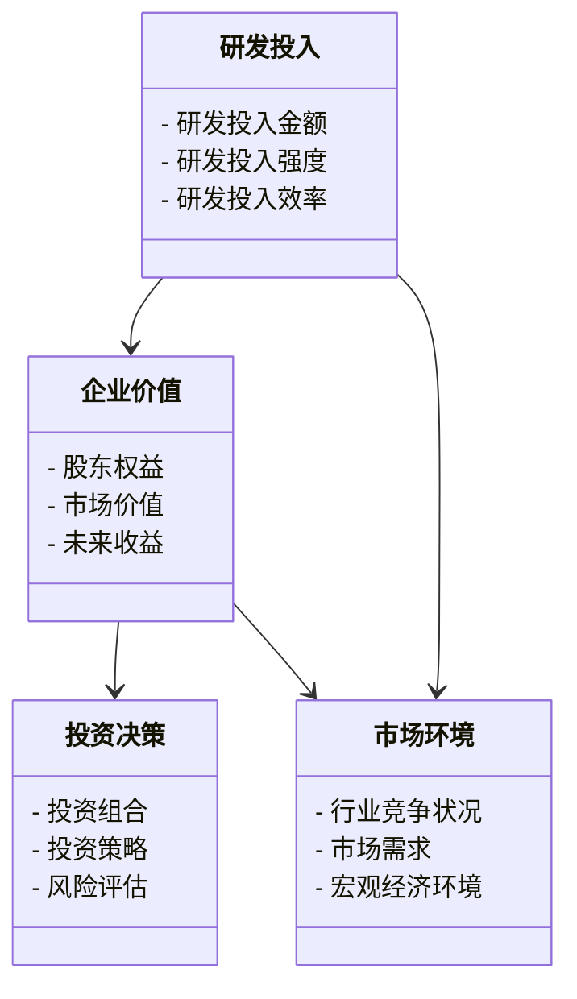
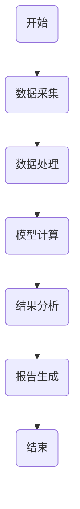

                 


# 彼得林奇如何看待公司的研发投入

## 关键词：彼得林奇，研发投入，投资策略，技术创新，企业价值

## 摘要：本文深入探讨了彼得林奇如何看待公司的研发投入。通过分析研发投入的重要性、评估指标、数学模型以及系统架构，结合实际案例，为投资者和企业管理者提供洞察。

---

# 第一部分：背景介绍

## 第1章：研发投入的重要性与背景

### 1.1 研发投入的核心概念

#### 1.1.1 研发投入的定义与分类

研发投入（Research and Development Expenditure）是企业在研究与开发活动中投入的资金，通常分为内部研发和外部合作研发。内部研发包括 salaries of R&D staff, lab equipment costs, and prototyping expenses。外部研发则涉及技术转让费和合作研究费用。

#### 1.1.2 研发投入与企业价值的关系

研发投入是企业技术创新的核心驱动力，直接影响企业的核心竞争力和长期盈利能力。通过研发投入，企业可以开发新产品、改进技术，从而在市场竞争中占据优势。

#### 1.1.3 彼得林奇对研发投入的重视

彼得林奇在其投资策略中高度重视研发投入，认为高研发投入通常意味着企业具备强大的技术储备和创新能力，这会带来长期的收益增长。

### 1.2 彼得林奇的投资理念

#### 1.2.1 彼得林奇的选股标准

彼得林奇注重选择那些具有持续创新能力的企业，特别关注企业的研发投入强度和研发效率。他倾向于投资那些在行业内具有领先地位且具备持续增长潜力的企业。

#### 1.2.2 彼得林奇对成长型企业的看法

彼得林奇认为，成长型企业是投资的首选目标。这些企业通常具有较高的研发投入，能够不断推出新产品，从而实现收入和利润的持续增长。

#### 1.2.3 彼得林奇的长期投资策略

彼得林奇主张长期投资，避免短期波动的影响。他认为，长期持有那些具有强大研发能力和市场竞争力的企业股票，能够带来稳定的收益增长。

### 1.3 研发投入对企业的影响

#### 1.3.1 研发投入对技术创新的推动作用

高研发投入的企业通常能够更快地推出新产品，占据技术领先地位。这种技术创新能力是企业在竞争激烈的市场中保持优势的关键。

#### 1.3.2 研发投入对市场竞争优势的影响

通过持续的研发投入，企业可以不断改进产品性能、降低生产成本，从而在价格和质量上形成竞争优势。

#### 1.3.3 研发投入对长期收益的潜在贡献

虽然高研发投入可能会在短期内影响企业的利润，但长期来看，技术创新带来的收益增长将远远超过研发投入的成本。

---

## 第2章：研发投入的评估与分析

### 2.1 研发投入的评估指标

#### 2.1.1 研发投入占总收入的比例

研发投入占总收入的比例是衡量企业研发投入强度的重要指标。通常，高科技行业该比例较高，而传统行业则相对较低。

#### 2.1.2 研发投入强度与行业对比

将企业的研发投入强度与行业平均水平进行对比，可以评估企业在行业中的创新投入水平。如果企业的研发投入强度显著高于行业平均水平，则表明该企业具有较强的创新能力。

#### 2.1.3 研发投入的周期性分析

研发投入具有一定的周期性，通常在经济衰退期间，企业的研发投入可能会减少，而在经济复苏期间则会增加。

### 2.2 彼得林奇对研发投入的分析方法

#### 2.2.1 关注企业的研发效率

彼得林奇不仅关注企业的研发投入金额，更关注这些投入的效率。他倾向于投资那些能够将研发投入转化为实际收益的企业。

#### 2.2.2 评估研发成果的可变现性

彼得林奇认为，研发成果必须具备可变现性，才能为企业带来实际的收益增长。他特别关注那些能够将技术成果转化为产品的研发活动。

#### 2.2.3 研发投入与企业未来增长的关联性

彼得林奇认为，高研发投入的企业通常具有较强的未来增长潜力。他倾向于投资那些在行业中具有技术领先地位且具备持续创新能力的企业。

### 2.3 研发投入的风险与机遇

#### 2.3.1 研发投入的高风险性

高研发投入意味着企业需要承担较高的风险，包括技术失败、市场接受度低等。如果研发成果无法转化为实际收益，企业的财务状况可能会受到负面影响。

#### 2.3.2 研发投入带来的潜在高回报

成功的研发投入能够为企业带来丰厚的回报。通过技术创新，企业可以提高产品附加值，扩大市场份额，从而实现收益的快速增长。

#### 2.3.3 如何平衡风险与收益

彼得林奇建议投资者在选择投资标的时，要综合考虑企业的研发投入强度、研发效率以及市场前景。他倾向于投资那些在行业中具有技术领先地位且具备持续创新能力的企业。

---

## 第3章：研发投入的数学模型与算法

### 3.1 研发投入的价值评估模型

#### 3.1.1 贴现现金流模型（DCF）

贴现现金流模型是一种常用的估值方法，通过将未来现金流折现到现值，来评估企业的内在价值。公式如下：

$$
\text{企业价值} = \sum_{t=1}^{n} \frac{\text{现金流}_t}{(1 + r)^t}
$$

其中，\( r \) 是折现率，通常采用企业加权平均资本成本（WACC）。

#### 3.1.2 市盈率与市净率分析

市盈率（P/E）和市净率（P/B）是常用的估值指标。市盈率反映了市场对企业盈利能力的预期，而市净率则反映了市场对企业资产价值的评估。

#### 3.1.3 研发投入的回报率计算

研发回报率（ROI）是评估研发投入效率的重要指标，计算公式如下：

$$
\text{研发回报率} = \frac{\text{研发收益增长} - \text{研发投入}}{\text{研发投入}} \times 100\%
$$

---

## 第4章：系统分析与架构设计

### 4.1 问题场景介绍

在投资决策中，如何量化和评估企业的研发投入对企业价值的影响是一个复杂的系统问题。需要考虑企业的财务状况、市场环境、技术发展等多个因素。

### 4.2 系统功能设计

#### 4.2.1 领域模型设计



#### 4.2.2 系统架构设计



---

## 第5章：项目实战

### 5.1 环境安装

在进行投资分析时，通常需要使用专业的财务分析工具，如Excel、Python（使用Pandas、NumPy等库）进行数据分析和建模。

### 5.2 核心实现

以下是一个简单的Python代码示例，用于计算企业的研发投入回报率：

```python
def calculate_rnd_return(rnd_expense, revenue_growth):
    return (revenue_growth - rnd_expense) / rnd_expense * 100

# 示例数据
rnd_expense = 100  # 研发投入（单位：百万美元）
revenue_growth = 200  # 营收增长（单位：百万美元）

return_on_rnd = calculate_rnd_return(rnd_expense, revenue_growth)
print(f"研发回报率：{return_on_rnd}%")
```

### 5.3 案例分析

以微软为例，分析其研发投入对企业价值的影响。微软近年来在云计算、人工智能等领域的高研发投入，显著提升了其市场竞争力和盈利能力。

---

## 第6章：最佳实践

### 6.1 小结

彼得林奇的投资理念强调长期持有具备强大研发能力和市场竞争力的企业。投资者在评估企业研发投入时，应综合考虑研发投入强度、效率以及市场前景。

### 6.2 注意事项

1. **行业差异**：不同行业的研发投入强度和评估指标有所不同，需结合行业特点进行分析。
2. **数据质量**：确保使用可靠的数据来源，避免因数据误差导致的误判。
3. **动态调整**：市场环境和企业战略会不断变化，需定期更新分析结果。

### 6.3 拓展阅读

1. 彼得林奇的《彼得林奇的投资哲学》
2. 《投资学基础》
3. 《技术分析与投资决策》

---

作者：AI天才研究院/AI Genius Institute & 禅与计算机程序设计艺术 /Zen And The Art of Computer Programming

---

通过以上结构和内容，您可以撰写一篇详细且有深度的技术博客文章。

