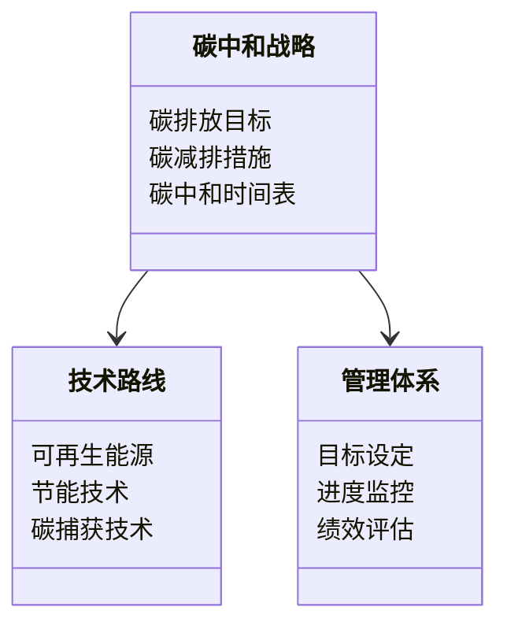
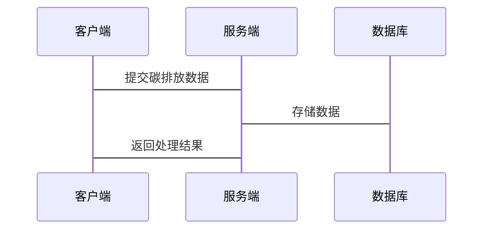

                 

# 目录大纲：《彼得·林奇如何看待公司的碳中和战略》

## # 第一部分: 碳中和的背景与意义

### ## 第1章: 碳中和的定义与全球趋势

#### ### 1.1 碳中和的定义与核心概念
- 从碳排放到碳中和的演进
- 碳中和的核心要素与组成部分
- 碳中和的全球共识与目标

#### ### 1.2 碳中和对全球经济与企业的影响
- 碳中和对企业战略的重塑
- 碳中和对产业链的重构
- 碳中和对投资机会的驱动

#### ### 1.3 碳中和的全球实践与案例
- 国际碳中和政策与法规
- 典型国家的碳中和实践
- 碳中和目标与企业责任

## # 第二部分: 公司碳中和战略的核心要素

### ## 第2章: 碳中和战略的制定与实施

#### ### 2.1 碳中和战略的目标设定
- 短期目标与长期目标的平衡
- 碳中和目标与企业愿景的结合
- 碳中和目标的可量化性

#### ### 2.2 碳中和战略的实施路径
- 技术路线的选择与优化
- 管理体系的构建与优化
- 资源配置的策略与优化

#### ### 2.3 碳中和战略的政策应对
- 政策环境的分析与应对
- 政府补贴与税收政策的利用
- 碳交易市场的参与策略

## # 第三部分: 碳中和战略的系统分析与架构设计

### ## 第3章: 碳中和战略的系统功能设计

#### ### 3.1 碳中和战略的领域模型
- 用mermaid绘制领域模型类图

#### ### 3.2 碳中和战略的系统架构设计
- 用mermaid绘制系统架构图

#### ### 3.3 碳中和战略的接口设计
- 系统接口的功能描述与交互流程
- 用mermaid绘制系统交互序列图

## # 第四部分: 碳中和战略的项目实战

### ## 第4章: 项目实战

#### ### 4.1 环境安装
- 安装Python和必要的库
- 配置开发环境

#### ### 4.2 系统核心实现
- 碳排放数据处理的Python代码
- 碳减排算法实现
- 碳中和时间表的可视化

#### ### 4.3 代码应用解读与分析
- 代码的功能分析
- 代码的运行流程
- 代码的优化建议

#### ### 4.4 实际案例分析
- 典型企业的碳中和实践
- 碳中和目标的实现路径分析
- 碳中和战略的实施效果评估

#### ### 4.5 项目小结
- 项目总结
- 经验教训
- 展望

## # 第五部分: 碳中和战略的最佳实践与总结

### ## 第5章: 最佳实践

#### ### 5.1 碳中和战略的核心要素总结
- 关键成功因素
- 常见问题与解决方案
- 行业差异与应对策略

#### ### 5.2 投资视角下的碳中和战略
- 彼得·林奇的投资策略
- 碳中和战略对投资机会的影响
- 企业如何吸引投资者关注

#### ### 5.3 未来展望与趋势分析
- 碳中和技术的未来发展
- 全球碳中和目标的新进展
- 碳中和战略对企业长期发展的意义

## # 第六部分: 总结

### ## 第6章: 总结与致谢

#### ### 6.1 全文总结
- 书籍核心内容回顾
- 关键观点总结
- 未来研究方向

#### ### 6.2 致谢
- 感谢读者
- 感谢支持者
- 感谢合作伙伴

## # 附录

### ## 附录A: 关键术语解释

### ## 附录B: 参考文献

### ## 附录C: 案例分析数据

---

作者：AI天才研究院/AI Genius Institute & 禅与计算机程序设计艺术 /Zen And The Art of Computer Programming

