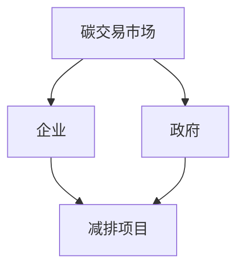
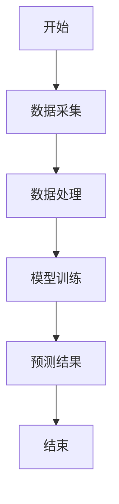
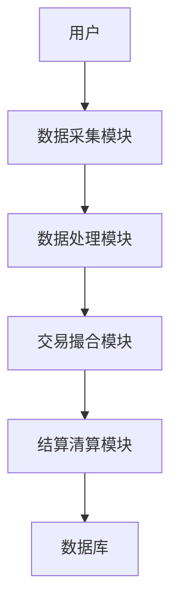

                 


# 彼得林奇如何看待公司的碳交易策略

## 关键词：碳交易、彼得林奇、投资策略、定价模型、系统架构

## 摘要：  
本文从彼得林奇的投资哲学出发，分析他在碳交易策略中的独特见解，并结合碳交易的数学模型、系统架构设计以及项目实战，深入探讨碳交易对企业的财务影响和投资机会。通过详细的技术分析和案例研究，本文为读者提供了从投资视角理解碳交易策略的全面指南。

---

## 第一部分：碳交易的基本概念与背景

### 第1章：碳交易的基本概念与背景

#### 1.1 碳交易的定义与背景

碳交易是指通过市场机制买卖碳配额或碳信用的行为，旨在减少温室气体排放。其背景可追溯到《京都议定书》和《巴黎协定》，这些国际协议推动了碳交易市场的形成。

- **碳排放**：企业在生产过程中产生的二氧化碳等温室气体。
- **碳汇**：通过植树造林等手段吸收二氧化碳的过程。
- **碳配额**：政府分配给企业的排放限额，超出部分需通过交易购买。
- **碳信用**：企业通过减排项目产生的可交易单位。

碳交易的机制包括配额分配、交易撮合、结算清算等流程，目前全球碳市场分为欧盟碳市场、中国碳市场等主要区域。

#### 1.2 碳交易的核心要素

- **碳配额**：政府分配的排放限额，企业需在规定时间内完成减排目标。
- **碳信用**：企业通过减排项目产生的可交易单位，分为核证减排量（VER）和碳汇信用（CCER）。
- **定价机制**：碳信用的价格受供需关系、政策法规和市场情绪的影响。

对比不同碳信用类型：

| 类型    | 定义                           | 适用场景         |
|---------|--------------------------------|------------------|
| VER     | 国际项目产生的减排信用         | 跨国企业         |
| CCER    | 国内项目产生的减排信用         | 国内企业         |

碳交易的实体关系图：



---

## 第2章：彼得林奇的投资理念与碳交易策略

### 2.1 彼得林奇的投资哲学

- **长期投资**：彼得林奇强调长期持有优质资产，避免频繁交易。
- **价值投资**：寻找被市场低估的企业，关注基本面分析。
- **分散投资**：通过多元化降低风险，避免过度集中。

### 2.2 碳交易中的投资机会

- **市场潜力**：碳交易市场规模庞大，预计未来几年将快速增长。
- **企业影响**：碳配额对企业财务的影响需重点关注。
- **风险平衡**：碳交易中的价格波动和政策变化需谨慎应对。

---

## 第3章：碳交易的数学模型与算法原理

### 3.1 碳交易的定价模型

- **线性回归模型**：用于预测碳信用价格。
- **博弈论模型**：分析市场参与者的策略选择。
- **均衡价格模型**：计算碳信用的理论价格。

公式：线性回归模型
$$
\hat{y} = a + bx + \epsilon
$$
其中，$\hat{y}$为预测价格，$x$为自变量，$a$为截距，$b$为斜率。

### 3.2 碳交易的算法实现

流程图：



Python代码示例：

```python
import pandas as pd
from sklearn.linear_model import LinearRegression

# 数据加载
data = pd.read_csv('carbon_price.csv')

# 特征与目标
X = data[['GDP', '政策影响']]
y = data['碳价']

# 模型训练
model = LinearRegression()
model.fit(X, y)

# 预测
y_pred = model.predict(X)
```

---

## 第4章：碳交易系统的架构设计

### 4.1 系统功能模块

- **数据采集**：实时获取碳配额和碳信用数据。
- **交易撮合**：匹配买卖双方，完成交易。
- **结算清算**：处理资金和碳信用的交割。

### 4.2 系统架构图



---

## 第5章：碳交易系统的实现与实战

### 5.1 环境搭建

- **工具安装**：安装Python、Pandas、Scikit-learn等库。
- **数据获取**：从公开数据源获取碳交易数据。

### 5.2 核心代码实现

```python
import pandas as pd
from sklearn.linear_model import LinearRegression

# 数据加载
data = pd.read_csv('carbon_price.csv')

# 特征与目标
X = data[['GDP', '政策影响']]
y = data['碳价']

# 模型训练
model = LinearRegression()
model.fit(X, y)

# 预测
y_pred = model.predict(X)
```

### 5.3 实际案例分析

- **案例背景**：某企业需购买碳信用以满足减排目标。
- **系统实现**：通过模型预测碳信用价格，优化购买策略。

---

## 第6章：最佳实践与小结

### 6.1 最佳实践

- **数据质量**：确保数据准确性和完整性。
- **模型优化**：根据市场变化调整模型参数。
- **风险管理**：制定应对价格波动和政策变化的策略。

### 6.2 小结

彼得林奇的投资理念为碳交易策略提供了独特视角，结合数学模型和系统架构设计，企业可以更有效地参与碳交易，实现减排目标和投资收益的双重优化。

---

## 作者：AI天才研究院/AI Genius Institute & 禅与计算机程序设计艺术 /Zen And The Art of Computer Programming

