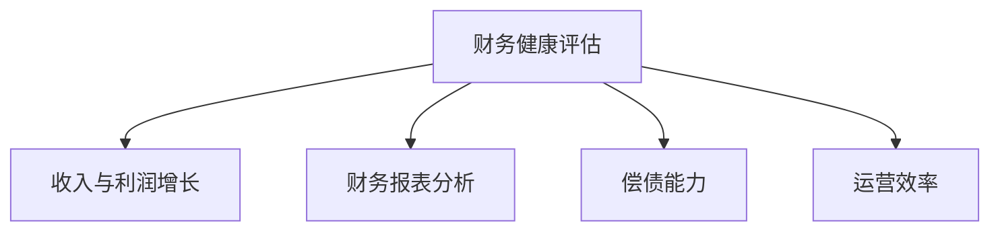
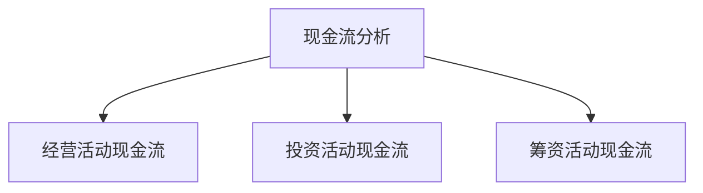
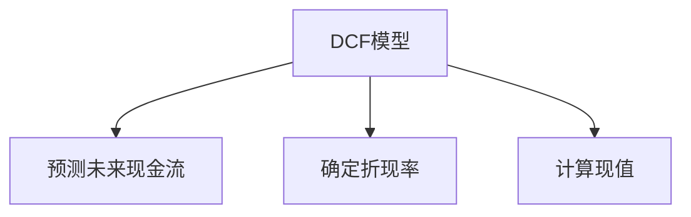
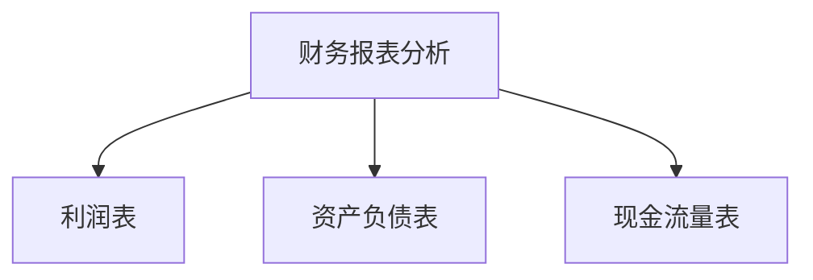
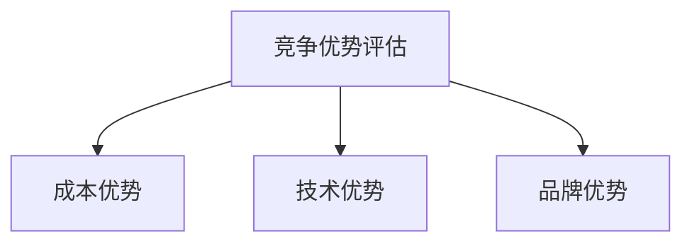
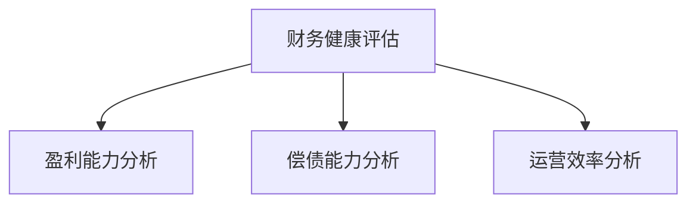
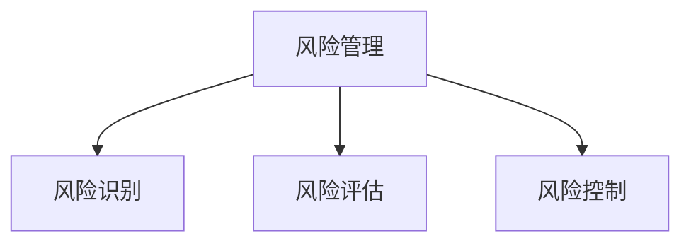

                 

# 彼得·林奇如何看待公司的股东回报

## 关键词：彼得·林奇，股东回报，投资策略，价值评估，风险管理

## 摘要：彼得·林奇作为投资领域的传奇人物，他如何看待公司的股东回报？本文将深入分析彼得·林奇的投资理念、股东回报的核心评估模型、影响股东回报的因素，以及如何通过基本面分析、竞争优势分析和财务健康评估来最大化股东回报。我们还将探讨风险管理策略，并通过实际案例分析，总结彼得·林奇的成功经验，为读者提供可操作的建议。

---

# 目录

1. [背景介绍](#背景介绍)
2. [股东回报的核心评估模型](#股东回报的核心评估模型)
3. [彼得·林奇的具体分析方法](#彼得·林奇的具体分析方法)
4. [投资策略与风险管理](#投资策略与风险管理)
5. [实际案例分析](#实际案例分析)
6. [总结与展望](#总结与展望)

---

## 第1章：背景介绍

### 1.1 股东回报的定义与重要性

股东回报是投资者在持有公司股票期间所获得的收益，包括资本增值和股息收益。资本增值是指股价上涨带来的收益，而股息收益则是公司定期派发的股息。股东回报的重要性体现在以下几个方面：

1. **衡量投资价值**：股东回报是衡量公司投资价值的重要指标。
2. **吸引长期投资者**：高股东回报能够吸引长期投资者，增强市场信心。
3. **反映公司经营状况**：股东回报的好坏直接反映了公司的经营状况和管理能力。

### 1.2 彼得·林奇的投资者背景

彼得·林奇是美国著名的投资经理人，曾管理富达麦哲伦基金，创造了卓越的投资业绩。他的投资哲学以基本面分析和长期投资为主，强调对公司基本面的深入研究和对管理层的信任。

### 1.3 影响股东回报的主要因素

影响股东回报的主要因素包括公司基本面、宏观经济环境和行业特性。具体包括：

1. **公司基本面**：收入与利润增长、财务健康状况、市场竞争环境。
2. **宏观经济环境**：经济周期、利率政策、通货膨胀。
3. **行业特性**：行业增长潜力、周期性风险、政策影响。

---

## 第2章：股东回报的核心评估模型

### 2.1 股东回报的财务指标分析

#### 2.1.1 股东回报的主要财务指标

- **净利润增长率**：净利润增长率是衡量公司盈利能力增长的重要指标。
- **每股收益（EPS）**：EPS是净利润与总股本的比值，反映了每股的盈利能力。
- **股息率与股息增长**：股息率是股息与股价的比值，股息增长则是股息的长期增长能力。

#### 2.1.2 财务指标的计算与对比

通过对比财务指标，可以评估公司的财务健康状况和盈利潜力。例如，净利润增长率较高的公司通常具有较大的增长潜力，而高股息率的公司则适合追求稳定收益的投资者。

#### 2.1.3 财务指标与股价的关系

股价与财务指标密切相关。高净利润增长率和高EPS通常会推高股价，而高股息率则会吸引价值投资者。

#### 图表：财务指标对比表

| 公司   | 净利润增长率（%） | 每股收益（EPS） | 股息率（%） |
|--------|-------------------|-----------------|------------|
| A公司   | 15                | 2.5             | 3          |
| B公司   | 10                | 1.8             | 4          |

#### 图表：财务健康评估模型

### 2.2 现金流与股东回报

#### 2.2.1 现金流分析的重要性

现金流是公司财务健康的重要指标。健康的现金流能够支持公司的持续经营和扩张，从而提高股东回报。

#### 2.2.2 现金流分析的步骤

1. **经营活动现金流**：经营活动现金流是公司日常经营活动中产生的现金流。
2. **投资活动现金流**：投资活动现金流是公司投资活动产生的现金流。
3. **筹资活动现金流**：筹资活动现金流是公司通过筹资活动产生的现金流。

#### 图表：现金流分析示意图

### 2.3 股东回报的DCF模型

#### 2.3.1 DCF模型的定义

DCF（Discounted Cash Flow）模型是通过将未来现金流折现到现值来评估公司价值的方法。

#### 2.3.2 DCF模型的步骤

1. **预测未来现金流**：预测公司未来几年的现金流。
2. **确定折现率**：确定合适的折现率，通常使用WACC（加权平均资本成本）。
3. **计算现值**：将未来现金流折现到现值，并加总得到公司估值。

#### 图表：DCF模型示意图

#### 2.3.3 DCF模型的数学公式

$$ \text{公司估值} = \sum_{t=1}^{n} \frac{\text{现金流}_t}{(1 + r)^t} $$

其中，r是折现率，n是预测年数。

---

## 第3章：彼得·林奇的具体分析方法

### 3.1 公司基本面分析

#### 3.1.1 公司基本面分析的重要性

公司基本面分析是彼得·林奇投资策略的核心。通过分析公司的财务报表、行业地位和管理团队，可以评估公司的投资价值。

#### 3.1.2 财务报表分析

1. **利润表**：分析公司的收入和利润情况。
2. **资产负债表**：分析公司的资产、负债和所有者权益情况。
3. **现金流量表**：分析公司的现金流情况。

#### 图表：财务报表分析示意图

### 3.2 竞争优势分析

#### 3.2.1 竞争优势的定义

竞争优势是公司相对于竞争对手的核心优势，包括成本优势、技术优势和品牌优势等。

#### 3.2.2 竞争优势的评估

1. **成本优势**：公司是否具有成本控制能力。
2. **技术优势**：公司是否拥有独特的技术或专利。
3. **品牌优势**：公司是否拥有强大的品牌影响力。

#### 图表：竞争优势评估示意图

### 3.3 财务健康评估

#### 3.3.1 财务健康评估的重要性

财务健康评估是评估公司能否持续盈利和偿还债务的重要指标。

#### 3.3.2 财务健康评估的步骤

1. **盈利能力分析**：分析公司的净利润率、毛利率等指标。
2. **偿债能力分析**：分析公司的流动比率、速动比率等指标。
3. **运营效率分析**：分析公司的存货周转率、应收账款周转率等指标。

#### 图表：财务健康评估示意图

---

## 第4章：投资策略与风险管理

### 4.1 投资策略的制定

#### 4.1.1 投资目标的确定

投资者需要根据自身的风险承受能力和投资目标制定合适的投资策略。

#### 4.1.2 投资组合的构建

通过合理配置不同类型资产，可以降低投资风险并提高回报。

### 4.2 风险管理策略

#### 4.2.1 风险的定义与分类

风险是指投资收益的不确定性。常见的风险包括市场风险、流动性风险和信用风险。

#### 4.2.2 风险管理的步骤

1. **风险识别**：识别可能影响投资收益的风险因素。
2. **风险评估**：评估各种风险的影响程度。
3. **风险控制**：通过 diversification 等方法降低风险。

#### 图表：风险管理流程图

### 4.3 投资组合管理

#### 4.3.1 投资组合的定义

投资组合是指投资者持有的各种资产的组合，通过 diversification 降低风险。

#### 4.3.2 投资组合的调整

根据市场变化和投资目标的调整，需要定期审视和调整投资组合。

---

## 第5章：实际案例分析

### 5.1 彼得·林奇的经典投资案例

#### 5.1.1 可口可乐案例

彼得·林奇曾投资可口可乐，并取得了丰厚的回报。通过分析可口可乐的财务状况、竞争优势和行业地位，可以得出其投资成功的秘诀。

#### 5.1.2 其他经典案例

例如，林奇投资IBM时，通过分析公司的技术优势和市场地位，判断其具有长期增长潜力。

### 5.2 案例分析的步骤

#### 5.2.1 案例背景分析

分析公司的行业地位、财务状况和竞争优势。

#### 5.2.2 投资决策分析

基于基本面分析和估值模型，判断是否值得投资。

#### 5.2.3 投资结果分析

分析投资结果，总结经验教训。

---

## 第6章：总结与展望

### 6.1 总结

彼得·林奇的成功投资策略基于对公司基本面的深入分析和对长期价值的追求。通过合理的财务指标分析、竞争优势评估和风险管理，投资者可以有效提升股东回报。

### 6.2 展望

随着市场的变化和经济的发展，投资者需要不断学习和调整策略。未来，技术进步和全球化将为投资带来新的机会和挑战。

---

## 作者

作者：AI天才研究院/AI Genius Institute & 禅与计算机程序设计艺术 /Zen And The Art of Computer Programming

---

### 最佳实践 Tips

1. **定期审视投资组合**：定期检查投资组合的表现，根据市场变化进行调整。
2. **注重基本面分析**：深入研究公司的财务报表和行业地位，避免盲目跟风。
3. **风险管理**：通过 diversification 和止损策略降低投资风险。
4. **长期投资**：避免短期波动，坚持长期投资，获得稳定的股东回报。

---

### 小结

彼得·林奇的投资理念强调对公司基本面的深入分析和长期价值的追求。通过合理的财务指标分析、竞争优势评估和风险管理，投资者可以有效提升股东回报。未来，投资者需要不断学习和调整策略，以应对市场的变化和经济的发展。

