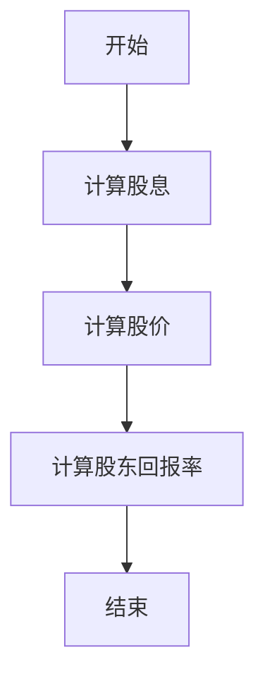
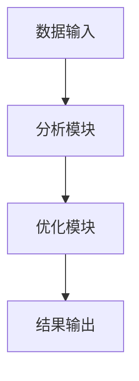
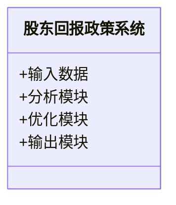

                 


# 彼得林奇如何看待公司的股东回报政策

## 关键词：股东回报政策，彼得·林奇，投资策略，财务分析，系统设计

## 摘要：彼得·林奇是全球著名投资家，他提出了许多独特的股东回报政策和投资策略。本文将从背景、理论、策略、系统设计等多方面详细分析彼得·林奇如何看待公司的股东回报政策，结合数学模型和实际案例，深入探讨其核心思想和实现方法。

---

## # 引言

### ## 1.1 股东回报政策的重要性
#### ### 1.1.1 股东回报政策的定义与核心概念
股东回报政策是指公司如何通过股息、股票回购等方式向股东分配利润的策略。它是企业治理和财务管理的重要组成部分，直接影响股东的价值和公司的长期发展。

#### ### 1.1.2 股东回报政策与企业价值的关系
股东回报政策直接影响股东的收益，同时也影响市场的对公司价值的评估。合理的股东回报政策能够提升股东信心，吸引更多投资者，从而促进公司发展。

#### ### 1.1.3 彼得·林奇与股东回报政策的关联
彼得·林奇作为著名投资家，他强调通过分析公司的股东回报政策来评估其投资价值。他认为，股东回报政策是公司财务健康和管理能力的重要体现。

### ## 1.2 本书的目的与结构安排
#### ### 1.2.1 本书的核心问题与解决思路
本文旨在探讨彼得·林奇如何通过股东回报政策来评估公司价值，并结合数学模型和实际案例，分析其策略的科学性和可操作性。

#### ### 1.2.2 本书的章节安排与内容概览
本文将从股东回报政策的背景、理论、彼得·林奇的策略、系统设计等方面展开，结合数学模型和实际案例，深入分析其核心思想。

---

## # 第一部分：股东回报政策的背景与重要性

### ## 2.1 股东回报政策的背景介绍
#### ### 2.1.1 股东回报政策的定义与核心要素
股东回报政策是指公司通过股息、股票回购等方式向股东分配利润的策略。其核心要素包括股息率、回购规模、分红政策等。

#### ### 2.1.2 股东回报政策的边界与外延
股东回报政策的边界在于公司的财务健康状况和市场环境。外延则包括对公司估值、股东信心等方面的影响。

#### ### 2.1.3 股东回报政策与企业治理的关系
股东回报政策是企业治理的重要组成部分，直接影响股东利益和公司价值。

### ## 2.2 股东回报政策的核心概念与联系
#### ### 2.2.1 股东回报政策的原理与特征
股东回报政策的原理是通过合理分配利润，实现股东价值的最大化。其特征包括灵活性、可持续性和公平性。

#### ### 2.2.2 股东回报政策与企业价值的对比分析
通过对比分析，可以看出股东回报政策直接影响企业的市场估值和股东信心。

#### ### 2.2.3 股东回报政策的ER实体关系图
```mermaid
erDiagram
    customer[股东] 
    company[公司] 
    transaction[回报分配]
    customer -|> transaction : 股东获得回报
    company -|> transaction : 公司分配利润
```

---

## # 第二部分：股东回报政策的理论框架

### ## 3.1 股东回报政策的理论基础
#### ### 3.1.1 股东回报政策的财务基础
股东回报政策的核心是公司利润的分配，涉及财务报表分析和现金流管理。

#### ### 3.1.2 股东回报政策的经济理论
从经济学角度看，股东回报政策是资源配置和利益分配的重要机制。

#### ### 3.1.3 股东回报政策的管理学视角
从管理学角度看，股东回报政策是公司治理和财务管理的重要内容。

### ## 3.2 股东回报政策的数学模型与公式
#### ### 3.2.1 股东回报率的计算公式
股东回报率的计算公式为：
$$ 股东回报率 = \frac{股息}{股价} $$

#### ### 3.2.2 股东回报政策的优化模型
优化模型可以通过数学规划方法实现，例如：
$$ \max \text{股东价值} $$
$$ \text{subject to} \quad \text{公司财务健康} $$

#### ### 3.2.3 股东回报政策的数学推导与分析
通过数学推导，可以得出股东回报政策的最优解。

### ## 3.3 股东回报政策的算法原理
#### ### 3.3.1 股东回报率的计算流程图


#### ### 3.3.2 股东回报政策的优化算法
优化算法可以通过动态规划或遗传算法实现。

#### ### 3.3.3 股东回报政策的实现代码示例
```python
def calculate_shareholder_return(dividend, price):
    return dividend / price
```

---

## # 第三部分：彼得·林奇的股东回报策略

### ## 4.1 彼得·林奇的投资理念
#### ### 4.1.1 彼得·林奇的核心投资策略
彼得·林奇强调基本面分析和长期投资。

#### ### 4.1.2 彼得·林奇的股东回报观
彼得·林奇认为，股东回报政策是公司财务健康的重要指标。

#### ### 4.1.3 彼得·林奇与股东回报政策的结合
彼得·林奇通过分析股东回报政策来评估公司的投资价值。

### ## 4.2 彼得·林奇的股东回报分析方法
#### ### 4.2.1 彼得·林奇的财务指标分析
彼得·林奇关注股息率、市盈率等指标。

#### ### 4.2.2 彼得·林奇的公司估值模型
彼得·林奇提出了基于股东回报政策的公司估值模型。

#### ### 4.2.3 彼得·林奇的股东回报预测方法
通过历史数据和财务指标，可以预测未来的股东回报。

### ## 4.3 彼得·林奇的经典案例分析
#### ### 4.3.1 某公司股东回报政策的分析
以某公司为例，分析其股东回报政策的实施效果。

#### ### 4.3.2 某公司股东回报政策的优化建议
根据分析结果，提出优化建议。

#### ### 4.3.3 某公司股东回报政策的实施效果
评估优化建议的实施效果。

---

## # 第四部分：股东回报政策的系统分析与架构设计方案

### ## 5.1 系统分析与设计
#### ### 5.1.1 股东回报政策的系统架构
系统架构包括数据采集、分析、优化和输出模块。

#### ### 5.1.2 股东回报政策的系统功能设计
系统功能包括数据输入、分析计算、结果输出等。

#### ### 5.1.3 股东回报政策的系统接口设计
系统接口包括数据接口和用户接口。

### ## 5.2 系统架构图与流程图
#### ### 5.2.1 股东回报政策的系统架构图


#### ### 5.2.2 股东回报政策的系统功能设计


---

## # 结论

### ## 6.1 总结
本文详细探讨了彼得·林奇如何看待公司的股东回报政策，结合理论和实际案例，分析了其核心思想和实现方法。

### ## 6.2 投资策略建议
根据彼得·林奇的策略，投资者应关注公司的股东回报政策，选择财务健康、回报稳定的公司进行投资。

### ## 6.3 未来展望
未来，随着市场的变化和技术的发展，股东回报政策的分析和优化将更加重要。

---

## # 附录

### ## A.1 术语表
- 股东回报政策：公司通过股息、回购等方式向股东分配利润的策略。
- 股息率：股息与股价的比率。

### ## A.2 参考文献
- 彼得·林奇的著作
- 相关财务和投资理论文献

---

## 作者：AI天才研究院/AI Genius Institute & 禅与计算机程序设计艺术 /Zen And The Art of Computer Programming

---

本文通过系统分析和详细阐述，全面探讨了彼得·林奇如何看待公司的股东回报政策，结合理论和实际案例，为投资者提供了科学的分析方法和实践指导。

