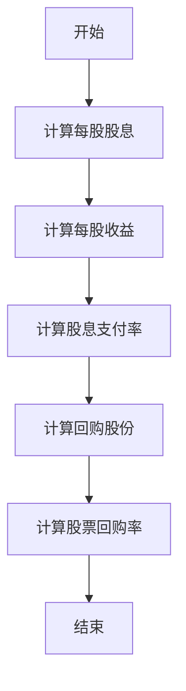
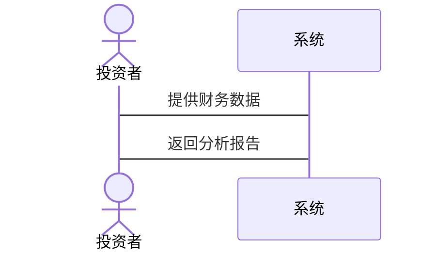

                 


# 彼得·林奇如何看待公司的股东回报政策演变

## 关键词
股东回报政策、彼得·林奇、股息支付率、股票回购、股东价值最大化、投资策略

## 摘要
本文从彼得·林奇的投资视角，分析股东回报政策的历史演变、核心概念及其数学模型。通过实际案例，探讨如何优化股东回报策略，并提供Python实现和系统架构设计。

---

## 第一部分: 股东回报政策演变的背景与基础

### 第1章: 股东回报政策的概述

#### 1.1 股东回报政策的基本概念

##### 1.1.1 股东回报政策的定义
股东回报政策是公司向股东分配收益的方式，包括股息支付和股票回购。

##### 1.1.2 股东回报政策的核心要素
- **股息支付率**：股息与净利润的比率。
- **股票回购**：公司用自有资金回购股份。
- **股东价值最大化**：长期股东价值的提升。

##### 1.1.3 股东回报政策的分类与特点
1. **高股息支付**：稳定收益，适合稳健投资者。
2. **低股息支付**：用于再投资，适合成长型企业。
3. **股票回购**：减少流通股，提高每股收益。

#### 1.2 股东回报政策的历史演变

##### 1.2.1 传统股东回报政策的起源
早期企业主要通过股息回报股东，20世纪初开始出现股票回购。

##### 1.2.2 现代股东回报政策的发展
20世纪80年代后，股票回购成为重要回报方式，反映了股东价值最大化理念。

##### 1.2.3 股东回报政策的全球化趋势
不同国家的政策差异，反映了不同市场环境和监管要求。

#### 1.3 彼得·林奇与股东回报政策的关系

##### 1.3.1 彼得·林奇的投资理念
林奇强调基本面分析和长期投资，注重公司管理能力和成长潜力。

##### 1.3.2 彼得·林奇对股东回报政策的贡献
他主张平衡股息支付和再投资，重视股东长期价值。

##### 1.3.3 彼得·林奇视角下的股东回报政策演变
林奇的视角反映了股东回报政策从注重短期回报转向长期价值的变化。

---

## 第二部分: 股东回报政策的核心概念与联系

### 第2章: 股东回报政策的核心概念与联系

#### 2.1 股东回报政策的核心要素

##### 2.1.1 股息支付率
股息支付率计算公式：
$$ \text{股息支付率} = \frac{\text{每股股息}}{\text{每股收益}} $$

##### 2.1.2 股票回购
股票回购率计算公式：
$$ \text{股票回购率} = \frac{\text{回购股份}}{\text{流通股总数}} $$

##### 2.1.3 股东价值最大化
通过股息和股票回购的组合，实现股东价值的最大化。

#### 2.2 股东回报政策的属性特征对比

##### 2.2.1 股息支付率与股票回购的对比
| 特性            | 股息支付率             | 股票回购             |
|-----------------|-----------------------|----------------------|
| 影响            | 分配收益               | 减少流通股           |
| 资金来源        | 利润分配               | 自有资金或贷款       |
| 税务影响        | 可能享有税收优惠       | 可能影响税务负担     |

#### 2.3 股东回报政策的ER实体关系图
```mermaid
erDiagram
    customer[股东] {
        key: id
        name: string
        shares: integer
    }
    company[公司] {
        key: id
        name: string
        shares_outstanding: integer
    }
    transaction[交易] {
        key: id
        date: date
        type: enum(股息, 股票回购)
        amount: float
    }
    customer --> transaction : 持有股份
    company --> transaction : 发放股息或回购股票
```

---

## 第三部分: 股东回报政策的数学模型与算法原理

### 第3章: 股东回报政策的数学模型与算法原理

#### 3.1 股东回报政策的数学模型

##### 3.1.1 股息支付率的计算公式
$$ \text{股息支付率} = \frac{\text{每股股息}}{\text{每股收益}} $$

##### 3.1.2 股票回购的计算公式
$$ \text{股票回购率} = \frac{\text{回购股份}}{\text{流通股总数}} $$

#### 3.2 股东回报政策的算法流程


#### 3.3 股东回报政策的Python实现
```python
# 示例代码：计算股息支付率和股票回购率

def calculate_dividend_payout_ratio(earnings_per_share, dividends_per_share):
    return dividends_per_share / earnings_per_share

def calculate_stock_repurchase_ratio(repurchase_shares, outstanding_shares):
    return repurchase_shares / outstanding_shares

# 示例数据
eps = 2.5
dps = 1.2
repurchased = 100000
outstanding = 1000000

dpr = calculate_dividend_payout_ratio(eps, dps)
srr = calculate_stock_repurchase_ratio(repurchased, outstanding)

print(f"股息支付率: {dpr:.2f}")
print(f"股票回购率: {srr:.2f}")
```

---

## 第四部分: 系统分析与架构设计方案

### 第4章: 系统分析与架构设计方案

#### 4.1 项目介绍
设计一个评估股东回报政策的系统，帮助投资者分析公司的股息支付和股票回购策略。

#### 4.2 系统功能设计
- **输入数据**：股息、净利润、流通股等。
- **计算指标**：股息支付率、股票回购率。
- **生成报告**：对比分析和优化建议。

#### 4.3 系统架构设计


#### 4.4 系统接口设计
- 输入接口：接受公司财务数据。
- 输出接口：生成分析报告和优化建议。

#### 4.5 系统交互设计


---

## 第五部分: 项目实战

### 第5章: 项目实战

#### 5.1 环境安装
安装Python和必要的库，如Pandas和Matplotlib。

#### 5.2 核心代码实现
```python
import pandas as pd
import matplotlib.pyplot as plt

# 示例数据
data = {
    '公司': ['A', 'B', 'C'],
    '净利润': [100, 150, 200],
    '股息': [50, 75, 100],
    '流通股': [100000, 80000, 120000]
}

df = pd.DataFrame(data)

# 计算股息支付率
df['股息支付率'] = df['股息'] / df['净利润']

# 计算股票回购率
df['股票回购率'] = (df['净利润'] - df['股息']) / df['流通股']

print(df)
```

#### 5.3 案例分析
分析某公司过去5年的股东回报政策，计算股息支付率和股票回购率，评估政策的有效性。

#### 5.4 项目小结
总结项目成果，强调股东回报政策分析的重要性和实际应用价值。

---

## 第六部分: 最佳实践与总结

### 第6章: 最佳实践与总结

#### 6.1 小结
股东回报政策是公司价值的重要体现，正确实施能提升股东价值。

#### 6.2 注意事项
- 考虑公司发展阶段和市场环境。
- 平衡股息支付和再投资。
- 风险因素如债务水平和市场波动。

#### 6.3 拓展阅读
建议阅读彼得·林奇的相关书籍，深入理解股东回报策略。

---

## 作者信息
作者：AI天才研究院 & 禅与计算机程序设计艺术

---

通过本文的分析，读者可以全面理解彼得·林奇视角下的股东回报政策演变，并掌握相关的数学模型和系统设计方法。希望本文能为投资者和公司管理者提供有价值的参考。

