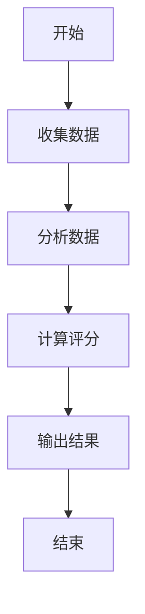
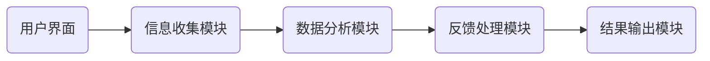

                 


# 彼得林奇如何看待公司的股东沟通策略

## 关键词：
- 股东沟通策略
- 彼得·林奇
- 透明度
- 投资者关系管理
- 沟通评分算法

## 摘要：
本文探讨了彼得·林奇对公司的股东沟通策略的看法，从背景介绍到算法设计，再到系统架构，详细分析了如何通过透明、及时和准确的沟通提升股东满意度。文章结合实例和图表，深入解析了股东沟通的核心要素，并提出了基于数据的评分算法和系统设计方案，为公司优化股东沟通提供了实践指导。

---

## 第一部分：股东沟通策略的背景与重要性

### 第1章：股东沟通策略的背景介绍

#### 1.1 股东沟通的定义与重要性
- **1.1.1 股东沟通的定义**
  股东沟通是指公司与股东之间通过信息交流，确保股东了解公司运营状况、财务表现和未来规划的过程。

- **1.1.2 股东沟通在公司管理中的作用**
  有效的股东沟通能够增强股东信任，提升公司形象，同时也能及时发现和解决问题。

- **1.1.3 股东沟通的重要性**
  透明的沟通有助于维护股东利益，促进公司与投资者之间的良好关系，是公司长期发展的基石。

#### 1.2 股东沟通的现状与问题
- **1.2.1 当前股东沟通的主要方式**
  包括定期报告、股东大会、电话会议和投资者简报等。

- **1.2.2 股东沟通中存在的主要问题**
  信息传递不及时、内容不透明、互动不足等。

- **1.2.3 问题的根源与影响**
  沟通不畅可能导致股东误解，影响公司股价和投资者信心。

#### 1.3 彼得·林奇的背景与观点
- **1.3.1 彼得·林奇的投资者背景**
  彼得·林奇是著名的投资专家，强调透明和及时的沟通对投资者信任的重要性。

- **1.3.2 彼得·林奇对股东沟通的看法**
  他认为公司应定期发布信息，及时回应股东疑问，建立开放的沟通渠道。

- **1.3.3 彼得·林奇的成功案例分析**
  通过案例展示透明沟通如何帮助公司赢得投资者信任，提升市场表现。

---

## 第二部分：股东沟通策略的核心概念与联系

### 第2章：股东沟通策略的核心要素

#### 2.1 核心概念与定义
- **透明度**
  公开、真实地分享公司信息，避免隐瞒关键数据。
  
- **及时性**
  在重要信息出现后尽快通知股东，避免信息滞后。

- **准确性**
  提供的数据和信息必须经过核实，确保无误。

#### 2.2 沟通方式的对比分析
- **线上与线下沟通方式的对比**
  线上方式便捷，但互动性可能不足；线下方式更具仪式感，但成本较高。

- **定期报告与实时更新的对比**
  定期报告系统性强，但可能滞后；实时更新更具时效性，但信息量可能有限。

- **互动会议与被动接收信息的对比**
  互动会议促进双向交流，被动接收信息则较为单向。

#### 2.3 ER实体关系图
```mermaid
er
  actor 股东
  actor 公司
  actor 第三方机构
  entity 股东信息
  entity 沟通记录
  entity 股东反馈
  股东 --> 沟通记录: 提交反馈
  公司 --> 沟通记录: 发布信息
  沟通记录 --> 股东反馈: 收集反馈
```

---

## 第三部分：股东沟通策略的算法原理

### 第3章：股东沟通评分算法

#### 3.1 算法原理
- **算法目标：** 最大化股东满意度，优化沟通策略。

- **算法步骤：**
  1. **收集数据：** 通过线上和线下渠道收集股东反馈。
  2. **分析数据：** 识别关键问题和趋势。
  3. **计算评分：** 综合透明度、及时性和准确性评分。
  4. **输出结果：** 提供改进建议。

#### 3.2 算法流程图


#### 3.3 数学模型与公式
- **沟通评分公式：**
  $$ \text{总评分} = \frac{\text{透明度评分} + \text{及时性评分} + \text{准确性评分}}{3} $$

- **改进方向：**
  根据评分结果，调整沟通策略，优化低分项。

---

## 第四部分：系统分析与架构设计

### 第4章：系统功能与架构设计

#### 4.1 问题场景介绍
- 公司如何通过系统实现高效的股东沟通？

#### 4.2 系统功能设计
- **信息收集模块：** 收集股东反馈和市场数据。
- **数据分析模块：** 分析数据，生成报告。
- **反馈处理模块：** 处理股东反馈，提出改进建议。

#### 4.3 系统架构设计


#### 4.4 接口设计
- **API接口：** 提供数据接口，方便第三方接入。

#### 4.5 交互流程图
```mermaid
sequence
    股东 -> 公司系统: 提交反馈
    公司系统 -> 数据分析模块: 分析数据
    数据分析模块 -> 股东: 反馈结果
```

---

## 第五部分：项目实战

### 第5章：项目实现与案例分析

#### 5.1 环境安装
- 安装Python、数据分析库和可视化工具。

#### 5.2 核心代码实现
```python
def calculate_score(feedback_data):
    transparency = sum(feedback_data['transparency']) / len(feedback_data['transparency'])
    timeliness = sum(feedback_data['timeliness']) / len(feedback_data['timeliness'])
    accuracy = sum(feedback_data['accuracy']) / len(feedback_data['accuracy'])
    return (transparency + timeliness + accuracy) / 3
```

#### 5.3 案例分析与解读
- 通过具体案例展示算法的应用和效果提升。

#### 5.4 项目小结
- 总结项目成果，强调沟通策略优化的重要性。

---

## 第六部分：最佳实践与总结

### 第6章：最佳实践

#### 6.1 彼得·林奇的沟通建议
- 定期发布报告，及时回应股东问题，建立开放沟通渠道。

#### 6.2 小结
- 透明、及时和准确的沟通是维护股东关系的关键。

#### 6.3 注意事项
- 注意沟通的及时性和透明度，避免误导性信息。

#### 6.4 拓展阅读
- 推荐相关书籍和资源，进一步深入学习。

---

## 附录

### A. 术语表
- 股东：持有公司股份的个人或机构。
- 沟通策略：公司与股东互动的方式和计划。

### B. 工具安装指南
- 如何安装数据分析工具和可视化库。

### C. 参考文献
- 彼得·林奇的相关著作和投资策略研究。

---

## 作者
作者：AI天才研究院/AI Genius Institute  
联系邮箱：contact@aignitist.com

