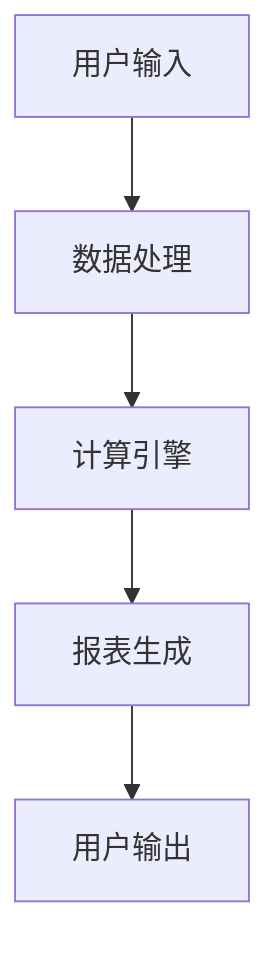
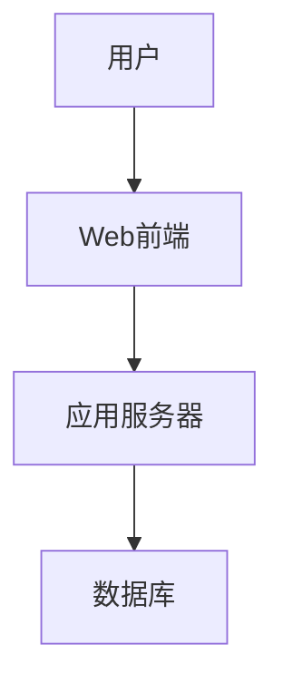

                 


# 彼得林奇如何看待公司的股息再投资计划对长期回报的影响

## 关键词：股息再投资，彼得·林奇，长期回报，复利效应，投资策略

## 摘要：股息再投资是一种将公司派发的股息用于购买更多股票的投资策略，能够通过复利效应实现长期财富增长。本文将从彼得·林奇的投资理念出发，分析股息再投资的核心概念、数学模型、系统架构，并结合实际案例和最佳实践，探讨其对长期回报的影响。

---

## 第一部分：股息再投资计划的背景与概念

### 第1章：股息再投资计划概述

#### 1.1 股息再投资的基本概念

##### 1.1.1 股息再投资的定义
股息再投资是指公司将派发的股息以股票形式返还给股东，股东可以选择将这些股息用于购买更多的公司股票。这种投资方式通常被称为“以股代息”，是一种强制再投资的机制，旨在通过复利效应增加股东的长期回报。

##### 1.1.2 股息再投资的核心要素
- **股息分配**：公司根据净利润和股份数量派发股息。
- **再投资机制**：将股息转换为新股票，增加股东持股数量。
- **复利效应**：通过持续再投资，股息收入进一步增长，形成滚雪球效应。

##### 1.1.3 股息再投资与复利增长的关系
股息再投资通过将收益再投资于标的资产，实现了收益的再投资和再增长，从而在长期形成复利效应，显著提升投资回报。

#### 1.2 彼得·林奇的投资理念

##### 1.2.1 彼得·林奇的投资哲学
彼得·林奇是著名的投资经理，他主张长期投资优质股票，注重公司的基本面分析，追求稳定的股息收入和资本增值。

##### 1.2.2 林奇对股息再投资的看法
林奇认为，股息再投资是一种有效的投资策略，尤其是对于那些股息稳定增长且公司具备长期增长潜力的公司。通过再投资，投资者能够利用复利效应，逐步积累财富。

##### 1.2.3 林奇的经典投资案例分析
例如，林奇曾投资于可口可乐公司，该公司长期派发稳定的股息，并通过股息再投资进一步增加了持股比例，最终实现了巨大的资本增值。

#### 1.3 股息再投资的优缺点

##### 1.3.1 股息再投资的优势
- **复利效应**：通过持续再投资，收益不断增长。
- **分散风险**：长期持有优质股票，降低短期市场波动的影响。
- **税务优惠**：部分情况下，股息再投资可以享受税务优惠。

##### 1.3.2 股息再投资的潜在风险
- **市场波动**：股票价格受市场波动影响，可能影响再投资的价值。
- **流动性限制**：长期锁定资金，可能影响资金的流动性需求。
- **公司风险**：公司经营状况变化可能影响股息的稳定性。

##### 1.3.3 如何平衡股息再投资的风险与收益
- 选择股息稳定且具备增长潜力的公司。
- 分散投资，避免过度集中。
- 定期评估投资组合，及时调整策略。

### 第2章：股息再投资的数学模型与分析

#### 2.1 股息再投资的复利模型

##### 2.1.1 复利计算公式
$$ A = P \times (1 + r)^n $$
其中，$A$ 是终值，$P$ 是本金，$r$ 是年增长率，$n$ 是投资年数。

##### 2.1.2 年增长率计算
假设某公司每年派发股息，再投资后，股息收入将逐年增长。通过复利计算，可以预测股息再投资的未来价值。

##### 2.1.3 不同股息率对长期回报的影响
以股息率分别为3%、5%和7%的三家公司为例，计算30年后的投资回报，展示股息率对长期回报的影响。

#### 2.2 股息再投资的数学分析

##### 2.2.1 股息再投资的年增长率计算
使用复利公式，计算股息再投资的年增长率，并与市场整体回报进行对比。

##### 2.2.2 不同股票价格波动对再投资的影响
通过波动率模型，分析股票价格波动对股息再投资回报的影响。

##### 2.2.3 股票价格波动对股息再投资的影响
使用蒙特卡洛模拟，预测股票价格波动对股息再投资回报的潜在影响。

#### 2.3 股息再投资的案例分析

##### 2.3.1 案例一：稳定增长型股票的股息再投资
选择一家股息稳定增长的公司，计算其股息再投资的回报。

##### 2.3.2 案例二：高增长型股票的股息再投资
选择一家高增长型公司，分析其股息再投资的回报潜力。

##### 2.3.3 案例三：周期性股票的股息再投资
分析周期性股票的股息再投资风险和潜在回报。

### 第3章：股息再投资的系统架构与实现

#### 3.1 股息再投资系统的功能设计

##### 3.1.1 系统需求分析
- 自动计算股息再投资的回报。
- 提供实时市场数据接口。
- 支持多种股息再投资策略。

##### 3.1.2 系统功能模块划分
- 用户界面模块。
- 数据处理模块。
- 计算引擎模块。
- 报表生成模块。

##### 3.1.3 系统功能流程图（Mermaid）


#### 3.2 股息再投资系统的架构设计

##### 3.2.1 系统架构图（Mermaid）


##### 3.2.2 数据流图分析
- 用户输入投资参数。
- 系统处理数据，调用计算引擎。
- 计算结果存储在数据库中，并生成报表。

##### 3.2.3 系统接口设计
- API接口用于数据交互。
- 接口遵循RESTful规范，支持JSON格式。

#### 3.3 股息再投资系统的实现

##### 3.3.1 环境安装与配置
- 安装Python和相关库（如Pandas、Matplotlib）。
- 配置数据库和API接口。

##### 3.3.2 系统核心代码实现
```python
import pandas as pd

def calculate_future_value(initial_investment, annual_growth_rate, years):
    return initial_investment * (1 + annual_growth_rate) ** years

# 示例计算
initial_investment = 1000
annual_growth_rate = 0.05
years = 30
future_value = calculate_future_value(initial_investment, annual_growth_rate, years)
print(f"未来价值：{future_value:.2f}")
```

##### 3.3.3 代码功能解读与分析
- 使用Pandas库进行数据处理。
- 通过数学公式计算未来价值。
- 代码实现简单，但可以根据需求扩展功能。

### 第4章：股息再投资的实际操作与风险控制

#### 4.1 股息再投资的实际操作步骤

##### 4.1.1 如何选择适合的股票
- 考虑公司的财务状况、行业地位和股息支付能力。
- 选择股息率稳定且具备增长潜力的公司。

##### 4.1.2 如何进行股息再投资
- 开立证券账户，选择支持股息再投资的 brokerage。
- 设置自动再投资功能，将股息收入用于购买更多股票。

##### 4.1.3 如何跟踪投资回报
- 定期查看投资组合的回报率。
- 使用财务报表和市场数据进行分析。

#### 4.2 股息再投资的风险管理

##### 4.2.1 如何评估投资风险
- 分析市场的波动性。
- 评估公司的经营风险。

##### 4.2.2 如何制定风险管理策略
- 分散投资，避免过度集中。
- 定期重新评估投资组合，及时调整。

##### 4.2.3 如何应对市场波动
- 长期持有，避免频繁交易。
- 利用市场波动的机会，低位买入。

#### 4.3 股息再投资的税务规划

##### 4.3.1 股息再投资的税务影响
- 了解不同地区的税务政策。
- 优化税务负担，合法避税。

##### 4.3.2 如何优化税务负担
- 利用税收优惠。
- 合理规划投资收益。

##### 4.3.3 税务规划的注意事项
- 遵守相关法律法规。
- 与专业的税务顾问合作。

### 第5章：股息再投资的长期回报分析与展望

#### 5.1 股息再投资的长期回报预测

##### 5.1.1 如何预测股息再投资的回报
- 使用历史数据和模型预测未来回报。
- 结合宏观经济指标进行分析。

##### 5.1.2 影响长期回报的关键因素
- 股息率和增长潜力。
- 市场波动和宏观经济环境。
- 税务政策和法规变化。

##### 5.1.3 长期回报的不确定性分析
- 市场风险。
- 公司特有风险。
- 利率变化的影响。

#### 5.2 股息再投资的未来趋势

##### 5.2.1 数字化投资对股息再投资的影响
- 数字化工具提高了投资效率。
- 人工智能技术的应用提供了更精准的预测和分析。

##### 5.2.2 人工智能在股息再投资中的应用
- 使用机器学习模型预测股息支付能力和股票价格。
- 优化投资组合，提高回报率。

##### 5.2.3 可持续投资与股息再投资的结合
- 投资于ESG（环境、社会、治理）表现良好的公司。
- 结合社会责任投资理念，实现长期回报和社会价值。

### 第6章：股息再投资的最佳实践与小结

#### 6.1 股息再投资的最佳实践

##### 6.1.1 投资前的准备工作
- 确定投资目标和风险承受能力。
- 选择适合的股票和投资工具。

##### 6.1.2 投资过程中的注意事项
- 定期评估投资组合，及时调整。
- 关注公司的财务状况和市场动态。

##### 6.1.3 投资后的复盘与优化
- 分析投资结果，总结经验教训。
- 根据市场变化优化投资策略。

#### 6.2 股息再投资的注意事项

##### 6.2.1 避免的常见错误
- 过度集中投资，忽视风险分散。
- 过度关注短期收益，忽视长期价值。

##### 6.2.2 如何应对市场波动
- 长期持有，避免频繁交易。
- 利用市场波动的机会，低位买入。

##### 6.2.3 持续学习与优化
- 关注市场动态和投资知识。
- 不断优化投资策略，适应市场变化。

#### 6.3 小结

股息再投资是一种有效的长期投资策略，通过复利效应实现财富的长期增长。彼得·林奇的投资理念强调长期持有优质股票，这与股息再投资的核心思想高度契合。然而，投资者在实际操作中需要综合考虑市场风险、公司基本面和税务政策等因素，制定合理的投资策略。

---

## 作者：AI天才研究院/AI Genius Institute & 禅与计算机程序设计艺术 /Zen And The Art of Computer Programming

---

这篇文章详细探讨了彼得·林奇如何看待公司的股息再投资计划对长期回报的影响，结合理论分析、数学模型和实际案例，为投资者提供了全面的指导和建议。

