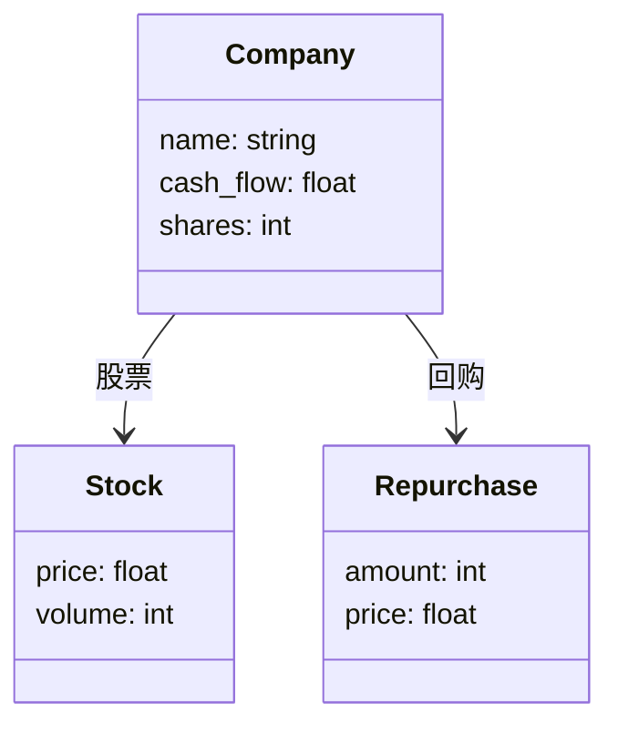
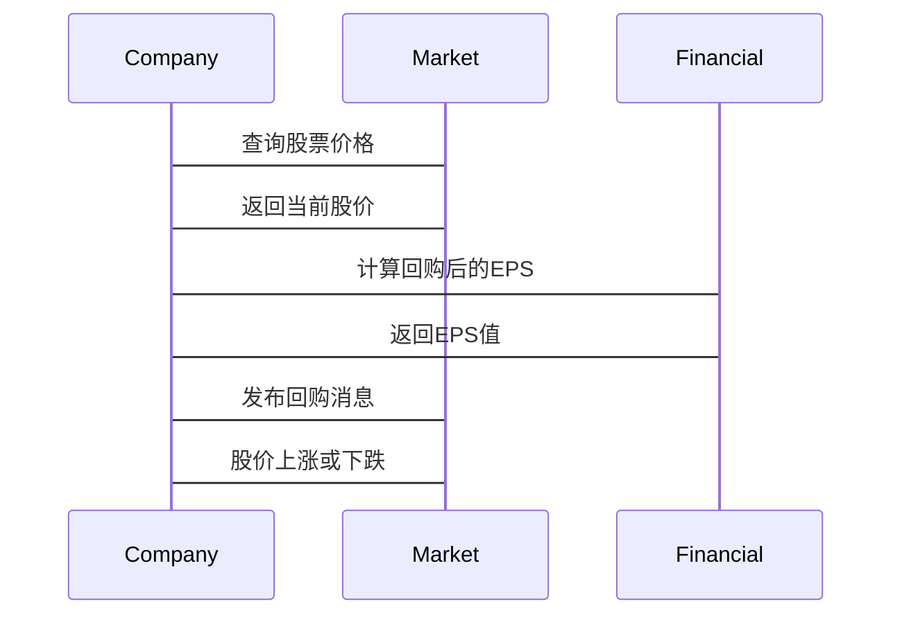

                 


# 彼得林奇如何看待公司的股票回购

## 关键词：股票回购、彼得·林奇、投资策略、股东价值、财务分析、数学模型

## 摘要：本文深入探讨了彼得·林奇对股票回购的看法，结合财务分析、数学模型和案例研究，分析了股票回购对公司的影响及其投资策略。文章结构清晰，内容丰富，适合投资专业人士和对股票回购感兴趣的研究者阅读。

---

# 第一部分：股票回购的背景与基本概念

## 第1章：股票回购的基本概念

### 1.1 股票回购的定义与目的

股票回购是指公司用自有资金从市场上回购本公司股票的行为。其主要目的是通过减少流通股数量来提高每股收益，优化资本结构，或在公司认为股价被低估时，通过回购来增加股东价值。常见的回购方式包括固定价格回购、荷兰式拍卖和竞价拍卖。

### 1.2 股票回购的类型

- **固定价格回购**：公司以固定价格回购股票，通常在二级市场上进行。
- **荷兰式拍卖回购**：公司设定一个价格范围，由股东出价，最低价中标者优先回购。
- **竞价拍卖回购**：公司接受所有符合条件的投标，按比例分配回购数量。

## 第2章：彼得·林奇与股票回购的背景

### 2.1 彼得·林奇的投资理念

彼得·林奇是著名投资经理人，强调价值投资和深入研究。他关注公司的基本面，尤其是盈利能力、管理层能力和行业地位。他注重股东价值，认为公司应通过回购等方式提升股东利益。

### 2.2 彼得·林奇与股票回购的关联

股票回购在彼得·林奇的投资策略中占据重要地位。他认为回购是公司对自身价值的信心表现，尤其在股价被低估时，回购能提升每股收益和股东价值。他的决策基于公司财务状况、行业环境和市场估值。

## 第3章：股票回购的财务影响

### 3.1 股票回购对财务状况的影响

股票回购会减少公司现金流，影响债务和资本结构。具体来说，回购会降低总负债，优化资本结构，但可能增加财务风险。

### 3.2 股票回购对股东价值的影响

回购可能提升股价，尤其在市场低估时。通过提高每股收益，增强股东价值，但需考虑回购成本和市场反应。

---

# 第二部分：股票回购的分析框架

## 第4章：股票回购的决策因素

### 4.1 影响股票回购决策的关键因素

- **公司财务状况**：现金流、盈利能力、债务水平。
- **行业竞争环境**：行业周期、竞争格局。
- **市场估值**：市盈率、市净率、股价与内在价值的关系。

### 4.2 彼得·林奇的决策标准

- **盈利能力**：公司应具备稳定的盈利能力。
- **管理层能力**：管理层应有能力判断回购时机。
- **行业周期**：行业周期影响回购的适宜性。

## 第5章：股票回购的市场与行业分析

### 5.1 行业周期与股票回购的关系

- **周期性行业**：在行业低谷时，回购可能优化资本结构。
- **非周期性行业**：回购更多基于市场估值。

### 5.2 市场环境对股票回购的影响

- **市场估值**：低估值时回购更有效。
- **利率环境**：低利率环境回购成本较低。

## 第6章：股票回购的案例分析

### 6.1 彼得·林奇的经典案例

以某公司为例，分析回购决策过程、对公司股价的影响，以及彼得·林奇的评价。

### 6.2 其他著名公司的回购案例

分析技术行业和消费行业的回购案例，探讨其效果和经验。

---

# 第三部分：股票回购的数学模型与算法

## 第7章：股票回购的数学模型

### 7.1 回购对每股收益的影响

假设公司回购后，每股收益（EPS）= 净利润 / 新股数。

### 7.2 回购的市场反应模型

考虑市场对回购的反应，建立模型预测股价变化。

## 第8章：股票回购的算法实现

### 8.1 算法流程

1. 确定公司财务数据。
2. 计算回购后的每股收益。
3. 评估市场反应。

### 8.2 Python代码示例

```python
import pandas as pd

def calculate_eps_after_repurchase(net_profit, shares_before, shares_repurchased):
    shares_after = shares_before - shares_repurchased
    eps = net_profit / shares_after
    return eps

data = pd.read_csv('financial_data.csv')
eps = calculate_eps_after_repurchase(data.net_profit.iloc[0], data.shares.iloc[0], 1000)
print(f'回购后的每股收益为：{eps}')
```

---

# 第四部分：系统分析与架构设计

## 第9章：系统功能设计

### 9.1 领域模型

使用mermaid类图展示公司、股票、回购行为的关系。



## 第9.2 系统架构设计

使用mermaid架构图展示系统模块。

```mermaid
architecturalDiagram
    container 财务模块 {
        FinancialData
        calculate_eps_after_repurchase
    }
    container 市场模块 {
        MarketData
        calculate_market_reaction
    }
    Company --> 财务模块
    Company --> 市场模块
```

## 第9.3 系统交互设计

使用mermaid序列图展示回购流程。



---

# 第五部分：项目实战

## 第10章：项目实战

### 10.1 环境安装

安装必要的库，如Pandas和Matplotlib。

### 10.2 核心实现

编写代码实现回购分析，包括数据读取、计算和可视化。

### 10.3 案例分析

分析某公司回购案例，计算EPS变化，评估市场反应。

### 10.4 项目小结

总结项目经验，提出改进建议。

---

# 第六部分：最佳实践与总结

## 第11章：最佳实践

### 11.1 投资策略

根据公司财务状况和市场估值，选择合适的回购时机。

### 11.2 注意事项

避免过度回购，关注公司长期发展，考虑回购成本和市场反应。

### 11.3 拓展阅读

推荐相关书籍和文章，深入学习股票回购和投资策略。

---

# 结语

股票回购是公司优化资本结构、提升股东价值的重要工具。彼得·林奇的回购策略结合了深入的财务分析和市场洞察，为投资者提供了 valuable insights.

作者：AI天才研究院 & 禅与计算机程序设计艺术

