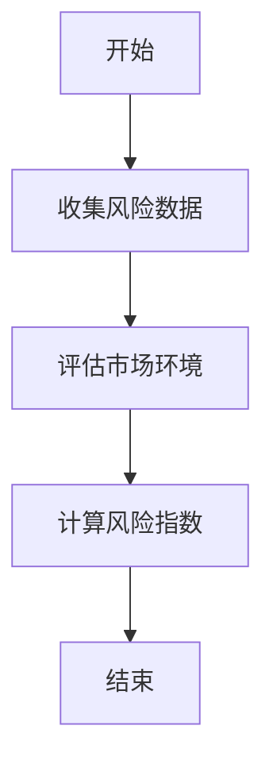
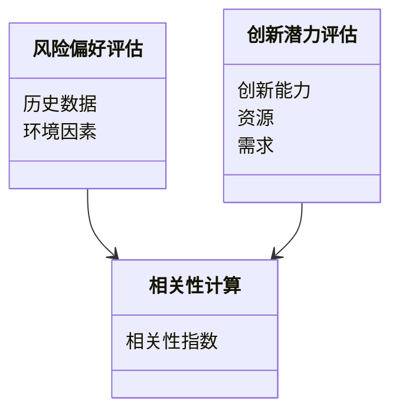
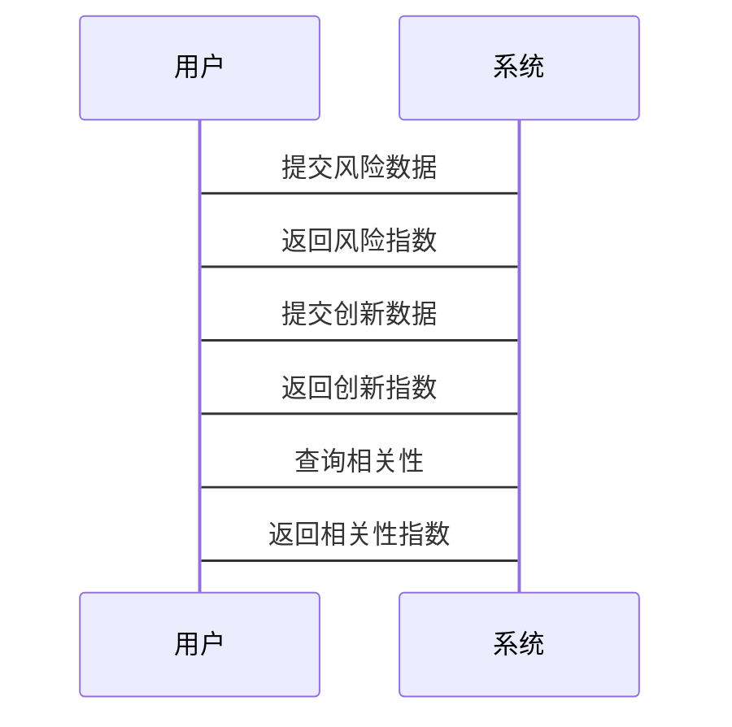

                 


# 彼得林奇如何看待公司的风险偏好与创新突破的相关性

## 关键词：彼得·林奇，风险偏好，创新突破，投资理念，企业战略

## 摘要：本文从彼得·林奇的投资理念出发，探讨公司风险偏好与创新突破的相关性。通过构建数学模型和系统架构，分析两者之间的关系，并结合实际案例，为企业制定战略提供参考。

---

## 第1章：风险偏好与创新突破的背景介绍

### 1.1 风险偏好与创新突破的核心概念

#### 1.1.1 风险偏好的定义与特征
风险偏好是指个体或组织在面对不确定性时，对风险的接受程度。高风险偏好意味着愿意承担更大的不确定性以追求更高的回报，而低风险偏好则倾向于避免风险，追求稳定。

#### 1.1.2 创新突破的定义与特征
创新突破指的是引入新的产品、服务或方法，以创造竞争优势。创新通常伴随着较高的风险，但也可能带来更大的收益。

#### 1.1.3 两者之间的关系与联系
风险偏好影响创新的力度和范围。高风险偏好的企业更倾向于进行大胆的创新，而低风险偏好的企业则更谨慎，创新步伐较慢。

### 1.2 彼得·林奇投资理念概述

#### 1.2.1 彼得·林奇的投资风格
彼得·林奇以价值投资著称，注重长期投资和深入研究，强调风险控制和稳健回报。

#### 1.2.2 彼得·林奇对风险偏好的理解
林奇认为，合理的风险偏好是投资成功的关键。他主张在风险可控的前提下追求超额回报。

#### 1.2.3 彼得·林奇对创新突破的看法
林奇欣赏创新，但强调创新必须基于深入的研究和风险评估，避免盲目追求创新而忽视风险。

### 1.3 风险偏好与创新突破的背景分析

#### 1.3.1 当前商业环境中的风险偏好趋势
当前商业环境中，风险偏好呈现多样化趋势，不同企业根据自身情况选择不同的风险策略。

#### 1.3.2 创新突破在企业中的重要性
创新是企业保持竞争力的关键，特别是在快速变化的市场环境中，持续创新有助于企业占据领先地位。

#### 1.3.3 彼得·林奇视角下的行业案例
通过分析实际案例，展示林奇如何在投资中平衡风险偏好与创新。

---

## 第2章：风险偏好与创新突破的核心概念与联系

### 2.1 核心概念的原理分析

#### 2.1.1 风险偏好的核心要素
- 风险承受能力：企业能够承担的最大风险水平。
- 风险评估：对潜在风险的识别和评估。

#### 2.1.2 创新突破的核心要素
- 创新能力：企业的研发能力和创新能力。
- 创新风险：创新过程中可能面临的风险。

#### 2.1.3 两者之间的内在联系
创新需要一定的风险承担，而风险偏好影响创新的力度和范围。

### 2.2 风险偏好与创新突破的属性对比

| 属性       | 风险偏好          | 创新突破          |
|------------|-------------------|-------------------|
| 定义       | 风险的接受程度    | 引入新想法        |
| 影响因素   | 过往经验、企业战略| 市场需求、技术能力|
| 目标       | 稳定与可控       | 竞争优势         |
| 风险       | 可控范围内        | 较高风险          |

### 2.3 实体关系图（ER图）架构

```mermaid
erDiagram
    actor 投资者 {
        <属性> 风险偏好
    }
    actor 创新者 {
        <属性> 创新能力
    }
    entity 项目 {
        <属性> 风险评估
        <属性> 创新潜力
    }
    投资者 --> 项目 : 评估风险
    创新者 --> 项目 : 提供创新
```

---

## 第3章：风险偏好与创新突破的数学模型与算法原理

### 3.1 数学模型的建立

#### 3.1.1 风险偏好评估模型
$$
\text{风险偏好} = \frac{\text{历史风险承受能力} \times \text{当前市场环境}}{\text{企业规模}}
$$

#### 3.1.2 创新突破潜力模型
$$
\text{创新潜力} = \text{创新能力} \times \text{创新资源} \times \text{市场需求}
$$

#### 3.1.3 相关性计算模型
$$
\text{相关性} = \frac{\text{风险偏好} \times \text{创新潜力}}{\text{企业战略目标}}
$$

### 3.2 算法原理的详细讲解

#### 3.2.1 风险偏好评估算法
1. 收集企业过去的风险承受数据。
2. 结合当前市场环境进行评估。
3. 计算风险偏好指数。

#### 3.2.2 创新突破潜力算法
1. 评估企业的创新能力。
2. 分析创新资源和市场需求。
3. 计算创新潜力指数。

### 3.3 用 Mermaid 绘制算法流程图



### 3.4 代码实现与案例分析

#### 3.4.1 环境安装与配置
安装Python和必要的库，如numpy和pandas。

#### 3.4.2 核心代码实现

```python
import numpy as np
import pandas as pd

def risk_preference_calculation(historical_risk, market_environment, company_size):
    return (historical_risk * market_environment) / company_size

def innovation_potential_calculation(innovation_ability, innovation_resources, market_demand):
    return innovation_ability * innovation_resources * market_demand

# 示例数据
historical_risk = 0.8
market_environment = 1.2
company_size = 100
innovation_ability = 0.9
innovation_resources = 0.7
market_demand = 1.1

# 计算
risk_preference = risk_preference_calculation(historical_risk, market_environment, company_size)
innovation_potential = innovation_potential_calculation(innovation_ability, innovation_resources, market_demand)
correlation = (risk_preference * innovation_potential) / 1  # 假设企业战略目标为1

print(f"风险偏好指数：{risk_preference}")
print(f"创新潜力指数：{innovation_potential}")
print(f"相关性指数：{correlation}")
```

#### 3.4.3 代码解读与分析
代码实现了风险偏好和创新潜力的计算，展示了两者之间的相关性。

---

## 第4章：系统分析与架构设计方案

### 4.1 问题场景介绍

#### 4.1.1 风险偏好与创新突破的评估需求
企业需要评估自身的风险偏好和创新潜力，以制定合适的战略。

#### 4.1.2 系统目标与范围
构建一个评估系统，帮助企业分析风险偏好与创新突破的关系。

### 4.2 领域模型设计



### 4.3 系统架构设计


### 4.4 接口与交互设计



---

## 第5章：项目实战与案例分析

### 5.1 项目环境安装与配置

#### 5.1.1 开发环境搭建
安装Python、Flask框架、数据库等。

#### 5.1.2 依赖库安装
使用pip安装numpy、pandas等库。

### 5.2 核心代码实现

#### 5.2.1 风险偏好评估模块
实现风险偏好的计算功能。

#### 5.2.2 创新潜力评估模块
实现创新潜力的计算功能。

#### 5.2.3 相关性计算模块
实现相关性指数的计算功能。

### 5.3 代码解读与分析
详细解读代码结构，分析每个模块的功能。

### 5.4 案例分析与详细讲解

#### 5.4.1 案例背景介绍
选择一家企业，分析其风险偏好和创新潜力。

#### 5.4.2 案例分析过程
使用模型计算相关指数，评估创新与风险的关系。

#### 5.4.3 案例结果与总结
总结分析结果，提出改进建议。

---

## 作者：AI天才研究院 & 禅与计算机程序设计艺术

---

这篇文章通过深入分析彼得·林奇的投资理念，结合数学模型和系统设计，详细探讨了风险偏好与创新突破的相关性，并通过实际案例展示了如何在企业战略中应用这些理念。希望对读者在制定企业战略时有所帮助。

