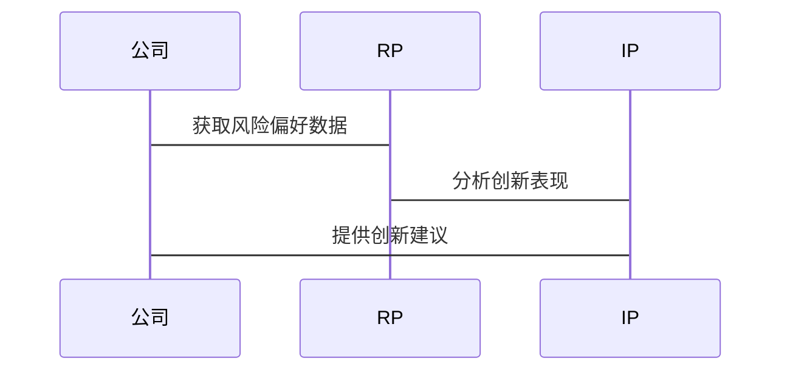

                 


# 彼得林奇如何看待公司的风险偏好与创新表现的关系

## 关键词：
- 彼得·林奇
- 风险偏好
- 创新表现
- 企业战略
- 投资决策
- 创新管理

## 摘要：
本文深入探讨了彼得·林奇对公司的风险偏好与创新表现之间关系的看法。通过分析风险偏好和创新表现的核心概念，构建了它们之间的数学模型，并通过实际案例展示了如何在企业战略中平衡这两者。文章结合理论与实践，为企业管理者提供了实用的指导和建议。

---

## 第一部分: 公司风险偏好与创新表现的背景介绍

### 第1章: 风险偏好与创新表现的核心概念

#### 1.1 风险偏好的定义与特征
##### 1.1.1 风险偏好的定义
风险偏好是指公司在面对不确定性时，愿意承担风险的程度。它反映了公司管理层对风险的态度，影响公司的决策和投资行为。

##### 1.1.2 风险偏好的核心特征
- **风险承受能力**：公司能够承担的最大风险水平。
- **风险评估方法**：公司用于评估风险的工具和模型。
- **风险管理策略**：公司采取的规避、转移或接受风险的策略。

##### 1.1.3 风险偏好的边界与外延
风险偏好的边界在于公司的财务状况、市场环境和管理层的决策风格。外延则涉及风险管理的各个层面，包括战略、运营和文化因素。

#### 1.2 创新表现的定义与特征
##### 1.2.1 创新表现的定义
创新表现是公司通过创新活动产生的成果，包括新产品开发、技术进步和服务改进等。

##### 1.2.2 创新表现的核心特征
- **创新能力**：公司开发新技术和新产品的能力。
- **创新资源分配**：公司投入创新的资源，如资金、人才和时间。
- **创新成果评估**：通过专利数量、新产品销售收入等指标衡量创新成果。

#### 1.3 风险偏好与创新表现的关系
##### 1.3.1 风险偏好与创新表现的相互作用
高风险偏好通常与高创新表现相关，因为公司愿意承担更大的风险以追求更高的创新成果。然而，过度冒险可能导致失败，因此需要平衡。

##### 1.3.2 彼得·林奇对两者关系的见解
彼得·林奇认为，适度的风险偏好是创新成功的前提。公司应在可控风险范围内追求创新，避免过度冒险或过于保守。

##### 1.3.3 两者关系的理论模型
通过构建模型，可以看出风险偏好和创新表现之间呈正相关关系，但存在非线性关系，即过度冒险会降低创新表现。

### 第2章: 风险偏好与创新表现的核心要素分析

#### 2.1 风险偏好的核心要素
##### 2.1.1 风险承受能力
公司财务状况和市场环境决定了其风险承受能力。

##### 2.1.2 风险评估方法
常用方法包括SWOT分析、风险矩阵和蒙特卡罗模拟。

##### 2.1.3 风险管理策略
包括风险规避、转移和接受策略。

#### 2.2 创新表现的核心要素
##### 2.2.1 创新能力
公司内部的研发能力和技术储备。

##### 2.2.2 创新资源分配
公司投入创新的资金、人才和时间。

##### 2.2.3 创新成果评估
通过专利数量、新产品销售收入等指标评估创新成果。

#### 2.3 风险偏好与创新表现的核心要素对比
##### 2.3.1 核心要素对比表格

| 要素       | 风险偏好                     | 创新表现                     |
|------------|------------------------------|------------------------------|
| 核心目标   | 管理和控制风险               | 推动技术和产品创新           |
| 影响因素   | 市场环境、财务状况           | 技术能力、资源投入           |
| 结果       | 影响公司稳定性               | 影响公司增长性和竞争力       |

##### 2.3.2 核心要素的ER实体关系图

```mermaid
erd
    公司(C) {
        id
        名称
        风险偏好(RP)
        创新表现(IP)
    }
    RP {
        id
        风险承受能力
        风险管理策略
    }
    IP {
        id
        创新能力
        创新成果评估
    }
    C - RP (1..1)
    C - IP (1..1)
    RP - IP (M..N)
```

---

## 第二部分: 风险偏好与创新表现的核心概念与联系

### 第3章: 风险偏好与创新表现的原理分析

#### 3.1 风险偏好的原理
##### 3.1.1 风险偏好的基本原理
风险偏好是公司战略决策的重要组成部分，影响投资决策和资源分配。

##### 3.1.2 风险偏好的影响因素
包括公司规模、行业特点、管理层风格和市场环境。

##### 3.1.3 风险偏好的数学模型
风险偏好可以用概率和期望值来描述。例如，风险偏好系数α用于衡量公司对风险的敏感程度。

#### 3.2 创新表现的原理
##### 3.2.1 创新表现的基本原理
创新是公司保持竞争力的关键，涉及技术研发、产品设计和服务创新。

##### 3.2.2 创新表现的影响因素
包括技术能力、资源投入、市场环境和管理支持。

##### 3.2.3 创新表现的数学模型
创新表现可以用专利数量和新产品销售收入等指标来衡量，同时考虑时间因素。

#### 3.3 风险偏好与创新表现的联系
##### 3.3.1 两者关系的理论模型
构建数学模型，分析风险偏好和创新表现之间的关系，如协方差和相关系数。

##### 3.3.2 彼得·林奇的观点
适度风险偏好是创新成功的前提，公司应在可控风险范围内追求创新。

### 第4章: 风险偏好与创新表现的算法原理

#### 4.1 风险偏好的算法原理
##### 4.1.1 风险偏好的数学模型
$$ R = \alpha \times V + (1-\alpha) \times C $$
其中，R为风险偏好，α为风险偏好系数，V为潜在收益，C为保守策略收益。

##### 4.1.2 风险偏好的算法流程图

```mermaid
graph TD
    A[开始] --> B[输入风险偏好系数α]
    B --> C[输入潜在收益V]
    C --> D[输入保守策略收益C]
    D --> E[计算R = α×V + (1−α)×C]
    E --> F[输出风险偏好R]
    F --> 结束
```

#### 4.2 创新表现的算法原理
##### 4.2.1 创新表现的数学模型
$$ I = \beta \times T + (1-\beta) \times S $$
其中，I为创新表现，β为创新投入系数，T为技术创新，S为市场响应速度。

##### 4.2.2 创新表现的算法流程图

```mermaid
graph TD
    A[开始] --> B[输入创新投入系数β]
    B --> C[输入技术创新T]
    C --> D[输入市场响应速度S]
    D --> E[计算I = β×T + (1−β)×S]
    E --> F[输出创新表现I]
    F --> 结束
```

---

## 第三部分: 风险偏好与创新表现的系统分析

### 第5章: 风险偏好与创新表现的系统架构

#### 5.1 系统功能设计
##### 5.1.1 领域模型类图

```mermaid
classDiagram
    class 公司(C) {
        id
        名称
        风险偏好(RP)
        创新表现(IP)
    }
    class RP {
        id
        风险承受能力
        风险管理策略
    }
    class IP {
        id
        创新能力
        创新成果评估
    }
    C --> RP
    C --> IP
    RP --> IP
```

#### 5.2 系统架构设计
##### 5.2.1 系统架构图


#### 5.3 系统交互设计
##### 5.3.1 系统交互序列图



---

## 第四部分: 风险偏好与创新表现的项目实战

### 第6章: 项目实战与分析

#### 6.1 项目环境安装
- 安装Python和必要的库（如NumPy、Pandas、Matplotlib）。

#### 6.2 核心代码实现
##### 6.2.1 风险偏好的Python代码

```python
import numpy as np

def calculate_risk_preference(alpha, potential_return, conservative_return):
    return alpha * potential_return + (1 - alpha) * conservative_return

alpha = 0.8
potential_return = 0.12
conservative_return = 0.05
risk_preference = calculate_risk_preference(alpha, potential_return, conservative_return)
print("风险偏好值为:", risk_preference)
```

##### 6.2.2 创新表现的Python代码

```python
import numpy as np

def calculate_innovation_performance(beta, innovation_tech, market_response):
    return beta * innovation_tech + (1 - beta) * market_response

beta = 0.7
innovation_tech = 0.15
market_response = 0.08
innovation_performance = calculate_innovation_performance(beta, innovation_tech, market_response)
print("创新表现值为:", innovation_performance)
```

#### 6.3 案例分析与解读
##### 6.3.1 案例分析
假设某公司风险偏好系数α=0.8，潜在收益V=0.12，保守策略收益C=0.05，计算风险偏好值为0.106。同时，创新投入系数β=0.7，技术创新T=0.15，市场响应速度S=0.08，创新表现值为0.121。

##### 6.3.2 案例解读
风险偏好值和创新表现值均较高，表明公司在可控风险范围内积极追求创新，符合彼得·林奇的建议。

---

## 第五部分: 风险偏好与创新表现的最佳实践

### 第7章: 最佳实践与总结

#### 7.1 小结
- 风险偏好和创新表现密切相关，适度风险偏好是创新成功的关键。
- 公司应根据自身情况调整风险偏好和创新投入。

#### 7.2 注意事项
- 避免过度冒险，保持风险可控。
- 创新投入需与公司资源和能力相匹配。

#### 7.3 拓展阅读
- 彼得·林奇的其他观点。
- 风险管理和创新管理的最新研究。

---

## 作者：AI天才研究院 & 禅与计算机程序设计艺术

---

这篇文章详细探讨了彼得·林奇对风险偏好与创新表现关系的看法，并结合理论分析和实际案例，为企业管理者提供了实用的指导和建议。

